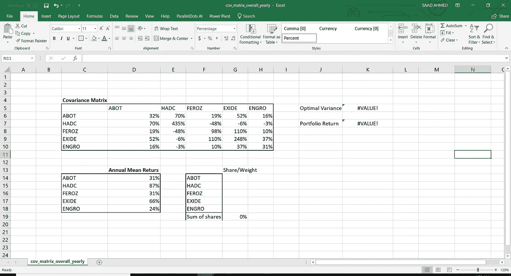
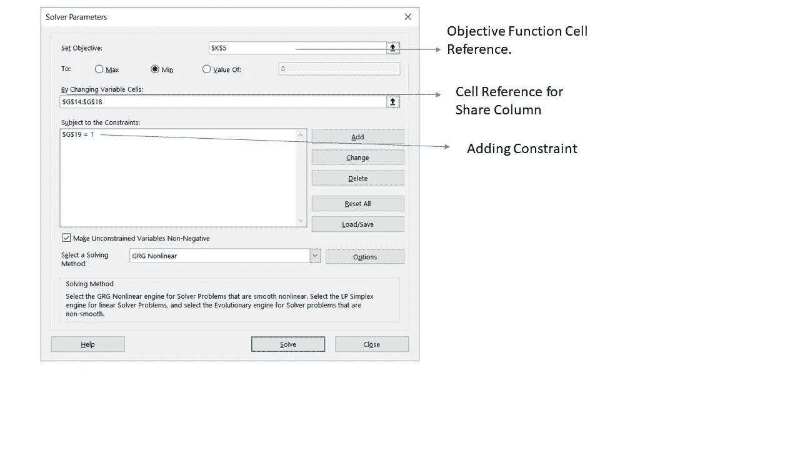
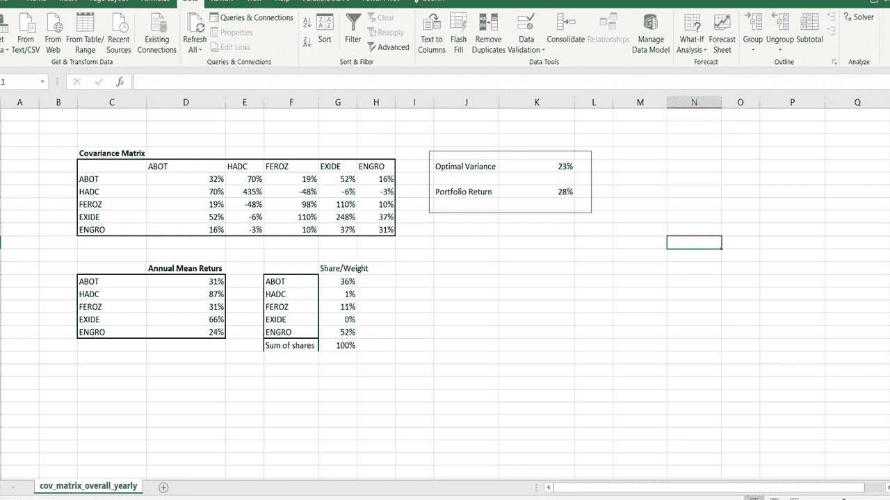

# 用 Excel 实现简单的投资组合优化

> 原文：<https://medium.datadriveninvestor.com/simple-portfolio-optimization-harry-markowitz-mean-variance-model-using-excel-part-1-efc3f19a347?source=collection_archive---------0----------------------->

我认为每个人都被金融市场迷住了，并把它们看作是一个人们要么快速致富要么快速致富的地方，但事实上，在大多数情况下并不是这样的。

因为这个领域的学生和密切关注市场的人知道，为了成为一个好的投资者或交易者，必须有一些计划或一些分析和事实，人们应该看看这些，以便做出下一个交易决定。

我教授过去常说

> **“萨德！交易是一门学科。”**

所以记住这个观点和我刚刚得到的知识，我想我也可以教育我的读者，或者至少试着这样做。

出于这篇博文的目的，我将选择五家公司，并用它们构建一个最优投资组合。在后面的博客文章中，我将尝试用优化投资组合所用的股票构建一个有效边界。

 [## 分散金融的出现|数据驱动的投资者

### 当前的全球金融体系为拥有资源、知识和财富的人创造了巨大的财富

www.datadriveninvestor.com](https://www.datadriveninvestor.com/2019/03/14/the-emergence-of-decentralized-finance/) 

那么我们如何构建一个最优的投资组合呢？为了我们的目的，我们需要一个我们想要优化的目标函数和一个约束。

牢记理性投资者的风险规避行为，我们的目标是**最小化我们投资组合的方差(风险)。**

现在记住我们的目标函数，让我们看看这里的约束是什么。**不同股票之间分配的财富份额之和不能大于 1 (100%)，**所以这里是我们对问题的约束。

以上陈述是我们进行分析时所采用的假设。

# 需要什么，怎么做？

1-我们需要股票价格来计算回报(我们使用百分比形式的年化回报)，然后计算年回报的平均值。

2-我们需要所选五家公司的方差协方差矩阵。

我已经在 excel 文件中提供了上述所有数据，现在开始真正的工作，见上图了解数据是如何布局的。

> 为了计算我们投资组合的方差，一般来说公式如下:我们将份额矩阵的转置与方差-协方差矩阵相乘，然后将结果向量与份额向量相乘，得到投资组合方差。
> 
> 这里，份额向量是(5x1)维的，方差-协方差矩阵是(5x5)维的。因此，通过将 1×5 乘以 5×5 的一维矩阵，我们得到 1×5 的一维矩阵，并将 1×5 的维和 5×1 的一维向量相乘，我们得到一个值，即投资组合方差。

作为投资者，现在最重要的问题是

*去哪里投资？*

*投资多少？*

要回答这个问题，我们只需使用 excel 的规划求解功能，选择我们希望投资于 5 家公司的财富份额(百分比),以最小化(优化)我们的方差。

下面的截图将展示如何做到这一点。

注意:要安装 excel 规划求解加载项，请单击此处的

一旦你安装了 Excel 规划求解，进入“数据”并点击规划求解，窗口就会出现，就像我附上的截图一样。你所要做的就是提供单元格引用，然后点击求解。

单击求解按钮后，求解器应该会找到一个最优解，在我们的例子中是投资组合的最优方差，它应该是这样的

这基本上告诉我们，在给定的五个选项中，如果我们将财富份额的 36%、1%、11%、0%和 52%分别投资于 ABOT、HADC、FEROZ 和 ENGRO，那么我们将最小化我们的方差(风险)。

我们的上述投资组合的平均回报率为 28%，方差为 23%。

我认为这是一个很好的起点，并为我们提供了一些关于我们的投资组合历史表现的信息，但在现实中，我们需要更强大的模型和估计才能在市场上做出判断。

> 要下载 excel 文件，点击[这里](https://drive.google.com/file/d/1BrW5J9VEQI5wfs-UXBFlsPUdsLn0oCsf/view?usp=sharing)

我希望你今天学到了一些新的东西，我没有深入研究模型的理论和技术细节，因为我认为理论是一门最好在课堂或视频讲座中讲授的课程。

希望我能写第二部分，在那里我们构建有效边界，并讨论夏普比率如何帮助我们在选择投资组合时做出更好的决策。