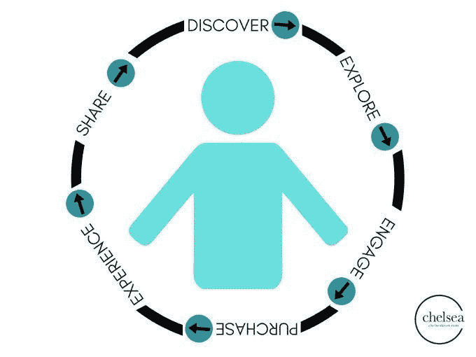
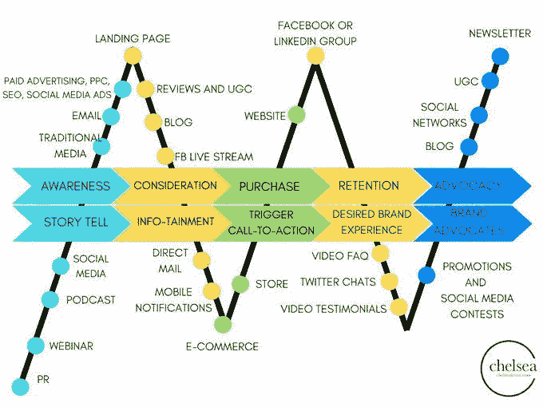

# 简单的销售渠道会产生巨大的效果

> 原文：<https://medium.datadriveninvestor.com/simple-sales-funnels-yield-big-results-1e5c41fddf55?source=collection_archive---------4----------------------->

## 商业以系统和可预测的方式发展

麦芽漏斗不需要很复杂。事实上， [Kat Sullivan](https://twitter.com/MrsKatSulli) 认为这些用于直接销售的营销渠道很简单。她通过在对话中引入大量经验来支持这一观点。

Sullivan 是一位企业家、作家、演说家、 [Marketing Solved](https://twitter.com/MrktgSolved) 的首席执行官和创始人，也是软件即服务公司 [Tassi](https://twitter.com/Get_Tassi) 的联合创始人。她与前 20 名千禧一代营销策略师和教练、LinkedIn 讲师和全球演讲者 Chelsea Krost 讨论了漏斗。

 [## 在创业之旅中，拥抱学习|数据驱动的投资者

### 好像建立一个数百万美元的公司还不够困难，企业家必须额外照顾他们的…

www.datadriveninvestor.com](https://www.datadriveninvestor.com/2018/10/16/on-the-entrepreneurial-trek-embrace-the-learning/) 

他们一起讨论了[销售漏斗](https://blog.markgrowth.com/businesses-live-or-die-through-outreach-f2e646c0e7af)的各个阶段、哪些产品和服务适用于漏斗营销、可以使用的最佳应用和工具等等。

销售漏斗以一种系统的、可重复的方式推动业务，并照顾到基本流程。这让您可以专注于客户的个人需求。

“一个简单的销售漏斗实际上就是走到顾客面前的过程，”沙利文说。“让他们通过全新的联系人——你到底是谁？”—对快乐的顾客—“我刚买了你的产品，我很喜欢。”

“企业需要一个销售漏斗——销售过程——这样他们就知道如何走到人们面前，获得新的线索并创造收入，”她说。

# 最重要的人

沙利文对销售漏斗的定义以人为本。

“这是你的潜在客户在消费之旅中经历的步骤、选择和体验，”她说。“这就是消费者如何从 A 到 Z——我们希望——购买你的产品或服务。”

Krost 解释说销售漏斗在几个方面是有益的:

*   提高品牌知名度
*   增加你网站的流量
*   产生热情的销售线索
*   自动化您的销售流程

“在我的营销生涯中，我了解到许多专家和行业领袖都有不同的漏斗方法，”Krost 说。“我看到了这些阶段应该或可能的不同版本。我不认为这是一个放之四海而皆准的概念。”

 [## 企业的生死取决于拓展

### 销售漏斗从吸引消费者的注意力开始

blog.markgrowth.com](https://blog.markgrowth.com/businesses-live-or-die-through-outreach-f2e646c0e7af) 

一般来说，她将销售漏斗分为以下几个步骤:

*   意识
*   考虑
*   购买
*   保留
*   支持

“我认为漏斗不应该止于销售，”克罗斯特说。“我们必须考虑如何留住这些客户，以及如何将他们变成我们品牌的拥护者。”

# 对客户友好的方法

沙利文的销售漏斗有四个阶段:

*   知名度:通过社交媒体、视频、文章、播客、广告等方式接触潜在客户。
*   激励:用免费的礼物、优惠券、样品、免费试用等给他们一个吸引他们的理由。
*   导语:和他们联系。让他们出现在你的门前，你的社交网页上，你的电子邮件列表上，给你他们的电话号码。
*   结束:卖掉他们，创造一个*关系*。

销售漏斗的总体目标是将人们引向你和你的企业——无论是产品还是服务——以满足客户需求。

[**相关文章:自助服务:实时连接的解决方案**](https://www.datadriveninvestor.com/2019/08/14/self-serve-the-solution-to-real-time-connection/)

“*绝对！*”沙利文说道。“销售渠道适用于任何行业的任何销售，因为它实际上只是客户旅程的另一个短语。可以针对任何业务进行定制。”

某些产品或服务通过漏斗营销转化得最好。Krost 的清单包括教练服务；健身或健康辅导或计划；金融服务、房地产经纪人和美容产品。

“在网上销售的东西特别好，”沙利文说。“就我个人而言，我出售过信息产品、教练、数字课程和软件。销售渠道像魔术一样工作。

“我也看到销售渠道在书籍、实体产品、网站设计、个人培训、社交媒体服务甚至月度会员网站上表现得非常好，”她说。“范围相当广。”

创建销售漏斗遵循一个基本流程。

 [## 让设定目标成为你的职责

### 知道你想去哪里很重要

medium.com](https://medium.com/datadriveninvestor/make-it-your-business-to-set-goals-7b67b0765ab9) 

“就像你营销中的其他事情一样，设定你的目标，”Krost 说。“问问你自己，我想吸引多少潜在客户？我是否希望利用这个销售漏斗建立自己的社交追随者？

“意识是漏斗的第一步，”她说。“从那里开始是有意义的。决定你将如何教导人们你是谁以及你为什么重要。这可以通过网上研讨会、签名流量生成器(Twitter 聊天、播客)或博客来实现。”

自然地，Sullivan 从她心目中的销售漏斗的四个阶段开始，并从那里继续前进。

“试着弄清楚你将如何获得这种意识，”她说。“激励人们与你联系，将他们转化为热门线索，并与他们建立关系。制定计划，创造顾客之旅。

“我经常使用‘顾客之旅’,因为它将重点放在顾客身上，而不是销售上，”Sullivan 说。

# 先测试试用广告

销售渠道的最佳社交媒体平台是你的客户所在的地方。否则，你只是在胡乱开枪，浪费时间。

“在建立你的销售漏斗时，脸书是一个很好的平台，”Krost 说。“我总是建议我的私人教练客户在脸书上为他们的产品和服务做一些广告。脸书也是推广你的奖励或优惠的理想之地。

“Instagram 在创建销售漏斗时给营销人员带来了更多挑战，因为他们不允许你在帖子中包含链接，”她说。“然而，当你拥有至少 10，000 名粉丝或经过验证时，你可以将他们纳入你的故事中。”

 [## 铅磁铁:吸引人的入门方式

### 有价值的赠品是营销的关键部分

blog.markgrowth.com](https://blog.markgrowth.com/lead-magnets-attractive-ways-to-get-your-foot-in-the-door-2005d8be6f96) 

Sullivan 说，销售漏斗的顶级激励措施(也称为销售线索磁铁)几乎是无穷无尽的，这是她的最爱:折扣、优惠券、特价、免费报告、清单、工作表、pdf、视频培训、免费咨询、免费战略会议、免费评估、免费送货、奖金产品、升级、赠品和抽奖。

[**相关文章:明天的工作会‘感觉像我们生活的一部分’**](https://www.datadriveninvestor.com/2018/10/12/tomorrows-work-will-feel-like-part-of-our-lives/)

“想想如何提供惊人的价值，”Krost 说，并提供了她的销售线索磁铁示例:免费电子邮件课程、免费指南、揭示重要见解的互动测验、探索电话、案例研究、赠品、优惠券和折扣。

你越投入，你的销售漏斗就越有吸引力。把它付诸行动，然后忘记它会让潜在的客户失去兴趣。

“创建一个调查或测验，帮助人们思考和互动，”克罗斯特说。“调查或测验可以让潜在客户意识到他们可能需要更多的知识或他们生活中缺少的东西。

“不要忘记互动元素，如 Twitter 聊天、直播和公开演讲，”她说。"这些都是给你的漏斗加油的好方法."

沙利文非常喜欢创新和独特，这从问这些问题开始:

*   你能做什么别人没做的事？
*   你能用视频做些有趣的事情吗？
*   你能用广告做些有创意的事情吗？

“想办法将你的个性融入其中，”沙利文说。

# 工具支持指标

Krost 为销售漏斗创建内容和登陆页面的顶级工具包括 [Canva](https://twitter.com/canva/) 、 [Leadpages](https://twitter.com/Leadpages/) 和 [ClickFunnels](https://twitter.com/clickfunnels/) 。除此之外，沙利文还增加了 [ActiveCampaign](https://twitter.com/ActiveCampaign/) 和 [KartraOfficial](https://twitter.com/KartraOfficial/) 。

从一开始就设定指标，让你衡量你的销售漏斗和整体营销的成功。

“当建立一个成功的销售漏斗时，分析是关键，”Krost 说。“一定要查看脸书和谷歌的广告分析；网站访问者；邮件打开和回复率，并确定您在漏斗中的哪个位置正在失去潜在客户。

她说:“通过评估你的销售额和扣除营销成本后的投资回报率，来确定你的销售漏斗是否有效。”

沙利文有一个衡量销售漏斗成功的基本标准:“如果你开始看到收入，你就知道它在起作用。”

除此之外，她还宣扬耐心。

“漏斗确实需要时间来运行和优化，”沙利文说。“在做出改变之前，至少监测和跟踪七天是有益的。

“至于衡量标准，它们会有所不同，”她说。“对我们这些数据迷来说，有趣的是，几乎所有东西都有一个可衡量的标准。你可以深入了解浏览量、点击量、登陆页面浏览量、登陆页面转化率、电子邮件打开率、点击率、产品浏览量和购买量。”

尽量避免不切实际的目标。了解销售漏斗的工作原理。然后你会从头到尾都有合理的期望。另一个要避免的错误是不提供价值。

[**相关文章:生产力是时间问题**](https://www.datadriveninvestor.com/2019/04/30/productivity-is-a-matter-of-time/)

“确保你通过教他们一些东西来激励他们，并向他们展示你的产品或服务是如何让他们的日常工作变得更简单、更有效的，”Krost 说。

“没有跟进肯定会失去潜在客户，”她说。“一定要通过直接信息、电子邮件或电话了解他们对你的产品或服务的看法，确定是什么阻碍了他们的购买或承诺。”

# 从客户的角度来看

从客户的角度来看你的过程也是有价值的。

“我看到的一个错误是，作为消费者，人们没有经历自己的销售漏斗，”沙利文说。“站在客户的角度，看看他们会如何看待这一过程，你会学到很多东西。这是一个巨大的学习工具。

“测试这项技术，”她说。“因为有如此多的工具需要通信，所以建立一个漏斗并让它正常工作可能会很复杂。你肯定想花时间仔细检查一下，确保它正常工作。”

没有什么是绝对的。一些人和企业看到了漏斗成功，而其他人没有。

“这绝对是一项长期战略，”沙利文说。“这需要耐心和正确的策略。我们很幸运有几个 Pinterest 的大头针在网上疯传。在我们创造它们多年后，它们还在继续表演。一旦你理解了这个平台，你就可以真正地利用流量。

“有时候提议不合适，”她说。“有时候观众是不对的。有时候提议很完美，观众也很完美。成功的销售漏斗的关键是玩长线游戏。”

沙利文提供了这些指导方针:

*   不要不耐烦。
*   做出调整。
*   学习。
*   多做调整。
*   了解更多。
*   做出调整。
*   冲洗并重复。

“当我的客户问我要测试什么时，我的回答是*测试一切*，”沙利文说。"测试是*总是*最好的."

克罗斯特还敦促企业家们坚持不懈。

“人们看到成功的最大原因是因为他们不放弃，”她说。“销售漏斗就是不断试错。如果你目前的漏斗不起作用，看看你可以在哪里改进。有时候，一点小小的改变就能改变一切。”

**关于作者**

吉姆·卡扎曼是拉戈金融服务公司的经理，曾在空军和联邦政府的公共事务部门工作。你可以在[推特](https://twitter.com/JKatzaman?source=post_page---------------------------)、[脸书](https://www.facebook.com/jim.katzaman?source=post_page---------------------------)和 [LinkedIn](https://www.linkedin.com/in/jim-katzaman-33641b21/?source=post_page---------------------------) 上和他联系。

*原载于 2019 年 9 月 15 日*[*www.datadriveninvestor.com*](https://www.datadriveninvestor.com/2019/09/15/simple-sales-funnels-yield-big-results/)*。*