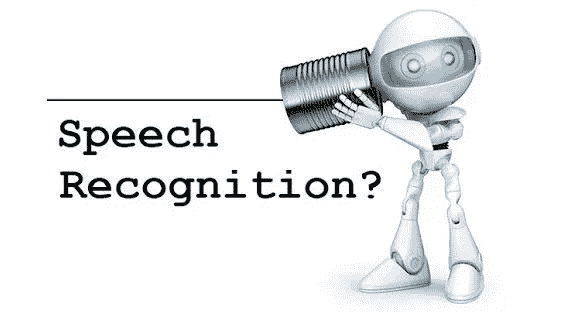
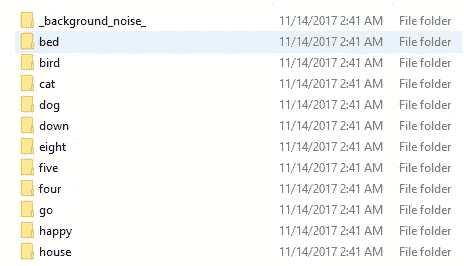
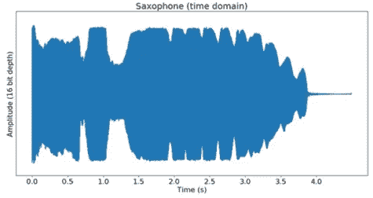
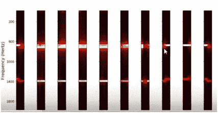
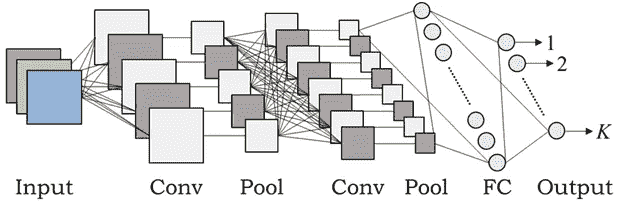
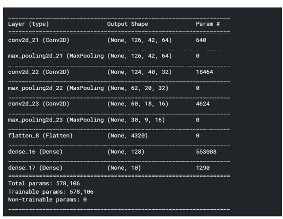
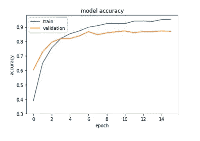
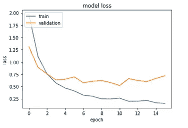

# 使用张量流的简单语音分类器

> 原文：<https://medium.datadriveninvestor.com/simple-speech-recognizer-using-tensorflow-1c63efa7cc7b?source=collection_archive---------2----------------------->

你有没有想过亚马逊 Alexa 是如何工作的？

我们正在创造一个可以识别人类声音的模型。我们使用包含人类声音的标记数据的数据集来训练模型，然后它可以用于识别新数据。最初，我从各种来源收集了数据，并准备了包含大约 64，727 个音频文件的数据集，这些音频文件包含基于不同类别的人声，例如“是”、“否”、“上”、“下”、“左”、“右”、“开”、“关”、“停止”、“开始”、“零”、“一”、“二”、“三”等。数据集如下图所示。

每个文件夹包含一个特定单词的人声和下面列出的一些例子。

 [## 2019 年深度学习的终极学习路径及更多...-数据驱动型投资者

### 又一个美好的一周，一些好的教育内容将会到来。我最喜欢的&最受欢迎的帖子之一…

www.datadriveninvestor.com](https://www.datadriveninvestor.com/2019/01/07/the-ultimate-learning-path-for-deep-learning-in-2019-more/) 

鸟的人声。

音频信号的相应波形图

在对如何将音频数据输入深度神经网络做了大量研究后。我发现了一种将音频数据转换成声谱图(图像)的方法，这种声谱图可以很容易地输入卷积神经网络。

预处理中涉及的步骤

●通过傅立叶变换将音频数据转换到频率-时间域。

●将频率-时间域转换成频谱图。

●随后将该频谱图传递给梅尔频率滤波器，以适合卷积神经网络。

经过这些步骤后，音频信号的输出是一个放大的频谱，这可以馈入卷积神经网络

我用卷积神经网络来识别语音信号。典型的 CNN 架构如下所示。

**张量流模型总结:**

**我为什么选择 CNN？**

在对音频数据进行了整个预处理之后，它给出了一个频谱图，通常是一个图像类型的数据。事实证明，CNN 可以很好地处理图像数据，我甚至尝试使用 LSTMs 来解决相同的用例，但发现 CNN 比 RNNs 显示出更好的结果。

**评估结果:**

我训练了大约 19000 个样本的模型，并对 4000 个样本进行了测试。我得到了大约 95%的训练准确率和大约 90%的测试准确率，这表明很少过度拟合，但这不是我们的原因。

训练数据集的模型精度与时期

测试数据集的模型精度与时期

**结论**

该模型达到了 90%的准确度，这是很好的，我们可以通过微调该模型来实现更好的准确度。

你可以在[https://github . com/TharunAts/Speech-Recognition-using-tensor flow](https://github.com/TharunAts/Speech-Recognition-using-Tensorflow)找到代码