# 使用 NLP 的简单文本摘要生成器

> 原文：<https://medium.datadriveninvestor.com/simple-text-summarizer-using-nlp-d8aaf5828e68?source=collection_archive---------0----------------------->

[](http://www.track.datadriveninvestor.com/1B9E)

***在本帖中，我们将了解什么是 NLP——自然语言处理及其用法。我们将一步一步地构建一个简单的文本摘要器。我们还将了解 NLP 中使用的一些关键概念，如单词袋(BOW)、术语频率(TF)和术语频率-逆文档频率(TF-IDF)***

*未来的帖子将探索深度学习 NLP 算法，如 Seq2Seq、双向 LSTM、Attention seaech、Beam search 和 Greedy learning。*


自然语言处理或 NLP 提供了使用计算机理解人类语言的工具。在 NLP 中，我们分析文本，理解正在交流的内容——比如谁在说什么，正在讨论的主题是什么，以得出结论的含义。

人类通过首先听正在说什么和由谁说来进行交流。我们试着去理解所说的内容和语境，这有助于我们理解意思。

[](https://www.datadriveninvestor.com/2019/02/08/machine-learning-in-finance/) [## 金融中的机器学习——数据驱动的投资者

### 在我们讲述一些机器学习金融应用之前，我们先来了解一下什么是机器学习。机器…

www.datadriveninvestor.com](https://www.datadriveninvestor.com/2019/02/08/machine-learning-in-finance/) 

在机器学习中，我们试图做完全相同的过程。

***自然语言处理用在哪里？***

自然语言处理的一些应用是

*   ***情绪分析*** —根据收到的反馈分析情绪。
*   ***聊天机器人*** —用户可以提问，自然语言处理程序会给出相关的答案
*   **神经机器翻译**——将文本从一种语言翻译成另一种语言
*   ***文本摘要***——总结一篇冗长的文本

***我们如何利用文本进行自然语言处理？***

这是一个非常有效的问题，因为机器学习算法只理解数字数据。

根据任务的不同，我们使用不同的 NLP 管道。

我们将讨论简单文本摘要器的 NLP 管道，然后理解 NLP 中的一些关键概念:**单词包、术语频率(TF)和术语频率-逆文档频率(TF-IDF)**

## 简单文本摘要生成器的 NLP 管道

来源将是一个维基页面，我们将用几句话总结。

***为简单文本摘要器创建 NLP 管道的步骤。***

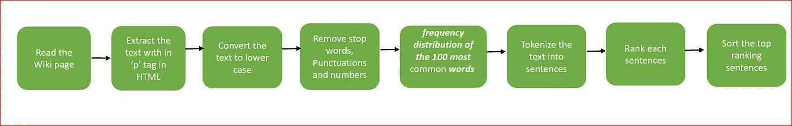

NLP Pipeline for simple text summarizer using basic NLP

***第一步*** : ***导入所需库***

```
import numpy as np
import pandas as pd
from bs4 import BeautifulSoup
import nltk
import urllib.request
from nltk.corpus import stopwords
from nltk.tokenize import word_tokenize, sent_tokenize
from string import punctuation
from heapq import nlargest
nltk.download(‘stopwords’)
from collections import defaultdict
```

***第二步*** : ***使用请求库从源文件中读取*** 文本或废弃网页。

我们正在废弃关于“机器学习”的维基页面。

```
***url="***[***https://en.wikipedia.org/wiki/Machine_learning***](https://en.wikipedia.org/wiki/Machine_learning)***"*****request = urllib.request.urlopen(url).read().decode('utf8','ignore')**
```

URL 的 HTML 内容在请求变量中可用。

显示我们从页面中读取的一小部分 HTML 内容，它存储在变量 ***请求*** 中

```
request
```

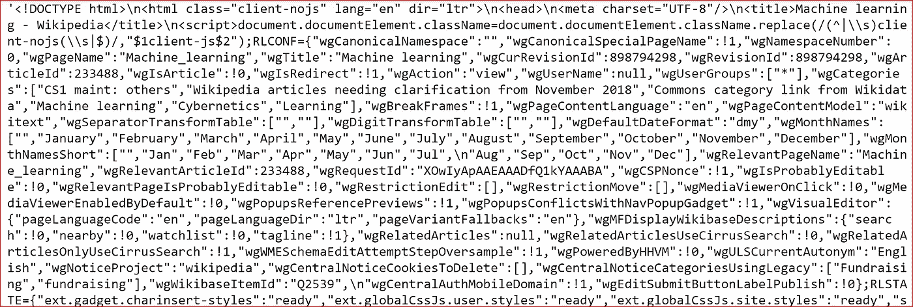

HTML response of the wiki page on Machine Learning

***第三步:将文本标记成单词*** 。

我们使用 ***BeautifulSoup*** 解析 HTML 内容来提取所有带有‘p’标签的文本。

```
# read the data from the url
**soup= BeautifulSoup(request, 'html.parser')**# find all text that has p tag
**text_p = soup.find_all('p')**
print(text_p)
```

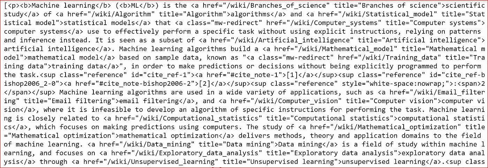

text inside the ‘p’ tag in the html content

我们将文本转换成小写，然后将文本标记成单词。

```
**for i in range(0,len(text_p)):
    text += text_p[i].text****text = text.lower()**# tokenize the text
**tokens =[t for t in text.split()]**print(tokens)
```

从提取的句子中打印标记化的单词


tokenized words containing stop words

我们可以在输出中看到停用词，如 is、the、of 等。

***第四步:去除标点符号、停用词和数字，对分词后的单词进行处理*** 。

停用词是在文本中频繁出现但没有增加太多意义的词，如 the、and、of 等。

```
clean_token =tokens[:]#define irrelevant words that include stop words , punctuations and numbers
**stopword = set(stopwords.words('english') + list(punctuation) + list("0123456789") )**
for token in tokens:
    if token in stopword:
        clean_token.remove(token)

print(clean_token)
```

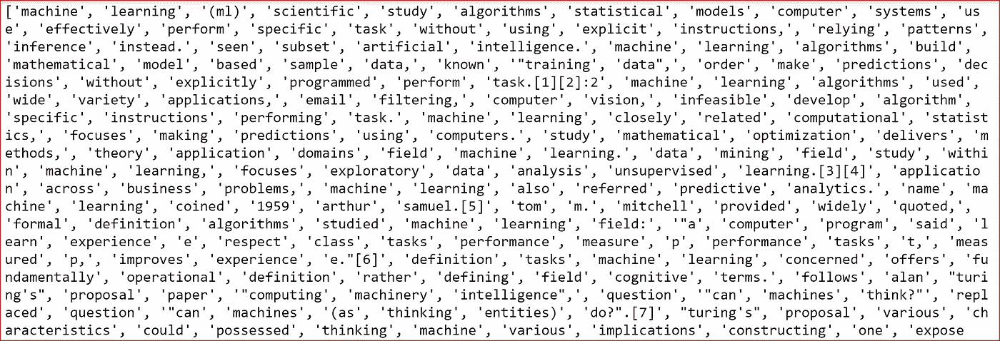

tokenized words without stop words

我们现在有干净的令牌，没有停用词、标点符号和数字

***第五步*** :我们创建一个 ***频率分布最广的 100 个单词*** 也称为 ***【包词(BOW)*** 呈现在网页上。

BOW 是出现在带有**单词** **计数的文本或句子中的**单词**的集合。单词包**不考虑它们出现的顺序。

频率分布会告诉我们文本中单词标记的总数是如何分布的。

```
**freq = nltk.FreqDist(clean_token)**
top_words=[]
**top_words=freq.most_common(100)**
print(top_words)
```

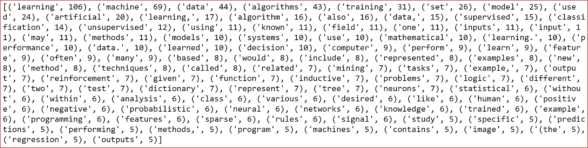

top 100 words from the wiki page with no. of occurrences

***第六步*** : ***将网页中的文本分词*** 成句子

```
**sentences = sent_tokenize(text)**
print(sentences)
```

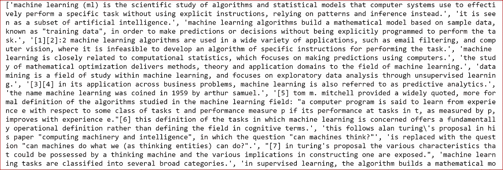

sentences from wiki page

***第七步*** : ***遍历网页中的所有句子，为每个句子创建排名*** 。

句子的排名将基于最常用单词的数量。句子中频繁出现的单词越多，排名就越高。

最常见的单词在步骤 5 中被识别。

```
ranking = defaultdict(int)
**for i, sent in enumerate(sentences):
    for word in word_tokenize(sent.lower()):
        if word in freq:
            ranking[i]+=freq[word]
    top_sentences = nlargest(10, ranking, ranking.get)**
print(top_sentences)
```

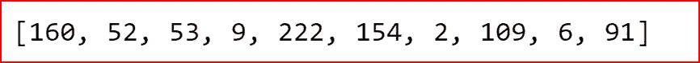

top sentences index

打印十大句子之一

```
print(sentences[2])
```

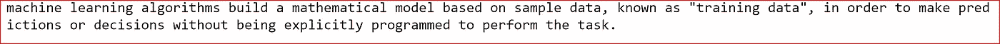

one of the top 10 sentences

***第八步*** : ***最后对句子进行排序，打印排名最高的前 10 个句子。***

```
sorted_sentences = [sentences[j] for j in sorted(top_sentences)]
print(sorted_sentences)
```

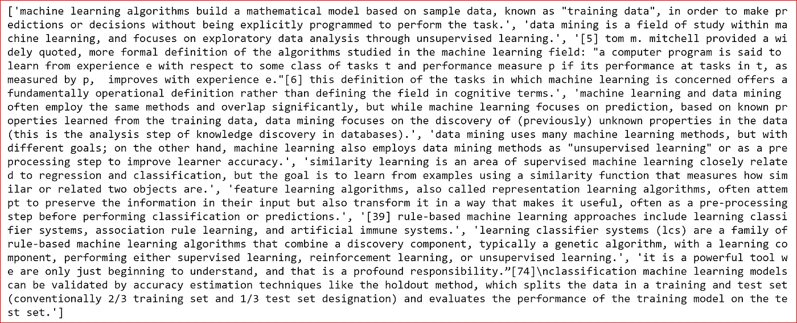

我们还可以对最常用的单词使用词干。词干将使用词根，这样 machine 和 machines 将不会是最常见的单词列表中的两个单独的单词。

对于不同类型的 NLP 任务，可以执行一些附加步骤

*   识别 ***词类*** 的单词。像名词、形容词或动词等词类。
*   使用 ***命名实体识别*** 识别单词是否是地名、人名或产品名
*   使用词干查找 ***词根。*** 字与run、run、ran 有同一个词根 run。
*   我们在文本摘要中使用了 ***术语频率(TF)***

***词频是一个词在文档中出现的频率除以文档中有多少个词*** 。TF 帮助我们理解包含最常用单词的句子。TF 用于一个文档。

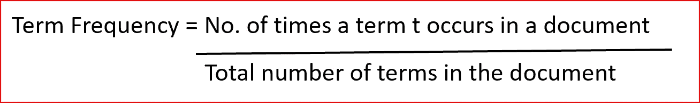

TF 面临的挑战是停用词何时出现频率更高。

我们可以通过删除停用词来克服这个挑战，就像我们在文本摘要器中所做的那样，或者使用 ***术语频率-逆文档频率(TF-IDF)***

TF-IDF 在我们有多个文档时使用，它有助于识别带有罕见或独特单词的句子或文档。

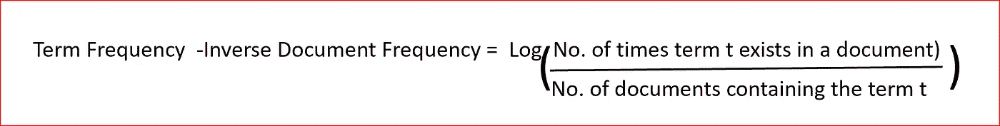

这篇文章将帮助你对 NLP 和 web 报废有一个基本的了解