# 简化:Sigmoid 神经元——深度神经网络的构建模块

> 原文：<https://medium.datadriveninvestor.com/simplified-sigmoid-neuron-a-building-block-of-deep-neural-network-5bfa75c8d8a9?source=collection_archive---------1----------------------->

欢迎回到我继[感知器](https://medium.com/@narmadhahandi/perceptron-learning-model-5918dd2ddbd9)和 [MP 神经元模型](https://medium.com/@narmadhahandi/mcculloch-pitts-neuron-first-computational-model-of-a-biological-neuron-c08c85b74997)之后的下一篇文章。这次我们将更深入地了解神经网络，以了解 Sigmoid 神经元——深度神经网络的基本构建模块。

在我的上一篇文章中，我们研究了感知器网络如何处理我们输入的真实输入并返回二进制输出。当决定输出时，MP 神经元和感知器都有一个很大的缺点，即边界非常苛刻。

例如，我们有一个人的工资，以千为单位，基于此，我们试图做出一个决定，这个人是否会购买汽车。我们的感知器模型有一个 50k 的阈值。所以现在我们的模型说，如果一个人有 50.1k 的工资，他很可能会买车，49.9k 工资的人不会买车。感知器做出的这个决定在实时情况下非常苛刻，而我们通常做出平滑的决定。

> [DDI 编辑推荐—深度学习专业化](http://go.datadriveninvestor.com/deeplearning/matf)

准确地说，下图告诉我们，Sigmoid 神经元将如何不同于感知器和我们的 6 罐机器学习。

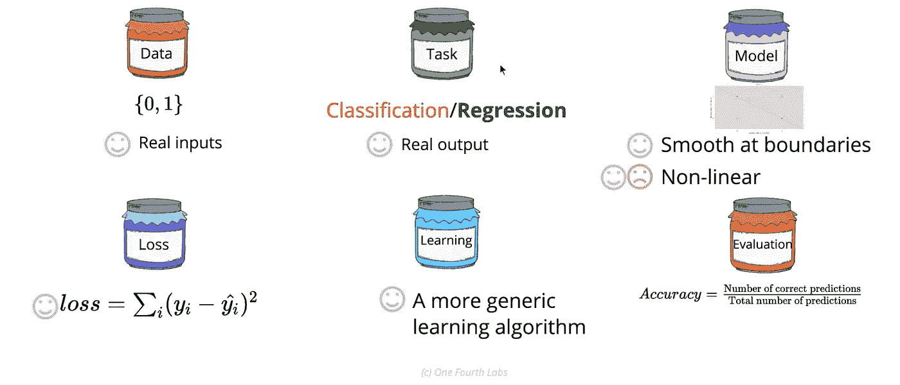

Sigmoid Neuron w.r.t 6 jars of Machine Learning

# 1.数据和任务

Sigmoid 神经元既可以用于*二元分类*也可以用于*回归*问题。输出将是一个介于*‘0’*和*‘1’*之间的值，基于该值，我们可以使用它来指示它是否属于用于二进制分类的*‘0’类*或*‘1’类*。例如，输出值 0.75 将属于*“等级 1”*，而值 0.2 将属于*“等级 0”*。这种分类是基于 ***阈值*** 。

在回归的情况下，给定输入 *x1，x2，x3，..我们正在尝试使用 Sigmoid 函数回归概率。我们可以像给出一个评级一样联系它，其中值位于*‘0’*到*‘1’*之间。*

# 2.模型

与感知器 0/1 函数相比， *S 形的 Sigmoid 函数族*给了我们一条更平滑的曲线，更接近人类的决策方式。给定 X 和 Y，其中 X 是属于实值输入的高维度。Y 和 X 之间的近似关系由下面提到的 Sigmoid 函数给出。

在 1 维输入 X 的情况下，最佳描述输入和输出之间关系的 sigmoid 函数由下式给出

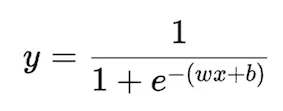

在 2 维输入(包含 2 个输入特征)的情况下，最佳描述输入-输出关系的 sigmoid 函数由下式给出

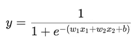

在具有许多特征的高维输入的情况下，sigmoid 函数由下式给出

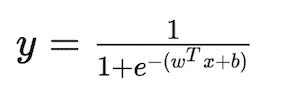

与感知器和 MPNeuron(二进制输出)不同，sigmoid 函数输出位于*‘0’*和*‘1’之间。*使用 Sigmoid Neuron 的另一个优点是，它可以处理不可线性分离的数据。一个 sigmoid 神经元不能完全区分正点和负点，但它可以给出一个分级的输出，这允许更好的解释。

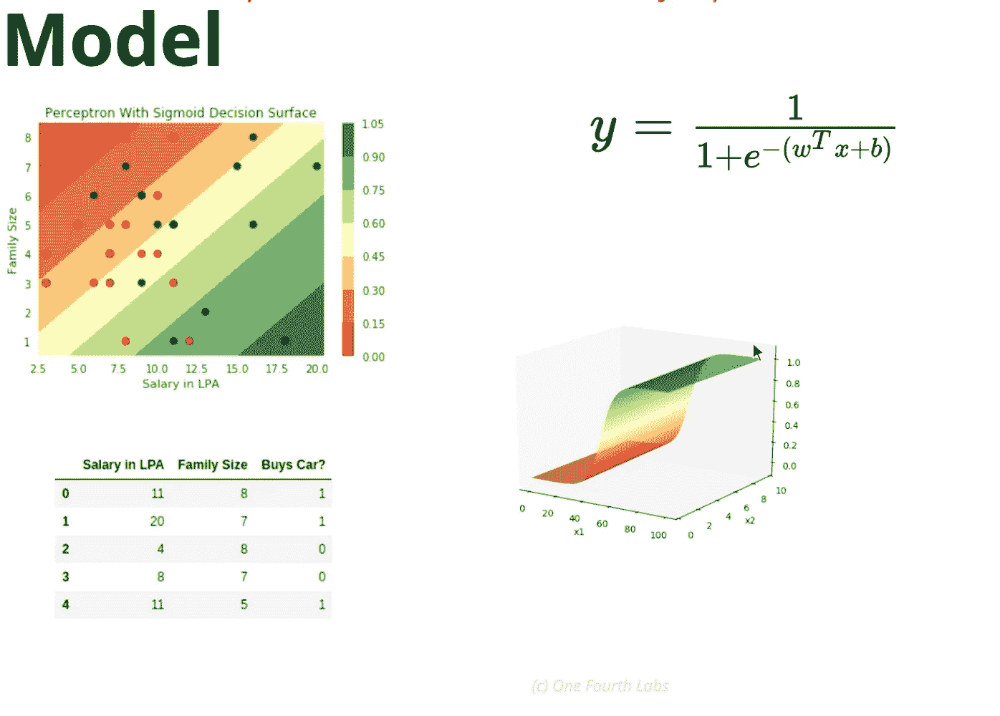

Sigmoid neuron giving gradation in the output

通过改变*‘w’*和*‘b’，*的值，我们可以得到不同类型的 Sigmoid 函数。

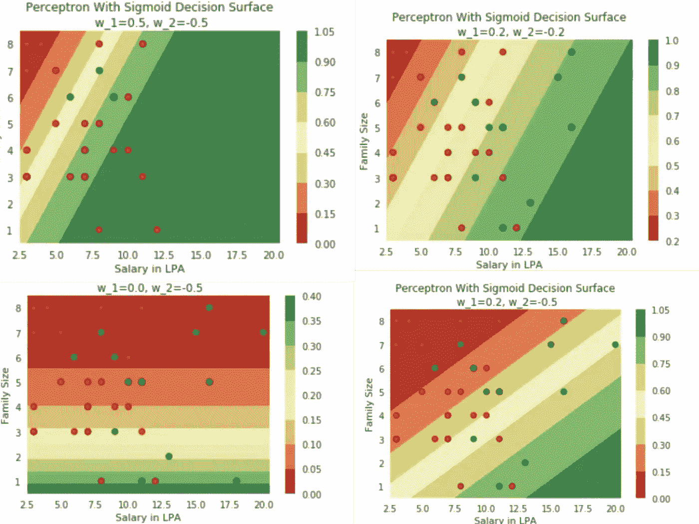

# 3.损失函数

有了数据、任务和模型，我们将如何计算损失？我们将再次使用我们最喜欢的损失函数，平方误差损失函数。Sigmoid 神经元利用另一种损失函数-交叉熵损失函数。

平方误差损失函数由下面的公式给出。

> 损失函数是真实输出和预测输出之间的平方差之和。

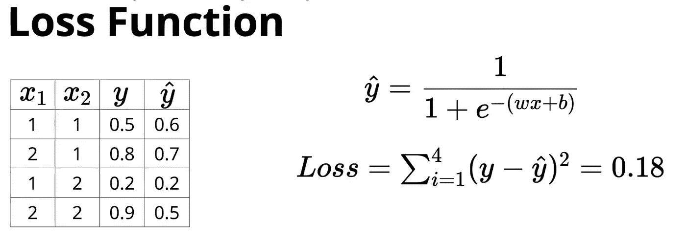

Squared error loss

# 4.学习算法(梯度下降)

基本上，sigmoid 是一个函数族，其中，通过改变*‘w’*和*‘b’*的值，我们可以得到各种 Sigmoid 函数。通过改变*‘w’*和*‘b’*的值，我们可以改变曲线的**斜率和曲线**的**位移。给定输入和输出，我们选择使用带参数*‘w’*和*‘b’*的 Sigmoid 函数进行近似。使用学习算法，我们必须找到参数*‘w’*和*‘b’*的值，这样，当我们将输入代入 Sigmoid 函数方程时，我们应该得到接近真实输出的预测输出。所以我们想找到*‘w’*和*‘b’*的值，使得 sigmoid 函数应该通过输入输出点。如果发生这种情况，那么我们知道，每当我们插入来自训练数据的值时，我的 sigmoid 函数给我的输出非常接近真实输出，在这种情况下，*‘w’*和*‘b’*的值被正确学习，因此我的训练数据的损失被最小化。这是我们学习算法的目标。**

我们如何找到*‘w’*和*‘b’*的值呢？从' *w'* 和 *'b'* 的一些随机值开始，因为我们对这些值一无所知。复习所有的训练要点。计算损失。尝试更新*‘w’*和*‘b’*的值，以便我们从一个随机的 sigmoid 函数开始，慢慢地接近我们期望的损失最小的 sigmoid 函数。这是一种猜测方法，其缺点是在某一点损失增加的情况下找到*‘w’*和*‘b’*的值。所以这种方法并不总是管用。我们需要找到一个有原则的方法来找到*‘w’*和*‘b’的值。*

因此，学习算法的目标是找到*‘w’*和*‘b’*的值，这样，从所有可能的 Sigmoid 函数中，我们必须找到一个更接近输入和输出之间真实关系的 Sigmoid 函数。

Sigmoid 神经元学习算法在某种程度上类似于我们的感知器模型学习算法，它是由损失函数驱动的。算法是这样的，

1.  随机初始化*‘w’*和*‘b’*的值
2.  使用带有随机初始化的*‘w’*和*‘b’*的 Sigmoid 函数计算输入的预测输出值
3.  使用损失函数计算损失
4.  更新*‘w’*和*‘b’*的值，使损耗稳定下降，并重复上述步骤，直到损耗为’*0’*(或)可接受的最小值(或)有限次重试(或)两次连续迭代之间的损耗变化可忽略不计。

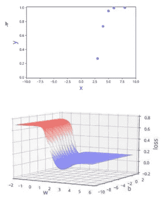

如果我们随机猜测*‘w’*和*‘b’*的值，损失可能不会稳定下降。从误差面(如左图所示)可以明显看出，损耗可能会随机减少和增加。针对*‘w’*和*‘b’*的所有可能组合，通过绘制*‘w’，‘b’*与损失的关系，获得误差面。因此，我们需要一种基于损失函数的原则性方法，来找出*‘w’*和*‘b’*的值，对于这些值，输出的预测值接近真实输出。在实践中，PyTorch 和 TensorFlow 通过给定模型和数据的内置函数，在每次迭代中查找*‘w’*和*‘b’*值的变化。

## 平方误差损失函数:

找出*‘w’*和*‘b’*的值的学习算法由下式给出

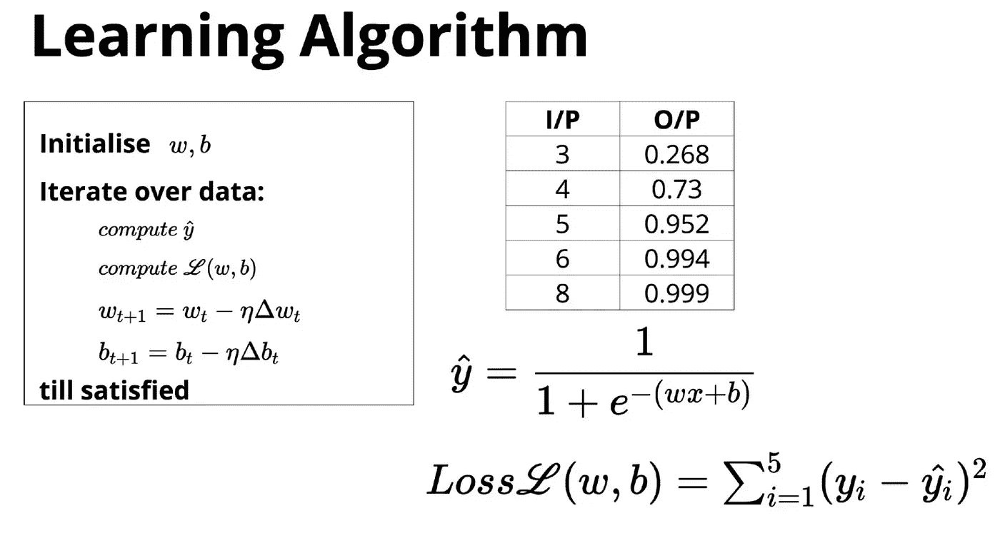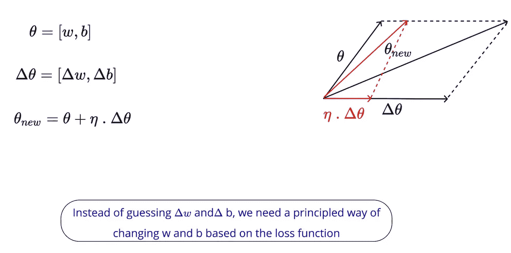

‘eta’ — Learning Rate, ‘Theta’ — vector of ‘w’ and ‘b’

在下一节中，我们将看到寻找*‘w’*和*‘b’值变化的数学公式。我们利用泰勒级数来求解方程。*

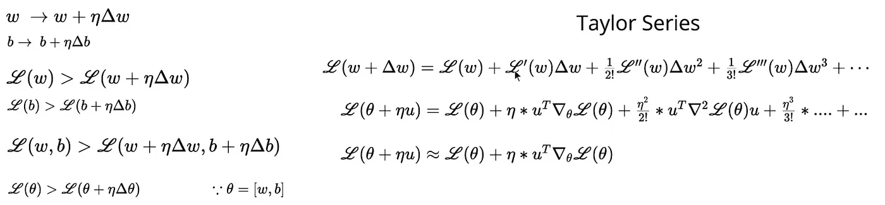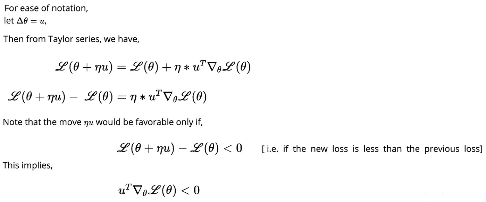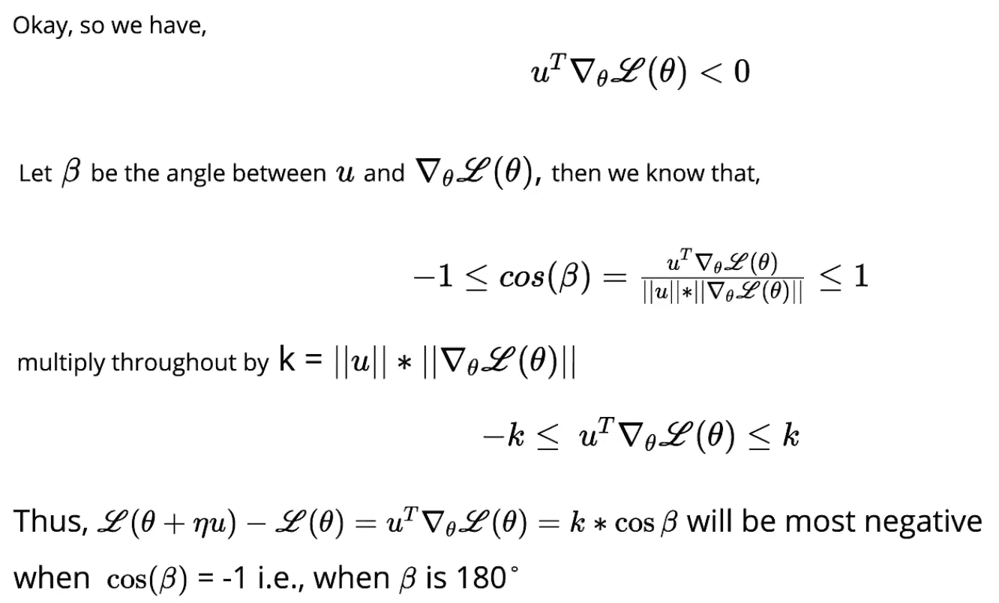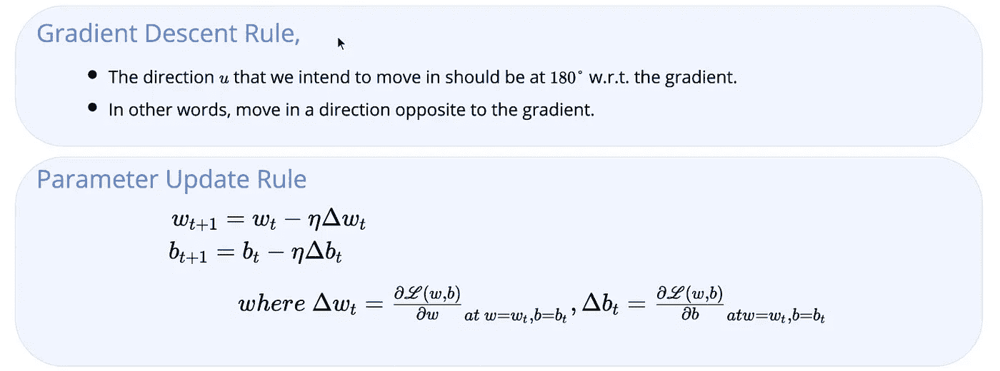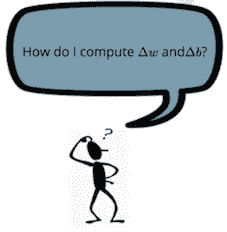

有了上面的数学公式，我们如何找到损失函数对*‘w’*和*‘b’*的偏导数？

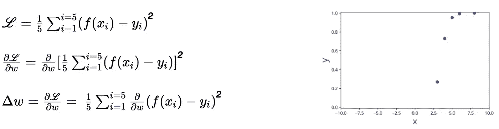

让我们只考虑今年夏天一个学期，

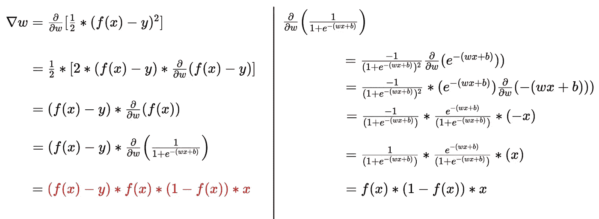

This derivation is for only one term.

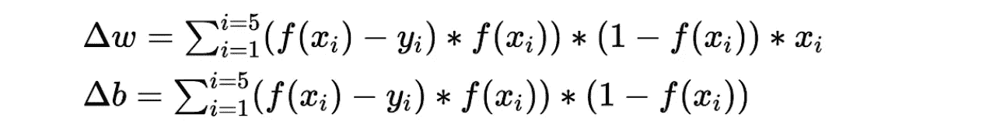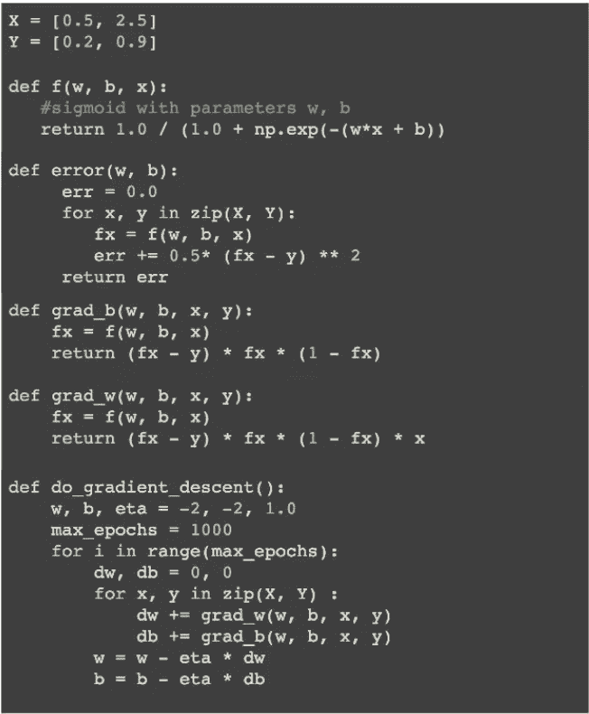

在整篇文章中，我们讨论了一维或二维输入。如何处理高维输入？让我们考虑下面的例子来理解在高维输入的情况下如何找到*【w】*和*【b】*的值。

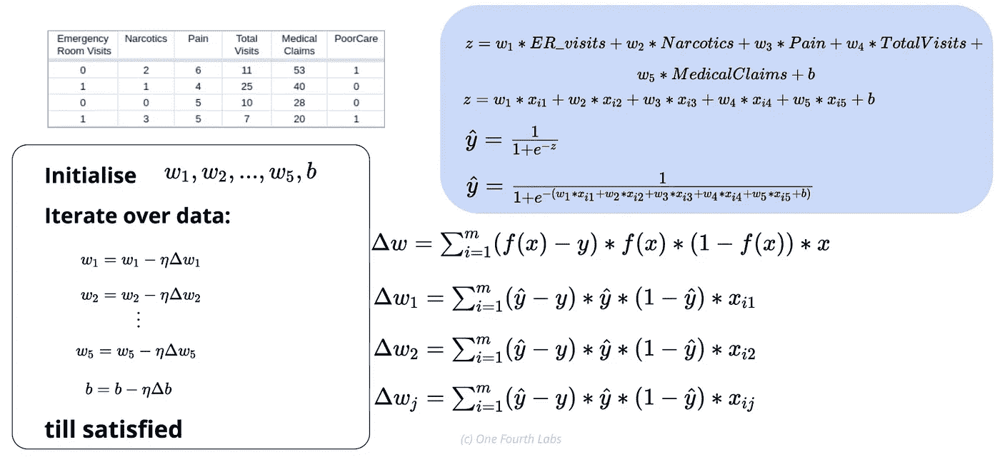

关于代码，我们必须进行以下更改来处理高维输入数据。

## 交叉熵损失函数；

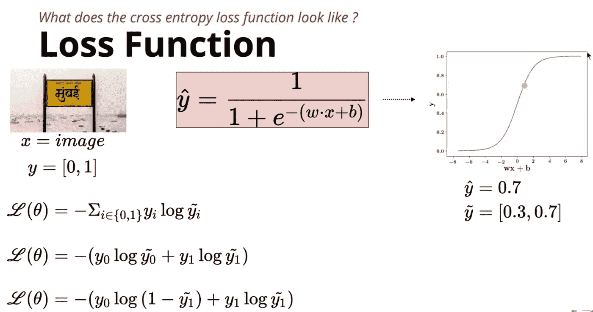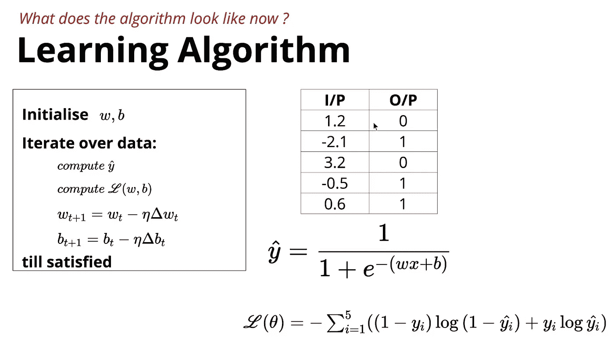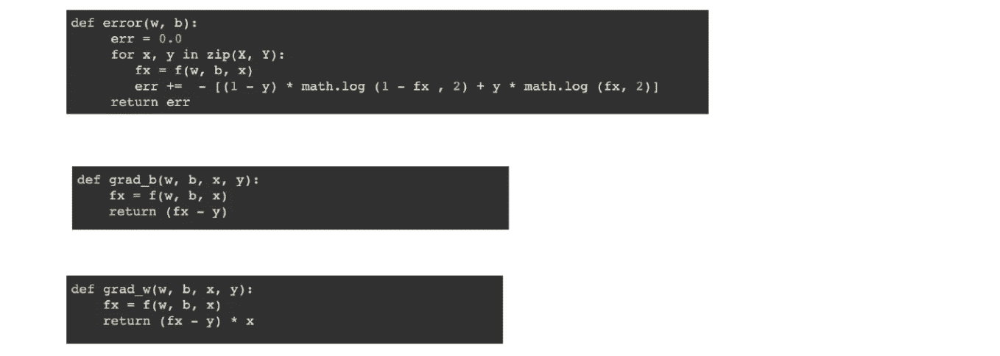

# 5.估价

到目前为止，我们已经获得了数据，我们的任务是预测*‘0’*到*‘1’*之间的值，因为我们正在尝试回归概率，我们有 Sigmoid 模型，因为输入与输出通过逻辑函数相关，我们有损失函数，即平方误差损失函数。我们如何评价损失函数？

有了真实输出和预测输出，我们可以利用*(均方根误差)来评估我们的模型。当然，RMSE 越小，模型功能越好。这是在*回归*的情况下。*

*如果我们不得不将我们的模型用于分类问题，我们根据阈值对输出进行分类，那会怎么样呢？我们可以通过使用下面的公式计算**精度**来评估我们的模型。*

*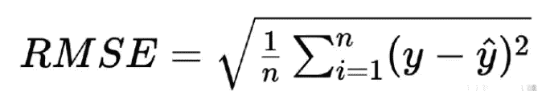**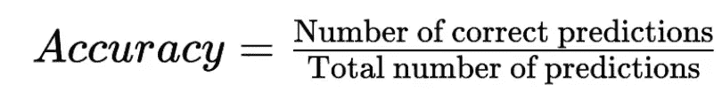***

*为了将所有的部分放在一起，下图总结了乙状结肠神经元的机器学习的 6 个方面。*

*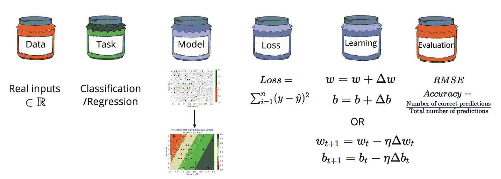*

*继我上一篇关于 [6 罐 ML](https://medium.com/@narmadhahandi/so-what-is-machine-learning-fbcf525c3f2c) 、 [MP 神经元](https://medium.com/@narmadhahandi/mcculloch-pitts-neuron-first-computational-model-of-a-biological-neuron-c08c85b74997)和[感知器](https://medium.com/@narmadhahandi/perceptron-learning-model-5918dd2ddbd9)的帖子之后，我想快速比较一下这三种神经元，以了解它们的特性。*

*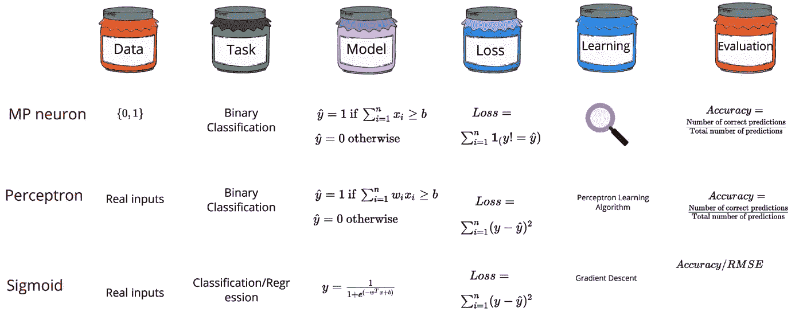*

*感谢您阅读我的帖子。带着一个很有意思的关于深度神经网络的话题再次和大家见面。*

*如果我在我的帖子中有任何错误，请随时纠正。一如既往，我鼓励建设性的批评。*

*编辑披露:编辑有时会发布有用资源的链接。如果你发现它们有用并购买，我们会赚很多钱。不，我不是说要把我的薯条做大。我说的是超大披萨上的意大利香肠。感谢您一直以来的支持，我们将继续为 p̶e̶p̶p̶e̶r̶o̶n̶i̶出版而努力。*