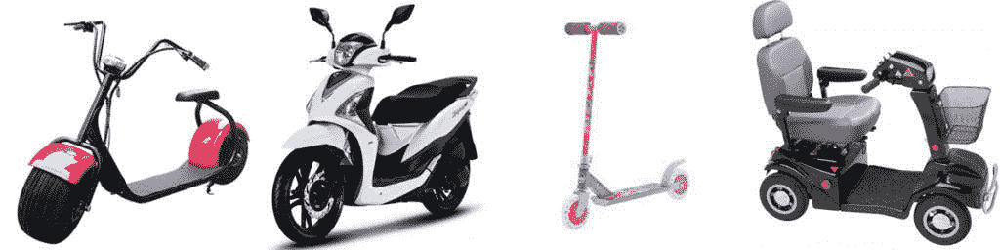
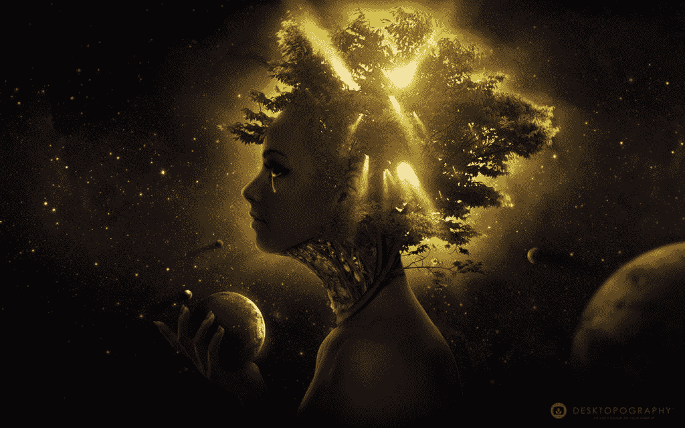

# 简单来说——意识到底是什么？！

> 原文：<https://medium.datadriveninvestor.com/simply-put-what-the-hell-is-consciousness-cc26c1584943?source=collection_archive---------5----------------------->

# 定义意识

给“意识”这个词下一个定义极具挑战性，但也许是时候公平对待它了。

出于某种原因，尽管我们都非常频繁地使用这个词，我们彼此理解也没有问题，但在定义它的时候，我们有点儿为难。从科学家到哲学家和宗教人物，都声称他们知道它是什么，但似乎没有人能够同意。

尽管如此，我想说我们一直在努力定义意识的原因不是因为它是一个复杂的术语，而是这整个混乱实际上是一个简单的沟通混乱的结果。

# 思想实验

让我们做一个小小的思维实验。请想一想小型摩托车，并试着给我定义一下。

现在，如果你说它有马达，那么我说它没有，如果你说它是你站在上面的东西，我说它有座位。

我没有错！但你也不是…

踏板车也是我们永远无法完全同意其定义的事物之一，原因很简单——有许多不同的事物使用相同的名称。

Scooter — Different Things, Same Name.

说到常见的实物，比如滑板车，这个问题对我来说真的很容易解释，对你来说也超级容易理解。我只是给你看不同的滑板车照片，你就明白了。但是，当涉及到完全抽象的物体时，比如意识，我没有什么可以展示给你，这使得解释和理解变得更加困难。所以我们必须用摩托车来比喻。

# 展开定义

让我们试着深入研究一下，看看是否有可能，当涉及到意识时，我们在一个清晰的定义上达成一致的困难来自于那个完全相同的错误。

所以，首先，让我们把“意识”这个术语分成几个独立的概念，并给每个概念下定义。

意识的主要类型有:

# 生物背景:意识是清醒的(一种活跃的状态)

这是意识这个词最简单也可能是最常用的用法，它只是用来描述一个活跃的实体——一个接收输入并积极处理它的实体。这种类型的意识只能在生物中找到，只要实体保持活着，它就可以很快和相当容易地失去和恢复(入睡/醒来)。一旦死亡，这种类型的意识将永远失去，因为它永远无法恢复。

# 心理背景:意识是心灵的一部分

我们用“意识”这个词来描述另一件事，它很相似，但又非常不同。在心理学领域，意识描述了一个实体监控自身内部过程的能力。意识到自身内部发生的事情的大脑结构或大脑的一部分。

根据这个定义，我们可以说，实际上，简单的有机体(不管清醒与否)是以完全无意识的方式运作的。当暴露于特定的输入时，它们会以特定的输出做出反应，就是这样。他们不知道自己为什么要这么做，而且[他们无法改变自己的反应，这让他们完全可以预测，完全无意识](https://emotionalintelligenceproject.com/how-to-trust-yourself/how-to-relate-to-your-unconscious)。

然而，更高级的生物，如人类，具有意识能力。与我们的前辈不同，在某种程度上，我们知道我们内心正在发生什么，我们利用这些信息来调整我们的处理过程并改善我们的反应。正如我们现在所知，这种类型的意识是一个巨大的进化优势。它让我们能够对自己和周围的世界做出更好的预测，同时也让我们变得更加不可预测，更加难以预料。最重要的是，它允许我们在几秒钟内改变自己，进化，变成不同的东西，而不是几代人。成倍地加速了我们的进化过程。

# 精神背景:集中的宇宙意识

当谈到灵性时，意识这个词再次被用来描述一些稍微不同的东西。在精神领域，意识指的是相信宇宙本身，像我们自己一样，是某种有知觉的实体。一个有一定意识水平的生物，有处理信息的能力，有能力对自己的反应做出某种形式的决定。

这是一个很大的概念，很难让人相信，原因有二:

第一个障碍是因果关系。既然我们意识到事情的发生是有原因的，并且每一个结果都有一个确定的原因，那么似乎没有任何空间留给宇宙来做任何决定。尽管当研究混沌理论、蝴蝶效应和量子世界的不可预测性时，我们知道总有一些回旋的余地。系统中有一定的自由度，可能是混乱的，也可能不是。所以即使系统(宇宙)是确定性的，有些东西仍然是随机的，不可预测的。

当然，第二个障碍是，即使因果宇宙有一些不确定性的空间，这也不能证明这种不确定性是由一个中心机制引导或组织的。但是几代人以来，甚至在这个科学时代，人们似乎仍然在混沌中经历着某种意想不到的秩序。这种神圣的秩序通常以一系列极低概率的巧合的形式出现，这些巧合是如此完美地组织起来，以至于它们没有被精心策划是极其不可能的。

我们不能完全证明这种类型的意识存在，也不能证明它不存在。但即使如此，它仍然是这个词最主要的用法之一，也可能是围绕它的混乱的主要原因。

The Living Universe

# 把它放回原处

归根结底，所有踏板车的共同点是它们都是两轮车，所有意识的共同点是它们都是一个实体接受信息(意识)处理信息并利用信息修改输出(反应)的能力的衡量标准。

既然我们可以区分不同类型的意识，并找到它们的共同点，让我们试着把它们放回一起——但这一次，作为一个包含不同层次的尺度。

意识的第一层必须是存在。现有是最低和最基本的水平，所以它将是我们的基线，或 0 值。

从那里，我们进入意识的第二个层次，这是功能意识——接受输入并对其做出反应的能力。这种类型的意识代表了静止物体(如岩石)和有生命的物体(如树或细菌)之间的区别。在这个意识层次中，一个实体不仅存在，而且还是一个对其环境作出反应的主动者。

第三层意识，目前在最高层，是精神意识。这是我们人类目前分散在意识尺度上的部分。在这个意识层次中，实体存在，对它的环境作出反应，也对它自己作出反应。它有能力思考和想象现实，并据此做出预测，在没有经验的情况下学习。允许它以自己认为合适的方式改变自己的行为和重塑自己。

> *“未经审视的人生不值得过”*
> 
> *——苏格拉底*

# 机器能变得有意识吗？

如果你有任何问题，认为其中一个论点有错误，或者只是不相信我，请随时留下评论。然而，如果你还和我在一起，让我们再向前推进一步，试着想想这对人工意识智能的未来意味着什么。

[如果我们看看 AI](https://emotionalintelligenceproject.com/enlightened-robot/the-human-singularity) 目前的水平，有一点我们可以肯定地说，它是存在的(在上下文中)。所以，它绝对有资格成为一级意识。

当观察最简单的生命形式，如植物、细菌、昆虫和其他此类生物时，我们真的看不到比相当简单的算法集合更多的东西。环境数据被输入，某些算法被用来处理这些数据并指示反应。

机器以完全相同的方式运转。它们也用预定义的算法响应输入，并且每次都返回相同的输出。就功能意识而言，机器的意识不亚于任何基本的生命形式。所以，我认为我们可以说他们绝对有资格成为第二级——功能意识。

第三层意识似乎是我们目前面临的挑战——对人类和人工智能都是如此。开发能够认识自己、理解自己并能够自我改进的东西是我们这个时代最复杂也是最重要的挑战。

就精神意识而言，今天的人工智能完全是无意识的。它通过反复试验来学习，对自己的心理过程既没有意识也没有理解。

我们的下一个挑战应该是超越这个阶段，发展智力。设计一种全新的人工智能，它不仅能从错误中学习，还能从思想和想象中学习。一个能够认识自己，进而认识我们的人工智能——而不仅仅是对我们做出反应。

# 人呢？

作为人类，我们正面临着同样的挑战。即使我们处于意识的第三阶段，这个阶段是一个有许多不同层次的光谱。我们的自我意识能力正在发展，我们还有很长的路要走。关于我们自己，我们的身体，我们的情感，尤其是我们的思想，我们还有很多不了解的地方。

如果我们真的希望提高自己，这应该是我们的主要焦点。因为从进化的角度来看，意识的进步是我们在生活中取得的唯一真正的进步，其他一切都只是在恭维它。

在一个足够长的时间线上，我们可以看到，留给后代的唯一真正遗产不是我们的信仰、故事、文化，也不是科学发现。我们唯一可持续的长久遗产是我们作为一个物种的进化过程。如今，我们的进化，就像人工智能一样，都是关于思维的。

> *“唯一真正的革命在于心灵的启蒙和品格的提高，唯一真正的解放在于个人，唯一真正的革命者是哲学家和圣人。”*
> 
> *——威尔·杜兰特*

感谢你的阅读，希望你喜欢它。
本文最初发表于[emotionalintelligenceproject.com](https://emotionalintelligenceproject.com/enlightened-robot/simply-put-what-is-consciousness)

 [## 简单来说——意识到底是什么？！

### 给“意识”这个词下定义是一个极大的挑战。出于某种原因，尽管…

emotionalintelligenceproject.com](https://emotionalintelligenceproject.com/enlightened-robot/simply-put-what-is-consciousness)