# 情感模拟

> 原文：<https://medium.datadriveninvestor.com/simulation-of-emotions-2e01b2dc2b2e?source=collection_archive---------1----------------------->

不理解智能出现的本质和智能行为的机制，就不可能创造出人工智能。通过改变神经元样元素的数量、组织和算法，可以无限地编译神经元样元素的网络，但不可能像进化几百万年来那样随机重复。我并不是说不可能创造出基于其他一些基础的智力，这些基础不同于人类智力的基础。为了飞行，不需要仅仅基于扑翼的模型飞机，但是为了设计它们，有必要知道空气动力学的法则。因此，首先我们需要了解地球上唯一已知的智能例子的工作原理。

生物的活动性质是由它们的需要决定的，例如生存、进食、繁殖和保存能量的需要。没有一个生物的行为是在由他们的需求形成的内在动机之外的，也不可能想象一个没有内在动机和目标的头脑。我们眼睛的每一个动作、话语的表达和思想的形成都是满足我们需求的机制的结果。不受需求制约的绝对智力的创造，将是无生命的机器人或机械齿轮的创造。我们周围的世界是非常复杂和多样的，不可能在所有情况下都创造出让生物体在这个世界上成功的条件反射。因此，大自然创造了一种机制，允许我们形成和选择导致预期结果的反射——这些是情绪，或情绪机制。

但是一个人工智能能有什么样的需求呢？因为它不需要经历饥饿，而恐惧感会激起自卫的行动；爱和情感——这些情感甚至对人类来说也制造了很多麻烦。人工智能唯一真正需要的是学习的欲望，好奇心和对新奇事物的渴望。所有情感的本质都是相似的，上述所有情感都可能体现在人工智能中。

在我们的大脑中，有许多不同的区域，我们可以说这些区域之间有一定的相互关系；这些连接比神经元之间的连接更高级。这些部门通过化学信号相互影响，这是一种较慢的信息渠道。每种情绪都受到大脑中它自己的区域、它产生的原因、它对其他区域的影响，以及作为结果的有机体本身的行为的制约。

## 重要的需求和与之相关的情感机制

对于大多数情绪来说，可以区分两种状态:饥饿和饱腹感。口渴和解渴、肌肉紧张和松弛时间延长、恐惧和危险回避感、痛苦和痛苦退缩、厌倦和新奇体验、缺少一个依恋对象和与依恋对象接触的喜悦是情绪机制的两个对立部分。

***什么是饥饿？***

想象一下神经系统中神经元的某个区域，其中的活动会随着需求的增加而增加，需求增加得越多，这些细胞的激活就越频繁，它们就越多地参与到精神活动中。因此，如果没有必要，这些细胞将不会被激活。你可以称这些细胞为需求细胞，它们似乎需要实施必要的行动来平息它们。

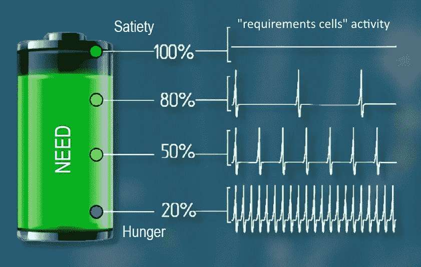

试着屏住呼吸，你会感受到呼吸中枢“需求细胞”的动作。随着时间的推移，随着呼吸的延迟，来自内脏器官的关于二氧化碳增加的信号将到达负责呼吸的神经中枢，增加其活动。活动增加如此之多，不可能通过大脑皮层的抑制作用来抑制呼吸。而这个神经中枢通过它的活动会引起对呼吸的必要反射。对于每一种需求，都存在相应的“需求单元”，尽管在某些情况下，这些单元的工作是相互关联的。

一个活的有机体可以有许多需求，这些需求之间有优先顺序，自我保护的需求总是高于满足食物饥饿的需求。这些优先级通过相应需求单元的最大活动级别和相互抑制来排序。生物体将执行那些与满足当前在其神经系统中占首要地位的细胞的需求相关的反射。

我们将研究需求和情绪如何控制动物的行为，以及在计算机模型的帮助下发生了什么内部过程。

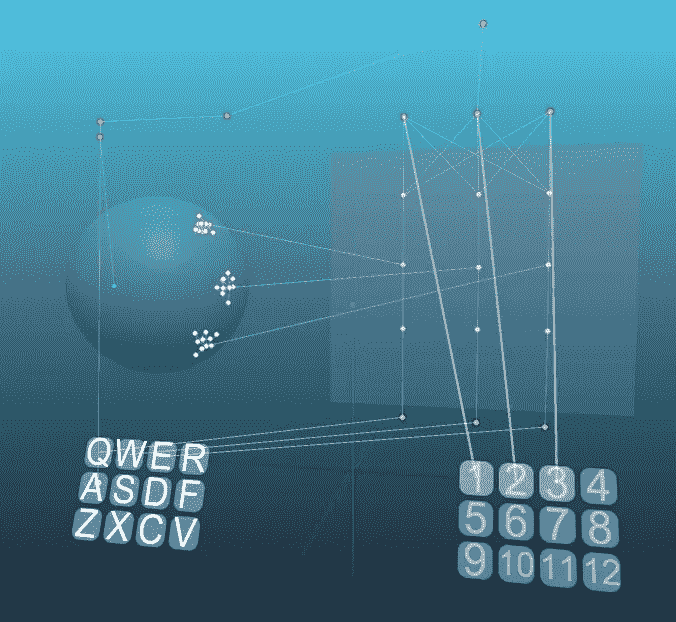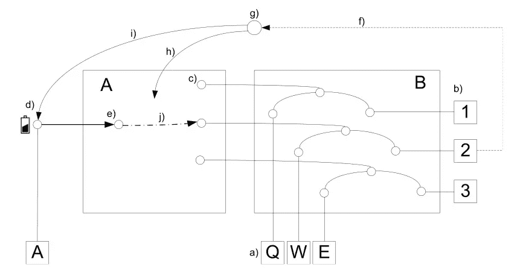

为此，我们将查看程序中的一个特定系统。系统中有两个区域，A 和 b。这些区域是必要的，以便我们可以在逻辑上分离和隔离神经元群。A 区负责某种需求，B 区由一组简单的反射编码。标题为 Q、W、E 的三个反射(A)，它们的激活分别导致三个动作“1”、“2”、“3”(b)，每个反射在 A 区(с)有表征，反射和表征之间的兴奋传递是双向的。这样的组织是从神经系统的组织原理中衍生出来的，但是已经大大简化了。负责情绪和需求的区域位于边缘系统，这些区域与海马体密切相关，海马体负责临时记忆，并有许多皮层代表。通过对海马体的虚拟访问，我们可以访问各种皮层反射。

通过刺激 A，我们可以激活需要(d)，这种刺激可以象征，例如，来自内脏器官的关于缺乏必要营养的信号，从而产生饥饿感，并激活相应的需求细胞(e)。此外，可能还有许多对需求细胞仅具有调节作用的额外刺激，例如，开胃的食物气味可以增加细胞对食物饥饿需求的敏感性，这将增加它们的活性。但是在绝对没有饥饿的情况下，食物的气味不会影响动物的行为。

假设当动物执行动作“2”时，它导致某种需求(f)的满足。对于饱和，神经元(g)将负责，其活动导致 a 区的印记。在这种情况下，神经可塑性在一秒钟内从 0 变化到 0.1，然后返回(h)。当我们讨论记忆的话题时，我们谈到了情绪记忆的机制，这是一个如何运用这一机制的例子。以同样的方式，负责需求单元(I)的活动的中心被抑制，但是这种抑制被延迟，并且这产生了形成关联链接的可能性。这些过程的一个类似物是多巴胺神经元的激活。多巴胺介质是抑制性的，它在负责饥饿的区域有阻滞作用。此外，影响大脑某些区域可塑性的各种“快乐激素”的释放改变了集中注意力和感知的能力，并降低了疼痛阈值，总体上可以解释为欣快状态或情绪高涨。

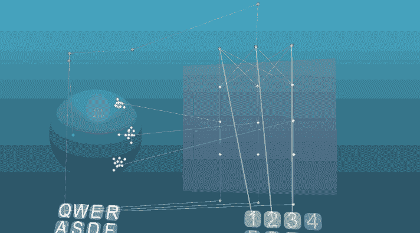

即使在“需求细胞”活动的情况下，不导致饱腹感的动作也不会在 a 区引起任何显著变化。但是在导致饱腹感的反射的第一次开始时，会产生一个反射弧，该反射弧连接“需求细胞”和导致所需动作的反射的表示。这样就形成了一定的封闭轮廓；需求的出现导致了“需求细胞”的激活，需求细胞激活了反射，反射形成了导致满足中枢激活的行动。满足感会抑制“需求细胞”的活动，直到需求再次出现。随着每一次重复，形成的反射弧将通过增加突触的强度而得到加强。在这种情况下，突触 100 的最大力的值被设定，将需要 10 次重复以达到反射动作稳定性的最大值。

如果我们进一步取消条件:通过“2”的动作导致饱和，那么当需要出现时，这个动作将被积极地执行，起初非常积极，但是随着时间的推移，习惯化过程将导致这种反射的表现的衰减，并且适应过程将有助于周期性地返回到“2”的动作。没有任何擦除信息的机制，反射弧会持续存在。由于属于反射弧的神经元在其他反射行为中的再训练和参与，反射弧可能会丢失。在生物系统中，一种情况是可能的，即无用的行为被与能量守恒有关的需要所抑制。事实上，保存能量的需要在执行任何动作时都会产生，但在执行由于不作为而抑制运动神经元的动作的反射时会得到满足。

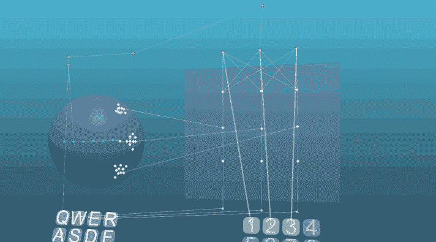

另一个选择是添加一个条件，使得动作“1”将导致饱腹感。在这种情况下，仅仅引入一个新的条件是不够的，有必要在有这样一个机会的一开始就训练有机体。在几个训练动作之后，当需要出现时，两个动作都会被执行，尽管这些动作在同时执行时可能是竞争的。反射行为将更经常地被执行，由于存在更强的链接，其反射弧更稳定，并且最终这种反射将完全占主导地位。简单地说，有机体更有可能执行那些先前导致积极结果的行动。

例如，如果动作“1”的执行对于节能更有效，那么它将使人比动作“2”更有优势。

当然，完全再训练是可能的，即使有最大限度的稳定反射，假设你只在对“1”的动作做出反应时，才建立起饱腹感的表象。这需要一些培训。之后，在一段时间内，可能会执行动作“2”(“出于习惯”)，但最终有机体只会在需要出现时执行动作“1”。

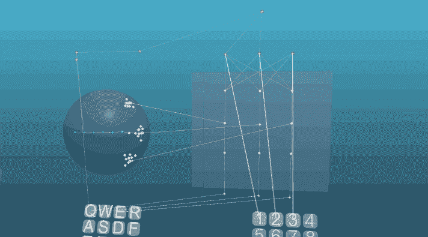

只有在一些预先配置的反射和老师的存在下，情绪和需求满足之间的关系才是可能的，这将在适当的时刻导致必要行动的实施。其实这和自然界还是挺符合的。但是生物体试图自己研究环境的情况呢？这是可能的，因为对新信息或新奇事物的需求非常重要。

## 对新奇事物的需求

新奇需求背后的情感机制与任何其他需求的原理相似，正因为如此，我们需要为输入信息的新奇性确定一个标准。如果身体在一段时间内没有接收到新的信息，那么对新奇事物的需求就会开始出现，相应的“需求细胞”就会开始激活。

从进化的角度来看，获取新信息的需求出现得相对较早，生理学家已经发现了一些基本的神经网络，用于评估神经系统中信息的新颖性。例如，一个神经网络可以让你识别声音水平的突然变化，这是吸引人们注意环境变化方面所必需的。

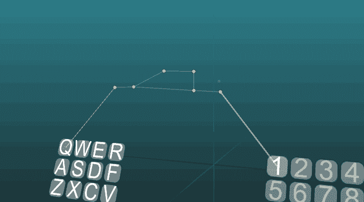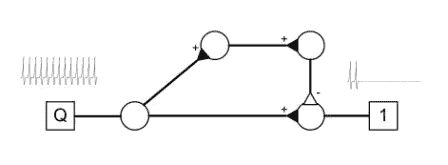

这种神经网络只在一系列尖峰信号开始时做出反应。如果你对所有的声音都有这样的网络，那么你只能选择新的声音并对它们做出反应。

但是很难想象有一个方案能够在抽象思维的层面，在形象和联想形成的层面，评价信息的新颖性。对于模型神经元，有一种非常简单的方法来评估新信息，累积状态的变化和突触的变化。在每一个神经元被激活时，有了这个新颖性标准，就有可能获得新颖性水平的中期值。

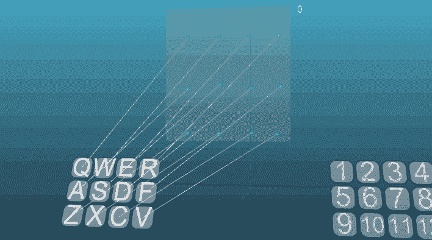

A criterion for the novelty of combinations of receptor activation

在生物模拟中，可能存在一些化学信号，神经元必须在外部因素的影响下启动改变其突触力的程序。

为了理解什么是新鲜感，我想举一个 T.G.R. Bower 的《婴儿期的发展》一书中的一个实验的例子:

> 婴儿可以把头转向左边来开灯。大多数 2-3 个月的宝宝会在短时间内多次开灯。那么向左转的频率就低于作为学习标准的水平。只要灯的点亮和头向左转之间有稳定的联系，就不会增加。让我们假设实验者改变了交流的方向:当头转向右边时，灯就亮了。婴儿迟早会把头转向左边，灯就不亮了。在这种情况下，接着是大量向左转弯，然后检测到右电路，这由向右的短暂高转弯频率指示，然后该频率降低。如果情况不改变，这一频率也将保持低位。
> 
> 如果再改变强化方案，以至于要开灯，先把头转向左边再转向右边，那么第一次尝试后右转的频率会增加，这时灯不亮；左转的频率也会增加，最后宝宝会把头转向左边，再转向右边，开灯。从左到右转弯的频率短暂增加后，频率会降低并保持不变，直到情况发生变化。改变强化程序会导致一系列活动，在找到正确的回合组合后会停止。因此，孩子学会了一系列相当复杂的动作:例如，向右——向右——向左——向左。随着形势的变化，每次都可以观察到活动的增长。研究表明，这种活动不是偶然的。婴儿通过一系列的假设进行排序，测试一系列的动作，找出哪一个动作在当时是有效的。找到正确的答案后，他检查了几次，然后停止了表达的活动。只有当先前的序列不再适用时，它才会再次增加。从婴儿的行为来看，很明显，光刺激不是一个激励因素。
> 
> 当假设测试开始时，第一次成功后的婴儿几乎不看光源。他匆匆瞥了一眼，看它是否亮着。在确定灯已经亮了之后，他可以表现出愉悦的迹象，但是他并没有注意到光源，这显然不是他满意的理由。

让我们用模型从例子中描述的例子来分析孩子行为的内在机制:

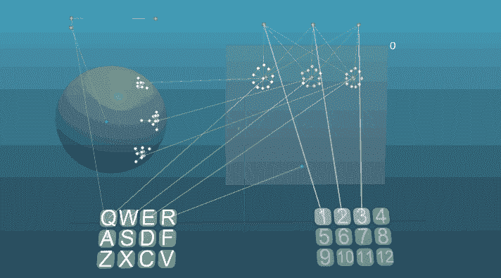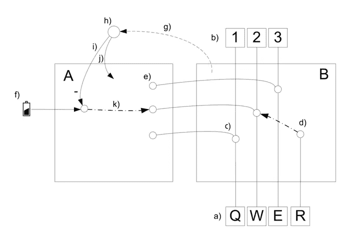

拿 A 和 B 两个区域来说，第一个区域负责新奇的情绪，第二个区域负责信息新奇程度的评估。区域 B 有四个输入信号(a)，假设信号 Q 是某种将头转向左边的内部或外部动机；这个激励信号激活相应的反射，导致动作“1”(b)，这将是向左转头的动作。对于刺激 W 也是一样，但是把头转向右边。刺激物 E 可以是一种先左转再右转的内在动机。整个运动组合的图像在大脑皮层内的运动皮层中形成。所以这种反射表象的存在是完全合乎逻辑的。刺激 R 是包含光的视觉图像出现的结果。与运动系统相关的反射在 B 区(с)和 A 区(e)都有表现。

刺激的组合将形成新的反射弧，传播兴奋的新方式，这将表明高水平的信息新颖性。并且每次重复相同的组合将显示出更低水平的新颖性。

gif 上的新颖性级别的值可以在区域 b 上方的右手边看到。

在 10 秒钟内在区域 B 中没有新颖性水平高于 70%的信息的情况下，存在信息匮乏，因此需要新颖性(f)。与其他需求相比，新奇的情感是很低的，但是满足它的需求很快就出现了；在需要自我保护的情况下，对新奇的需求是次要的，恐惧的情绪总是更强烈，但对新奇的需求几乎是无法满足的。例如，这种情绪控制我们眼睛的迅速扫视，在观看图像的时候，一旦从眼睛的感受器传输的信息具有低水平的新鲜感，眼睛就会移动。眼睛浏览图像的速度表明了对新奇情感的饥饿-饱和循环的速度。当然，大脑不同区域的新奇程度可以用不同的方式来评估。

B 区高水平的新鲜感(> 70%)导致神经网络(h)的激活，这在短时间内缩短了 A 区的可塑性，以形成反射弧，该反射弧将与导致饱腹感的动作相关联。此外，“需求细胞”的活性受到抑制(I)。

导致对新奇事物需求的满足的行为会被重复，即使它们不会带来满足，但是在这种情况下，有可能通过其他需求的影响来抑制这种行为。比如能量守恒的需要，或者习惯化的出现。组合，比如转头开灯或者转头不开灯，当它们发生变化时，会被同等评价新奇程度。

孩子们经常会问“为什么？”仅仅是因为他们新奇情感的中心与这个动作的表现相关联。他们的经验告诉他们，通过问这个问题，有可能获得新的信息，从而满足对新奇事物的需求。

对新奇事物的需求对于学习掌握发音器官和运动技能是非常重要的。这些系统有反馈；运动活动的作用立即反映在视觉、触觉和前庭器官的感受器中。发音器官的作用反映在听觉器官的感受器中。在动物发展的最初阶段，动作的组合和对这种动作结果的感知形成新的反射弧，鉴于需要新奇的情感机制，这种反射弧导致重复这些动作的愿望，以及类似动作的组合。

一个例子是儿童的牙牙学语，大约在婴儿六个月大时开始活跃。儿童发展的这一阶段是由激发发音的无条件反射的激活开始的，但受到新奇情绪的支持，使儿童发出相同的声音或玩这些声音。

争取主动游戏，与物体互动等。让一个动物和一个人不仅能满足对新奇事物的需求，还能教会他们管理自己的身体，形成自己的形象。

## 爱情和亲情

满足需求的机制是普遍的，挑出饥饿和饱足的内部标准就足够了。比如考虑依恋的情绪。依恋有不同的种类:母子亲情，对配偶、亲人的依恋等。这种情绪表现为渴望接近依恋对象或看到它。在失去依恋对象的情况下，可能会出现焦虑或紧张的状态，如果依恋对象回来了，那么喜悦和其他愉悦的迹象就会表现出来。澳大利亚动物学家康拉德·劳伦兹的研究和实验证明了依恋情感的机制。例如，在研究小鸭子的行为时，洛伦兹发现刚孵化的小鸡做的第一件事就是寻找“母亲的形象”。

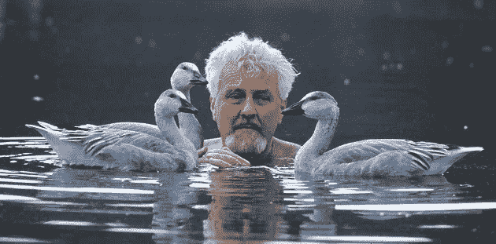

对于母亲这个角色，候选人唯一要做的就是搬家。如果一个移动的物体出现在刚孵出的小鸭子面前，它们就开始跟着它。将附件对象图像写入内存的过程称为印记。出生后，和母亲在一起的一天，足以让她的印记完成。此后，他们甚至会完全无视自己的亲生母亲，他们会更乐意地追随“代孕母亲”。

在生物体生命活动的某些关键时刻，活动图像的细胞被标记，这可能是在催产素介质的帮助下发生的。催产素被称为信任和依恋的荷尔蒙，它在成功的社会接触和互动、母乳喂养、相互修饰和性行为中脱颖而出。神经系统记得那些在催产素水平增加时活跃的神经元。

依恋情绪的饥渴标准可以是“标记”神经元的低水平活动，而满足标准是这些神经元的活动。根据所描述的满足神经系统需求的方案，那些导致需求满足状态的行为将被记忆和执行。渴望欣赏所爱的人的脸，孩子在与母亲分离时哭泣，母性的温柔和关怀的表现，失去亲人或宠物的悲伤都是负责依恋情感的大脑中心工作的结果。

提出的情绪机制模型允许我们谈论独立情绪的定性特征。改变饱腹感的速度或量度、饥饿开始的速度以及“需求细胞”相对于其他情绪中心的整体最大活动水平形成了模拟神经系统的动力学。

好奇心的程度、依恋的力量、勇气、贪婪、勤奋、懒惰和快乐，这些以及许多其他的性格品质都受到需求满足中心的初始设置的制约。

在未来，人工智能程序的开发人员将不仅专注于技术任务，还将专注于与程序的心理素质相关的任务，正如电影《伊娃》(2011)中所描述的那样。

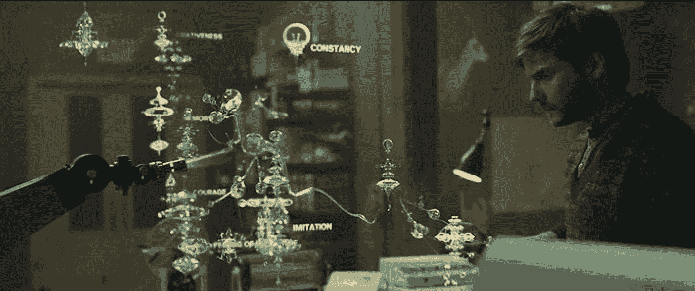

理解情绪的本质将有助于“编程”人工大脑逼真地执行机器人三大定律，它将不仅仅是一组指令；这些法律的实施本身会给这类人造心灵带来真正的喜悦和幸福。