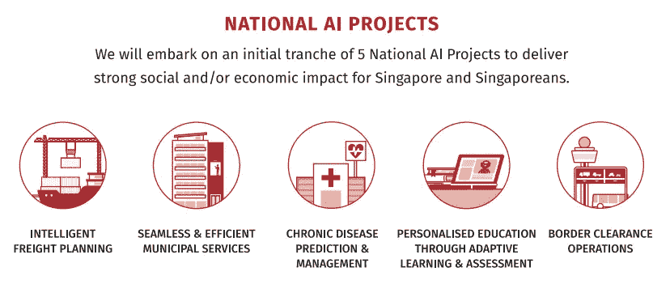
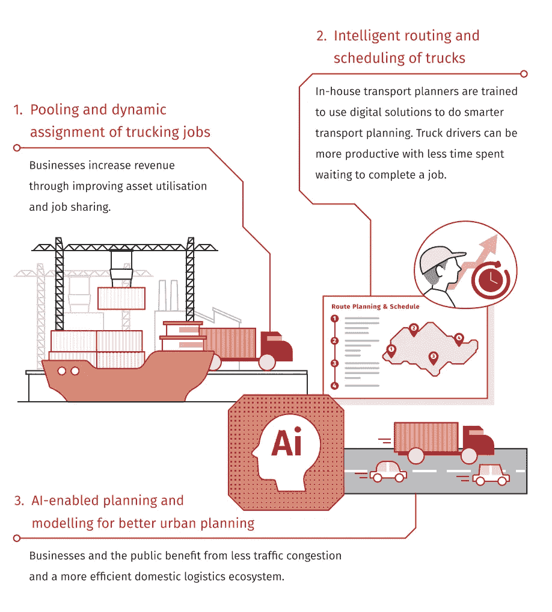
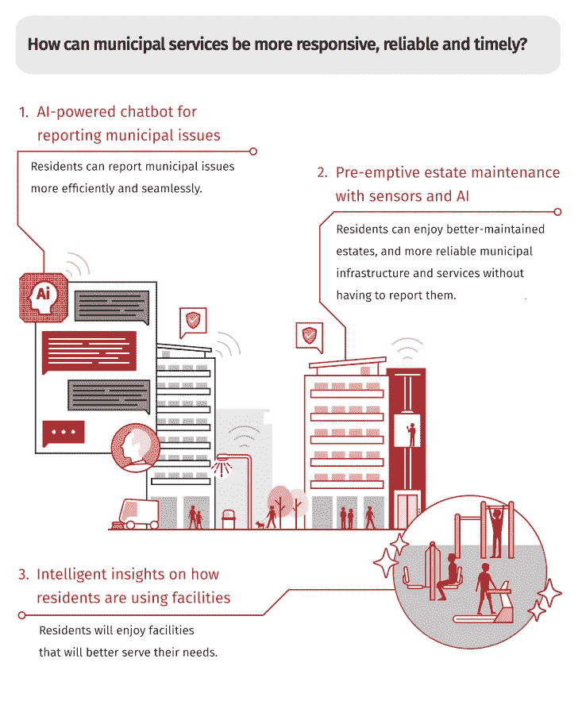
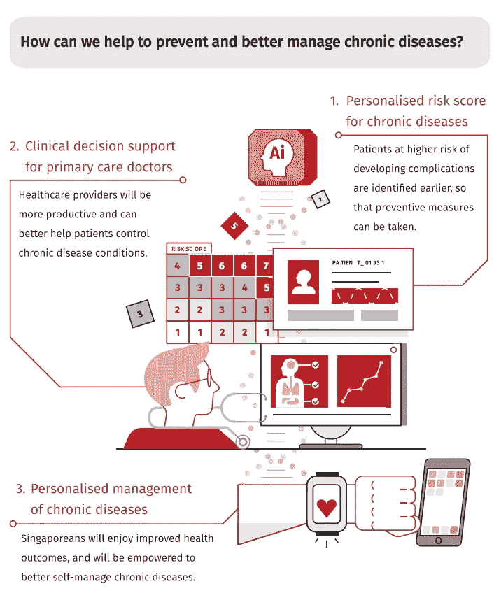
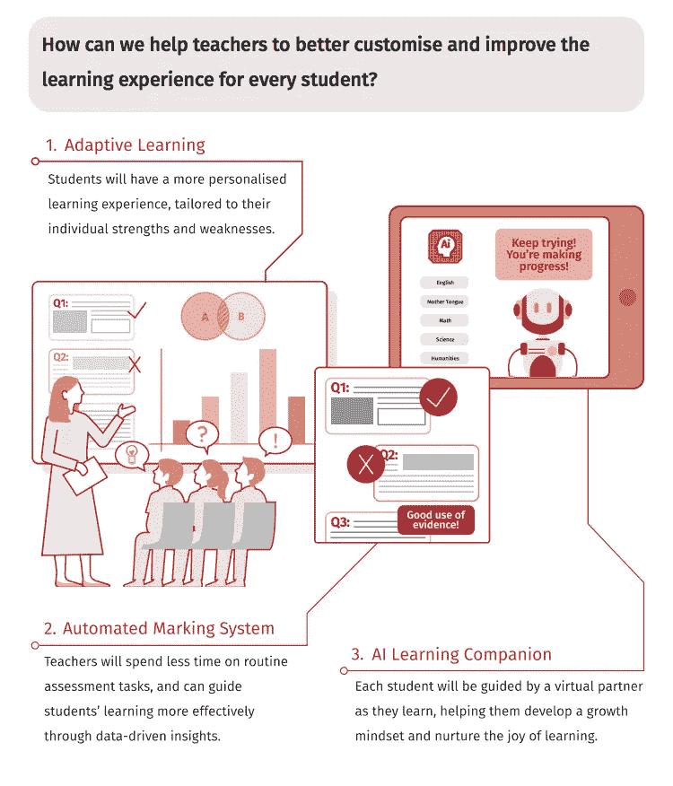
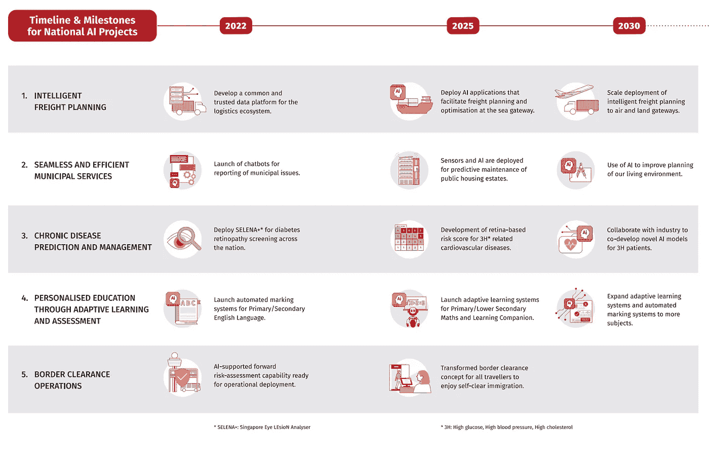

# 新加坡的国家人工智能战略

> 原文：<https://medium.datadriveninvestor.com/singapores-national-ai-strategy-f6ee68fa6aed?source=collection_archive---------6----------------------->

Photo by [@huchenme](https://unsplash.com/@huchenme)

## 应用人工智能来帮助——而不是取代——人

我决定快速浏览一下新加坡和它的人工智能战略。这是对总结要点的快速浏览，我希望下周能更深入地了解它。

## 新加坡有五个国家人工智能项目

它以一个大胆的目标开始，即在未来十年成为领导者。

> 到 2030 年，在对我们的公民和企业具有高价值和相关性的关键领域，新加坡将成为开发和部署可扩展、有影响力的人工智能解决方案的领导者。

然而，它并没有清楚地说明这种领导将会是什么样子，尽管最好保持模糊。虽然我会说除了“领导力”之外，他们的五个项目是我迄今为止在人工智能战略中看到的一些更具体的项目。

 [## 今年值得关注的 5 大人工智能趋势|数据驱动的投资者

### 预计 2019 年人工智能将取得广泛的重大进展。从谷歌搜索到处理复杂的工作，如…

www.datadriveninvestor.com](https://www.datadriveninvestor.com/2019/02/19/artificial-intelligence-trends-to-watch-this-year/) 

另一点是采取以人为中心的方法。基于他们的智能国家方法、风险和治理以及劳动力。

这是一个详细的策略。每个要点都有概述。

## 1.智能货运计划

## 2.无缝高效的市政服务

## 3.慢性病预测和管理

## 4.通过适应性学习和评估进行个性化教育

## 5.边境通关行动

他们甚至有时间表！

他们的战略总结简短而甜蜜，因此非常有助于了解他们想做什么。

## 它涵盖了气候变化还是可持续性？

不，我再次忽略了气候变化、气候危机、可持续性等等。在他们的战略中占据显著地位。

你会希望像新加坡这样在世界上扮演如此重要角色的地方，能够明白在他们的计划中解决这个问题是多么的重要。

唉，事实并非如此。

然而，我认为这是我迄今为止看到的最好的人工智能策略之一。

你怎么想呢?

Photo by [@coleenr](https://unsplash.com/@coleenr)

这里是#500daysofAI，您正在阅读的是第 181 条。500 天来，我每天都写一篇关于人工智能或与之相关的新文章。