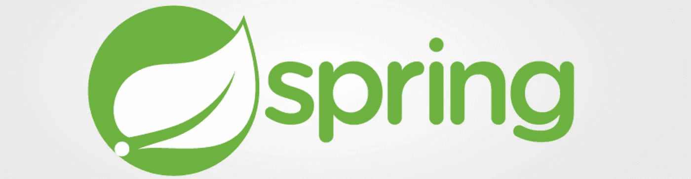
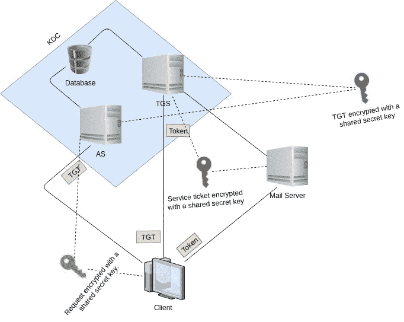
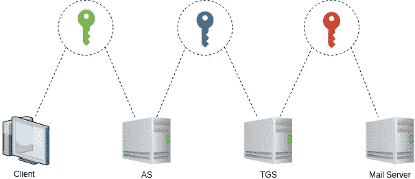

# 使用 Spring 的 Kerberos 单点登录…

> 原文：<https://medium.datadriveninvestor.com/single-sign-on-with-kerberos-using-spring-bff3eb835bc8?source=collection_archive---------0----------------------->

## 安全性

我假设你们大多数人都知道单点登录*和 Kerberos，但是不知道如何实现单点登录的 ***Kerberos*** 。让我们一个阶段一个阶段的去理解题目。单点登录意味着使用一个用户 Id 和密码访问所有帐户。Kerberos 是一种身份验证协议。到目前为止，Spring 是 Java 生态系统中最流行的应用程序开发框架。这是我在 Medium 的第 17 篇文章。*

## *什么是单点登录(SSO)*

*如今，人们使用许多软件应用程序。在大多数 web 应用程序中，用户需要创建一个概要文件来开始。因此，用户应该记住每个帐户的用户 Id 和密码。这对用户来说是不方便的。因此，开发人员提出了一种称为“单点登录”的机制。您已经知道了单点登录的含义。有许多协议提供服务来访问相关的、独立的软件应用程序，如 ***Kerberos、SAML、OpenID 等*** 。单点登录主要由 ***轻量级目录访问协议*** 完成，并存储在【目录】服务器 的 ***LDAP 数据库中。相反，存在一种称为“单点登录”的机制。单点注销意味着如果用户从一个应用程序注销，那么指定用户的所有登录应用程序也将注销。****

**

*Source: [https://knowourproducts.files.wordpress.com/2013/05/single_sign_on_banner.jpg](https://knowourproducts.files.wordpress.com/2013/05/single_sign_on_banner.jpg)*

## *麻省理工学院开发的安全认证系统*

*根据希腊神话，Kerberos (Cerberus)是一种三头狗，守护冥界，防止死者离开。Kerberos 是由麻省理工学院(MIT)在 20 世纪 80 年代早期为雅典娜项目开发的。历史和意义已经讲得够多了，现在让我们更深入地探讨一下技术。Kerberos 是一种网络身份验证协议。Kerberos 用于 c ***客户端-服务器模式架构*** 系统。这个协议防止 ***窃听和*** 重放攻击。Kerberos 建立在 ***对称密钥加密*** 之上。*

**

*Cerberus*

*Kerberos 有两个目的。分别是*。假设一个客户端想要访问一个邮件服务器，但是使用 Kerberos，客户端必须通过一个可信的第三方进行验证，这个第三方被称为“ ***密钥分发中心*** ( ***KDC*** )”。KDC 包括两台服务器。它们是一个 ***认证服务器*** ( ***为*** )和一个 ***票据授予服务器***(***TGS***)。如果客户机想要访问邮件服务器，那么下面的步骤将在 Kerberos 中执行。**

****

**Processes executed inside the Kerberos protocol**

****第一步:**客户端向认证服务器(AS)发送一个请求，比如“我的用户 ID 是某某，我需要一张邮件服务器的票”，类似这样。客户端请求是由密钥 部分加密的 ***。该密钥是客户端密码。客户端 ***从不通过不安全的网络发送他/她的密码*** 。客户端使用他/她的密码作为加密密钥。当 AS 收到客户端的请求时，它将根据 userID 在数据库中检索它们的密码，并使用客户端密码作为密钥来解密客户端的请求。客户端的密码是身份验证服务器和客户端之间的秘密共享密钥。你看，Kerberos 的设计非常聪明。如果数据库中的密码可以解密请求，这意味着为用户提供了正确的密码和用户 ID 组合。这就是验证用户的方式。验证完客户端后，认证服务器发回一个名为“ ***票证授予票证***(*)”的票证，用另一个密钥加密。******

****步骤 2:** 客户端得到加密的 TGT 后，连同客户端的“我要访问邮件服务器”等请求一起，发送给票据授予服务器。当 TGS 获得 TGT 时，它用与认证服务器共享的秘密密钥解密票据。然后，TGS 向客户端发放一个 ***令牌*** ，该令牌用另一个密钥加密。第三个密钥由 TGS 和邮件服务器共享。然后，客户端将令牌发送到邮件服务器。**

**第三步:当邮件服务器得到令牌时，它用与 TGS 共享的密钥解密令牌。邮件服务器根据令牌允许客户端在 ***特定时间段*** 内使用其服务。代币就像电影票，一个人可以用它在某一天的特定时间去电影院欣赏特定的电影。**

****

**在上图中，您可以看到不同方之间的所有通信都涉及一个密钥。例如，客户端和身份验证服务器共享一个密钥，即客户端的密码。认证服务器和票证授予服务器共享一个密钥。票据授予服务器和邮件服务器共享一个密钥。**

## **弹簧框架**

**这里我就不解释 Spring 框架了。在这里，我将描述为什么我们想要使用 Spring 来实现 Kerberos 的单点登录。**

*   **对 Java 编程语言的配置支持。**
*   **便携。**
*   **对授权和认证等任务的全面支持。**
*   **Servlet API 集成。**
*   **Spring MVC 集成。**
*   **CSRF 保护。**
*   **针对一些常见任务的保护。**

## **履行**

**这里让我先描述一下 KDC 的实现以及客户端应用程序和服务器应用程序。**

## **KDC**

**首先，我们跑 KDC 去找 TGT。**

## **客户应用程序**

**这里我创建了一个简单的客户端类。你可以把它作为一个模板。**

**Spring boot 应用程序使用一个 ***Rest 模板*** 来调用外部 REST API，因此，我们将使用那个 Rest 模板的***Kerberos Rest template***实例。**

## **服务器应用程序**

**这里我使用了 Spring security**

## **结论**

**在本文中，我提到了如何使用 spring boot 对 Kerberos 进行单点登录。我在这里只是触及了表面，如果你想深入了解，请查看它的 [RFC](https://tools.ietf.org/html/rfc4120) 或[官方文档页面](https://web.mit.edu/kerberos/krb5-latest/doc/)。如果你想知道核心 Java 内部发生了什么，使用这个 [Oracle](https://docs.oracle.com/javase/8/docs/technotes/guides/security/jgss/lab/) 链接。像往常一样，代码可以在我的 [GitHub](https://github.com/Sabesan96/SSO_Kerberos) 页面找到。**

## **参考**

1.  **贝尔东。*学春安。*【在线】。可用:[https://www.baeldung.com/learn-spring-security-course](https://www.baeldung.com/learn-spring-security-course)【2019 年 8 月 8 日获取】。**
2.  **thekspace.com。 *Kerberos 和 SPNEGO* 。【在线】可用:[http://www . the kspace . com/home/component/content/article/54-Kerberos-and-sp nego . html](http://www.thekspace.com/home/component/content/article/54-kerberos-and-spnego.html)【2019 年 8 月 7 日访问】。**
3.  **DataFlair。*春季安全教程循序渐进—举例&优点*。【在线】。可用:[https://data-flair.training/blogs/spring-security-tutorial/](https://data-flair.training/blogs/spring-security-tutorial/)【2019 年 7 月 9 日接入】。**

*****感谢您阅读至此。如果你喜欢这篇文章，请分享、评论并发表👏几次(最多 50 次)。。。也许会对某个人有帮助。*****

*****关注我的*** [***推特***](https://twitter.com/TheSabesan) ***和 Medium 如果你将来对这些更深入、更翔实的文章感兴趣的话！*****