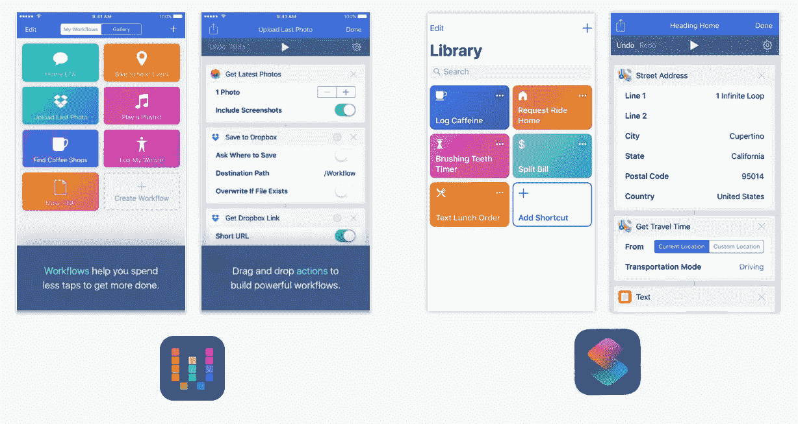
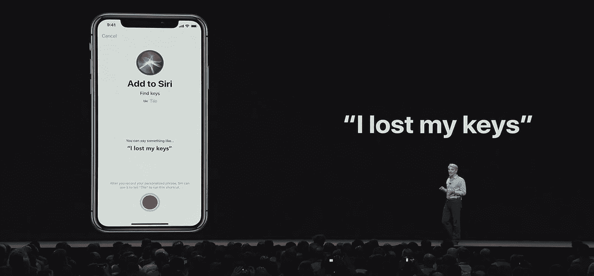

# Siri 快捷键:苹果对用户敌意的失败承认

> 原文：<https://medium.datadriveninvestor.com/siri-shortcuts-apples-user-hostile-admission-of-failure-88f81b62a990?source=collection_archive---------1----------------------->

在 2010 年收购 Siri 后，苹果吸收了它，并将助手集成到他们的平台中，在 2011 年向褒贬不一的评论公布了这次改造(这是出于礼貌)。在大多数方面，这项服务已经使用了 7 年，没有任何改进。

在去年抢购了超级用户应用工作流之后，他们现在将这两项有价值的收购放在一起，试图夺回被亚马逊的 Alexa 和谷歌的 Assistant 抢走的部分地盘，尽管苹果已经领先，但它们现在已经遥遥领先。

Workflow 应用程序的粉丝(平衡一下——我有这个应用程序，我自己用它来实现有限的功能)正在庆祝苹果公司既将一些功能集成到系统中，又提供了原始应用程序的副本。这使他们能够完成所有繁重的动作、流程自动化和他们已经依赖的脚本编写。

Workflow vs Siri Shortcuts

然而，这意味着，除了超级用户，Siri 快捷方式几乎没有什么可提供的。即使当我试图向精通技术的人解释使用工作流应用程序的好处时，他们也很快迷失了方向。

为什么？设置自动化所需的工作很少是值得的。用例存在于他们体验的边缘。

他们的目光很快变得呆滞，渐渐进入沉睡的梦境，那里一切都简单而不复杂——换句话说，就是典型的苹果顾客。

新的快捷方式非但不是 Siri 的救星，甚至不是一个自信的进步，而是苹果对失败的承认。事实上，这是投降的白旗。

本质上，声控助手必须做三件事；

*   收听用户命令，
*   解释和理解意图，以及
*   立即采取有意义的行动。

有了 Siri 快捷方式，用户就有望完成艰巨的工作。

在极不可能发生的情况下，一个普通用户有一系列的动作需要以精确的顺序无变化地完成(或者，用有利的术语来说，同时完成)，并且发生得如此频繁以至于他们过于费力，以至于投资时间来构建和测试过程对用户来说是一个明显的红利。

对普通用户来说，最有价值的是只执行一个动作的简单快捷方式。即使这种情况也是失败的，因为手动执行操作通常更快、更准确。

甚至语音识别(可以说是等式中最简单的部分)也通过强迫用户用他们的声音提供他们自己的快捷方式“触发器”来规避。这为用户提供了触发词的准确发音模式，随后的命令可以与该模式进行比较。

毫无吸引力的工作量和实际使用 Siri 快捷方式的机会很少，这意味着 Siri 快捷方式仍将是高级用户的先锋。

唯一会改变的是用户将可以使用语音触发器。Siri 作为一种人工智能将无法衡量地得到改善。因此，苹果将继续输给那些认真对待数字助理的竞争对手。

这只留下一个问题没有回答；对谁来说这是捷径——用户还是苹果？