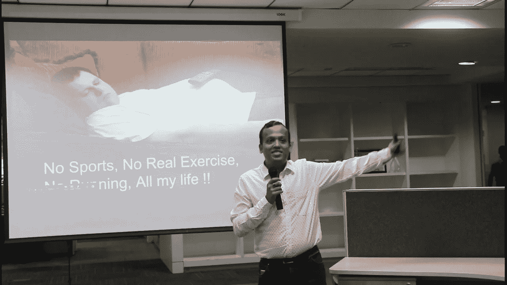

# 我健康生活的六条戒律

> 原文：<https://medium.datadriveninvestor.com/six-commandments-of-my-healthy-life-c454a78ebe5d?source=collection_archive---------9----------------------->

10th Jan, 2018 at Tredence, Bangalore

2019 年 1 月 10 日。我有机会将我的健康之旅的故事分享给一家总部位于班加罗尔(即 Tredence)的数据分析跨国公司的大约 150 名年轻观众。没有读过我的故事的人可以在这里阅读。当我告诉他们我在[我的文章](https://medium.com/@nimit.agrwal/i-had-to-do-it-and-i-did-it-b7aaef71640)中写的故事的内容、原因和方式时，我也提取了六条帮助我在过去 20 个月中所做的事情的经验。

给你一个关于我自己的背景，我是一名 26 岁的数据分析专业人员，在我 3 年半的第一份工作中，我每天在最具挑战性和压力的工作环境中工作近 12-14 个小时。直到我生命的前 24 年，我一直有一个工作哲学，即压力是好的，当我有压力时，我会尽力而为。所以我承受了很多不必要的压力。我过去几乎什么都吃，没有后悔的感觉，而且我从来没有做过任何真正的体育锻炼。这些信息很重要，因为在过去的 20 个月里，我能够改变我的健康状况，而不考虑这些先决条件。这之所以成为可能，仅仅是因为我意识到并实践了我今天与大家分享的这六条戒律。

让我把它们分成两个问题:

首先，为什么优先考虑健康是重要的？

1.  自私——健康是你唯一应该自私的事情。它应该优先于其他任何事情。甚至超过你的家人。用更哲学的术语来说，你处于你的宇宙的中心，而你生活中的其他人都是围绕你旋转的行星。如果宇宙的中心不稳定或不健康，无论你多么努力地发光或试图将所有的行星聚集在一起，整个宇宙都会崩溃。打个比方，无论何时乘坐飞机出行，都必须在安全简报中被告知“如遇机舱压力下降，先戴上口罩再帮助他人”。科学已经证明，如果你试图先帮助别人，你们两个都受伤的可能性更大。这同样适用于你的健康
2.  这与减肥无关——体重和健康之间并不总是有直接的联系。你可以让一个体重完全正常的人健康状况不佳，反之亦然。不要只想着减肥，同时想着身体健康。健康的生活是一个连续不断的过程，需要每个人平等地实践，不管他们的体重或年龄。如果我开始了我的健康之旅，仅仅是作为减肥运动，那么我会在头两个月内停止。因为那时我已经达到了可控制的体重。但我没有停下来，因为我意识到健康的生活是我一生都要过的，它不能只是一个阶段
3.  不要等待——我的一个同事曾经告诉我，她不在乎她吃什么，因为她太年轻了，不需要担心这个。这是她享受和享受最好生活的时候了。60 岁的她会担心这个”。这是我们当代大多数人都在对自己说的谎言。我们怎么能假设我们在 60 岁之前没有健康问题呢？忘了 60 岁吧，我们怎么能假设明天会好起来呢？我们不能。这是一场我们自己玩不起的赌博。我很幸运，在 24 岁的时候，我的身体提醒我，我需要振作起来，否则就太晚了。我很幸运，我有一个医生，他没有开任何一种药，而是激励我努力改变我的生活方式，最重要的是，我很幸运，我能够集中自决和勇气去做我所做的事情来改变我的生活。不是所有人都像我一样幸运。你真的想把生活中这么重要的事情留给你的运气吗？我不想吓唬任何人。但是如果这让你感到害怕，这并不是一件坏事。

其次，我们如何能维持我们一生的健康旅程，不让它过去，只是作为一个阶段？

1.  耐心慢慢来——生活是一场马拉松，而不是短跑。我们犯的最大错误是我们试图立刻改变我们的生活。即使你认为你的生活是一场短跑，请记住，尤塞恩·博尔特也不是一天之内成为世界上跑得最快的人。不要试图一次给自己的生活方式带来太多的改变。慢慢开始，从你最舒服的事情开始。一旦这件事成为一种习惯，增加更多，一个接一个，一个月接一个月，一周接一周，一天接一天。你可以从每天喝 3-4 升水这样简单的事情开始。不要苛求自己的身体。给它时间来消化这些变化。例如，离开糖对我来说并不难，但我知道对我们大多数人来说可能很难。所以，如果对你来说太难的话，不要一开始就不吃糖。你可以试着减少或者做点别的。我遵循的一条黄金法则是，只有当我认为我可以持续坚持至少一年，如果不是一生的话，我才会选择一种健康方式
2.  制定过程目标，而不是结果目标——我们犯的另一个错误是制定“结果目标”,比如体重、肚子大小、二头肌大小、六块腹肌、血压、血糖等。我也犯了同样的错误，但我很快意识到它有两个问题。首先，很难实现不断进步，并保持自己的动力来实现这些目标。例如，你可能不会每天减肥，因为它是许多不同事情的因素，其中一些你不能每天控制，一旦我们开始看到进展中的下降，我们就会感到悲伤和失望，导致健康之旅的完全停止。其次，一旦我们实现了这个“结果目标”，我们往往会停下来，但正如我前面解释的那样，健康的生活是一个终生的过程，而不仅仅是一个阶段。所以我把我的“结果目标”换成了过程目标，比如每天喝 3 L 水，训练保持跑半程马拉松，晚餐不吃 chapati 或米饭，睡觉前至少 4 小时吃晚餐等等。“过程目标”的三条黄金法则是——首先，你应该能够定期跟踪这些目标。第二，你不能得到负进展，直到你停止这样做，第三，无限期地实现这个目标的时间框架。如果你坚持*过程*，结果总会到来。
3.  制造噪音——我练习的最后一件事对我帮助很大，让我保持动力，那就是制造噪音来谈论我的健康目标和我正在取得的进步。在你的健康之旅中，确保你让你的朋友、家人和任何你能知道的人都知道。它之所以重要，有两个原因。首先，大多数人在同伴压力下工作得最好。如果有一天，你觉得太懒了，不想起来运动，或者你太想吃美味的萨莫萨，你总是可以被你的同伴有意识或无意识地提醒你的健康之旅。其次，你可能会在某个时候意识到，从你的旅程中获得灵感，你已经激励其他人开始他们自己的旅程。现在你将有额外的责任继续下去，以确保那些仰望你的人不会失望，并停止他们的失望。因此，来自同伴的压力和追随者的责任感将帮助你继续各自的旅程

我希望你能和我的健康戒律产生共鸣。如果你想分享你对这个话题的看法，请留下评论或 DM。喜欢并分享如果你觉得这些想法值得传播。