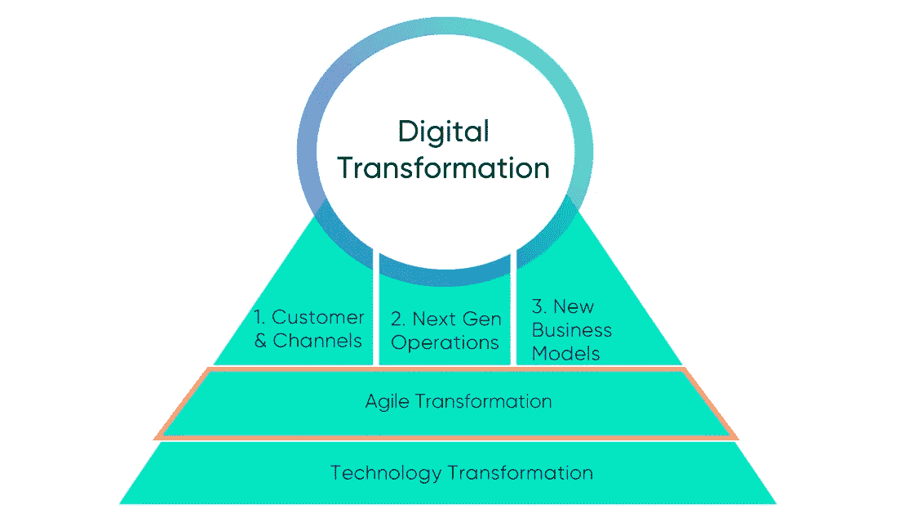
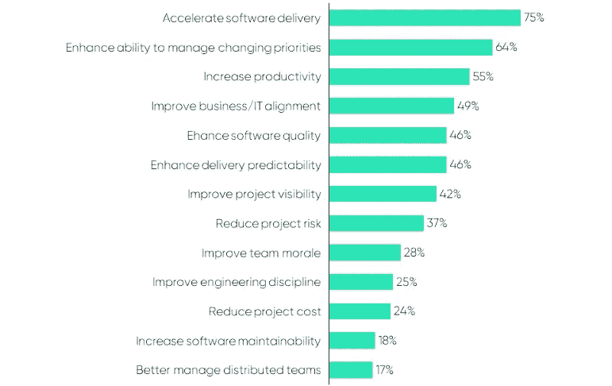
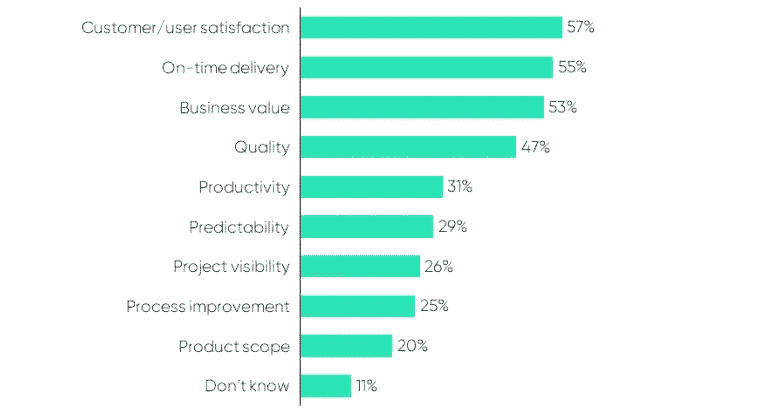
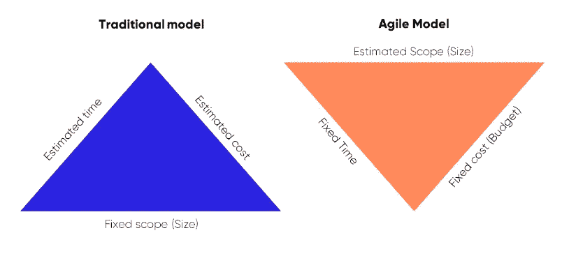

# 大规模实施敏捷时要避免的六个常见错误

> 原文：<https://medium.datadriveninvestor.com/six-common-mistakes-to-avoid-when-implementing-agile-at-scale-7fe98d8f4d9a?source=collection_archive---------3----------------------->

敏捷和精益商业方法的好处得到了广泛的认可。然而，在大公司环境中有效采用和嵌入这些实践，说起来容易做起来难。理论在教科书中是有意义的，实践在小型产品团队中很容易被接受。然而，大组织的规模、复杂性和特点给实施这些理念带来了巨大的挑战。

> *只有 12%的受访者表示他们的组织在敏捷方面有很高的水平*

许多“敏捷转换”失败或中途停滞不前。在《2018 年敏捷状况报告》(一项年度全球调查，约有 1500 份回复)中，只有 12%的受访者表示他们的组织在敏捷实践方面有很高的能力。只有 4%的人报告说敏捷实践能够更好地适应市场条件。

 [## 想知道领导是谁？请他决定。-数据驱动型投资者

### 一个有效的领导者能为组织提供的最有价值的东西之一是决策能力…

www.datadriveninvestor.com](https://www.datadriveninvestor.com/2019/01/25/want-to-know-who-the-leader-is-ask-him-to-decide/) 

# 成功的敏捷转型需要避免的最常见错误

作为我们数字化转型成功系列的一部分，我们正在分享我们对如何在组织中最好地组织和执行数字化变革的见解。这些是由真正做过这项工作的专家写的，以帮助其他人踏上改变的旅程。

Figure 1: Typical areas tackled in a digital transformation. Source: Riverflex series — Digital Transformation Done Right, February 2019.

本月,《数字化转型做得好》聚焦敏捷转型。在这篇文章中，我们揭示了一些我们看到的组织在启动这种计划时最常见的高影响错误。最后，我们为您提供一些提示，帮助您在这个复杂、深远和长期的旅程中一开始就取得成功。

# 1.领导不是拥护敏捷原则

与企业环境中的大多数变革一样，它们的成功或失败往往由领导力和文化单独决定。对于敏捷来说更是如此。敏捷是一种新的哲学，需要不同的管理方法和一系列行为。领导者不能仅仅使用他们的老的经过测试的技术来应用敏捷。

通常情况下，领导者不会花时间去理解和沉浸在敏捷作为一种哲学、文化和运作方式中。这种认为这是“进行项目管理的另一种方式”的想法是失败的秘诀。他们自己无法展示正确的行为，也无法在组织中推动正确的行为。只有当一个组织的领导者真的想要变得敏捷，并且培养正确的氛围，敏捷的种子才会生根发芽。这意味着认识到他们和他们的团队处于相同的学习旅程，改变他们的领导风格，从高层支持敏捷文化。

# 一些开始的提示

## 放弃传统的管理哲学

领导者需要放弃传统的管理方式，比如命令和控制，真正拥抱仆人式领导。为了产生影响并赢得团队的信任，领导者必须成为平易近人的问题解决者，他们的首要任务是促进团队并不断消除障碍。

## 积极支持新的工作方式

敏捷转换中另一个重要的角色建模行为是允许敏捷地交付工作。如果你继续寻求基于项目的产出，并要求广泛的计划和审批——这并没有真正显示出改变工作方式的意愿。这将再次导致传统的瀑布过程。

## 在主题中建立可信度

领导者应重点展示关于转型主题的健康知识水平。这有助于赢得团队的信任并建立信誉。要做到这一点，领导者必须跟上相关主题的理论、培训和新闻。此外，他们应该积极参与团队的“边做边学”过程，以增进理解。

# 2.自上而下推动转型

成功的转型不是靠强加于人就能实现的。强迫人们“做敏捷”与重视个人自主性的敏捷哲学正好相反。敏捷宣言的原则之一是:

> “围绕有动力的个人建立项目。
> 
> *给他们需要的环境和支持，*
> 
> *相信他们能完成工作。”*

为了建立这种动力和双向信任，你的团队需要理解为什么他们需要不同的工作方式，这对组织有什么好处，对他们又有什么好处。如果这一点没有被清楚地表达和强化，你将会打一场硬仗。

# 一些开始的提示

## 讲述这个故事，让人们理解并相信它

您的组织开始这一旅程是有原因的。也许一个新的数字竞争对手正在扰乱你的行业，你需要加快交付速度来赶上。或者你可能有一个令人兴奋的新产品或商业模式，你需要快速推出。或者你可能得到了糟糕的客户反馈，需要做出反应。不管原因是什么，你的团队需要理解它并相信它。

不要低估讲故事的价值，因为它创造了比事实和数字更多的情感反应，并帮助个人感受到个人对结果的投入。一个好的故事也更容易被一群人分享和共同拥有，这有助于协调。我们建议花时间在叙述上:为什么你的转变很重要？个人将如何为你的成功做出贡献？大团圆结局是什么样子的？一遍又一遍地讲述这个故事，让它渗透到企业的意识中。

Figure 2: Reasons for Adopting agile*. Source: adapted from State of Agile, CollabNet VersionOne, 2018
*Respondents were able to select multiple options

## 利用成功的敏捷采用案例

很难否认谷歌、网飞和 Spotify 等世界一流数字企业的商业成功。他们的核心都有许多敏捷和精益的实践，被展示为他们成功的关键因素。向员工展示你正在效仿其他地方行之有效的做法，并指出它如何有助于实现最佳绩效，这是让你的转变变得生动的好方法。此外，利用这一点来强调他们的个人成长机会——他们正在学习高需求的技能，并将使他们在市场中保持最新！

## 庆祝成功

敏捷转型是一个漫长的过程。事实上，它永远不会真正结束。毕竟，你正在努力创建一个你不断寻求改进和优化的组织。敏捷的迭代本质也意味着团队不断地转移到下一组可交付成果。在这种情况下，很容易忘记庆祝成功。注意不要错过强调你所做的改变如何真正带来价值的机会。奖励表现出正确行为的个人或团队，并激励其他人以这种方式工作。为此，你可以开始认识到重要的交付里程碑。或者让团队远离产品交付，专注于其他学习机会(比如黑客马拉松)。或者，最后，安排参观其他有类似经历的公司，以获得灵感和能量。

# 3.没有界定个人的责任和任务

成为敏捷组织的核心是高效的决策。这应该落在负责任的人手中，他们是专家，他们接近内容，他们将经常感受到决策的直接后果。人们需要了解他们的责任和职责，这样他们才能做出自己的决定。批准请求和委员会给敏捷的组织速度带来了巨大的阻力。一些很好的迹象表明你的敏捷转型正朝着正确的方向发展，包括:快速而透明的决策，个人信任他们同事的能力，以及组织中人们正在做事情而不仅仅是谈论事情的势头。

# 一些开始的提示

## 确保每个人都知道产品负责人的角色和他们的任务

我们知道你以前听过这句话，但它需要反复说。在敏捷组织中，产品负责人扮演着重要的角色。他们充当不同涉众和产品团队之间的缓冲。组织越大，利益相关者的情况越复杂，产品负责人就越难平衡决策和取悦所有利益相关者。通常，优先级冲突会造成严重的挫折和低效。组织应该在各个职能部门、市场和产品线之间建立意识，让他们知道自己在做什么，任务是什么。产品负责人应该被授权，应该做出让步才能前进。

## 尽可能降低组织中的决策层级

在传统的组织中，决策过程在组织中的地位太高，掌握在少数人手里。这导致了瓶颈、移交、增加的周期时间和团队授权的缺乏。向前看，组织应该避免等级的限制，允许团队成员做出小的决定。团队需要被信任。专业知识和专长需要得到尊重。决策应该发生在特定主题的信息和知识所在的地方。

## 负责任的冒险行为

一个支持决策的敏捷组织必须拥抱冒险文化。团队成员需要对承担预计风险感到安全。他们需要能够做出个人承诺，并冒着风险做出艰难的决定或优先的决定。这意味着，他们也需要感觉到，如果他们犯了一个错误，他们不会被击落。“请求原谅，而不是请求允许”这句话通常是一个很好的指导方针。有了这个责任，团队成员还必须准备好解释他们做出每个决定的原因，以及对业务的相关好处。

# 4.没有重组业务以关注协作和价值

有效敏捷工作的核心是团队之间的紧密合作和高效沟通。团队应该有凝聚力，有共同的目标和治理。交付卓越的客户体验、产品或服务需要跨职能团队的投入，他们能够提供不同的专业、体验和视角。大多数传统企业以职能团队的形式运作，管理和目标都遵循这些原则。这造成了孤立的工作，业务和技术团队专注于优化内部功能，而不是最终客户。作为敏捷转型的一部分，重组公司以应对这些挑战是最彻底的变革之一。这也是获得敏捷的诸多好处的必要条件。

# 一些开始的提示

## 理解并定义你的价值流

花点时间搞清楚你的客户价值流是什么——向客户交付价值的一系列步骤或事件。你可以问自己一些问题:

-在顾客心目中建立品牌或产品认知度的步骤是什么？

-创建订单或签订合同的步骤是什么？

-将产品送到顾客手中使用的步骤是什么？

围绕这些价值流而不是内部业务职能来构建您的团队。这有助于重新关注真正的价值交付。

## 创建跨职能敏捷团队

为了用敏捷创造价值，合适的专家之间的密切沟通和协作是基础。通过将这些人放入同一个团队，您可以围绕共同的目标创建焦点和一致性。你想让这变得多正式取决于什么是可接受的，什么对你的组织有效。一些人可能会正式改变报告关系，其他人可能会将个人部署到团队中，同时保持现有的直线管理报告关系。

通常主要的焦点是在产品团队中结合来自商业和技术领域的个人。这是解决许多组织在技术方面普遍存在的问题的重要一步。但这也是一种过度简化，因为“业务”是相当多样化的。商业人士推动新的当天客户交付功能可能很好，但物流也是团队的一部分吗？确保你在团队中有合适的代表！

## 为每个团队定义清晰的愿景和目标

如何在组织中衡量和激励成功应根据价值流重新调整。每个团队都应该有一个清晰的愿景，由产品负责人制定，每个成员都理解并接受。应该使用一个简单的框架(如 OKRs)来明确定义和衡量目标。除了将团队的重点放在有形的价值交付上，目标还确保团队成员之间的一致性，并实现更快更好的决策制定。对团队和公司目标的清晰关注是正确采用敏捷的关键。不恰当地采用敏捷实践会导致对每个迭代的极度关注，团队正在交付，但是没有交付价值或者将业务带到它需要的地方。

Figure 3: How success is measured with agile initiatives*. Source: adapted from State of Agile, CollabNet VersionOne, 2018
*Respondents were able to select multiple options

# 5.使用相同的供应商并以相同的方式与他们签约

许多组织内部不具备所有必需的交付技能或能力。因此需要与外部供应商合作。传统上，供应商是根据一系列广泛要求的投标或报价签订合同的。这形成了在估计的甚至固定的时间和预算内工作的一组固定的可交付成果的基础。

如果团队遇到比预期更复杂的情况或不断变化的业务需求，每次都应该安排变更请求或重新协商。这给建设性的工作关系带来了压力。供应商希望通过夸大报价来保护自己免受变化和不可预见情况的影响，并专注于“管理合同”而不是交付正确的结果。敏捷的主要好处之一是基于新的发现和见解的开发过程中的灵活性。因此，有必要采用不同的方法与供应商合作并签订合同。

敏捷模型颠覆了传统模型，去掉了固定范围的概念。它估计范围，并修正成本和时间。在这种情况下，选择的供应商应该习惯这种工作方式。最后，应该建立契约，以实现敏捷所固有的协作和灵活性。

Figure 4: Different contracting models

**一些入门技巧**

## 创造信任的环境和一致的目标

内部和外部供应商应该能够为交付优秀的技术和创造价值而感到自豪。预先设定的规格和要求不应被用作打击的手段，因为这会导致各方钻牛角尖。相反，所有各方都必须承认，没有人能够预测未来会发生什么，或者会出现哪些障碍。随着新数据和信息的出现，计划和行动也会相应地调整，而无需进行广泛的协商。

## 在固定的时间和预算内保持灵活的范围

在时间、预算和范围这三个维度中，后者对于敏捷交付应该是灵活的。最佳实践是就 sprint 的价格、运行时间和通知期达成一致。这使得客户能够在预算和业务需求允许的情况下，向供应商提供优先的高价值需求。产品负责人知道他们必须在范围上“花费”多少容量，并且能够基于沿途的学习在这个界限内进行优先排序。他们可以根据可用的预算更轻松地进行规划，并根据价值创造扩大和缩小产品团队。

## 建立专门的团队来处理相同的积压工作

在同一个 sprint 中工作的产品团队应该是专注的。这意味着交付 sprint 所需的所有技能和能力应该针对特定的 sprint 进行隔离，从相同的 backlog 开始工作，并且有每日联系点。因此，即使团队中的数据科学家来自专业供应商，Salesforce 开发人员是自由职业者，后端开发人员是内部人员，他们都应该处理相同的待办事项。不管他们的薪水是谁的。这促进了快速和非正式的沟通、持续的一致性以及障碍的透明度。因此，减少了不确定性、风险和整合问题。

## 促进同地办公，以更好地开展跨职能工作

为了实现最有效的沟通、协作和跨职能工作，产品团队应该在同一地点。至少每周有几天，以及重要的敏捷仪式。尝试采购允许人们在客户网站上的供应商，尤其是在开始的时候。为了表示信任和平等，如果物流更有意义，客户团队也可以在供应商的网站上工作。敏捷可以按照“分布式敏捷”模型与虚拟团队合作，但是这需要额外的纪律和成熟度，以及良好的沟通工具。

# 6.过度思考敏捷过程

许多组织花了太多时间来计划和谈论他们的敏捷转型。他们陷入了这样的问题:我们应该使用哪种敏捷方法？我们应该如何构建我们的价值流？我们需要什么工具来实现协作？这是可以理解的，因为敏捷转型是一个很大的复杂变化。然而，它也没有抓住敏捷的要点，浪费了大量前期时间。

敏捷就是将一个复杂的问题或变化转化为小的可管理的元素，以增量的方式交付。您应该以同样的方式处理您的敏捷转型。不要落入采用瀑布方法的陷阱，而是将它变成小的可管理的元素，并增量地交付它。在这个过程中，通过获得真实的生活经验和测试你的假设或选择，你会找到你的开放性问题的答案。

这是真正开始“做敏捷”的唯一方法，并学习如何在你的业务中适应和采用它。这并不意味着你不应该有一个长期的方法或路线图。但是这些可以在过程中进行优化。

# 一些开始的提示

## 专注于获得高层次的定义，但不要陷入细节

为了大规模的敏捷转型取得成功，需要进行一些重要的初始步骤。这些包括阐明范围、愿景、预期成果以及它将如何交付价值。这有助于协调领导团队，使他们能够提供一致的方向。其次，它使转型能够基于组织一致认为重要的事情来进行。

不过，要避免过度智能化。不要试图一次解决所有问题，预先考虑所有细节。你会陷入分析瘫痪，试图找到完美的答案——但没有答案。保持这种高水平，开始旅程并解决沿途的细节问题。

## 练习，练习，练习

像大多数事情一样，擅长敏捷的唯一方法就是实践它。这就是重点，通过迭代工作，你将获得大量的实践机会。例如，如果你遵循 Scrum 方法，那么每隔一两周，你就会一遍又一遍地执行流程和仪式。这将为您和您的团队提供关于哪些工作做得好，哪些不太好的共享经验，以便您可以改进。

## 经常跑回顾会！

回顾对于让你的团队专注于持续改进和学习是很重要的。虽然它们通常是最不受重视的敏捷仪式，但是你不应该犯这个错误。这是您在团队内部进行诚实坦率讨论的机会。开始时，这可能是一个具有挑战性的步骤，因为团队成员可能不习惯以这种方式集体反思他们的工作。坚持不懈，它会很快变得更容易，并对创建敏捷成功所需的透明和协作文化大有帮助。

# 结束语

将敏捷性融入业务是提高上市时间、以客户为中心、创新和敏捷性以超越竞争对手的关键。做好这件事的风险很高！这个列表并不意味着是组织在敏捷转型开始时可能犯的所有错误的详尽列表。相反，我们更愿意关注我们多年来看到的组织陷入的影响最大的错误。路上的错误和颠簸是任何商业旅程的一部分。好消息是，如果事先理解并积极管理，这些错误是可以减轻或完全避免的。我们希望这篇文章为你提供了关于如何开始下一个敏捷挑战的有价值的见解。我们的数字化转型成功系列文章将继续提供指导和见解，帮助您实现这一目标。

# 下面是关于 Riverflex 和创作团队的更多信息:

Riverflex 是一家新型的咨询公司。我们通过将顶级顾问与独立专家的力量相结合，提供数字咨询、人员扩充和临时管理服务，从而提供数字专业知识和价值。

**本文撰稿人:**

**André Azadehdel，**前德勤，Riverflex 创始人兼董事。过去的客户包括佳能、清晰频道、O2 Telefonica 和 SABMiller

**Sohrab Hosseini，**前首席技术官 Transdev，前麦肯锡，现在是 IT &数字战略顾问。在财富 500 强企业中设计并实施了多项数字化和敏捷转型

**Victor Hoong，**前德勤数字合伙人，Riverflex 创始人兼董事。过去的客户包括阿迪达斯、宜家和 Ahold Delhaize

**Kenny Cruden，**前 ThoughtWorks，现独立顾问和敏捷教练