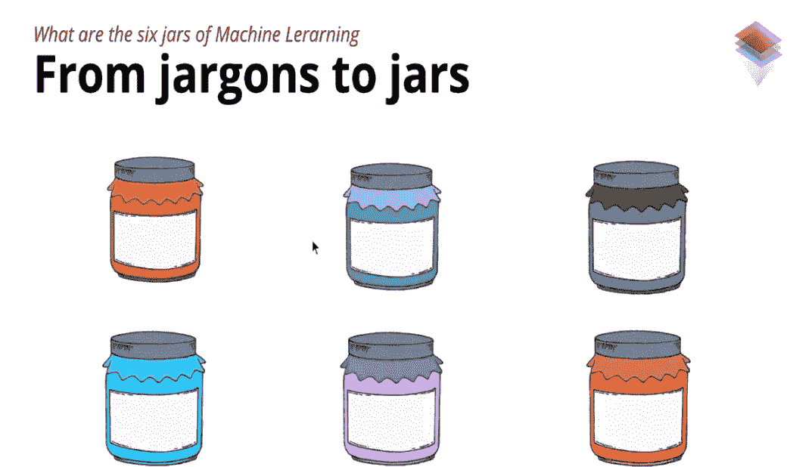
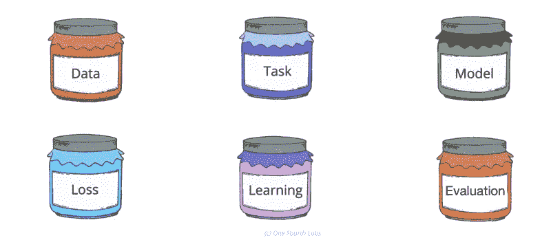

# 六罐机器学习

> 原文：<https://medium.datadriveninvestor.com/six-jars-of-machine-learning-2dd5a72ca1b?source=collection_archive---------5----------------------->

***参考 Mitesh Khapra 教授和 Pratyush Kumar*** 的会议

在机器学习中，你会遇到像分类、回归、梯度下降、卷积神经网络这样的关键词。一些专门的关键字，如用于对象检测的 Yolo、用于对象检测的 R-CNN 以及特征向量等概念。

为了组织这个行话，让我们看看四分之一实验室独特设计的概念，这样你就知道你在处理机器学习的哪一部分。它将进一步给你一个大画面，让你跟随开发正确的机器学习模型的流程。

从行话到罐子:

Image credit: One Fourth Labs

# 罐子一:**数据**

我们到处都有文本、视频、图像或表格形式的数据。这也可以是结构化数据或非结构化数据。

要应用机器学习，需要特定类型的数据。让我们以使用图像的癌症检测为例。这里你需要输入(x)和输出(y)的数据，即扫描的图像和标记的图像，表明它是否是一个癌症病例。

 [## DDI 编辑推荐:5 本机器学习书籍，让你从新手变成数据驱动专家…

### 机器学习行业的蓬勃发展重新引起了人们对人工智能的兴趣

www.datadriveninvestor.com](https://www.datadriveninvestor.com/2019/03/03/editors-pick-5-machine-learning-books/) 

有了这些数据，你就可以训练一个模型，对一张新的图像进行癌症可能性的分类。图像数据根据像素以数字的形式输入机器。这种数据通常是高维的。

数据可以通过三种方式管理-

1.  免费的公共数据集，如谷歌人工智能，UCI
2.  外包付费服务，如亚马逊土耳其机械公司
3.  通过 Photoshop 等图像处理工具模拟数据

# 罐子二:**任务**

一旦确定了数据，下一步就是定义可以用数据完成的任务。任务可以像预测天气一样简单，也可以像预测当前温度一样简单，最终的任务是预测温度。

在脸书的各种帖子中，你可能会遇到不同的图片。现在如果你想给图像加标签。这可以是你的机器学习模型的一个任务。所有你需要做的是有一个输入(x)作为一个图像和一个输出(y)，即一个带有坐标和图像标签的标记图像。

获得坐标和标签可以是实现自动标记的主要任务中的一些任务。任务可以是在机器学习模型中定义你的输入和输出。

任务可以被监督或不被监督:

***-*-**

这里既有输入也有输出的要求。**分类**是基于输入和输出关系的常见任务之一。**回归**是另一个可以用来寻找图像中文本框坐标(宽度，高度)的工具。这里输出的是图像中带有文本的特定框的坐标。

***无监督任务-***

在无人监督的任务中，没有带有标签的输出。只需要机器学习模型的输入就可以完成工作。

**聚类**是根据形状、颜色等公共因素在未标记数据中创建数据聚类的任务之一。这里没有输出，而是集群。

**生成**是另一个任务，其中基于所提供的可能不相似的输入生成新的输入。基于个人过去的推文创建新推文的示例。

# **罐子三:**型号

在机器学习中，输入和输出之间存在关系。这种关系对于实现预测目标起着关键作用。

因此，由于我们不知道这种关系，我们可以用一个函数来近似描述输入(x)和输出(y)之间的关系。

这个函数可以简单到 y=mx+c

这个函数构成了机器学习模型。

找到误差最小的函数中的最佳参数是非常重要的。根据对数据的要求，函数可以简单，也可以复杂。选择正确的功能，即正确的模型，对于实现目标非常重要。

# 罐子四:损失函数

在为机器学习选择模型(即函数和参数)时，你可能会遇到多个模型。现在，为了找到误差最小的最佳函数，我们使用损失函数。

损失函数在根据实际输出评估模型好坏方面起着重要作用。它在寻找最佳参数以实现最佳模型方面起着关键作用。

一些损失函数包括平方误差损失、交叉熵损失、KL 散度。

# 罐子五:学习算法

功能— ax+bx+cx

在上述函数中，需要选择最佳参数(即 a、b 和 c ),以获得机器学习模型中的最低误差。为了获得这些参数，可以使用蛮力，即尝试所有参数，以找到损失最小的参数的正确组合。这些参数进一步有助于为特征赋予适当的权重。然而在实践中，这对于多样化的数据来说是很麻烦的。

这里，优化解算器开始发挥作用，它有助于找到损失最小的参数。一些优化求解器包括梯度下降、Adagrad、RMSProp、Adam。

# 罐子六:评估

在实现的不同模型中，需要找到最佳模型。评价模型的方法之一是通过模型的预测精度。

准确度=正确的预测数/预测总数。

精确度与用最小损失估计模型的损失函数有何不同？

答案是，如果你看损失函数，并不清楚如何判断一个模型是好是坏。因此，准确性给出了不同模型中最佳模型的更好的想法。

精确和回忆构成了准确性。

精度与模型给出正确输出的次数有关。而召回与模型给出错误输出的次数有关。评估总是在测试数据而不是训练数据上进行。

一些评估指标包括 Top-k 准确度、精确度、召回率、F1。

Image credit: One Fourth Labs

这六个罐子完成了机器学习实现健壮模型的路径。

**参考文献:**

四分之一实验室的专家系统