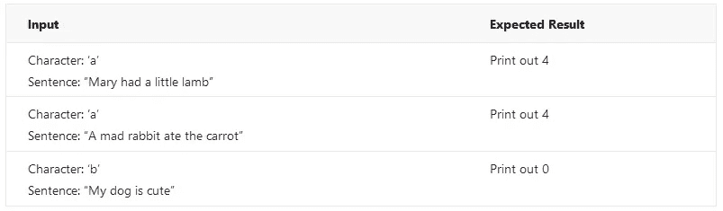
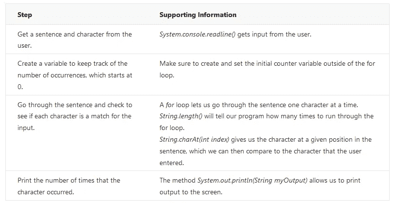

# 编程学生可以采取的解决编码问题的六个步骤

> 原文：<https://medium.datadriveninvestor.com/six-steps-programming-students-can-take-to-solve-coding-problems-8e9b2a6eef02?source=collection_archive---------0----------------------->

作为一名导师，我和许多计算机科学专业的学生一起工作，他们都是编程新手。我经常看到的一个问题是，学生们很难找到解决编程问题的方法。他们完成了阅读作业，参加了讲座，但他们很难将所学应用到实际问题中。

以下是我推荐给学生的六步流程。

1.  理解问题陈述。
2.  确定预期的行为。
3.  确定支持信息。
4.  将支持信息与行为对应起来。
5.  将这些部分组合成一个解决方案。
6.  测试您的解决方案。

**过程说明**

***1。理解问题陈述***
要解决任何问题，你必须首先理解你被要求做什么。通常一个编码问题会给你一组期望的输入和输出。也要注意极端情况和“边缘情况”;例如，为了了解一个数学问题的全部行为，我们可能需要查看极高和极低的数字、负数和正数以及 0。

问题还可能指定输入或输出应该采用特定的格式，所以请注意这些要求。

***2。确定预期行为***
一旦你明白了问题，你需要弄清楚什么行为会给你预期的结果。换句话说，为了从给定的输入中获得正确的输出，您需要在程序中采取什么步骤？在计算机科学术语中，这些步骤被称为“算法”，但你也可以把它们看作一个配方。想想看:一个食谱从一组配料(输入)开始，给你具体的步骤来遵循(算法)，如果一切顺利，你最终得到一道美味的菜肴(输出)。

***3。识别支持信息***
通常，除了预期的结果之外，编码任务还会给你额外的信息。例如，问题陈述可能建议或要求您使用某些方法或功能来解决问题，或者它可能会引导您找到一些与问题相关的参考资料。

有时问题陈述会很直接，不会给出任何支持信息。在这些情况下，你仍然需要知道如何做算法中的步骤，这可能需要复习你的课堂笔记或做一些研究。如果有助于解决问题，支持信息还可以包括您已经知道的信息。

请记住，您可能需要帮助来收集一些支持信息。如果你正在解决问题并有疑问，你应该把它们写下来，然后当你回答每一个问题时，你就增加了你的信息。记下具体的问题也会让你更容易向别人寻求帮助。

***4。将支持信息映射到行为***
当您收集支持信息时，您会注意到它对应于您预期行为中的特定步骤。有一种方式来思考这个问题:对于行为中的每一步，你都在问“我如何完成这一步？”你的支持信息就是答案；它告诉你“这是你如何完成这一步。”将这种联系作为你的信息和目标将有助于你更好地理解和编写你的程序。你甚至可以把你的信息和行为汇总成一个表格(如果你想要一个例子，查看这篇文章的结尾)。

***5。将各个部分组合成一个解决方案***
一旦你将所有的信息组织起来并与相关的行为联系起来，你就可以编写你的程序了。通过按顺序写出行为，就像这个过程的第二步一样，你已经对程序应该如何组织有了概念。现在，您可以将这些片段放入实际的代码中。

***6。测试您的解决方案***
最后一步是测试您开发的解决方案。使用您在步骤 1 中确定的预期输入和输出来验证您的代码是否有效。

希望你的程序在这一点上能够正常工作，但是在现实中，大多数程序在第一次尝试时并不正确。如果您注意到问题，检查任何错误消息，并分析您得到的实际结果与您期望的结果。

**行动中的过程:一个例子**
让我们用一个例子来试试这些步骤。在这种情况下，我将使用 Java 解决问题，但您可以将这一过程应用于任何语言。

***问题***
写一个 Java 程序，要求用户输入一个字符和一个句子，然后打印出该字符在句子中出现的次数。

例如，如果字符是“a”，句子是“Mary had a little lamb”，程序将打印出 4。如果字符是“A”，句子是“一只疯兔子吃了胡萝卜”，程序也会打印出 4。如果句子是“我的狗很可爱”,字符是“b ”,那么程序打印出 0。

***第一步:理解问题陈述。***
这个问题陈述相当简短，给出了几个期望输入输出的例子。我们可以用一个表格来总结这些期望:

Table of inputs and expected results

如果你想在程序完成时测试更多的例子，你也可以在表格中添加你自己的输入和输出。

你注意到第二句话了吗？大写字母 A 不包括在内。这个问题给我们的例子告诉我们，字符的大小写很重要。注意给出的例子告诉你的额外信息。我建议检查每个例子，看它对你是否有意义，这将帮助你发现这样的细节。

***第二步:确定预期行为。***
为了解决这个问题，我们需要做到以下几点:

1.  从用户那里获取一个句子和一个字符。
2.  创建一个变量来跟踪出现的次数，从 0 开始。
3.  浏览句子并检查每个字符是否与输入匹配。

*   如果该字符是匹配的，则将出现次数加 1，并移动到下一个字符。
*   如果该字符不匹配，则对计数不做任何操作，并移动到下一个字符。

4.打印字符出现的次数。

***第三步:确定支持信息。***
问题陈述没有给我们任何额外的信息，但是我们可以从行为中看出，有几件事我们需要知道如何去做。我们需要知道如何:

*   获取用户的输入。
*   检查句子中的每个字符，一次一个。
*   将信息打印到屏幕上。

假设从我们的 Java 类笔记中，我们知道了如何将输出打印到屏幕上(一个名为*system . out . println(String my output)*的函数)。
问题没有说如何获得用户输入，我们在课堂笔记上似乎也找不到任何例子，所以需要做一点研究。我们可以查阅教科书，或者在谷歌上搜索(尝试搜索“java get char input”或“java get string input”这样的词)；如何搜索信息是一个广泛的话题，值得单独深入讨论。

经过一番搜索，我们找到了 Java 的官方在线文档页面，并了解了*system . console . readline()*函数，因此我们将它添加到我们的支持信息列表中。

我们知道我们将不得不一次一个字符地阅读这个句子。从类中，我们记得我们可以使用 for 循环来迭代字符串。查看在线 Java 文档，我们还看到 Java 字符串有一个名为*string . charat(int index)*的方法返回字符串中指定位置的字符，还有一个名为 *String.length()* 的方法返回字符串中的长度(字符数)。

我们还需要小心地在 for 循环之外创建计数器变量并将其设置为 0。如果我们在循环内部将其设置为 0，那么每次我们检查一个新字符时，计数器将被重置为 0，这不是我们想要的。

***第四步:将支持信息映射到行为。***
所以现在我们已经确定了将帮助我们解决问题的支持信息，所以我们可以把它映射到所需的行为。

Table mapping steps to supporting info

***第五步:将碎片组装成溶液。***
一旦你想通了行为，以及如何实现，就该把它们全部组合成一个完整的程序了。参见附带的文件，CharacterCounter.java，我的解决方案基于我们的例子(你可以在[https://codepad.co/snippet/wTCxNZom](https://codepad.co/snippet/wTCxNZom)找到代码)。可以用文本编辑器打开(我喜欢用 Notepad++)。

请记住，在许多情况下，解决一个编程问题的方法不止一种，所以如果您能提出一个不同的解决方案，只要它符合任务要求，它可能也是有效的。

***第六步:测试你的解决方案。好了，现在我们有了一个程序，我们需要检查它是否工作。为此，你可以使用第一步中列出的预期收入和结果。***

如果您的计算机上安装了 Java，您可以自己测试代码。即使您不熟悉 Java，希望代码足够短，这样您就可以很好地了解它是如何工作的，因为我们已经完成了解决问题的过程。

**更长的程序**
这个例子很短，但是如果我们有一个更长、更复杂的程序会怎么样呢？在这种情况下，一个好的方法是将程序分成更小的功能块，并将这个过程应用到每个功能块。

例如，假设我们有一个类似的任务，要求我们找出一个字符在一个文本文件中出现的次数。我们必须执行打开和读取文件的额外步骤。我们可能想从找出并测试如何打开文件的代码开始。一旦我们成功地打开了一个文件，我们就能知道如何读取它；我们可以通过将每一行输出到屏幕上来测试这段代码。这样，我们可以继续将较小的部分构建成完整的解决方案。

**结论**
希望这个过程能帮助你以一种更有条理的方式应对编程挑战。请随意改进这种方法，以便更好地帮助你。如果你第一次没有把程序做好，不要担心；仔细记下实际结果与预期结果的对比，然后返回步骤 3，添加更多关于错误的信息，并在需要时寻求帮助。

我希望这篇文章和例子证明是有帮助的，并随时留下评论、建议、问题或其他反馈！

# 有关系的

*原载于 2016 年 10 月 28 日*[*【cloudyheavengames.com】*](http://cloudyheavengames.com/six-steps-programming-students-can-take-to-solve-coding-problems/)*。*