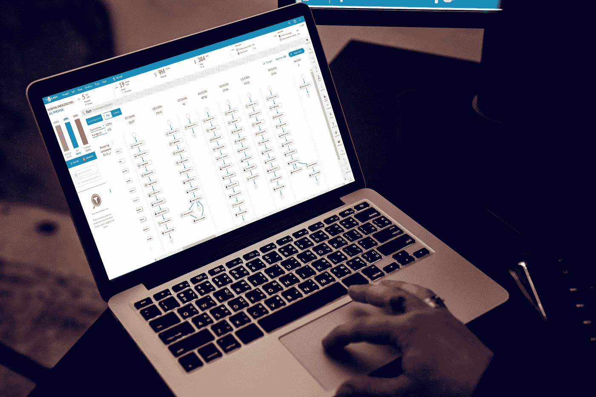

# 启动流程挖掘计划的六个技巧

> 原文：<https://medium.datadriveninvestor.com/six-tips-to-kick-start-your-process-mining-initiative-d4e2de30d163?source=collection_archive---------10----------------------->

您准备好探索流程挖掘作为简化和改善业务运营的重要工具了吗？这是让你开始的六个建议。

1.  让合适的人参与进来。应用流程挖掘的一个挑战是，不同的技能需要结合起来才能成功。不要低估你需要参与的人，以使你的流程挖掘计划取得成功。至少，这个团队由一个流程负责人、一个策略经理和一个分析师组成，但是，可能需要 it 人员参与数据提取，或者包括处理流程的其他人。

 [## 想知道领导是谁？请他决定。-数据驱动型投资者

### 一个有效的领导者能为组织提供的最有价值的东西之一是决策能力…

www.datadriveninvestor.com](https://www.datadriveninvestor.com/2019/01/25/want-to-know-who-the-leader-is-ask-him-to-decide/) 

2.**准备好数据。**众所周知，如今的企业拥有大量数据。众所周知，许多公司正在利用各种商业智能工具来获得对其运营的更多了解，并跟踪 KPI 和绩效。很多时候，用于构建 BI 类型分析的相同数据被用于流程挖掘。确保您可以访问这些数据，并且这些数据包括流程挖掘的三个基本元素——时间戳、惟一 ID 和事件。

3.**确保你有技能。**确认您选择了一家流程采矿公司，您可以利用您企业的当前技能组合。具有更友好的用户界面和点击功能的平台，以及全面的知识和支持中心，缓解了寻找具有特定技能(如编码)的员工的压力。通过选择一个用户友好的平台，可以扩展对流程的理解，并跨部门提供。

4.**选择正确的解决方案。**流程挖掘不限于一种特定的方法或解决方案，但是您确实需要软件来开始。请确保您选择了正确的解决方案，该解决方案能够在您的组织内促进持续改进，并且能够持续监控绩效，以提醒您并防止您的流程出现倒退和恢复到旧的/坏的习惯。

5.**将注意力集中在特定的流程上。对于新技术，如果没有适当的目标和期望，自然会产生范围蔓延的感觉。从技术开始时，试着专注于核心计划，一旦你能够完全理解技术及其影响，就扩展目标。确保与关键利益相关者和您的流程团队进行交流，以设定期望值。**

6.设定目标并监控绩效。为您的流程挖掘计划设定目标非常重要。无论这是为了减少时间、成本还是简化流程，设定你的公司希望努力实现的目标，以专注于发现。将初步发现作为基准，通过监控绩效来实现持续改进。