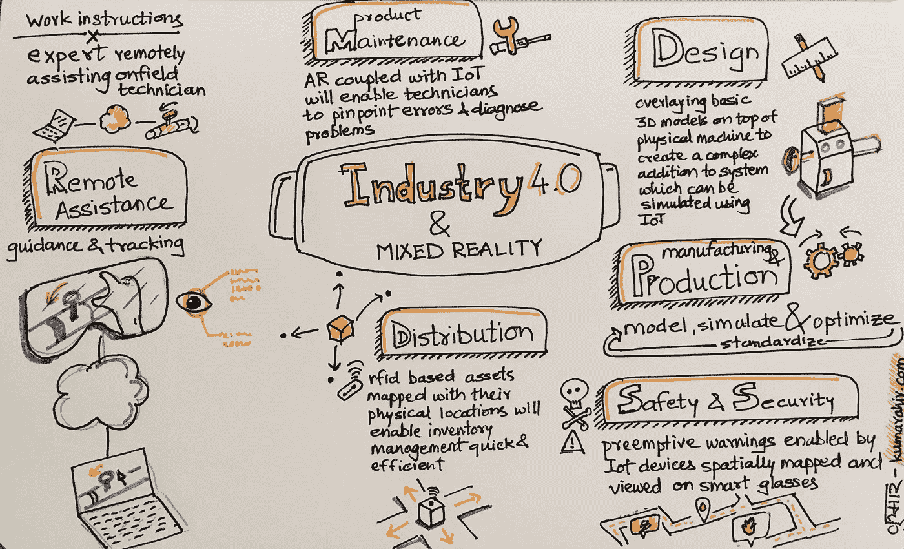
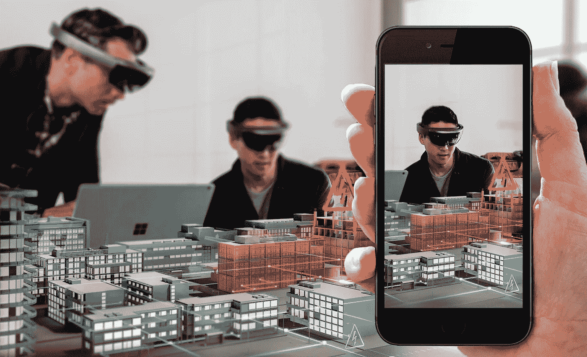
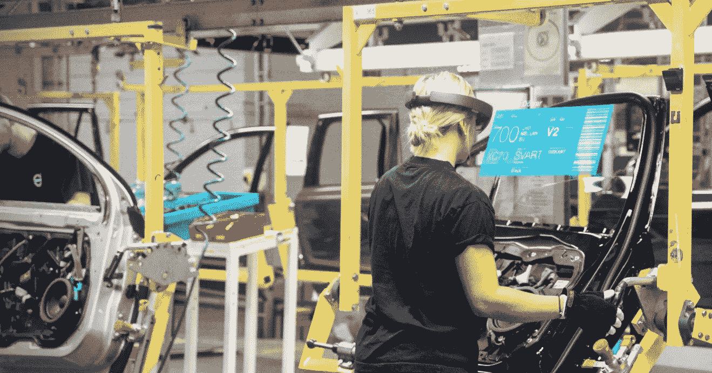
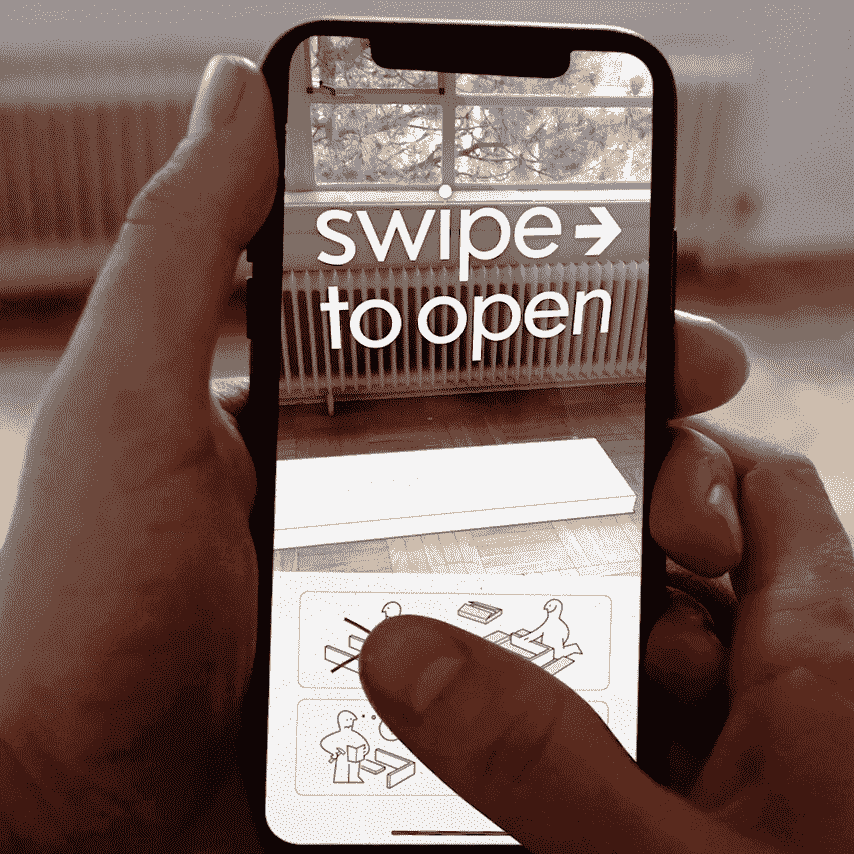
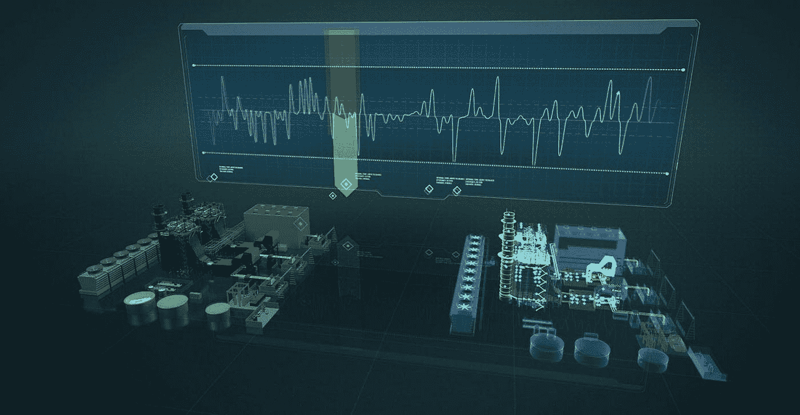
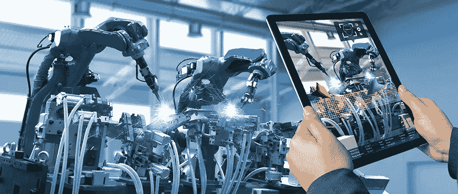

# 草图笔记—工业 4.0 的混合现实

> 原文：<https://medium.datadriveninvestor.com/sketch-notes-mixed-reality-for-industry-4-0-af330c86b7d8?source=collection_archive---------12----------------------->

Mixed Reality — Sketch Notes

工业 4.0 完全是为了效率和规模而自动化工业流程，其中机器相互交谈以完成工作。允许人类工作者更好地专注于更复杂的任务和创新。

在我们开始之前，了解虚拟现实、增强现实和混合现实之间的差异以及它们必须为最终用户提供什么是很重要的。简单来说，混合现实就是沉浸式增强现实。

下图展示了增强现实和混合现实的区别。在图像背景中佩戴 Hololens 设备的人们正在体验混合现实中的内容(身临其境)，观看者正在移动设备中消费相同的内容(但不是身临其境)。

Augmented Reality vs Mixed Reality

混合现实为企业提供了巨大的机会，特别是在制造业和对问题及其可能的解决方案进行预可视化非常重要的地方。混合现实在工业 4.0 的背景下有着特殊的作用。这不是一个详尽的列表，但是介绍了我作为 I4.0 研讨会的一员听到专家谈论该技术的现状和未来时所能想到的。

## 生产援助

Production Assistance using Mixed Reality

虽然工业 4.0 中的机器和流程的固有特性是每台机器都有数字签名，并且它们可以使用一些标准协议相互通信，但它也允许平板电脑、电话和最近的 MR 耳机(如微软 Hololens 和 Magic Leap)等媒体消费设备与设备通信。

> 这意味着现场技术人员和工人能够了解他们正在加工的机器的详细信息，以及制造过程中最终产品的部件。

通过混合现实，他们能够将细节覆盖在他们视觉关注的部件上，使过程与上下文相关，比让技术人员连接它属于哪个部件更相关。

除了有关零件的信息之外，MR 还帮助技术人员使用合适的工具来处理零件，并显示执行手头任务的步骤。经过一段时间，当技术人员习惯了流程和工具时，同一台 MR 设备可以帮助分析技术人员如何执行任务，这可以输入到 AI 系统，以便为新学员创建更好的流程向导。

## 远程协助和现场支持

Remote Assistance demo by Wikitude

如果技术人员可以在制造过程中获得产品部件的详细信息，那么也可以通过设备联网在部署后获得相同的信息。这些信息有助于现场支持工程师获得与设置和环境相关的产品性能历史数据。借助在线视频会议设施和 3d 注册注释，在旅途中完成工作的整个任务变得耗时更少，支持支出也全面减少。

> 技术人员诊断数据中心问题所花费的时间减少 2%,就可以节省数十亿美元的成本

## 客户入职体验

Wizard-based onboarding demo by Wikitude

有什么比用户/技术人员第一次花更少的时间去了解产品用法更好。有了混合现实，高管不用查阅产品手册就能快速了解产品。这也有助于最终客户在没有任何人工帮助的情况下更好地理解产品。

## DIY 客户和培训

DIY furniture assembly concept for IKEA

一家公司可以通过允许最终消费者在不雇佣低级技术人员的情况下负责产品设置来节省数十亿美元。这对于设置复杂且需要专家手动帮助的产品非常有效。

想象一下，一家公司能够在没有印刷产品手册的情况下，通过简单的步骤指导客户如何让他们的净水器或洗衣机工作。这意味着节省大量的时间、精力和金钱。

在 I4.0 环境中，DIY 概念占据了中心位置，因为系统实际上是通过感知用户的环境、上下文和工作阶段来指导用户下一步做什么。

## 数字孪生

Digital Twin concept

根据定义，数字孪生是以数字格式表示物理和/或生物对象。以数字格式捕获对象的不同方面，并能够操纵它们来查看效果，这使得主动支持变得高效，并可以降低运营成本。

Augmented Reality showing analytical data using Digital Twin

这些只是我作为一个门外汉所能想到的一些主要用例。我确信，深入实际制造业的细节可以让更多混合现实的用例浮出水面。

[*库马尔·阿希尔*](http://www.kumarahir.com) *是沉浸式技术和设计领域的独立顾问。他一直在通过积极举办关于设计思维、AR 和 VR 设计、混合现实技术原型的研讨会来宣传新的沉浸式技术和设计。他的目标是为沉浸式技术创造一个更好的设计生态系统。到目前为止，他已经联合创立了两家公司。*

*在*[*LinkedIn*](https://www.linkedin.com/in/kumarahir)*了解他，在* [*Twitter*](https://twitter.com/kernel_kumar) 关注他