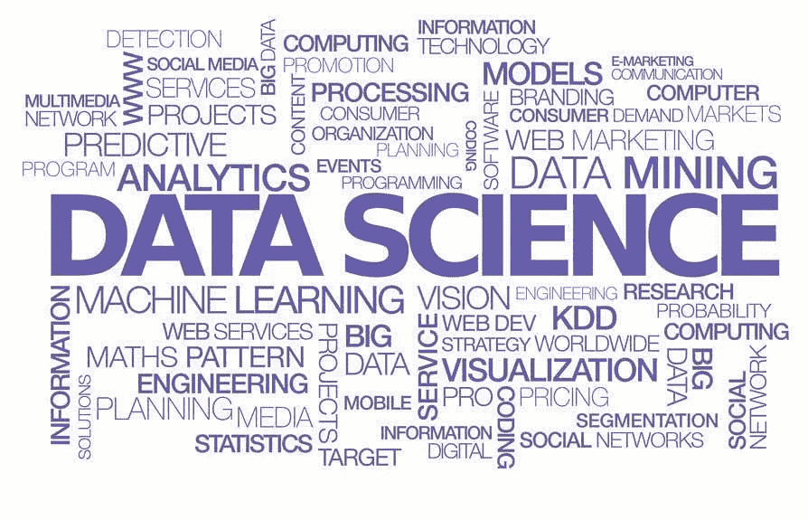

# 现代数据科学家的技能

> 原文：<https://medium.datadriveninvestor.com/skills-for-modern-data-scientists-3b6d7365050?source=collection_archive---------6----------------------->

# 你会学到什么？

*   数学和统计技能
*   领域知识和软技能
*   编程和数据库技能
*   沟通和可视化技能

 [## 成为数据科学家所需的 8 项技能|数据驱动型投资者

### 数字吓不倒你？没有什么比一张漂亮的 excel 表更令人满意的了？你会说几种语言…

www.datadriveninvestor.com](https://www.datadriveninvestor.com/2019/02/07/8-skills-you-need-to-become-a-data-scientist/) 

# 数学和统计技能

1.  机器学习
2.  统计建模
3.  试验设计
4.  贝叶斯推理
5.  监督学习
6.  无监督学习
7.  最佳化

# 领域知识和软技能

1.  对业务充满热情
2.  对数据好奇
3.  没有权威的影响
4.  黑客思维
5.  问题求解程序
6.  战略性、主动性、创造性、创新性和协作性

# 编程和数据库技能

1.  计算机科学基础
2.  脚本语言，例如:Python
3.  统计计算包，例如:R
4.  数据库，例如:SQL 和 NoSQL
5.  关系代数
6.  并行数据库和并行查询处理
7.  MapReduce 概念
8.  Hadoop 和 Hive/Pig
9.  定制减速器
10.  像 AWS 一样体验 XaaS

# 沟通和可视化技能

1.  能够与高级管理层接触
2.  讲故事的技巧
3.  将数据驱动的见解转化为决策和行动
4.  视觉艺术设计
5.  r 包，如 ggplot 或 lattice
6.  了解任何可视化工具，例如 Flare，D3.js，Tableau

## 谢谢大家！

## 敬请关注并与# [MLAIT](https://medium.com/mlait) 保持联系

## [关注我们](https://medium.com/mlait)获取更多关于人工智能、人工智能和云的教程，并加入 [MLAIT](https://t.me/mlait) 的电报小组