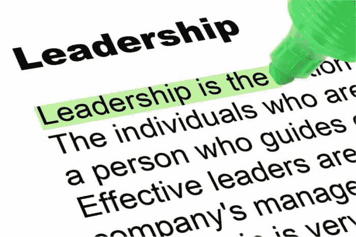
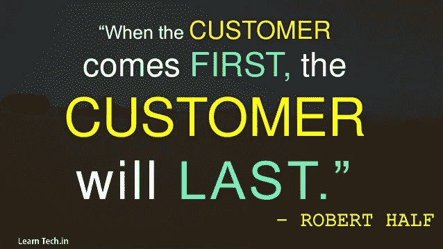

# 必备的领导技能(第二部分)

> 原文：<https://medium.datadriveninvestor.com/skills-great-business-leaders-possess-93288a778b4d?source=collection_archive---------9----------------------->

# 第二部分

“Value your customer as much as yourself”

11.**尊重&珍惜你的顾客**

作为先生的超级粉丝。理查德·布兰森，我记得他提到过他的商业战略，我们可能会称之为“以客户为中心”。我记得他说过，专注于客户体验、解决问题和提供真正的价值——这一点令人难忘，也正是它构建了他的公司。我相信他也说过专注于美元不是获得长期成功的途径，而专注于客户——金钱会带来忠诚和长期的整体成功(*根据我的记忆转述*)。

我总是对高管们说，象牙塔中的高管和领导者会失去与客户的联系，无法真正理解客户体验——从长远来看，这是营销和成功发展公司的宝贵因素。你可以在许多优秀的餐厅看到这一点，那里的老板每天都在，把每位顾客当成自己的朋友或家人一样问候，在食物送到客户面前之前在餐厅(房前)检查食物，并在一天中不断倾听和观察业务的心跳。任何一个不高度重视和关注客户的领导者注定会失败。

12.**大多数时候，你会为你得到的东西付费**

所以问题是，为性能和一致性付费是明智的，对吗？对吗？好吧，问题是有时公司并不总是选择最适合(领导)角色的人。聪明的公司通常会把历史表现作为一个预测器(在某种程度上),来预测如果这个人被聘用担任领导角色，未来会是什么样子。俗话说得好，“付出才有回报”。现在，这并不总是意味着一个新手或者一个过去有过失败经历的人不会是一个好的领导者，它只是意味着成功记录更长的人更有优势。因此，如果你想成为一家聪明的公司，道德就是要为你的领导者支付最高薪酬，因为人们在一天结束时会创造或毁灭一家公司。另一方面，如果你(不管是什么原因)要和一个未经证实的人或者一个不太好的记录的人一起去——把这个因素考虑到你的期望中，考虑让一个商业教练或者顾问和这个人一起工作——尤其是在第一年。

13.**深思熟虑(大局)的领导&问责**

你会在工作场所听到很多关于 KPI、衡量和责任的说法——见鬼，甚至在家里和你的孩子或配偶在一起！我发现，正直程度高的领导者通常对他们的团队和他们自己的行为非常负责——就像父母对他们的孩子负责一样。一天结束时，父母就像他们孩子的领导者，在家里如此，在工作场所也是如此。当领导者没有深思熟虑地领导，没有注意到他们的决定和行动；他们最终无法有效地领导。卓有成效的领导者明白，他们不仅要对公司目标负责，还要对为公司工作的人负责，让他们执行公司战略和策略来构建公司愿景。

如果员工没有得到适当的培训、有效的沟通、缺乏动力等。这就难怪领导不力会导致错误和/或问题。伟大的领导者总是深刻地理解，这是领导者对所有支持他们的团队和资源的最终责任。当取得胜利时，领导者会把他/她对认可的需求放在一边，表扬他/她的员工的工作。当出现失败时——领导者是否会挺身而出，对这些错误负责，负责修复这些错误，并作为领导者积极地从自己的错误中吸取教训，防止错误在未来再次发生？

“A well-defined HR strategy is key”

14.**这一切都始于正确的招聘理念/实践**

成为一名伟大的领导者与领导正确的人有很大关系。进入一家企业文化不利的公司是一回事，但当你在一家年轻的公司起步，并能从零开始建立一个团队时，那就是另一回事了。挑战略有不同，花费的时间也可能有所不同，但有一点是相同的，那就是被选入团队的人员的选拔过程。

我总是建议我的客户，他们应该创建一个企业哲学文件，处理他们将如何与客户以及他们自己的员工互动，以及他们将如何被对待。考虑到这一点，我建议高管团队拿出一个他们真正相信并会不惜一切代价保护的企业文化哲学。一些很好的例子常见于科技公司，如谷歌、脸书等。他们的招聘实践是经过深思熟虑的，并得到了很好的遵守——员工必须符合企业文化，而不是相反。通过这样做，领导者为自己赢得了更大的成功机会。

*“Inspiration comes from a dream, dare to dream”*

15.**灵感**

伟大的领导者往往是自我激励和驱动的，并以他们积极进取的心态激励他人。这话说得太多了，但重复中有真理——激情是会传染的。领导者会让团队几乎站在他/她的肩膀上也能实现伟大，伟大的领导者总是在那里帮助和激励他们，让他们可以达到这些伟大的时刻。

16.**激情**

同样，这在职业和个人世界中被经常提及。无论是在你的职业生涯中，还是在学术咨询中，你都会经常听到人们问，“*你对*有什么热情？”…在我与创业公司共事的这些年里，我可以直接告诉你，很多时候投资者可能不是 100%了解技术、商业模式等。，但投资者实际上会出来告诉创始人，他们绝对喜欢他/她身上的激情——这就是为什么他们对企业的成功充满信心。

“I think I can, not how I can not do it”

17.**积极&坚韧**

这在早期和创业公司中尤为重要。对于领导者来说，用可能性来调和现实是非常重要的，因为我们永远不想显得不靠谱。领导者用积极的经历来缓和消极的经历是非常重要的，因为这在任何行业都会发生，尤其是在创业的过山车中。员工需要看到领导者始终如一地以积极的方式行事，不管公司当时正处于什么时期。正是这种积极性也激发了坚韧不拔的行为，通过不断专注于实现个人目标或公司目标等。这种行为通常也具有传染性——这对创业公司来说是件好事。

18.**洞察力**

我相信良好的洞察力不是轻易就能教会的，而是与生俱来的。我发现，企业家和领导者一样，伟大的人，往往有巨大的洞察力，也知道如何解释他们的推理。拥有洞察力对一家公司的长期成功有很大的影响。一个很好的例子是，1990 年，克莱斯勒首席执行官李·艾柯卡决定推出道奇蝰蛇——当时燃料价格昂贵，人们对经济型汽车非常感兴趣，蝰蛇是克莱斯勒的一个全新方向。蝰蛇被许多人认为是扭转克莱斯勒公司的转折点。

**总之**

做正确的事，要有勇气，要有信念和激情，要坚信自己在做什么，为什么要做。我的商业哲学和营销哲学一直是与众不同，做领导者，而不是跟随者。我对我的孩子也用同样的哲学。领导者为员工和公司尽最大努力，并有勇气与那些害怕改变的人对抗，寻求维持现状，希望不顾损失继续前进，不允许(暂时)失败——即使这实际上是一个小挫折。我总是喜欢说“满是尿和醋的领导人”，当然是用逻辑和推理来调和的。所以，带着目标去领导，带着激情去领导，带着你的团队和你一起去领导，一起征服世界。

这个故事的寓意是，领导者需要诚实，有成功的记录，是优秀的沟通者，强调为他们领导的人服务，方法灵活，有激光聚焦，并有行动偏好。如果你目前的领导团队或你的新领导不具备这些特质，你很可能会走上一条崎岖不平的道路。

我是 Avy-Loren，我为全球不同行业的公司提供战略业务咨询和执行顾问服务。我与初创公司和创始人一起工作，与上市公司的首席执行官一起工作，当我们一起克服障碍时，我帮助公司和高管带着尊重和自豪实现他们的个人和职业目标。在过去的 10 年里，我共同创立了三家公司，目前是一家科技公司的联合创始人和首席运营官/首席市场官，作为天使投资人投资了一些早期初创公司，担任了一家美国风险投资公司的顾问，并指导了数百名个人和初创公司。欲了解更多信息，请访问 www.avylorencohen.com

***我也鼓励你把这篇文章分享给你认为能从中受益的每一个人，因为它可能会对很多人非常有用。***

Please share this article

**关注我:**

推特[https://twitter.com/AvyCohenBizWiz](https://twitter.com/AvyCohenBizWiz)

https://www.facebook.com/AvyLorenCohen 脸书

领英[https://www.linkedin.com/in/avyloren-cohen/](http://FOLLOW ME AT: Twitter https://twitter.com/AvyCohenBizWiz Facebook https://www.facebook.com/AvyCohenBizWiz/ LinkedIn https://www.linkedin.com/in/avyloren-cohen/)