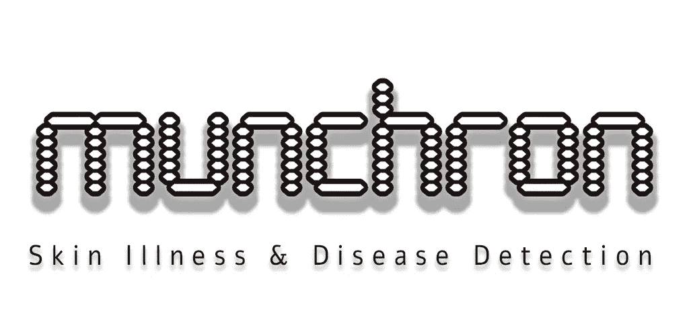

# 用机器学习对臭虫进行皮肤病和疾病检测&人工智能:创业公司如何保持生存。

> 原文：<https://medium.datadriveninvestor.com/skin-disease-illness-detection-to-bed-bugs-with-machine-learning-a-i-startup-pivot-to-live-9039f6b58800?source=collection_archive---------25----------------------->

随着时间的推移，我们总是看到进步，但有时甚至是以潜意识的方式，通过我们可能关注或可能不关注的行业(因此网络媒体因色情而激增)，进步有时是非常小的增量，从未被注意到……直到它被所有人注意到，不同的变化撕掉它，直到它成为日常生活的一部分。

Munchron.com Logo

我要和大家分享的是一个小故事，关于 Munchron 如何成为沉睡的巨人，以及我们如何慢慢地众包世界来帮助我们主宰未来，以及我们的扫描工具系列使用机器学习和人工智能来创造明天的技术和服务。

在 Munchron，我们最初的目标是创建一个健康扫描工具来确定皮肤病和疾病，并使用 ML/AI，我们已经完成了这种形式，当然，它不是 100%，成功率相当高，足够早一天作为一个工具来帮助医生或作为一个智能应用程序来帮助你扫描你的身体，作为你自己的预后，也许有一天在提交给你的医生或药剂师之前，第一次也是唯一的意见。

这听起来很棒，但在每一个好的故事和每一步成功或取得进展的过程中，都会遇到困难和你必须与之斗争的人，以便在尝试使用技术观点与人类解决未来问题时获得公平的待遇。很自然，大多数人说他们不会相信计算机会这样做，但你却相信计算机会处理股票市场、包含你辛苦赚来的美元的信用卡/借记卡购买、电力、水、大多数使用机器的农业和一些智能农业，然而，一台机器检测你皮肤上的东西是否可能是什么东西的想法比努力工作和创造一个更好的未来更令人害怕？

如果你知道我会同意，那你就知道我们以前来过这里。今天的问题？我是一家初创公司，而不是一些获得认可和奖项的机构，像约翰·霍普斯金这样的地方，医务人员创建了一个这样做的流程。但是，你真的认为是那些医生想出了算法或编码这些机器/计算机，让你在计算机上看到 X 射线，通过超声波看到婴儿，以及其他我们信任我们的医生有时会导致他们错误诊断的事情。

那么，为什么就不能有一次，技术专家/编码人员是一个没有医疗团体参与的人来开发或开始这项工作呢？为什么先找中间人？当然，许多年的学校教育，但什么，也提供假阳性结果，这似乎总是好的，“它发生了”。但我们在这里建立的是一个数据库，它可以识别已经存在的疾病和病症，并知道它们(主要)看起来是什么样的，以及需要包括哪些方面/层才能说这是这个或那个。医生目测你的皮肤状况，他可能之前见过你的皮肤状况，也可能之前没见过你的皮肤状况，而一个应用程序有成千上万的数据来创建模型，在这个模型中，一个活着的医生在他/她的一生中几乎不会遇到这么多问题！

这让你几乎想知道，为什么我们可以信任计算机(手机应用程序)将愚蠢的 AR 图形放在我们的脸上，并且在很大程度上可以很好地跟踪我们，我们不会再考虑面部识别是多么令人惊讶和多么可怕。想想如何使用指纹来确定你是你声称的那个人，用软件使用算法来交叉引用正在使用的手指是文件上的匹配，模式是否与你匹配。

这些是我们认为理所当然的技术上的惊人进步，并且已经在我们的眼皮底下建立了很长时间，慢慢地被引入，然后最终， 我们都使用它，似乎一夜之间，不要再想技术或技术背后的人有多神奇，因为他们做出了一些看起来疯狂或不可能甚至愚蠢的事情，认为一个人可以检查指纹进行匹配，你可以创建一个物理面具戴在你的脸上，但我们不会，几乎永远不会回到那种思维方式。

这让我回到了我的创业公司 Munchron。我们在医疗保健领域的工作遇到了很多阻力，我们试图让那些负担不起医生费用或不能等待的人获得某种类型的检测系统，让他们知道也许去看医生是一个好主意，因为我们不提供诊断，我们只是说，也许你有这个，应该去看看。

因为如果没有强大的支持或伙伴关系，我们就无法获得实验室或皮肤科医生完成的所有图像，我们基本上就被搞砸了，得到了一个蹩脚的交易，我们获得了一笔费用和特定时间的许可，即使我们创造了产品/服务。这是一种苦涩的味道，因为我们必须在互联网上寻找希望在社交媒体上拥有这些条件的普通人(是的，人们喜欢分享以获得同情)，并重新训练我们的模型，使它们尽可能强大。在这个时代，天使投资人忽视我们，风险资本家在我们有销售数据之前不想接触我们，但请记住，我们不能在没有信心的情况下销售产品。

当我们手头拮据，做着朝八晚五的工作来资助我们疯狂的想法，利用休息时间和周末来开发产品，让大家伙们看着并指出他们希望你失败或你可能成功的渺茫机会时，进来用一个提议诱惑你，如果你想让你帮助别人的梦想成为现实，你可能不得不接受这个提议。但在那之前，我们将利用我们的技能，开发带有广告的小应用/服务，试图为我们公司的未来提供资金，这就是为什么我们现在有一个名为 [Munchron Bed Bug Detection](https://play.google.com/store/apps/details?id=com.munchron.com.bedbugdetect) 的 Android 应用。

这款应用程序旨在发现你是否真的被臭虫侵扰，并提醒你。很明显，它们很小，但是通过足够近的距离，我们有很高的成功率报告你可能真的有臭虫(或者秘密地我们有其他检测，如跳蚤、K.Bugs 等)，因为它们已经被建模为未来的版本和产品，可以用于家庭、办公室、餐馆，甚至你的汽车旅馆/酒店。

直到投资者醒悟过来并倾听。接受我们正在努力建设的未来，我们将昂首挺胸，勇往直前，建立其他工具，希望为我们的主要关注点提供资金:从日常生活中的医疗检测工具到医生的快速检测工具，总有一天，它会成为一种负担得起的预防措施。

请记住这篇文章，因为我们是为这个行业而来，我们已经陷入了困境和陷阱，但我们会等到沉睡的风投/天使醒来，并记住，是初创公司改变了世界，而不是苹果-他们只是为你重塑品牌，并最终让你吹嘘你刚刚资助的初创公司，以及他们如何使用提供的 SDK (Healthkit 听起来熟悉吗？).对于苹果和谷歌来说，接受我们的 Munchron 皮肤检测工具，不是每个人都喜欢使用网络浏览器，不要一直否认和威胁我们账户的未来，说我们本质上是在给出错误的声明，而我们从定义上来说并不称自己为诊断平台，让我们通过众包世界皮肤照片来改变未来，并尽我们所能建立最好的 ML 模型。我们来到硅谷，寻找尤利娅·格里巴诺娃和我，兰斯·塞德曼。