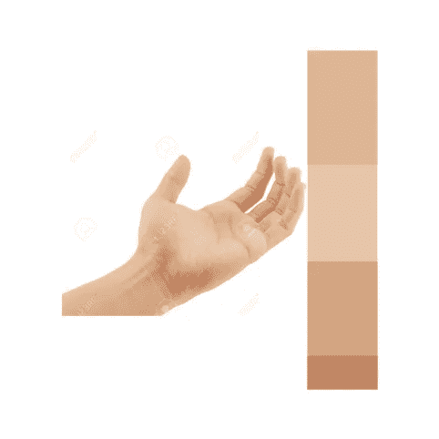

# 皮肤分割和主色调/颜色提取

> 原文：<https://medium.datadriveninvestor.com/skin-segmentation-and-dominant-tone-color-extraction-fe158d24badf?source=collection_archive---------2----------------------->

你好世界！！！你有没有看过自己的皮肤，想知道为什么身体的不同部位会有不同的深浅？我们去思考一下，然后回到这篇文章。

欢迎回来！！！我们今天的共同目标是找到一种从图像中提取“皮肤”并找到其颜色/色调的方法。所以，我们要做的是图像分割和颜色提取。

这个项目的直接灵感来自我咬指甲时阅读 OpenCV 的颜色分割。“我是个咬指甲的人，我很自豪”(海绵宝宝托尼)。所以我想为什么不应用一些机器学习，为我咬下来的皮报仇。

这些是我的研究发现

1.  OpenCV 是一个非常棒的图像处理库
2.  可以使用不同颜色空间中的阈值进行颜色分割
3.  聚类是对未标记数据进行分组的一种很棒的方式

# TL；速度三角形定位法(dead reckoning)

今天我们将学习使用 OpenCV 来分割皮肤，并使用 Sci Kit learn 来执行 K-Means 聚类，以找到主要的皮肤颜色。

我写这篇文章的前提是假设你了解基本的 python 和 OpenCV。尽管如此，我们将涵盖对 K-Means 的高级理解和 OpenCV 的一些方法。我们还将讨论不同的色彩空间。

我相信所有东西的代码都存在于互联网上。“为什么，”你问？由于出色的开源社区和基本的人性。找到它很重要。话虽如此，我并不喜欢复制粘贴代码，除非我理解它。本文着重解释代码背后的概念。

有兴趣进一步阅读？让我们开始吧！！！

**OpenCV 是什么？**

“OpenCV(开源计算机视觉)是一个主要针对实时计算机视觉的编程函数库”——https://en.wikipedia.org/wiki/OpenCV

假设您知道“库”在计算机科学领域意味着什么，让我们打破这个定义。关键焦点在“计算机视觉”这个词上。那么什么是计算机视觉呢？

> “计算机视觉涉及从单个图像或一系列图像中自动提取、分析和理解有用信息。它涉及到理论和算法基础的发展，以实现自动视觉理解。”——【http://www.bmva.org/visionoverview 

到目前为止，这是我对计算机视觉的最好解释，简短但有深度。在高层次上，我们知道使用算法对图像进行一些处理，以提取和分析信息。

计算机视觉是人工智能的一个子领域，它包括从简单的物体识别到生产级机器人的应用。一个大家都能理解的用例是脸书建议在你上传照片时给你自己或你的朋友加标签。

因此，让我们使用高层次的解释，并为 OpenCV 做一个简单的英语定义

> “OpenCV 是一个计算机视觉库，帮助我们使用图像处理技术从图像或视频中提取/分析数据”。

我会让你好奇的头脑去发现更多关于图像处理和这些所谓的图像处理技术。剧透警报！如果你的笔记本电脑或手机上有一个照片编辑 app，你已经是一个图像处理器了；)

Sci-Kit 学的是什么？

“Scikit-learn(以前的 scikits.learn)是一个用于 Python 编程语言的免费软件机器学习库。它具有各种分类、回归和聚类算法，包括支持向量机、随机森林、梯度推进、k-means 和 DBS can”“【https://en.wikipedia.org/wiki/Scikit-learn 

事实上，如果你在机器学习领域，sci-kit learn 对你来说可能并不陌生。当你进入这个空间的时候，你可能已经无数次遇到过“sklearn”了。

我假设你对机器学习有基本的了解。为了有益健康，让我们回顾一下它的定义；

机器学习是人工智能的子领域，其重点是为计算机/系统提供算法，以便在没有显式编程的情况下从数据中自动学习。，它基本上意味着允许计算机在没有“if else”语句的情况下做出预测或假设。

**机器学习算法包括**

1.  监督学习
2.  无监督学习
3.  强化学习

我将在另一篇文章中讨论机器学习，现在，让我们回到 SciKit-learn。

因此，让我们将 Scikit-learn 定义为一个库，它有一套丰富的简单干净的 API 来完成机器学习管道，从加载和操作数据到进行预测的目标。

**什么是 K 均值聚类？**

K-Means 聚类是一种无监督学习算法。聚类算法的基本原理是在给定的数据集中寻找具有相似特征的数据点组。K-Means 就是这样一种聚类算法，它将数据分成“K”个组/簇。

你会问 K 均值聚类是如何工作的？

这个过程其实很简单，

1.  选择聚类的数量(K)
2.  随机放置 K 个数据点(初始质心)
3.  将数据集中的点分配给最近的质心(这通常是通过查找点与质心的欧几里德距离来完成的)
4.  通过取每个聚类中数据点的平均值来重新计算新的质心。
5.  重复 3 和 4，直到质心不动。

明白要点了吗？没有吗？看看下面两张 gif 图是否让你明白了，如果你还是不明白，就看这个[视频](https://www.youtube.com/watch?v=3vHqmPF4VBA)

[http://shabal.in/visuals/kmeans/4.html](http://shabal.in/visuals/kmeans/4.html)

# 编码时间！！！！！！！！！！！！！！！！！

你想把你的屏幕拍在你脸上吗？深呼吸，冷静下来。回忆一切，因为我们将进入代码。

既然我们已经理解了相关的概念，那就执行任务吧。让我们开始编码吧！！

我们将使用谷歌协作。如果你以前没有检查过 Google Collab，请到这里来检查一下。在你做到这一点后，阅读 fuat 的[“Google Colab 免费 GPU 教程”，你会很高兴你这样做了(对我来说+1 布朗尼/独角兽点)。](https://medium.com/deep-learning-turkey/google-colab-free-gpu-tutorial-e113627b9f5d)

有 python 背景的人会注意到，Google Collab 看起来对 Jupyter Notebook 非常熟悉。嗯，确实如此:P

回到主题，一如既往，当我开始一个项目时，我喜欢分解过程。所以让我们把这个也分解一下

1.**读取图像**——这可以使用 OpenCV 来完成

2.**从图像中分割出皮肤**——这也可以使用 OpenCV 来完成

3.**找到主色** —这是主要目标！我们将在 Scikit-learn python 包的帮助下使用 K 均值聚类算法。

*所以我们得到了一个三步流程。(我依稀记得读到过，一个行动应该在三步过程中完美地完成才能成为一个丰富完整的 UX。嗯，那是题外话…..唉又走神了… )*

在你真正理解代码之前需要知道的一些事情。

1.  **OpenCV 读取“BGR 色彩空间”中的彩色图像。**

嗯是的，那是“RGB 色彩空间”的反转。如果你是一个网页设计师或一般的设计师，RGB 对你来说并不陌生。RGB 作为“加色空间”,你为什么这么问？让我们回到小时候。你的母亲或父亲，甚至你的老师可能已经教过你，如果你把红色和蓝色混合，你会得到紫色/洋红色。那是不是触发你的记忆记住了“三原色”？

那么 OpenCV 为什么不使用现在流行的色彩空间呢？嗯，答案是“历史”。我不是开玩笑，开发者选择使用 BGR 色彩空间，因为显然在开发期间，BGR 是相机制造商和软件供应商广泛使用的色彩空间。你可以从 [*LearnOpenCV 的帖子中了解更多信息。*](https://www.learnopencv.com/why-does-opencv-use-bgr-color-format/)

**2。使用 HSV 颜色空间中的阈值进行皮肤分割**

HSV(色调、饱和度、值)是用于表示符合人类感知的 RGB 颜色的模型。色调表示特定颜色波长的优势，饱和度表示颜色的深浅，值表示颜色的强度。

阈值处理是通过基于定义的阈值过滤掉像素来创建二进制图像的过程。简单来说，取图像的每个像素，如果该像素在“阈值”的范围内，则将其设为白色，否则设为黑色。在我们的上下文中，阈值将是表示“肤色”范围的 HSV 值。HSV 范围可以通过反复试验获得。你可以从 LearnOpenCV 的这篇文章中了解更多信息。

*我们将使用 cv2.inRange()方法进行阈值处理，并使用 cv2.bitwise_and()从二进制图像中获得最终的减影图像。*

以及关于要使用的库的其他几点

1.  OpenCV 使用 Numpy 数组作为数据类型。
2.  默认情况下，OpenCV 不能处理透明图像。它将透明视为黑色
3.  由于 cv2.imshow()在 Google Collab 中不工作，我们将使用 matplotlib 的 plypot 的“imshow”方法来显示图像。
4.  我们将使用由《PyImageSearch.com*的作者 Adrian Rosebrock 编写的令人敬畏的“ [imutils](https://github.com/jrosebr1/imutils) ”库。*

*好了，现在事情已经解决了，在你查看[谷歌协作笔记本](https://goo.gl/bZZ3Yv)之前，让我们通读下面的代码。*

*这将是代码的最终输出，颜色信息和颜色栏如下。*

**

*Hand Image from 123RF.com*

*有收获吗？嗯，你为什么不试试呢？[这里是我的谷歌协作笔记本](https://goo.gl/bZZ3Yv)的链接，上面有代码的详细描述。复制一份，然后自己玩玩。你也可以克隆我的[回购](https://github.com/octalpixel/Skin-Extraction-from-Image-and-Finding-Dominant-Color)并在本地试用。*

*好了，这就把我们带到了文章的结尾。如果您有任何问题或意见，请在下面留下。如果你真的觉得有用，请在这里分享并鼓掌。*

*在我离开之前，我想分享一些你可以阅读和探索 OpenCV 世界的资源。*

1.  *[PyImageSearch——在 OpenCV、Python、深度学习和计算机视觉方面表现出色](https://www.pyimagesearch.com/)*
2.  *[学习 OpenCV ( C++ / Python )](https://www.learnopencv.com/)*
3.  *[OpenCV 101:开放计算机视觉库实用指南，作者马特·雷佛](https://www.youtube.com/playlist?list=PLSxoFZq1-zcTVA2cPx9zayDUHSnri61bF)*
4.  *[OpenCV 和 Python，用于 sentdex 的图像和视频分析](https://www.youtube.com/playlist?list=PLQVvvaa0QuDdttJXlLtAJxJetJcqmqlQq)*

*好吧，那么“拳头碰撞”在我的下一个帖子:D 见*