# 跳过 Gram 模型分解

> 原文：<https://medium.datadriveninvestor.com/skip-gram-model-broken-down-e8751c0b051c?source=collection_archive---------3----------------------->

[](http://www.track.datadriveninvestor.com/1B9E)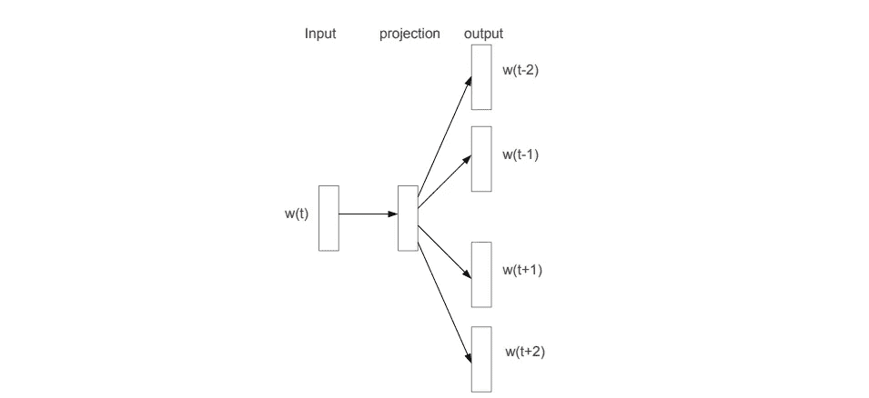

Source: [https://arxiv.org/pdf/1310.4546.pdf](https://arxiv.org/pdf/1310.4546.pdf)

跳格模型使用神经网络来创建单词表示。一个词可能很容易被人理解，但不是机器。用机器语言表示单词的一种常见方式是将单词编码成字符数组或字符串。但是，字符数组没有任何意义。跳格模型来了。

不是用字符来表示一个单词，跳格模型将创建一个向量，向量空间的一个元素来表示每个单词，称为单词向量。单词向量可以被看作是相对于图中原点的位置。具有相似含义的单词将使它们的单词向量靠得更近，而具有不同含义的单词将相距很远。有趣的是，单词向量通过线性翻译对语义关系进行编码。

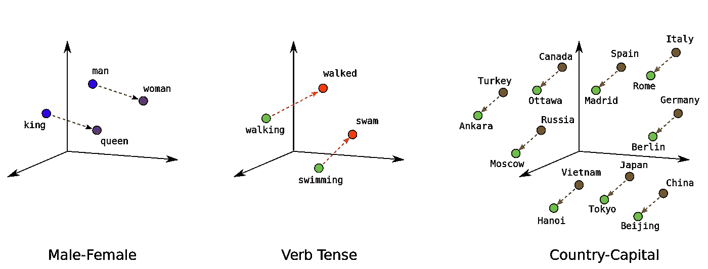

Source: [https://developers.google.com/machine-learning/crash-course/embeddings/translating-to-a-lower-dimensional-space](https://developers.google.com/machine-learning/crash-course/embeddings/translating-to-a-lower-dimensional-space)

# 概观

在 Skip-gram 模型中，我们将通过从中心词预测上下文词来训练具有单个隐藏层的完全连接的神经网络。假设我们的数据集是

```
**the quick brown fox jumped over the lazy dog**
```

我们将创建(中心，上下文)单词对来训练我们的模型。语境是中心词左右两边的词的窗口。使用大小为 2 的窗口，

*   中心词，“the”将有上下文词，“quick”和“brown”。
*   中心词，“quick”将有上下文词，“the”、“brown”和“fox”。
*   中心词，“棕色”会有上下文词，“the”、“quick”、“fox”和“jumped”。
*   中心词，“狐狸”会有上下文词，“快”、“布朗”、“跳了”、“过了”。

…等等。

因此，我们的训练数据集变成了

```
**(the, quick), (the, brown), (quick, the), (quick, brown), (quick, fox), (brown, the), (brown, quick), (brown, fox), ...**
```

(中心，上下文)对。中心单词将是神经网络的输入，而上下文单词是目标。

在将中心单词输入神经网络之前，我们将每个单词替换为一个从 0 到 *W、*的数字，即词汇表中的单词数(不包括 *W* )。所以，每个单词对应一个数字(我称之为单词索引)。顺序在这里并不重要。

我们可以随机初始化输入权重矩阵和输出权重矩阵。然而，有一种更好的方法来初始化矩阵，而不是将标准偏差固定为 0.1，但这超出了本文的范围。在训练神经网络之后，权重矩阵将最终成为单词向量。注意，权重矩阵的大小是 *W × EMBED_SIZE。矩阵的每一行都是每个单词的向量。*

```
import numpy as np# The number of component in each word vector
EMBED_SIZE = 128# W is the number of words in the vocabulary
input_weights = np.random.normal(0, 0.1, size=(W, EMBED_SIZE)) output_weights = np.random.normal(0, 0.1, size=(W, EMBED_SIZE))
```

这里需要注意的重要一点是，跳格模型的最终产品是权重矩阵，而不是模型预测上下文单词的能力。

培训前，我们先了解一下培训目的。跳格模型的训练目标是最大化平均对数概率

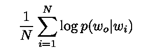

其中 *wᵢ* 是中心词(输入) *wₒ* 是上下文词(目标) *N* 是(中心，上下文)对的数量。这仅仅意味着给定 *wᵢ* 作为输入，我们必须最大化 *wₒ* 被神经网络*预测为输出的概率。*

在基本的跳格模型中，使用 softmax 函数定义 *p(wₒ|wᵢ)* 。

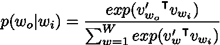

其中 *vₓ* 和 *v'ₓ* 是单词 *x* 的输入和输出向量表示，而 *W* 是词汇表中的单词数。

因此，我们针对单输入的总体简化培训目标是


然而，上述表达式中求和的计算成本太高，不切实际，因为它与通常非常大的 *W* 成比例。为了解决这个问题，我们应该使用负抽样。在一篇论文《单词和短语的分布式表示及其组合性》中有描述。

# 负采样

负采样是一种简化的噪声对比估计(NCE)。我们使用 softmax 函数的问题是计算成本太高。对于 NCE，我们通过在阳性样本和阴性样本之间建立对比来进行评估(以降低成本)。

基本上，给定一个输入中心词 *wᵢ，*我们必须最大化使其对应的输出上下文词 wₒ成为神经网络中的输出的概率。此外，我们将从噪声分布 *Pₙ (w)* 中选择 *k* 个负样本，并最小化得到负样本作为输出的概率。因此，我们的负抽样训练目标变成了

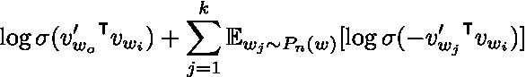

其中 *σ* 是一个 sigmoid 函数。

根据 Tomas Mikolov 和他的团队的实验，范围为 5-20 的 k 值对于小型训练数据集是有用的，而对于大型数据集，k 值可以小到 2-5。请注意，与没有负采样的目标相比，求和的成本已经大大降低。

我们还没有定义我们的噪声分布。根据 T. Mikolov 团队的经验结果，发现最佳噪声分布是 3/4 次幂的一元分布。换句话说，选择一个单词作为负样本的概率等于该单词的 3/4 次幂的频率除以所有单词频率的 3/4 次幂的总和。

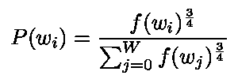

让我们用 python 实现负采样。该代码基于 word2vec C 实现。

```
POWER = 0.75
TABLE_SIZE = int(1e8)
total_prob = 0"""
Assume that *vocab* is a list of Word objects which have *count* attribute, storing the frequency of the word in the dataset*vocab* can be constructed when reading the dataset
"""
for word in vocab:
    total_prob += word.count ** POWERunigram_table = np.zeros((TABLE_SIZE,), dtype=np.int64)
i = 0
d1 = vocab[i].count ** POWER / total_prob
for a in range(TABLE_SIZE):
    unigram_table[a] = i

    if a/TABLE_SIZE > d1:
        i += 1
        d1 += vocab[i].count ** POWER / total_prob if i >= len(vocab):
        i = len(vocab) - 1
```

在构建了 unigram 表之后，该表将包含单词 indexes。表格中单词索引的频率由 *P(wᵢ) × TABLE_SIZE 给出。*因此，通过生成从 0 到 TABLE_SIZE(不包括 TABLE_SIZE)的随机整数，并使用生成的随机整数从 unigram 表中获取单词索引，我们已经从噪声分布中采样了单词。

```
# Number of negative samples
k = 5indexes = np.random.randint(0, TABLE_SIZE, size=k)
neg_samples = unigram_table[indexes]
```

然而，所取得的样本有可能与目标上下文单词相同(正样本)。我们以后会处理的。

# 培养

现在，我们可以开始向前传播了。

```
k = 5def sigmoid(x):
    return 1/(1 + np.exp(-x))for center, context in train_data:
    indexes = np.random.randint(0, TABLE_SIZE, size=k)
    neg_samples = unigram_table[indexes] # We form a list of tuples of *(word, label)*
    # *label* is 1 if the word is a positive sample else 0
    samples = [(context, 1)] # Only the samples which are different from context word     
    samples.extend([(w, 0) for w in neg_samples if w != context]) # Select the word vector/embedding in *input_weights* input_embed = input_weights[center] for word_index, label in samples:
        output_embed = output_weights[word_index] # z is the weighted sum value at the output layer
        z = np.dot(input_embed, output_embed)

        # a is the activation at the output layer
        a = sigmoid(z) # Backpropagation
```

对于反向传播，我们应该回顾一下我们的训练目标， *J* ，

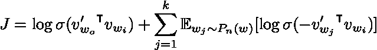

让我们定义 *zₒ* 和 *zⱼ* ，它们分别是正样本和负样本的加权和值。

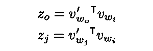

我们的训练目标变成了

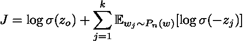

然后我们可以找到梯度， *∂ J/∂ zₒ* 和 *∂ J/∂ zⱼ。*

梯度由下式给出

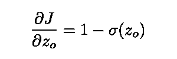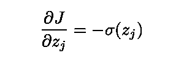

我们可以将这两个导数归纳成一个表达式，以便在 for 循环中使用。

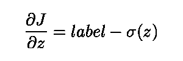

其中*标签*为阳性样本时为 1，为阴性样本时为 0。

然后，我们可以很容易地得到训练目标相对于输入权值和输出权值的梯度。

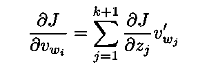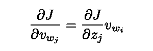

求和达到 k + 1，因为有 k 个负样本和 1 个正样本。

下面是关于反向传播的代码，它是上面关于正向传播的代码的延续。

```
# Learning rate
lr = 0.1...for center, context in train_data:
    ... # Select the word vector/embedding in *input_weights* input_embed = input_weights[center] delta1 = np.zeros((EMBED_SIZE,))
    for word_index, label in samples:
        output_embed = output_weights[word_index] # z is the weighted sum value at the output layer
        z = np.dot(input_embed, output_embed)

        # a is the activation at the output layer
        a = sigmoid(z) delta = (label - a) * lr

        delta1 += delta * output_embed
        output_weights[word_index] += delta * input_embed input_weights[center] += delta1
```

这里，我们已经完成了反向传播。权重矩阵、*输入权重*和*输出权重*现在将包含单词向量。具有单词索引 *n* 的单词将使其单词向量位于权重矩阵中的 *nᵗʰ* 行。

在下一篇[文章](https://medium.com/@chinhuantan/skip-gram-model-broken-down-subsampling-n-grams-feab04a6f220)中，我们将讨论关于子采样和 n 元语法的主题，以改进 skip-gram 模型的结果。

感谢您的阅读！