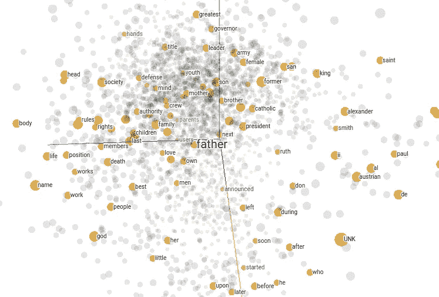
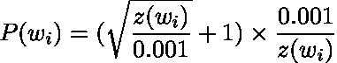
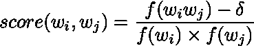

# 跳格模型分解—二次抽样，N 元模型

> 原文：<https://medium.datadriveninvestor.com/skip-gram-model-broken-down-subsampling-n-grams-feab04a6f220?source=collection_archive---------6----------------------->

[](http://www.track.datadriveninvestor.com/1B9E)

Word vectors projected using PCA

本文是上一篇文章的延续，上一篇文章讨论了负抽样和跳格模型训练。如果你有兴趣，可以在这里阅读文章[。](https://medium.com/datadriveninvestor/skip-gram-model-broken-down-e8751c0b051c)

# 二次抽样

跳格模型试图通过一个词的上下文来解释这个词的意思。这是通过创建单词对来完成的。然而，像“the”和“and”这样的词被频繁使用，它们很少解释上下文。另一方面，不常用的单词或特定领域的单词和短语通常带有上下文的含义。这就是我们使用子采样的原因。

通俗地说，子采样就是对不常用词进行比常用词更多的采样，从而产生新的训练数据。通过这样做，它们的相对频率保持几乎相同。因此，必须定义对单词进行采样的概率。下面是 word2vec C 实现中使用的概率，



其中 *z(wᵢ)* 是语料库中所有训练词的分数。

```
# A storage to store tokens after subsampling
new_tokens = []# tokens is a list of word indexes from original text
for word in tokens:
    frac = vocab[word].count/len(tokens)
    prob = (np.sqrt(frac/0.001) + 1) * (0.001/frac)

    if np.random.random() < prob:
        new_tokens.append(word)
```

在二次采样之后，我们现在可以使用 *new_tokens* 创建我们的训练数据，并遵循之前描述的训练步骤。

# N-grams

此外，短语的意思通常不是单个单词意思的直接相加。所以，我们的任务包括决定一个单词是短语的一部分还是一个独立的单词。然后，我们给这个短语一个词向量。在这种情况下，我们使用 n 元语法的思想来识别短语。在去 n-grams 之前，我们从 bigram 开始。我们为每个二元模型定义一个分数。如果分数高于某个阈值，我们认为它是要在训练数据中使用的有效二元模型。



其中 *f(wᵢ wⱼ)* 表示二元模型 *wᵢ wⱼ* 在语料库中的频率， *f(w)* 是词在语料库中的频率， *δ* 是去除不常用短语的阈值。

请注意，这里有两个阈值。使用 *δ* 是因为有可能 *wᵢ* 和 *wⱼ* 都不常见，从而导致高分。

下面是一个示例代码。该代码假设您有一个名为 *n_gram_hash* 的字典，它将 n_gram 本身作为键，将其 n_gram 索引作为值。n_gram 索引是列表中 n_gram 的索引， *vocab* 。回想一下 *vocab* 是一个 Word 对象列表。现在，它将 n_gram 视为一个单词。例如，假设您的训练数据是

```
**nice to meet you**
```

在第一次迭代中，我们只从二元模型开始。所以，我们的 *n_gram_hash* 会有以下二元模型作为键，“nice_to”、“to_meet”和“meet_you”。这些值将具有每个二元模型的频率。

```
min_delta = 5# A storage to store tokens after identifying the phrases
new_tokens = []i = 0
while i < len(tokens) - 1:
    word = tokens[i]
    next_word = tokens[i + 1]

    # f_i is the frequency of the first word (i)
    f_i = vocab[word].count

    # f_j is the frequency of the next word
    f_j = vocab[next_word].count

    # token attribute stores the word itself as string
    bigram = vocab[word].token + "_" + vocab[next_word].token

    # f_ij is the frequency of the bigram
    f_ij = vocab[n_gram_hash[bigram]].count

    score = (f_ij - min_delta) / (f_i * f_j)

    # Has to define the threshold based on the corpus
    if score > threshold:
        new_tokens.append(n_gram_hash[bigram])
        i += 2
    else:
        new_tokens.append(word)
        i += 1# If the last 2 words are not bigram, we have to include the last word
if i < len(tokens):
    new_tokens.append(tokens[i])
    i += 1
```

完成后，我们的 *new_tokens* 变量现在将有一个单词和双词列表。如果我们再次运行这个程序，我们将把二元模型和一元模型结合在一起形成三元模型。在运行程序之前，确保你的 *vocab* 和 *n_gram_hash* 包含三元模型、四元模型等等。我们想做多少次都可以。通常，我们用递减的阈值运行它 2-4 次，因为在语料库中出现长短语的机会较小。

现在可以使用 *new_tokens* 进行子采样，然后进行模型训练。

# 结论

给出的代码是为了学习。它根本没有优化，也绝对不是最好的方法。如果你需要更多的细节，你可以看看[论文](https://arxiv.org/abs/1310.4546)和 [word2vec C 实现](https://github.com/dav/word2vec)。

快乐学习！