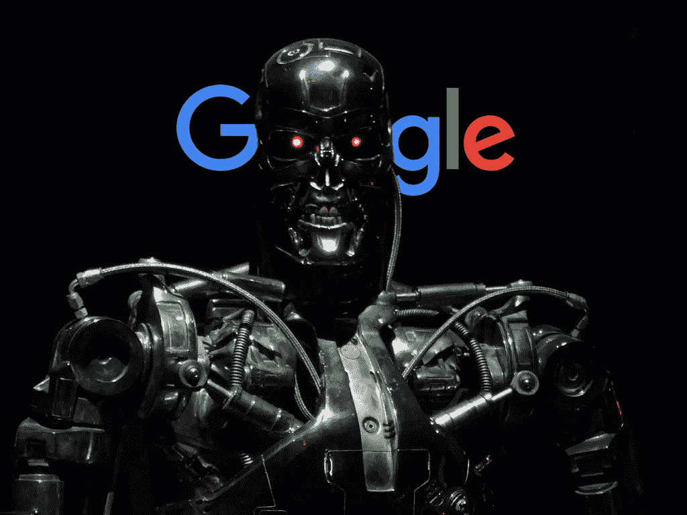
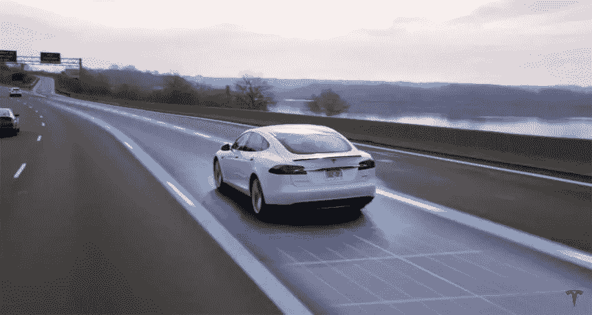
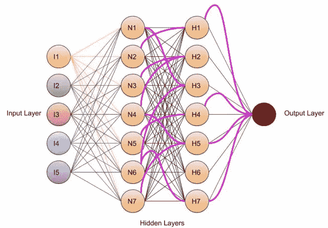

# 天网还是谷歌云

> 原文：<https://medium.datadriveninvestor.com/skynet-or-google-cloud-7267943119af?source=collection_archive---------24----------------------->

AI、ML、深度学习、监督/非监督学习、计算机视觉、自动驾驶汽车、iPhone X 人像模式、Pixel 3 夜视、Ok_GOOGLE、Hey_SIRI、Hey_CORTANA、自动校正等等..所有这些都是彼此的集合和子集。一个多面无姓的女生(get)，如果这一切都是从《终结者 1》开始的呢也许不是，其实不是。在我昏昏欲睡地寻找真理和启示的过程中，我发现某所著名大学的一位非常聪明的教授给了他的一个学生一个完全奇怪的任务，那就是为计算机视觉开发一个简单的计算机代码，他做还是不做不是这里的问题。

几乎一切都在平均水平左右。这个人有一个硅芯片，它非常非常听话地执行非常具体的命令，比如将烤箱定时器设置为 3 分钟，当你忘记关掉汽车前灯时会发出嘟嘟声。但是很明显，一些天才决定在硅片旁边放一个大脑/指挥中心，现在你的烤箱会给你发短信，告诉你吃什么，怎么吃，什么时候吃。你的车现在可以自动把你从阳台送到商场，把你放下，然后自动停车。我同意医学已经有所发展，这种大脑/硅芯片组合无疑是在拯救生命。

AI，ML，DL 这些都是一个父亲，儿子，兄弟(不按顺序)。我不是在搞技术，因为每一个都有数十亿个定义，而且每分钟都在变化。底线是，上述天才小组实际上是在试图弄清楚人类大脑是如何工作的，以及为什么它看起来如此丑陋。幸运的是，他们没有得到任何答案，但在这一过程中，他们从 1000 亿个神经元中分离出一个神经元(神经元是大脑的基本工作单元)，并对其进行最大程度的折磨，并建立数学方程(带有权重、偏差、激活函数)来模拟单个神经元的工作。单个数学神经元本身只不过是一个交通信号，只有两个选项，红色或绿色，取决于它接收的流量。然后类似于人类的大脑，许多神经元被堆叠在相互连接的层中，它们被分配去做一个非常特定的任务，直到它们做得完美为止。示例:用于图像识别的卷积神经网络的工作具有多层滤波器，即一层具有许多滤波器，然后另一层具有另一数量的滤波器。经过训练和测试后，该模型在从未见过的图像上的输出准确率达到 85%。目前还不清楚这种过滤器是如何工作的，以及网络作为一个整体是如何以如此高的精度工作的。它背后有明确的数学，但在某一点上，数据是如此庞大和胡言乱语，人脑不可能理解，这个过程就像人脑一样，我们知道它可以工作，但仍然不知道为什么。

所有重要的术语，如权重、偏差、激活函数、卷积、前馈、反向传播、梯度下降等，将在需要时进行适当的介绍。我是一个完全的新手，没有计算机科学、编码、编码语言方面的经验。我已经开始了这个探索未知的旅程，因为我对 ML 的应用非常着迷。我没有该领域的学位，但我想学习，我整理了一些开源指南，以获得一些值得尊敬的 ML 背景知识，我有手写笔记和 Python 代码，一旦我自己尝试并测试了它们，我就会上传它们。我也将提供我所有的参考链接。

现在回到天网，虽然我自己没有编写任何代码来结束世界饥饿或解决贫困。我绝对相信这一天离今天不远，在 ML 领域的增长是指数级的，我的意思是为什么机器不能自己学习，因此在任务过程中没有人的干预或愚蠢的错误。警告:自动机器不是人工智能或人工智能，自动机器只是一段非常有效的代码，它被编程在一个非常广泛的范围内，如果面对一个从未被编程过的情况，它肯定会失败。另一方面，机器学习就像 2-3 岁的人类孩子，我们教它几次什么是字母，什么是数字，然后要求它识别它，总有出错的余地，这是可以预料的，因为我们从未硬编码我们的程序，我们只是试图一遍又一遍地教它。缺点是我们的机器小孩只适合非常特殊的事情。当我们处理数据并运行一个实际的程序时，一切都会很清楚。谷歌、亚马逊、苹果、facebook 这些公司正在使用“n”个机器孩子，他们擅长“n”个任务，现在这些机器孩子需要学习一些正确的东西，否则他们将如何更好地做好他们的工作。这是数据，用户数据。数据越多，这些机器孩子可以更有效地学习，他们在测试时表现得越好。因此，在最近的骗局中，脸书因数据窃取而受到私人公司的攻击，谷歌也面临着同样的指控。

那么这些机器小孩在你的现实生活中是如何帮助你的呢？？让我们举一个谷歌地图的例子:假设在一个非常普遍的意义上，你必须从密歇根开车到迈阿密，我们知道来源和目的地，我们将这些输入到地图中，我们的应用程序在最佳路线上画出一条蓝线，中间还有一条灰线，显示有 10-20 分钟延迟的不同方法。它如何向我们展示最佳路线，为什么不向我们展示从密歇根到迈阿密的所有可能的道路，并让用户决定什么对他们最好。在这种方法中有一个警告，因为用户只有非常有限的数据，即他可以选择的道路数量和他总共将行驶多少英里，这是他所知道的。但是我们在谷歌地图上工作的机器孩子有许多人以前旅行的数据，机器孩子甚至将整个路线分成不同的部分，所以现在有更多的数据，因为我们可能需要整个道路的一部分。M 小子有他们的旅行速度，有进站时间和一些非常有礼貌的人也报告公路建设的 M 小子。通过这种方式，M kid 比最终用户知道得更多，因此可以预测可能的最佳方式。如果用户同意 M kid，用户将开始旅程并到达迈阿密，M kid 现在将匹配他在旅程开始之前的推荐时间，并将其与用户旅行所用的实时时间进行比较。如果时间匹配，M kid 将获得奖励，如果实际花费的时间比预期的长得多，M kid 将重新计算所有的中转站和路况，然后可能会向选择相同行程的下一个用户建议替代道路。

这是我写的第一篇文章，我的下一篇文章将有一个 NOOB 的 NOOBS 指南，从头开始在 ML 爱好安装软件建立图书馆等…