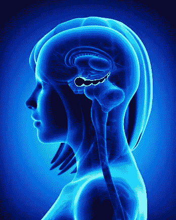

# 睡觉和学习

> 原文：<https://medium.datadriveninvestor.com/sleeping-and-learning-a72787c2cbcf?source=collection_archive---------2----------------------->

## 我们睡觉时是如何学习的

> “只有在把人看作是他的无意识，由他的梦揭示，把他呈现给我们之后，我们才能完全理解他。因为就像弗洛伊德对普特南说的那样:“我们之所以成为我们，是因为我们曾经是我们。”"
> 
> ——西格蒙德·弗洛伊德

众所周知，记忆的形成和学习与睡眠有关。一个休息好的大脑更有能力学习概念，人脑对昨天的记忆不如对今天的记忆那样详细。在这篇文章中，我详细描述了大脑在睡眠中是如何学习的，描述了海马重放、视觉皮层重放和杏仁核重放。它们都是大脑用来将短期记忆转化为长期记忆的机制，也就是对全天存储的知识进行编码。我解释了用于记忆回忆的相同回路如何也用于想象，也就是说，从新皮层解码信息的回路。它表明大脑不会记录每一个时刻，而是在夜间花时间学习。

## **互补学习系统理论**

1995 年，补充学习系统理论被引入，这个想法源于大卫·马尔早期的想法。根据这个理论，学习需要两个互补的系统。第一个是在海马体中发现的，允许快速学习个别项目和经验的细节。第二个位于新大脑皮层，作为逐渐获得关于环境的结构化知识的基础。

新大脑皮层逐渐获得结构化的知识，海马体很快学习细节。海马体的双侧损伤会深刻影响对新信息的记忆，但不会影响语言、一般知识和习得的认知技能，这一事实支持了这一理论。情景记忆，即与发生在特定时间和地点的过去个人经历的集合相关的记忆，被广泛认为依赖于海马体。

**海马回放**

Figure 18.1 — Hippocampus location inside the human brain

海马体负责空间记忆(我在哪里？)、陈述性记忆(知道什么)、外显记忆(回忆昨晚的晚餐)、回忆(对某个特定物品的附加信息的检索比如你妈妈手机的颜色)。Howard Eichenbaum 和 Neal J. Cohen 在 1988 年抓住了这个观点，他们建议这些海马神经元应该被称为关系细胞，而不是狭义的位置细胞。

海马体是记忆形成的重要部分。当一个人经历一个新的情况时，它的信息在海马体和皮层区域被编码和记录。最初学习后，记忆会在海马体中保留长达一周的时间。在这个阶段，海马体向新大脑皮层传授越来越多的信息。这个过程被称为海马重放。例如，在白天，一只老鼠被困在迷宫中，并学习走出迷宫的路径。那天晚上，海马体重放了海马体中被激发的相同神经元，并将空间信息编码到新皮层中。下一次鼠标在同一个迷宫中时，它会根据编码信息知道去哪里。

海马重放是在睡眠或清醒休息期间，细胞激活在活动期间发生的过程，即，在初始活动期间激活的海马中的相同细胞在睡眠期间以相同的顺序或完全相反的顺序被激活，但速度快得多。海马重放已被证明在记忆巩固中具有因果作用。

在这个理论中，海马体负责暂时存储记忆，突触快速变化，而新皮质突触随时间变化。动物海马体和相关结构的损伤与空间工作记忆的缺陷和识别熟悉环境的失败有关。因此，巩固可能是一个积极的过程，通过这一过程，新的记忆痕迹被选择并以可变的速率合并到现有的知识语料库中，并根据其内容取得不同的成功。

无论记忆巩固过程的具体性质和功能是什么，似乎很清楚的是，编码后在群体水平上神经活动模式的重新激活很可能有助于细胞组合的持久性，因此也有助于行为相关的记忆痕迹。

## **视觉皮层回放**

视觉皮层呈现同样的回放，并与海马同步。实验表明，临时结构化回放以一种称为帧的有组织方式发生在视觉皮层和海马体中。清醒状态下诱发的多细胞放电序列会在这两个区域的这些画面中重演。不仅如此，感觉皮层和海马体中的重放事件也是协调一致的，以反映相同的经历。

## **杏仁核回放**

惊吓清醒的老鼠会在它们下一次睡觉时重新激活它们大脑的恐惧中心或杏仁核。2017 年，纽约大学(NYU)的科学家 gy rgy buzáki 和 Gabrielle Girardeau 通过将老鼠加入迷宫，然后给它们一种不愉快但无害的体验，如吹气，证明了这一点。从那时起，老鼠害怕那个地方。“他们在气团出现之前减速，然后以超快的速度逃离。”该小组还记录了杏仁核细胞的活动，杏仁核细胞显示出与海马体相同的放电模式。当他们在精神上重访那个可怕的地点时，他们的杏仁核变得更加活跃。这些事件可能碰巧将保留的信息存储在大脑中不同的、更低级的部分，以及将信息存储在新皮层中，新皮层是大脑进化中更高级的部分。

buzáki 指出，目前还不清楚这些老鼠经历的是一场梦还是噩梦。“我们不能问他们。”他接着说，“创伤会导致噩梦，这一点已经得到了很好的证明。人们吓得不敢睡觉。”

## **记忆回忆与记忆形成**

当人们有新的经历时，他们形成的记忆会存储在大脑中海马体和其他大脑结构的不同部分。大脑的不同区域储存着记忆的不同部分，比如记忆发生的地点以及与之相关的情绪。

长期以来，研究大脑的神经科学家认为，当我们回忆记忆时，我们的大脑会激活与记忆最初形成时相同的海马回路。但麻省理工学院神经科学家在 2017 年进行的一项研究表明，回忆记忆需要一个迂回回路，称为下丘，从原始记忆回路中分支出来。

“这项研究解决了大脑研究中最基本的问题之一——即情景记忆是如何形成和检索的——并为一个意想不到的答案提供了证据:检索和形成的微分回路，”Picower 生物学和神经科学教授 Susumu Tonnage 说。

这项研究还对阿尔茨海默氏症和下托神经回路有潜在的见解。虽然研究人员没有专门研究这种疾病，但他们发现患有早期阿尔茨海默氏症的小鼠在回忆记忆方面有困难，尽管他们会继续创造新的记忆。

2007 年，戴密斯·哈萨比斯发表的一项研究表明，海马体受损的患者无法想象自己会有新的体验。这一发现表明，想象的建构过程和情景记忆回忆之间有着明显的联系。

## **与深度学习的关系**

大脑的所有低级部分——包括海马体、视觉皮层和杏仁核——在夜间重播，以编码睡眠期间的信息。这就是为什么很容易记住你在同一天午餐吃了什么，但很难记住你昨天吃了什么。较低层次的短期记忆会一直存在，直到你的大脑将它们储存起来，并在睡眠中对所有知识进行编码。大脑皮层储存编码和压缩的相关信息。

深度神经网络也是一种编码信息的方式。例如，当深度神经网络分类图像时，神经网络将图像编码到分类的对象中，因为图像包含比仅仅标签更多的数据比特。一个苹果可以有一千种不同的样子，但它们都被称为苹果。将短期记忆转化为长期记忆是将所有信息，包括视觉、触觉和任何其他感官材料压缩成压缩数据。因此，有人可以说他们昨天吃了一个多汁的苹果，但不记得苹果看起来或尝起来的所有细节。

记忆回忆和想象是一种将信息从大脑较高部分(包括新皮层)解码到大脑较低部分(包括杏仁核、视觉皮层和海马体)的方式。回忆和想象可能只是对储存在大脑皮层的信息进行解码。