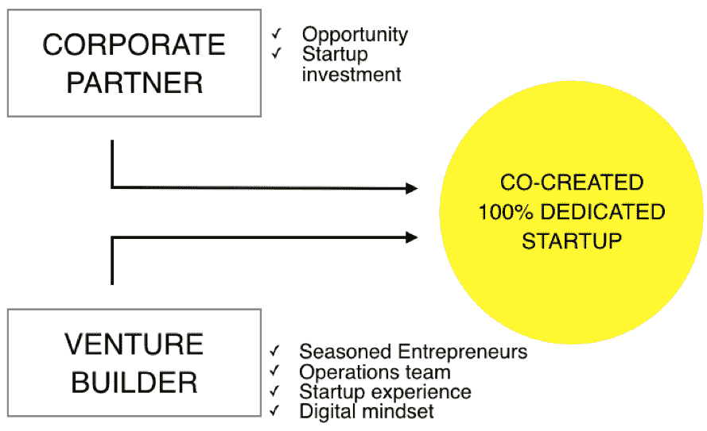
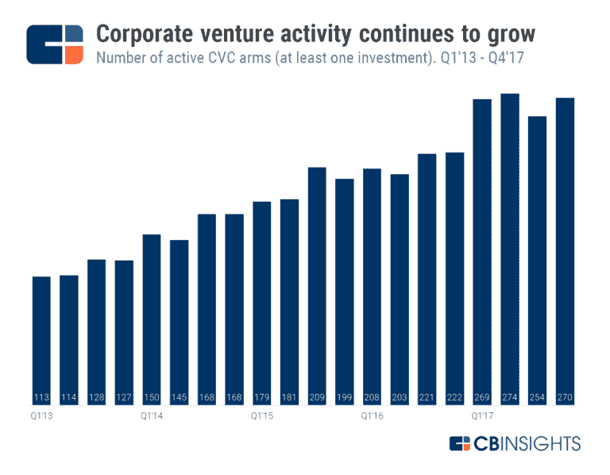
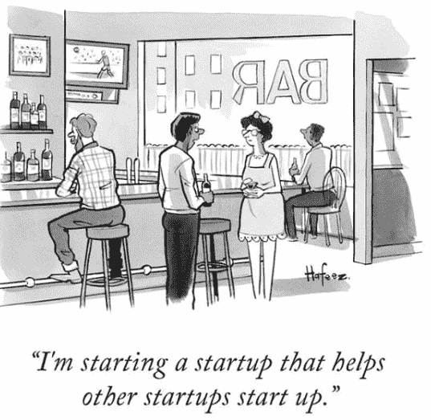

# 沉睡的巨人:企业风险建设入门

> 原文：<https://medium.datadriveninvestor.com/sleeping-giants-a-primer-on-corporate-venture-building-77494a8386e5?source=collection_archive---------5----------------------->

*本文是《大卫与歌利亚》中的第一篇。该系列旨在提供对企业风险建设新领域的见解，在这一领域，企业和初创公司是合作者，而不是竞争对手。本文的重点是简要介绍风险构建即服务模型，以及它在企业环境中是如何工作的。*

— — — — —

在柏林的一个阳光明媚的星期一，Lukas 啜饮着他办公室著名的咖啡。肯尼亚阿拉比卡咖啡，气动压制。在与一家食品配送初创公司的业务开发团队进行电话更新之前，他对 B2B 市场平台的提案进行了调整。然后，Lukas 在电话中与他在伦敦的合作伙伴一起头脑风暴物联网创业公司的商业模式，然后准备向一家大型金融服务公司推销，共同创建一家金融科技贷款公司。这是一大堆要处理的事情，这就是风险企业家的生活。

Tech disruption (Artist’s rendition)

《圣经》中讲述的失败者大卫在一场艰难的战斗中击败强大的歌利亚的故事，已经成为初创企业破坏其行业和现有企业的童话原型。技术的指数变化通常会扰乱公司保持竞争优势的稳定性。尽管公司拥有资源和现有的市场优势，但它们往往缺乏创新，因为它们旨在优化现有的流程，而且比一家精简、平庸的初创企业(可能是在车库里自举和工作)行动更慢。创新的过程通常被认为是初创企业和作为对手的 T2 之间争夺市场份额的持久战斗。

我曾在一家为大型企业服务的新型风险企业[海伍德&之子](https://www.heywoodandsons.co/)工作过，我想提出一个不同的观点——初创企业和企业并不是截然相反的两个极端。在企业和初创企业之间的共生关系中，合作模式的空间越来越大，比如企业风投和企业风险投资。

# CVB 如何工作# 1——风险投资到底是什么？

i) *Venture Builder:一家公司通过集中其资源和网络在内部创建初创企业。他们的角色主要包括企业本身的发展和运营，以及协助招聘和提供资本。*

这与风险投资公司略有不同，风险投资公司投资于现有初创企业并为其提供资金，但不参与日常运营(如果你愿意，也可以称之为“建设”过程)。有许多方式可以建立这种关系，从建立自己的创业公司的内部风险投资(如火箭互联网)，到与大公司共同创建创业公司的企业风险投资。

(一篇关于更广泛的风险投资以及它与加速器和孵化器等其他创业模式有何不同的精彩文章可以在这里找到。)

ii)*( CVB)企业风险建设者:风险建设者的一个子集，公司与企业合作，共同创建一个初创企业，以解决企业感兴趣的特定领域。*

这些可以在内部完成，如 BCG Ventures，它从几个独立的最低可行产品的孵化过程开始。或者，这些可以在外部建立，公司提供资本以换取股权和战略发言权，而风险建设者提供执行力，团队以换取股权(被称为“汗水股权”)。我所在的风险建设者 Heywood & Sons 就是后者。

术语*企业风险建设*，又名企业风险投资或风险建设即服务，已成为一个总括术语，用于描述不同资本和所有权结构的各种模式。然而，这些都有一个共同的主题——企业、企业创业家和创业团队之间的激励机制一致。通常情况下，公司会坐在战略董事会上，决定创业公司的高层事务，但创业公司被给予足够的空间来保持敏捷。

这对于公司来说是非常有利的，可以决定创业公司前进的方向，使其符合公司的长期利益。初创公司也有更多的喘息空间来进行日常运营，并专注于交付产品。

# CVB 是如何运作的#2:为你的公司资本带来更多收益

尽管有人认为企业创新缓慢且过时，但大企业之所以大是有原因的，正如 Aleph 的 Alex Barrera 恰当地指出的那样，它们是“卫冕冠军”。就像你当地健身房里的巨大健身房老鼠一样，企业有肌肉可以弯曲，正如内部企业风险投资机构完成的投资交易的增长所示。根据 [CB Insights](https://www.cbinsights.com/research/corporate-venture-capital-active-2014/) 的数据，2017 年，全球有 186 家新的企业风投部门进行了首笔投资。

显然，这不是缺乏创新资本或良好意愿，而是创新失败了。Inc.Digital 的 Michael Gale 报告称 [84%的企业认为他们的数字化转型努力已经失败或者没有达到预期](https://www.forbes.com/sites/brucerogers/2018/01/16/innovation-leaders-inc-digitals-michael-gale-on-digital-transformation/#4ba6561e7693)。以下是三个可能的原因:

I)缺乏执行的专业知识:

企业很清楚应该关注哪些新市场，比如千禧一代或中小企业，就像顾问多年来一直告诉他们的那样！相反，我认为企业非常擅长做企业，但[缺乏建立更小、更灵活的企业的专业知识。](https://www.cbinsights.com/research/corporate-innovation-product-fails/)

就像创业一样，企业创新是一个迭代的过程，企业应该削减沉没成本和任何不起作用的东西。通常，与公司合作过密会扼杀创业。尽管并非所有公司都是如此，但一个好的对比是[沃尔玛让其网上商店蚕食自己的实体店销售](https://www.chicagotribune.com/business/ct-walmart-amazon-online-shopping-20161007-story.html)。

然而，CVB 可以帮助企业按照公司的战略方向发展壮大，而不会像公司一样被官僚主义所束缚。

ii)不合格产品:

通常，这些数字化的尝试会产生表面层面的创新，比如简单地创建现有网络应用的移动版本。这在传统银行中已经出现，这可能是我们看到消费者偏好转向自由职业银行的原因，如 [Revolut、N26 和 Monzo](http://%20https//www.fxcintel.com/research/analysis/beware-of-the-challenger-banks) ，它们为用户提供更高价值的产品(如透明的低费用和始终可用的数字服务)。

那么，你的产品真的是从零到一并给你的用户带来 5-10 倍的利益吗？一个很好的例子是腾讯从零开始发展微信，而不仅仅是其前身 QQ 的移动版本。通常，这个实验是一个迭代的过程。

iii)风险规避:

随着公司变得越来越大，它们变得越来越不灵活，越来越厌恶风险，并寻求最小化风险。对大品牌来说，比财务风险更糟糕的是声誉风险。

通过 CVB，企业可以最大限度地减少对负面黑天鹅的风险敞口(降低它们面对这种风险的脆弱性)，同时增加对正面黑天鹅的风险敞口(比如一家独角兽初创企业)。

(赞美塔勒布，我最喜欢的作家之一，因为他有这个奇妙的心理模型。)

这使得企业能够专注于新的市场和蓝海(或者用顾问行话来说:“地平线 3 创新”)，同时保持他们主要规避风险的立场，塔勒布(再次)称之为[杠铃战略](http://%20https//www.nuggetsofthought.com/2018/04/02/nassim-taleb-senecas-barbell%E2%80%A8)。

因此，企业风险建设已经成为企业创建企业的一种选择，这种企业可以迅速创新并抓住出现的机会，而不会像企业本身那样受到束缚。企业风险建设模式还允许大公司测试商业模式，并从公司外部失败，这保障了品牌形象不受玷污。

# CVB 的工作方式#3:共同创建内部创业公司

虽然这一过程因 CVB 而异，但标准程序是风险团队和公司之间的直接战略联盟(全部由 CVB 调解)。这可能比 M&A 更节省成本和时间，因为合资企业是为了适应公司未来更大的计划而建立的。[初创公司收购通常会失败](https://www.forbes.com/sites/steveblank/2014/04/22/corporate-acquisitions-of-startups-why-do-they-fail/)，因为团队迷失在企业流程中，失去了最初成功所需的敏捷性。

通常情况下，CVB 首先从其庞大的网络中寻找合适的候选人担任首席执行官，并与首席执行官一起招聘团队的其他成员(如营销、产品和运营)。尽管大部分股权由公司和 CVB 分享，但对于相关的创业团队来说，这也是一笔非常好的交易，上市时间非常快，薪水稳定。

某些功能，如行政和法律任务，由 CVB 处理，类似于安德森·霍洛维茨等一些风险投资公司的做法，即承担企业家的责任，让他们做他们最擅长的事情——制造和销售产品本身。

*Illustration Credits: Kaamran Hafeez, The New Yorker*

当 CVB 的投资组合中有多个合资企业时，它也会受益于信息优势。监管投资组合的创业家采纳了不同商业模式和行业的理念和技能，这可能会带来意想不到的解决方案。

通常，在 6-9 个月内，CVB 创建并验证商业模式，产生用户群、现金流和现成的规模化业务。

企业风险投资仍然是一个全新的领域，但凭借大公司的资金规模，它可能会释放沉睡的企业资本巨头的潜力。绝对值得一看的地方。

— —

接下来是对一家成功企业的首席执行官的采访[快速通道](http://fasttrackit.co/)从企业风险建设者过程中脱颖而出，[丹尼尔·罗维拉](https://www.linkedin.com/in/daniel-rovira-505487/)，连续创业者，前高盛投资银行和私募股权。

*Heywood & Sons 是一家全球公司建造商，专门与财富 500 强公司一起作为共同投资者建造新的绿地业务。了解更多关于他们正在做的* [*酷事*](https://www.heywoodandsons.co/) *的信息。*