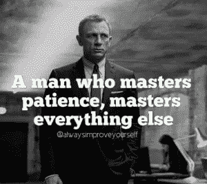

# 小额学习投资

> 原文：<https://medium.datadriveninvestor.com/small-amounts-to-learn-investing-212f9930d67c?source=collection_archive---------4----------------------->

订阅-[iTunes](https://itunes.apple.com/us/podcast/bit-better-have-my-money/id1374764732)[Stitcher](http://stitcher.com/s?fid=183129&refid=stpr)[Google Play](https://playmusic.app.goo.gl/?ibi=com.google.PlayMusic&isi=691797987&ius=googleplaymusic&apn=com.google.android.music&link=https://play.google.com/music/m/Ikoddu7nd3g5ijjnhnedvdpgzo4?t%3DBit_Better_Have_My_Money!%26pcampaignid%3DMKT-na-all-co-pr-mu-pod-16)

这是我需要努力的地方。我知道并告诉人们要有耐心，但却很难做到。我知道我应该等待买入 Achain，但无论如何。

随着市场的波动，如果你只是等待，很多时候你会得到你想要的买入或卖出价格。价格必须合理，不能太离谱。

这是从少量开始是一件好事的另一个原因。我投资的金额是 100 美元。所以没什么疯狂的。它允许我犯错和学习，但不会因为失败而受到严重伤害。

到目前为止，我在这笔交易中只跌了 10%，这还不错。只需要耐心等待价格。如果我一开始就有耐心的话，我本可以买到更便宜的东西。

嗯，不完全是突发新闻，但一些积极的消息。**纳斯达克表示，他们愿意成为加密货币交易所。**

这显然是个好消息。不过，这也说得通。这些人不傻，看到能赚多少钱。他们想要他们的那份。

在考虑之前，他们希望有更多的监管。这也有道理。某种形式的监管即将到来，而且可能是必要的。希望无论发生什么，都不会阻碍创新或盈利。

现在为了你的观赏乐趣…..

