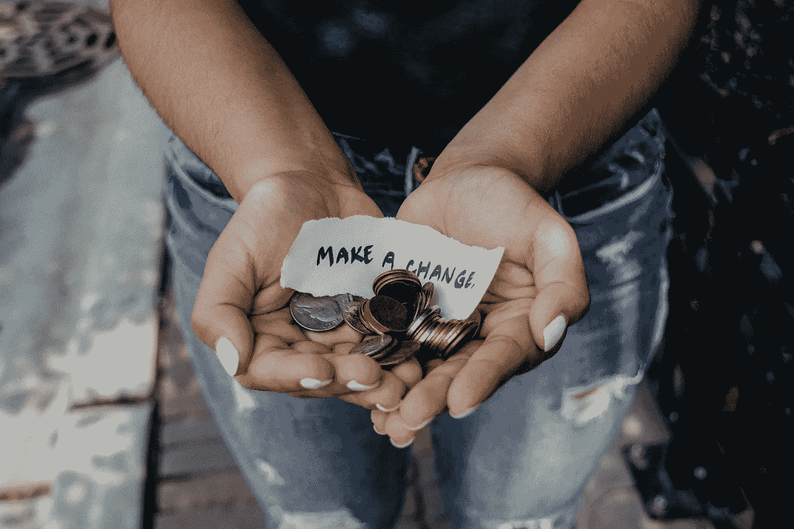

# 微小的变化会产生巨大的影响

> 原文：<https://medium.datadriveninvestor.com/small-changes-can-have-huge-impacts-64554cea557?source=collection_archive---------6----------------------->

与 BJ·福格一起播下积极习惯的种子(二手灵感项目)

Photo by [Kat Yukawa](https://unsplash.com/@katyukawa?utm_source=unsplash&utm_medium=referral&utm_content=creditCopyText) on [Unsplash](https://unsplash.com/search/photos/change?utm_source=unsplash&utm_medium=referral&utm_content=creditCopyText)

二手灵感项目从一句激励性的引语开始，在创造性道路蜿蜒的任何地方冒险。

> “如果你选择了正确的小行为，并对其进行排序，那么你就不必激励自己让它成长。它会自然发生，就像一颗好种子种在一个好地方一样。”―BJ·福格

每隔几个月，对自己进行一次“生活审计”是有益的。我们可以评估哪些有效，哪些无效，然后按下重置按钮。

 [## 成功的生活数据驱动型投资者的 25 种自我提升方法

### “我活得越久，学到的就越多。学的越多，体会的越多，知道的越少。”―米切尔·莱格兰德时间到…

www.datadriveninvestor.com](https://www.datadriveninvestor.com/2019/03/12/25-self-improvement-ways-for-a-successful-life/) 

我从生活审计中发现，随着时间的推移，整合小习惯会产生巨大的影响。人们通常认为，要取得重大突破，我们必须对生活方式进行大规模的改变。但是加入突然的、宏观的改变可能很难实现。

积极的习惯把我们带到成功的门口，就像错误的习惯让我们停滞不前，感到沮丧。我们应该通过培养有益的行为来掌控自己的命运，这些行为将帮助我们茁壮成长。

无论我们多么渴望某样东西，只有我们不断重复的行动才能塑造我们的未来。坚持不懈地做一个小小的改变会产生巨大的效果。

这里有三个微妙的习惯性变化，可以在我们的生活中引发积极的结果。

1.**自愿做一些事情，有时甚至是我们不愿做的任务。**如果我们举起手去做志愿者，我们几乎总是会被要求做得更多。那很好。多做是一个学习、留下印象、获得技能和建立关系的机会。成就基于行动。我们承担的越多，我们就越有机会行动。成功的人会站出来利用机会。极其成功的人向他们冲刺。

例如，在会议上自愿做笔记是一项平凡的任务。但是，如果我们变得善于记笔记，我们可能会被邀请参加通常不会参加的高层会议。基于会议记录的质量，我们可能会在那些积极进取、注重细节的员工中建立起良好的声誉。或者，仅仅是坐在桌子旁边，我们可能会顺便嘀咕一些可能最终成为一个成功想法的事情。但是如果我们不自愿的话，我们永远也不会幸运地得到那个职位。

2.**不要让时间控制我们——我们需要控制我们的时间。**截止日期和时间表建立了约束，但并不总是以积极的方式。一个有三周时间完成一项任务的人会下意识地调整他们的努力，所以需要整整三周。

我们需要防止截止日期管理我们的活动。任务应该只花他们需要的时间。尽可能快速有效地做每一件事，然后利用任何“剩余”时间快速有效地完成其他事情。

人们经常让时间把自己的意志强加给他们。但是，当我们开始将自己的意志强加于时间时，我们的生活将会改变。

3.以诚实和及时的方式回应他人。避免拖延，千万不要用沉默作为沟通的方法。

如果有人发短信，我们应该一有回应就回复。如果我们必须让某人失望，诚实地告诉他们，这样他们才能适应。如果有一个日期我们不能确定，一个期限我们不能完成，或者一个协议我们不再希望遵守——说出来。

如果我们回应，人们可能会接受我们，也可能仍然信任我们。但是如果我们不像独立个体一样坚持到底，我们就会失去所有的信任。

这些都是微小的改进，但是细微的改进可以带来巨大的机会。人们很容易认为，只有通过实施大规模的变革，才能取得巨大的进步。但这是关于做一些轻微的习惯性改变，并且非常有意识地执行它们，直到它们坚持下来。这就是巨大转变发生的时候。

不久前，我的写作生涯没有方向，不受我控制。我不能充分利用我的潜力或加强控制来可靠地控制我的创作过程。

去年，我开始设定每日字数配额，并完成它们。不久之后，我也建立了每周向杂志和文学期刊投稿的目标。它改变了我灵感的速度，我开始看到写作的新曙光。

这并不容易，我确实遇到过几次困难，但我坚持了下来。这需要时间和坚持，但这些习惯导致了突破(最终)得到[我的第一本诗集出版](https://www.amazon.com/Everything-Wrong-Feels-Adrian-Potter/dp/109519061X/ref=sr_1_4?qid=1560264651&refinements=p_27%3AAdrian+S.+Potter&s=books&sr=1-4&text=Adrian+S.+Potter&fbclid=IwAR0odVV6aBMsM1IZcN9mucBDcJ9hL_YLDJxgrUqTjTTnLMhSKE2jXJN6Agg)。但是这个旅程不是一夜之间发生的。微小变化的累积努力最终导致了巨大的轰动。

永远不要低估微小调整的力量。当我们渴望飞跃时，我们应该从小步开始。