# 小数据和深度学习(AI)——一个数据简化框架

> 原文：<https://medium.datadriveninvestor.com/small-data-deep-learning-ai-a-data-reduction-framework-9772c7273992?source=collection_archive---------0----------------------->

与普通的产品/解决方案不同，人工智能产品包含三个部分……产品、数据和算法/架构。当一个人考虑人工智能领域的产品策略时，除了产品策略原则之外，他还需要考虑算法和数据策略。从历史上看，关于产品战略的管理理论已经足够多了，而关于其他两个方面的理论却很少。在本文中，我们将关注其中的一个。

深度神经网络算法的研究也很多。开源中提供了多种算法和架构。但在大多数情况下，收集数据比开发和应用算法来运行数据要困难和昂贵得多。

像谷歌、亚马逊和微软(LinkedIn)这样的公司在各种情况下都有巨大的领先优势，因为它们已经拥有海量的数据。当我花时间在各种人工智能驱动的产品构建上时，我发现在思考如何用更少的数据构建人工智能产品方面存在差距。我以前的博客是关于这个主题的，很多人问我还有什么其他的方法。这里我把我学到的东西以框架的形式整理出来。该汇编是我在一个飞速发展的技术领域的学习，因此不一定全面。然而，这个框架是为推断而构建的。

如何减少对数据的需求？如下图所示，探讨了三种干预措施…

1.  尝试使用现有的任何数据访问，以增加数据点的大小(这假设用户可以访问各种已知的公开可用的数据源，从 google 搜索到 Imagenet 等数据库)
2.  以有助于生成数据的方式重新构建现有的已知架构。基本上，使用深度学习架构来生成数据
3.  以一种本质上需要较少数据的方式构建模型。在这里，对数据的需求是与产品的架构相权衡的。与相对较新的数据策略相比，这将涉及更多已知的产品开发工作

当然，在真实条件下，可以看到这三种方法的混搭。例如，人们可以在迁移学习的同时进行数据扩充。每种技术都假设了一个基线数据可用性，并以此为基础进行构建。干预措施与基础数据可用性的两个维度使得每种方法都有助于解决不同的问题，因此必须谨慎选择。

注意:方框的位置是相对的，不是绝对的

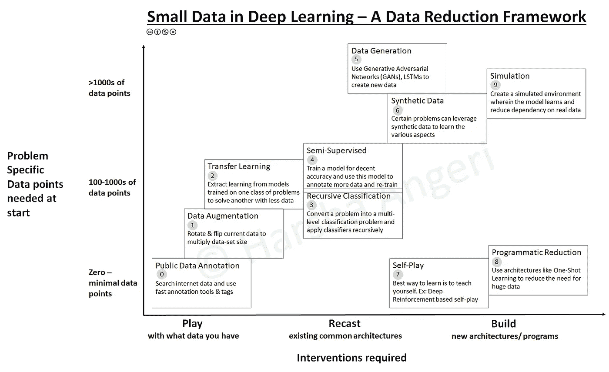

每种方法如下所示。这是一个汇编，因此不提供该方法如何工作的详细解释，但是每个部分都给出了进一步探索的指针和来源。为了便于理解，本文将图像作为数据点，但这同样适用于其他形式的数据。还举例说明了一个非图像数据示例，以表明这些方法可以跨多个数据流工作。

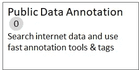

它被命名为方法“0 ”,因为这是一个基本的谷歌搜索和下载数据的方法。令人惊讶的是，没有多少公司这样做。方法是下载互联网的图像，并使用快速注释工具或已经与图像相关联的标签进行注释。互联网会给图像有水印，也有版权/各种许可证的要求。注意并尊重版权。另一种方法是实现一个服务( [GitHub](https://github.com/DeepSystems/pexels_downloader) )从大型照片库 Pexels 下载数据。然后可以使用像 Supervise.ly 这样内在使用人工智能的工具来注释这些图像。

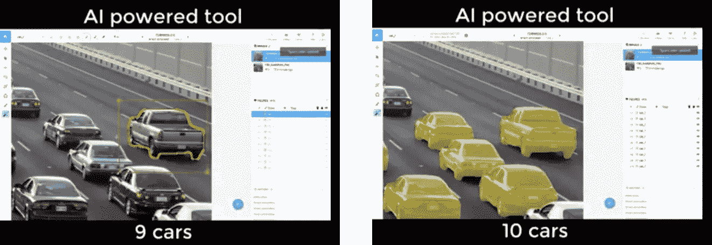

Source: Supervise.ly — AI based fast annotation

在没有直接数据的情况下，可以如下图所示组合图像。数字被添加到汽车上，用于自动车牌识别(ANPR)

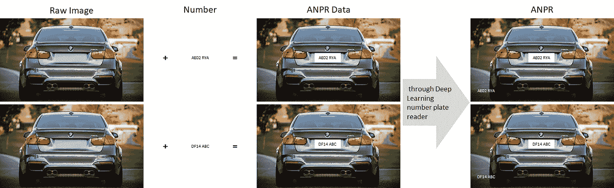

请记住，如果经过适当的训练，深度学习可以与水印一起工作，当图像被敲击时也是如此。

Face recognition when watermark exists

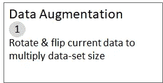

数据增强是一套技术，其中您通过一些随机转换来“增强”您的数据，以便深度学习模型永远不会看到同一张图片两次。这也有助于防止过度拟合，并帮助模型更好地概括。技术包括旋转、翻转、缩放、宽度或高度移动等应用于图像的组合。组合的数量极大地增加了可能图像的数量。下图说明了数据增强如何将单个猫图像倍增为深度学习模型可以看到的大量图像。

Source: [https://blog.keras.io/building-powerful-image-classification-models-using-very-little-data.html](https://blog.keras.io/building-powerful-image-classification-models-using-very-little-data.html)

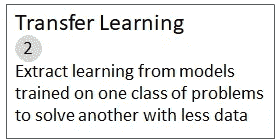

这种技术的使用已经在我之前的两篇博客中有所介绍——[深度学习让好莱坞司机失败](https://medium.com/@harshaangeri/deep-learning-fails-hollywood-drivers-2a3d6c39d6b2)和[让人工智能像人类一样学习……用更少的数据](https://medium.com/@harshaangeri/making-ai-learn-like-humans-with-less-data-5549c375c037)。

在实践中，很少有人从零开始训练整个深度学习网络(随机初始化)，因为拥有足够大小的数据集相对罕见，而拥有与现实世界图像、视频、音乐、文本等公开可用的数据集非常不同的数据集则更为罕见。相反，通常在非常大的数据集(例如，包含 1000 个类别的 120 万个图像的 ImageNet)上预先训练深度学习网络，然后使用该模型作为感兴趣的任务的初始化或固定特征提取器

这是今天构建学习模型最令人惊奇的事情，因为你不需要从头开始。就像我们人类雇用专家并向他们学习一样，人们可以从互联网上找到一个预先学习的模型，该模型已经在大约 120 万张图像(ImageNet)上进行训练，以查看真实世界的图像并建立在它的学习基础上。该模型已经知道如何检测例如边缘、曲线、面和各种物体。人们必须让它撤销一些学习(删除几层)，让它学习感兴趣的新任务，比如说“分心的司机”挑战，如说话、喝酒、向后伸手、发短信等(通过添加新层)。你突然有了一个在 GPU 上训练的~20 层深度学习模型。就是这样…它现在可以很准确地检测出分心的司机。学习你感兴趣的任务的数据集从数百万个急剧下降到数千个。

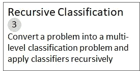

到目前为止，我们一直在研究数据集和模型的架构，比如在迁移学习中改变几个层次。如果我们需要一个不同于直接可用的标记数据，该怎么办？例如，如果一个人需要一组图像，这些图像中的人走着，有些人向你走来，有些人从你身边走开。你是怎么得到这个的？在这里，我们进入一类方法，其中我们需要玩深度学习架构，并重新塑造它们以达到我们的目标。

这种方法的关键是训练自己把一个给定的问题转化成一系列的分类问题。为了说明这个方法，我简化了这个实验，尽管可能还有其他方法。

在这里，我将上述需求转化为在公开可用的数据集(如 ImageNet)上应用多级分类器。首先使用人物分类器对 1.2M 的图像进行分类，以得到一个包含人物的图像数据集。现在应用一个人脸分类器来检测这个子集中的人脸。请记住，如果一个人正在离开，人脸检测器将不会检测到人脸。创建图像子集，其中检测到的人脸数量少于检测到的人的数量。这并不意味着有人站着，但却面对着另一个方向。下图说明了这一点。通过在同一组图像上递归地应用不同类型的分类器，您有了一个新的数据集。

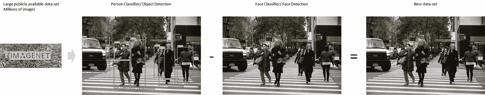

Recursive Classification (Picture source — [https://www.nytimes.com/2017/11/24/nyregion/pedestrians-new-york-walk-signals.html](https://www.nytimes.com/2017/11/24/nyregion/pedestrians-new-york-walk-signals.html))

当然，您现在可以应用姿势分类器来确定人们是否在行走。你可以应用一个交通灯分类器和一个车辆分类器来创建一个行人过街图像的数据集，比如说一个行人步行道。通过递归分类生成新标记数据的好方法。

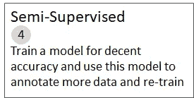

想象一下这样一种情况，你有 X 个标记的图像数据和 3X 个未标记的数据。你如何使用未标记的数据来构建你的模型？这就是半监督学习技术的用武之地。人们可以使用任何技术来构建分类器，而不是被 X 标记的数据所约束。假设分类器的准确率是 80%。现在，我们可以对未标记的数据运行这个分类器，并对它们进行分类(注释)。这些注释也称为伪标签。现在，你有 4 倍的标签数据，准确率超过 80%，可用于建立深度学习分类器。事先了解数据是如何建立和分类的，将有助于选择这种方法。它被称为半监督的，因为对于部分数据(这里是 X ),人们使用监督学习技术。

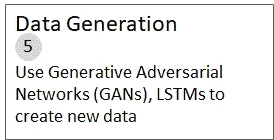

假设你需要一组绘画的数据。很难获得？不再是了。请看下面如何生成一个新的先前不存在的绘画图像。这种方法被称为艺术风格转移，并通过 Prisma 等应用程序得到推广。这背后的技术有更重要的应用，比如“生成”新数据。构建并混合理解图像内容和风格的深度学习模型。通过这种方法可以产生大量的数据。这是一个“生成模型”的例子。

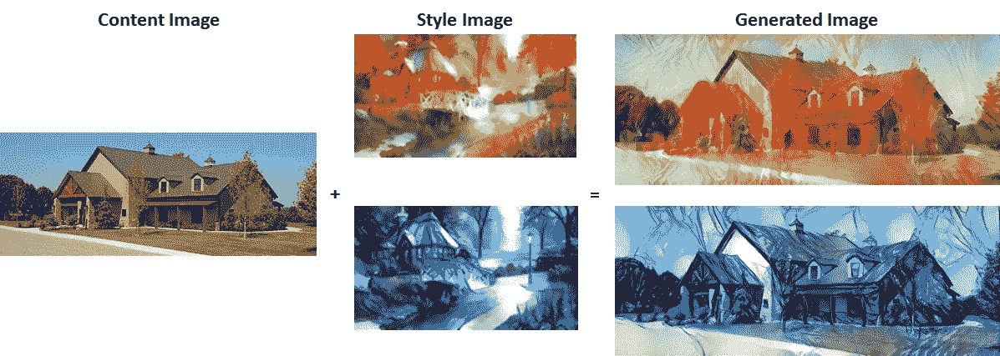

Source: Gatys et al. [https://arxiv.org/abs/1508.06576](https://arxiv.org/abs/1508.06576)

“生成模型”有多种类别。一种真正强大的现实生活数据生成方法是 GANs/生成式对抗网络。下图中显示的所有卧室图片在任何房子中都不存在。它们是使用 GANs 生成的。

Picture from Alec Radford’s original [DCGAN paper](https://arxiv.org/abs/1511.06434)

GANs 是由 Goodfellow 等人设计的一种生成模型。在 GAN 设置中，由深度学习模型表示的两个差分函数被锁定在一个游戏中。思考博弈论应用于 2 个深度学习模型。两个角色，生成器和鉴别器，在这个框架中有不同的角色。当鉴别器像法官一样工作时，生成器试图产生卧室看起来是什么样子的数据。它可以决定它的输入是来自生成器还是来自真实的训练集。这导致惊人的现实图像。

正如你现在会意识到的，人们正在以不同的方式重新铸造深度学习模型，以生成不同于最初方法的数据。

生成模型的另一种方法是 LSTMs(长短期记忆)。LSTMs 可用作生成模型。给定序列数据的大语料库，例如文本文档，LSTM 模型可以被设计成学习语料库的一般结构属性，并且当给定种子输入时，可以生成代表原始语料库的新序列。下面是一组由 LSTM 生成的手写笔记。

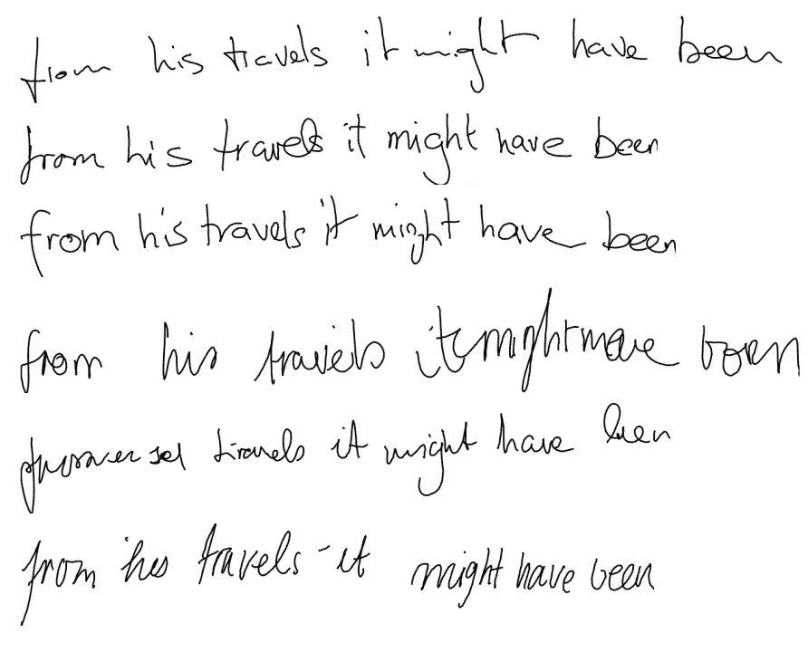

Automatic Handwriting Generation Source: [https://arxiv.org/abs/1308.0850](https://arxiv.org/abs/1308.0850)

该方法还被应用于不同的领域，其中现有序列信息的大语料库是可用的，并且新序列可以一次一步地生成，例如:

*   手写生成
*   音乐一代
*   语音生成
*   代码生成
*   维基文章、诗歌生成等

让我在这里给出一个如何生成非图像域数据的例子。例如，如果你需要语音数据。重铸将涉及…使用生成模型来生成文本，您可以使用文本到语音转换器将其转换为语音。

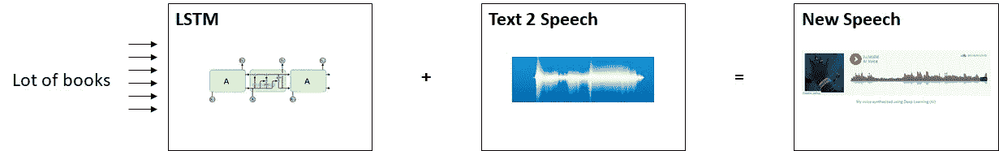

Automated speech synthesis using multiple Deep Learning Models

为了实现这一点，我找到了由深度学习模型生成的声音，其中我的输入是文本“你好。这是我用深度学习合成的声音”。

My voice synthesized using Deep Learning (AI)

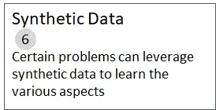

用上述方法可能很难生成所有形式的数据。这时，人们会评估合成数据生成是否有所帮助。想想你玩过的所有电脑游戏。这是合成数据的一个例子。根据深度学习系统将要学习的内容，合成数据可以极大地增强你的数据集。例如，可以使用游戏引擎来生成合成数据。可以生成重要的数据集，但这需要理解游戏引擎并编写代码来合成数据。为了说明这种方法是真实的，我在“极品飞车”游戏图片上运行了一个对象分类器，如下图所示。深度学习模型不会区分和识别汽车。

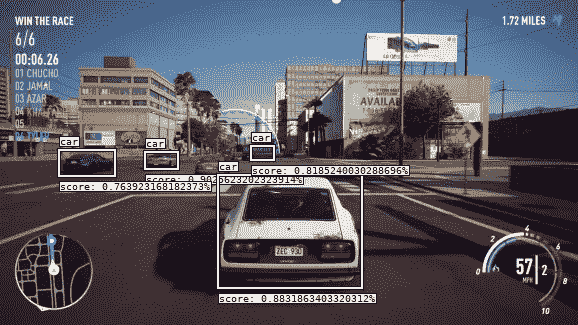

深度学习模型识别合成图像的又一个例子。

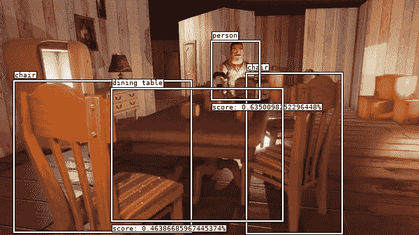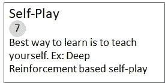

顾名思义，一个人通过与自己玩耍来学习。我们都和自己下过棋。正是如此。最好通过一个例子来说明。AlphaGo 是第一个在中国古代围棋比赛中击败世界冠军的计算机程序。

“AlphaGo Zero”是新推出的，它更加强大，可以说是历史上最强的围棋选手。AlphaGo 的早期版本最初在数以千计的人类业余和职业游戏上进行训练，以学习如何玩围棋。AlphaGo Zero 跳过这一步，简单地通过与自己对弈来学习下棋，从完全随机的打法开始。通过这样做，它很快超过了人类的游戏水平，并以 100 比 0 的比分击败了此前公布的击败冠军的 AlphaGo 版本。下面的图表显示了如何在几天内通过自我发挥的人工智能系统超越冠军的发挥。

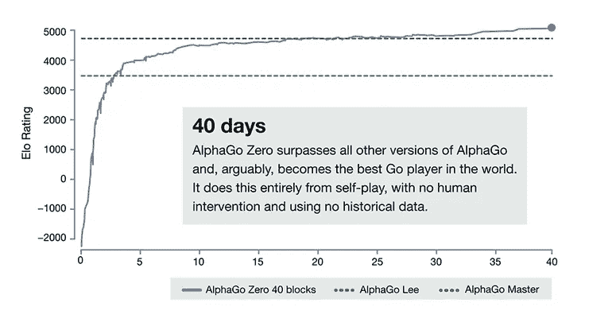

DeepMind — Source: [http://www.zdnet.com/article/deepmind-alphago-zero-learns-on-its-own-without-meatbag-intervention/](http://www.zdnet.com/article/deepmind-alphago-zero-learns-on-its-own-without-meatbag-intervention/)

它能够通过使用一种新形式的强化学习来做到这一点，在这种学习中，AlphaGo Zero 成为了自己的老师。这个系统从一个对围棋一无所知的神经网络开始。然后，它通过将这种神经网络与强大的搜索算法相结合，与自己进行博弈。随着游戏的进行，神经网络被调整和更新以预测游戏的走向和最终赢家。

更具体地说，这是 AlphaGo Zero 能够完成的事情:

1.  击败之前版本的 AlphaGo(最终比分:100–0)。
2.  学习从零开始执行这个任务，而不学习以前的人类知识(即记录的游戏)。
3.  世界冠军级别的围棋比赛只需 3 天的训练。
4.  用少一个数量级的神经网络来实现(4 个 TPU 对 48 个 TPU)。
5.  用更少的训练数据做到这一点(390 万场 vs 3000 万场)。

这在戏剧性的数据减少和作为一种建立人工智能系统的方法方面确实是破坏性的。这是一种从架构上构建人工智能系统的完全不同的方法，因此属于第三类方法。

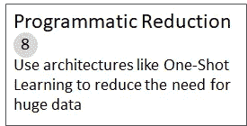

这种技术的使用已经在我以前的一篇博客中介绍过了——[用更少的数据让人工智能像人类一样学习](https://medium.com/@harshaangeri/making-ai-learn-like-humans-with-less-data-5549c375c037)。

在这种方法中，您以需要更少数据的方式来设计产品。您需要在大型数据集和构建新系统之间进行权衡。

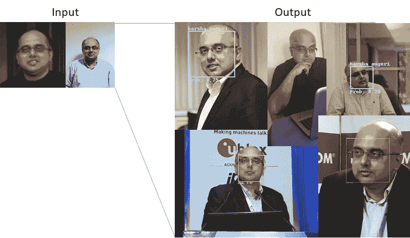

该方法是制作人脸检测深度学习模型的两个相同的孪生模型(暹罗网络/一次性学习),并提出两者之间的距离度量。可以把它想象成一个检测相似/不相似人脸的指标。一个模型建立在一个人的脸上。第二个模型被输入了随机的面孔，只有当它接近第一个模型的输出时，它才会显示绿色。在抽象层面上，这就是它所做的……深度学习模型将人的面部表示为嵌入向量，当任何面部显示给第二个模型时，它也会生成类似的嵌入向量，如果它接近第一个向量，那么它就是那个人，它就是别人。为了构建这种表示矢量的人脸，需要非常少的图像。这里有少于两个图像的人(me)识别器机器，其识别人的存在或不存在。这在多种用例场景中非常有用，如安全、门报警、计算机/移动登录、识别汽车司机等。

这是改变系统构建方式的许多编程方法之一，因此对数据的需求本来就少。

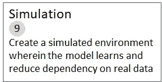

一种学习方法是通过我们在方法 7 中探索的自我游戏。另一种是通过实践。在模拟环境中练习。

就拿自动驾驶汽车来说吧。就像对于人类司机来说，学习的关键是实践。这就是模拟器的用处。Waymo 的(谷歌汽车)模拟器是一个现实的虚拟世界，他们可以在这里重现他们驾驶的每一英里真实世界。每天，多达 25，000 辆虚拟 Waymo 自动驾驶汽车在模拟中行驶高达 800 万英里，测试新技能并完善旧技能。就像运动员想象比赛场地一样，虚拟汽车设想各种场景并练习机动动作，帮助他们安全地在现实世界中导航。

通过模拟，人们可以将一次真实世界的遭遇——例如闪烁的黄色左转——转化为成千上万次练习和掌握技能的机会。在模拟世界中，这辆车的行驶里程是现实世界中累计行驶里程的 600 倍。这是数量惊人的学习数据。关键是建立仿真软件。这种方法是另一个极端，需要编写一个模拟器，但与真实世界的数据相比，它给出了学习数据的数量级。

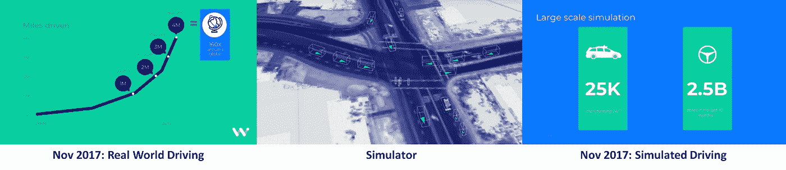

Source: Waymo (Google Self Drive Car)

总之，我们可以看到，根据手头的问题，我们可以设计各种方法来确保构建基于深度学习的人工智能系统所需的数据比相对而言假设的数据量低得多。选择正确的方法至关重要。当一个人在“数据简化框架”中向右移动时，他将需要新的架构和软件开发技能。有趣的是，我们还发现了一些旧技术的混搭，如在石油和天然气工厂中使用的模拟器、游戏中使用的合成数据、CAD 实现等，这些都有助于数据简化策略。

产品、数据和算法造就了人工智能公司。您有现成的数据战略吗？您是否构建了数据战略地图，并在产品、数据和算法战略之间进行了权衡？你的公司/产品在“数据简化框架”中处于什么位置？你如何改变位置？

如果你觉得这篇文章有用，请在下面鼓掌。请记住，你可以留下 10 次掌声，而不是一次:-)