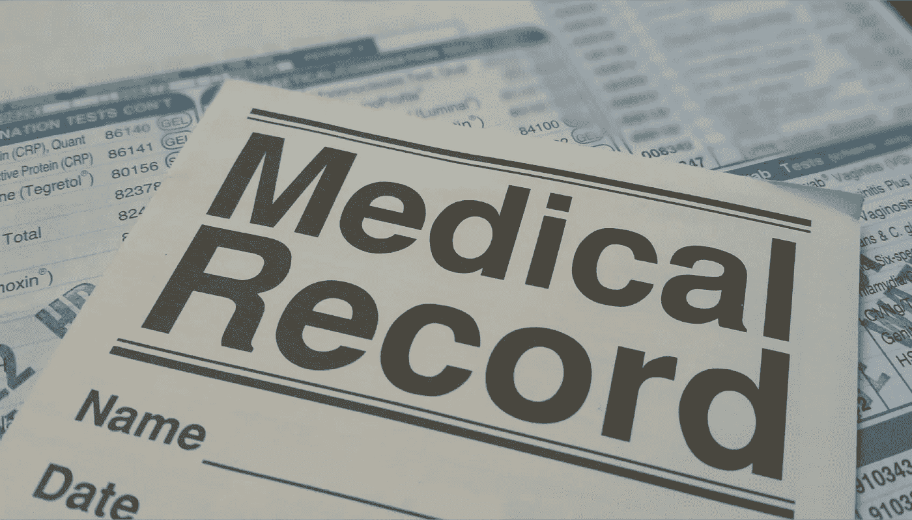

# 随着电子健康记录(EHR)变得可互操作，小型医疗实践不应被遗忘

> 原文：<https://medium.datadriveninvestor.com/small-medical-practices-should-not-be-left-behind-as-electronic-health-records-ehr-become-bd875ac4731e?source=collection_archive---------9----------------------->

**Small Medical Practices Should Not Be Left Behind as Electronic health records (EHR) Become Interoperable**

患者经常抱怨的一个问题是，当他们搬家或从一个医疗服务提供商换到另一个医疗服务提供商时，他们的新医生不容易获得他们的全部病史。这意味着患者必须接受他们已经接受过的诊断测试，回答他们已经回答过的问题，并尽可能描述他们自己的状况。

对于有新病人要治疗的医生来说，这意味着在不了解病人健康状况的情况下制定一个疗程。对于一个内科医生来说，这就像是在一个故事的中间，而不是在故事的开头。

 [## 医疗保健的未来正在被一场巨大的技术入侵所塑造——数据驱动的投资者

### 过去十年，全球经济的所有部门都经历了大规模的数字颠覆，而卫生部门现在…

www.datadriveninvestor.com](https://www.datadriveninvestor.com/2018/11/02/the-future-of-healthcare-is-being-shaped-by-a-big-tech-invasion/) 

我们现在生活在一个几乎所有病历都被数字化的时代，这使得它们易于搜索和浏览。但不幸的是，我们还没有到所有不同的电子健康记录都能很好地协同工作的时候。由于不同的医疗实践、连锁医院和诊所使用不同的软件系统，即使是数字化的记录也很难共享。

大型医疗系统正在解决这个问题，并逐渐使电子医疗记录更具互操作性和集中化。这样，管理式医疗环境中的医生将能够在更全面地了解患者病史的情况下开始他们的治疗过程。迈向互操作性意味着不断升级技术系统，这是一项既昂贵又耗时的工作。

但是独立医生既没有预算也没有员工来不断更新他们的技术。因此，尽管更大的卫生系统能够取得稳步进展，但独立医生可能会被落在后面。

独立医疗机构已经受到成本的困扰，而更大的系统更容易吸收这些成本，包括保持认证，遵守 HIPAA 法律，收取自付额和免赔额，以及实施 ICD-10。

上个月发布的一份研究报告称，电子健康记录的采用，包括解决互操作性问题，将减少医疗收入，减少小型医疗机构的病人数量。而这些做法已经感受到了资金压力。

研究中引用的专家一致认为，EHR 的实施将转移对治疗患者的关注，甚至导致提供者忽视医疗条件。专家说，将注意力从患者身上转移到 EHR 文件和实施上会对患者和提供者的关系产生负面影响。

该研究建议，独立诊所引入数据录入人员，这样医生就可以花更多的时间在病人护理上。

虽然引进更多的员工肯定有助于缓解问题，但独立医疗。

实践还需要实践管理系统，该系统不仅能跟上 EHR 文档，还能跟上一系列其他 it 问题，这些问题正在耗尽小型实践的预算。

这意味着一个由开放应用程序接口(API)组成的后端系统，以及一个可以轻松与其他提供商、政府机构和患者本身进行通信和共享信息的系统。

一个更先进的实践管理系统将为小型实践节省时间和成本，不仅仅是因为它们实现了 EHR，而且还面临着独立实践难以跟上的无数其他技术问题。

 [## 机器人医疗会把医生甩在后面吗？

### 医疗实践是一门艺术。它一直是，并将永远是艺术。作为医生，我们收集临床和…

medium.com](https://medium.com/datadriveninvestor/will-robotic-medicine-leave-physicians-behind-db808ba8ee54)