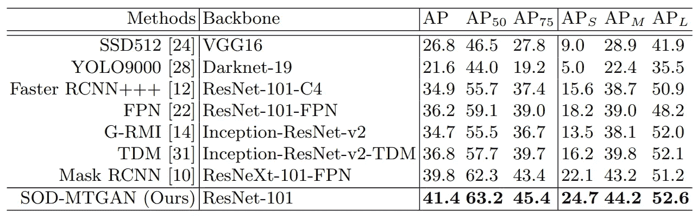
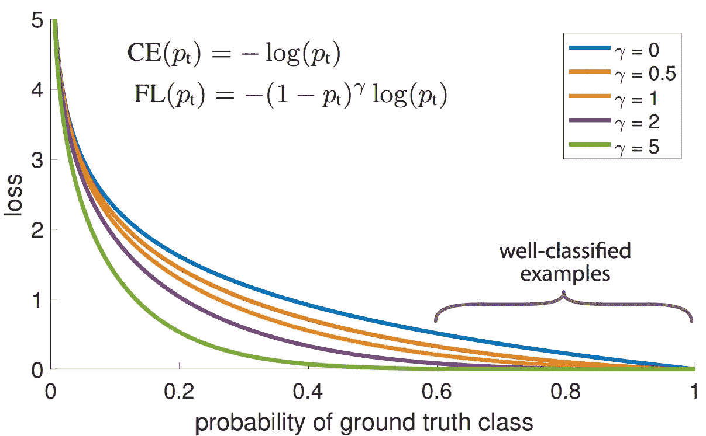
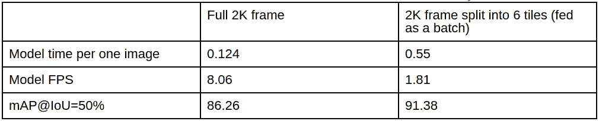
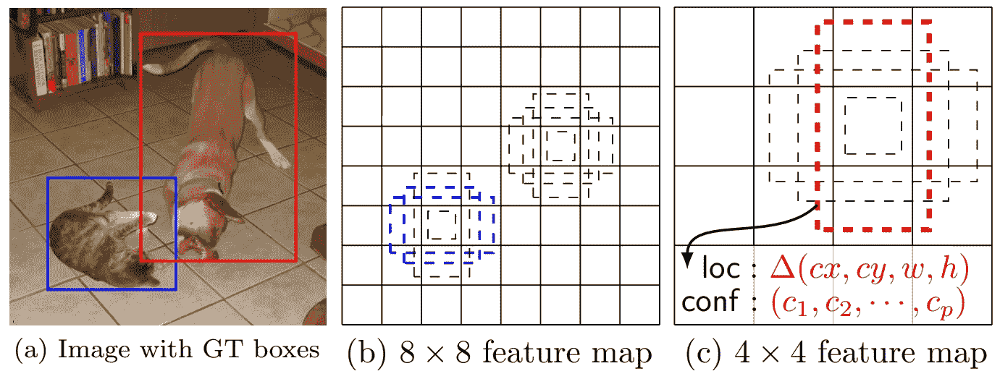
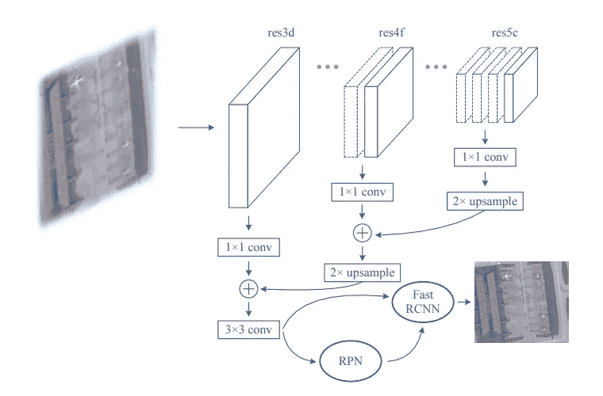
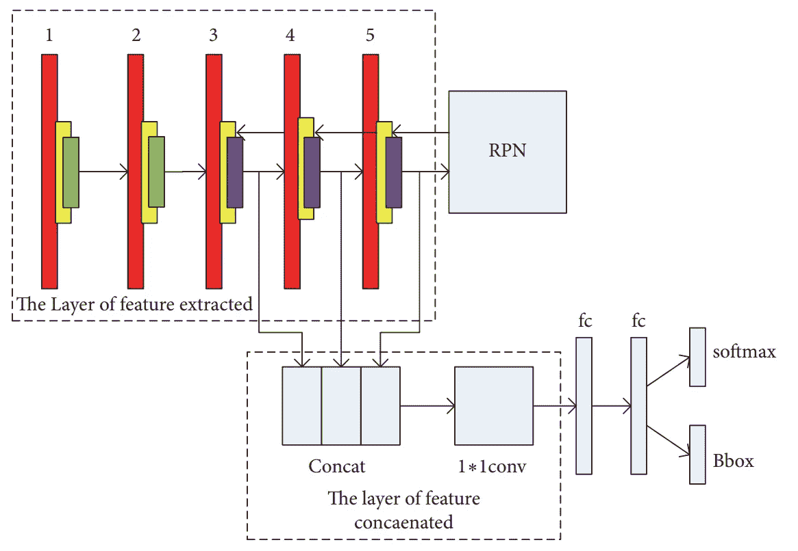

# 小物体检测问题

> 原文：<https://medium.datadriveninvestor.com/small-objects-detection-problem-c5b430996162?source=collection_archive---------0----------------------->

机器学习正在我们日常生活中越来越多的地方出现。从个人服务广告和电影推荐到自动驾驶汽车和自动送餐服务。几乎所有的现代自动化机器都能“看见”这个世界，但不像我们这样。他们必须专门检测和分类每一个物体，以便像我们人类一样看到和认识它。虽然所有现代检测模型都非常擅长检测相对较大的物体，如人、汽车和树木，但另一方面，小物体仍然会给它们带来一些麻烦。对于一个模特来说，很难看到房间另一边的电话或者 100 米外的交通灯。因此，今天我们将讨论为什么大多数流行的对象检测模型不善于检测小对象，我们如何提高它们的性能，以及解决该问题的其他已知方法。

# 理由

所有现代目标检测算法都是基于卷积神经网络的。这是一种非常强大的方法，因为它可以创建一些图像的低级抽象，如线、圆，然后将它们“迭代组合”成一些我们想要检测的对象，但这也是他们难以检测小对象的原因。

Classification CNN visualization. [Source](https://www.mathworks.com/videos/introduction-to-deep-learning-what-are-convolutional-neural-networks--1489512765771.html)

上面你可以看到一个普通图像分类神经网络的图解。我们最感兴趣的是隐藏层部分。如您所见，这个网络有许多卷积的组合，后跟一个池层。许多物体探测网络，如 YOLO，SSD-Inception 和更快的 R-CNN 也使用这些，而且相当多。将图像从大约 600×600 的分辨率降低到大约 30×30。由于这一事实，他们在第一层提取的小对象特征(开始时很少)只是在网络中间的某个地方“消失”,而从未真正进入检测和分类步骤。我们可以尝试一些方法来帮助模型更好地看到这些对象，但在提高性能之前，让我们先看看它现在处于什么位置。

# 目标检测的流行模型及其在任务中的表现

The 2016 test results conducted and gathered on the COCO dataset in the paper SOD-MTGAN. [Source](https://ivul.kaust.edu.sa/Documents/Publications/2018/SOD%20MTGAN%20Small%20Object%20Detection%20via%20Multi%20Task%20Generative%20Adversarial%20Network.pdf). The +++ denotes a special training procedure for the F-RCNN.

# 以最小的变化改进小物体检测的方法

# 使用[聚焦损失](https://arxiv.org/pdf/1708.02002.pdf)

如果您有许多要检测的类，则改进小对象和难以检测的类的检测的最简单方法之一是在训练神经网络的过程中使用焦点损失。这里的主要直觉是，这种损失对网络的“惩罚”较少，因为它已经可以很好地检测到错误分类的类，而更多的是因为它现在有问题的类。因此，为了进一步最小化损失函数，权重将开始以这样的方式改变，这将使网络更好地拾取困难的类。很容易从主要论文本身提供的图表中看出:

Focal loss visualization. [Source](https://arxiv.org/pdf/1708.02002.pdf)

## 将图像分割成图块

我们个人遇到了一个问题，模型不能检测相对较小的物体。这项任务是检测足球场上的足球运动员和球。游戏是以 2K 分辨率拍摄的，所以我们有相当多的细节。但我们用来检测玩家的模型的输入分辨率要小得多——从 300×300 到 604×604 不等。所以，当我们把图像输入网络时，很多细节都丢失了。它仍然能够发现前景中的球员，但是球和球场另一边的球员都没有被检测到。由于我们有一个大的输入图像，我们决定首先尝试我们能想到的最简单的解决方案——将图像分割成小块，并在其上运行检测算法。而且效果很好。你可以在下面看到我们的测试结果。

Player detection benchmark

虽然模型的 FPS 下降相当明显，但它给了模型在玩家检测上非常好的准确性提升。另一方面，球仍然是个问题。稍后我们将深入探讨我们是如何解决这个问题的。

# 利用图像的时间特性

如果我们有一个来自固定摄像机的视频，并且我们需要检测视频上的运动物体，例如足球，我们可以利用图像的时间特性。例如，我们可以进行背景减法，或者只使用后续帧之间的差异作为一个(或多个)输入通道。因此，我们可能有 3 个 RGB 通道以及一个或多个附加通道。这确实让我们改变了网络的输入一点，但仍然没有那么多。我们需要改变的只是第一个输入层，网络的其余部分可以保持不变，仍然可以利用整个架构的能力。

这种变化将指示网络为移动对象创建更“强大”的功能，这些功能不会在轮询和步进卷积层中消失。

## 改变检测器中的锚尺寸

当前的一些检测器使用所谓的“锚”来检测物体。这里的主要直觉是通过明确地向网络提供关于对象大小的一些信息来帮助网络检测对象，并且还检测图像中每个预定义单元的几个对象。

Anchor boxes visualization. [Source](https://arxiv.org/pdf/1512.02325.pdf).

因此，更改锚点以适应数据集是一个非常好的主意。对于 YOLOv3，甚至有一个简单的方法可以做到这一点。[在这里](https://github.com/AlexeyAB/darknet#how-to-improve-object-detection)您会发现一个列表，其中列出了改进 YOLO 架构检测的方法。

# 用于小物体检测的专门模型

上面描述的方法是好的，但是远远不是最好的，如果您使用专门为寻找小对象而设计的体系结构，您很可能会得到更好的结果。所以，让我们开始吧。

## 要素金字塔网络(FPN)

由于其有趣的结构，这些类型的网络在检测小物体方面显示出相当有效。虽然像 SSD 和 YOLOv3 这样的网络可以在不同的尺度上检测对象，并且只使用这些尺度上的信息，即所谓的金字塔特征层次，但 FPNs 建议向下传播高级特征。这用网络在其头部附近计算的语义更强的特征“丰富”了抽象的低级层，最终帮助检测器拾取小物体。这种简单而有效的方法表明，可以将对象检测数据集的总体平均精度从 47.3 提高到 56.9(原始论文中的[表 3)。](https://arxiv.org/pdf/1612.03144.pdf)

# [发现小脸](https://arxiv.org/pdf/1612.04402.pdf)

本文做了大量的工作和研究。我强烈建议你完整阅读，但我们会在这里总结一下:

*   语境很重要，用它来更好地找到小物件；
*   为不同的规模创建几个网络是昂贵的，但却是有效的；
*   如果你想要高准确度，区域建议仍然是一个好方法；
    调查你的网络骨干进行预训练的数据集，然后尝试缩放你的图像，以便你需要检测/分类的对象的大小与预训练数据集的大小相匹配。这将减少训练时间，并更快地获得更高的精度。检测大小为 20×45 的对象不一定对相同大小的内核最有效。只需将图像放大两倍，并使用 40×90 的内核，实际上可能会提高性能。对于大物体来说，情况正好相反。

# F-RCNN 修改

由于在几乎所有的网络速度/精度比较图中，F-RCNN 总是出现在右上角，人们一直在努力提高这种架构的速度和精度。我们将简要地看一下它被修改以提高其准确性的不同方式。

## [改进的快速 RCNN 用于光学遥感图像中的小目标检测](https://www.researchgate.net/publication/325268539_Small_Object_Detection_in_Optical_Remote_Sensing_Images_via_Modified_Faster_R-CNN)

在本文中，作者做了几件事。首先，他们一直在测试不同的预训练骨干网络，以用于小物体检测的 F-RCNN。发现 ResNet-50 显示出最好的结果。他们选择了最适合他们测试网络的数据集的锚大小。此外，就像之前关于寻找小脸的论文一样，使用物体周围的环境对检测有很大帮助。最后，但同样重要的是，他们采用了 FPN 方法，将高层次和低层次的特征结合起来。

Proposed FPN realization. [Source](https://www.researchgate.net/publication/325268539_Small_Object_Detection_in_Optical_Remote_Sensing_Images_via_Modified_Faster_R-CNN)

然而，建筑并不是他们唯一改变和创新的东西。训练程序也得到了改进，并对最终的表现产生了相当大的影响。第一个变化是为训练平衡数据集的特定方式。他们不是让它保持原样，然后调整损失函数来进行平等的类学习，而是通过多次处理一些图像来平衡数据集。这使得每个时期具有更均匀的类别分布。他们改变的第二件事是增加了随机旋转。因此，他们不是将图像旋转 90 度或 180 度，而是随机旋转一个角度，例如 13.53 度。这需要重新计算边界框，你可以在原始论文中看到公式。

# [具有多尺度特征的小目标检测](https://www.hindawi.com/journals/ijdmb/2018/4546896/)

这篇论文的作者也使用更快的 RCNN 作为主网络。他们所做的修改类似于 FPN 所做的相同的想法——将较高层次的特征与较低层次的特征结合起来。但是，他们不是迭代地合并层，而是将它们连接起来，并对结果进行 1×1 卷积。这在作者提供的架构可视化中表现得最为明显。

Model structure. Convolution — red, ReLU — yellow, pooling- green, RoI pooling — purple. [Source](https://www.hindawi.com/journals/ijdmb/2018/4546896/)

在结果表中，他们表明，与普通的 fast-RCNN 相比，这种方法使 mAP 增加了 0.1。

SOD-MTGAN:基于多任务生成对抗网络的小目标检测

起初，在读完这种方法的名字后，你可能会想:“等等，用 GANs 进行物体探测？什么？”。但是你等着瞧，这种方法的作者已经做了一件非常聪明的事情。你以前可能会想到:“如果物体很小，为什么我们不把它们放大？”。使用插值简单地放大图像的问题在于，我们只会得到 10×10(或 20×20，或任何你设置的倍增因子)甚至更模糊的像素，而不是 5×5 的模糊像素。在某些情况下，这可能会有所帮助，但通常情况下，这只会带来相对较小的性能提升，代价是处理更大的图像和更长的训练时间。但是，如果我们有办法在保留细节层次的同时真正放大图像呢？就像他们在《T2》、《老何》和《T3》中一直做的那样。这就是甘一家发挥作用的地方。正如你可能知道的，它们已经被证明可以很好地放大图像。所谓的超分辨率网络(SRN)可以可靠地将图像放大 4 倍，如果你有时间训练它们并收集数据集，甚至更多。

但作者也不仅仅是简单地使用 SRN 来放大图像，他们训练 SRN 的目的是创建图像，使与生成器一起训练的最终检测器更容易找到小物体。因此，这里的 SRN 不仅用于使模糊图像看起来更好更清晰，还用于为小对象创建描述性特征。正如您在图 2 中看到的，它工作得非常好，并在准确性方面提供了显著的提升。

# 摘要

我们今天学到了什么:

*   小物体检测仍然不是一个完全解决的问题；
*   背景很重要；
*   缩放图像是一个好主意；
*   组合不同层的输出；
*   调查预训练网络的数据集，以更好地评估其性能并加以利用。

*撰稿* [*伊利亚·斯特列尼科夫*](https://www.linkedin.com/in/ilya-strelnikov/) *校对* [*切列帕诺夫*](https://www.linkedin.com/in/oleksandr-cherepanov/)

*原载于 2019 年 2 月 11 日*[*www.quantumobile.com*](https://www.quantumobile.com/small-objects-detection-problem/)*。*

## 来自 DDI 的相关故事:

 [## 用 7 个步骤解释深度学习——数据驱动投资者

### 在深度学习的帮助下，自动驾驶汽车、Alexa、医学成像-小工具正在我们周围变得超级智能…

www.datadriveninvestor.com](https://www.datadriveninvestor.com/2019/01/23/deep-learning-explained-in-7-steps/)  [## 成为数据科学家所需的 8 项技能——数据驱动型投资者

### 数字吓不倒你？没有什么比一张漂亮的 excel 表更令人满意的了？你会说几种语言…

www.datadriveninvestor.com](https://www.datadriveninvestor.com/2019/02/07/8-skills-you-need-to-become-a-data-scientist/)