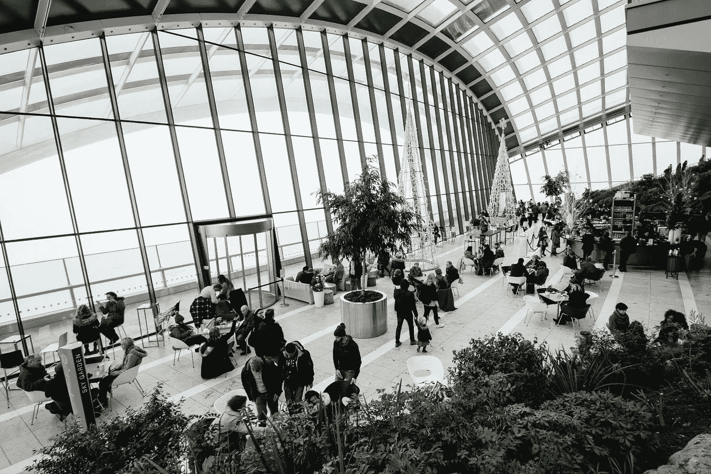

# 智能建筑:释放人员分析数据的价值

> 原文：<https://medium.datadriveninvestor.com/smart-buildings-unlocking-the-value-in-people-analytics-data-90c7b110d2c0?source=collection_archive---------1----------------------->

[Photo by Riccardo Bresciani](https://www.pexels.com/photo/adults-airport-architectural-design-architecture-301930/)

答案可能就在一个 13 年前的软件中。

比赛开始了。

谁能以最聪明的方式使用智能建筑数据？

我们可以自己奋斗，但这里有一个导师来教我们。

我们不要再浪费时间了。

# 一点背景知识

在过去的几年里，智能建筑的所有者和管理者一直在进行一场竞争激烈的探索。这一探索的最终目标是释放他们新装备的智能建筑现在产生的数据的真正价值。*每小时，每分钟，每秒钟。*

随着比赛中期的结果看起来很有希望，我们现在正在寻找这些数据的下一个层次的价值——谁将首先解决这个问题？

这一系列中型职位描述了一个乐观的尝试，以破解这一案件，或至少，采取初步摆动，以芯片小康的岩石。我通过探索从网站优化领域获取最佳实践的潜力来做到这一点，并将这些实践直接应用于智能建筑。一个梦寐以求的结果将是产生一个全新的学科:*智能建筑优化*。**但是话说回来，网站和建筑有什么联系呢？**

> 建筑的结构可以比作网站的结构，其中构成建筑的空间类似于构成网站的页面。

上面的想法可能不是全新的，但它的真正意义和潜在价值从未被探索、描述或投入使用。现在我们的建筑已经变得智能，我们可以精确地跟踪这些建筑的用户的活动。这正是 Google Analytics 等软件十多年来一直在做的事情**,但那时是针对网站的。**

那么，我们为什么不从网站优化(一个在过去 13 年已经成熟的领域)中汲取最佳实践，并将其应用于我们年轻的智能建筑人员分析领域呢？*智能建筑优化。*

第一篇文章旨在为最初的分类法(或字典)设定大纲，使我们能够将谷歌网站分析的语言和方法转化为智能建筑的人员分析:建筑是网站，空间是网页，传感器是跟踪代码，等等。

在接下来的文章中，我将使用这种分类法将最佳实践从网络转移到房地产——目的是创建最终的建筑而不是最终的网站。

准备好深入应用数据分析领域，为您的智能建筑进行转换优化，并采访网站优化大师。

不需要事先谷歌分析知识。

# 识别相似之处。
见见导师和门徒

> "如果你不知道你要去哪里，问问以前去过那里的人。"
> ——j·洛伦·诺里斯

在这一节中，我将简要介绍建筑物的用户分析(门徒)和网站的用户分析(导师)。然后，我将介绍使这两者高度兼容的三个共同特征。

## **见见被保护人。
建筑物用户分析**

智能建筑的人员分析领域在过去几年发展迅速。到目前为止，主要的使用案例主要集中在可视化和跟踪建筑物占用和用户流量上。这个门生显示出未来的巨大潜力。

可以通过各种技术来收集关于建筑物中的用户行为的数据。应用最广泛的技术是传感器、信标和 WiFi 三角测量。深入研究每种方法的利弊，以及这些方法如何转化为*智能建筑优化*，这是另一次冒险。

数据收集后，将被传输到数据库中。从这个数据库中，可以通过一个界面访问和可视化数据。这种可视化为建筑物所有者或管理者提供了关于他们的建筑物的过去、现在和未来(基于历史数据预测的)状态的信息。对于人员分析，这些见解可以包括:

大楼内的用户数量。

空间利用率。

每个用户在建筑物内的平均时间。

最受欢迎的步行路线。

诸如此类。

由于各种原因，上述用例的采用正在蓬勃发展，例如:更精简的资产管理、实现成本降低、改善用户体验和支持可持续发展工作。这种快速采用带来了大量的新数据。**然而，这些数据的大部分价值仍未得到挖掘**。我们需要一位导师来教我们如何驾驭这种价值观。

## **见见导师。
网站用户分析**

那么网站分析是做什么的呢？网站分析软件跟踪网站用户的行为，为网站所有者提供关于用户访问期间行为的非常详细的见解。这种数据收集和处理的方式与 people analytics 中的方式完全相同:用户的行为被跟踪和收集，数据被传输到数据库中，然后为网站所有者可视化。

以这种方式收集数据为网站所有者提供了各种见解，例如:

访问他们网站的用户数量。

每个用户查看每个页面的持续时间。

用户与哪些内容进行了交互。

用户使用哪个浏览器。

还有更多。

[Website Analytics](https://unsplash.com/photos/nJX74kn1yn4)

如今，拥有一个没有网站分析软件的网站几乎是不可想象的。(三年前的)估计是，3000 万到 5000 万网站 使用谷歌分析——这一估计没有考虑所有其他网站分析软件提供商。

在过去的 13 年里，网站用户分析领域发展迅速，并被证明在将用户信息转化为价值方面取得了成功。通过网站分析，网站现在对其业务目标做出了重大贡献，无论是增加收入、优化用户体验还是增加流量。

# **门生和导师的共同特质**

当仔细阅读被保护人和导师的介绍时，我们可以找出使两者高度契合的三个特征。

*   **第一个**。他们收集的*类*信息。被保护者和导师都是他们的用户的熟练数据收集者，并且关注相同类型的数据:在他们的领域(建筑或网站)中的用户数量，这些用户从哪里进来，这些用户停留多长时间，他们走什么路线，等等。
*   **第二个**。他们收集和处理数据的*方法*。被保护者和导师都是通过跟踪用户行为来收集数据，然后将其存储在数据库中，最后可视化呈现给数据的所有者。
*   **第三个**。他们可能为其业务创造巨大价值的方式。网页分析已经产生了数十亿欧元的价值。导师已经证明了它的价值，然而，被保护者在这里还有很多要学的。

在这一点上，第一个和第二个共同特征已经为我们准备好了。现在该由我们利用这两个来引出第三个了。为了帮助我们实现这一目标，我们构建了一个分类法，允许我们将网站优化的最佳实践转化为*智能建筑优化*。

# 建造桥梁——一个基本的分类法

> “我只是不喜欢那些说话含糊不清、表现得好像比我更懂语言的大个子。”小罗伯特·唐尼

在这一部分，你会发现七个基本要素，通过它们网站和建筑可以联系起来。然而，还有更多不同复杂程度的问题。在接下来的冒险中，我们将继续增加门生和导师之间共享语言的分类。

**1。我们的大楼就是他们的网站。** 最明显的一个。我们可以像看待访问我们大楼的用户一样看待访问网站的用户。每当用户进入一个网站，他们在逗留期间都会被跟踪。智能建筑人员分析的兴起使我们能够在我们的领域内做同样的事情。

**2。我们的共享空间是他们的网页。**建筑由各种空间组成。类似地，网站由各种网页组成。建筑中的每个空间都有其存在的理由——例如，为访问者提供一个入口(其功能就像网站的主页)或一个接待区(其功能就像网站的帮助页面或搜索栏)。

**3。我们的用户行为就是他们的点击。浏览一栋建筑类似于浏览一个网站。点击一个按钮，把我们带到下一个网页，就像打开一扇门，把我们带到下一个空间。点击网页上的一段内容类似于与给定空间内的对象或人进行交互。**

然而，在网页上还可以跟踪更多的动作，这在我们的共享空间中也很有价值。网站优化会告诉我们先看哪里。

**4。我们的传感器是他们的追踪代码。好了，现在我们正在深入主题，事情开始变得有趣了。您知道吗，在 Google Analytics 可以跟踪网站用户之前，网站所有者需要在每个网页上安装一小段 Javascript 代码。这非常类似于为建筑空间配备收集数据的设备，如传感器。只有在安装了这些传感器之后，我们大楼的数据库才会开始被大楼的使用数据所填充。**

**5。我们的建筑参观就是他们的会议。**谷歌分析与所谓的会话一起工作。每当用户“进入”网站时，会话就会开始。当用户离开网站，或者 30 分钟不活动时，会话结束。会话对于创建函数、报告和统计数据至关重要。

参观我们的建筑也可以被视为一个会话，允许 30 分钟的无所事事可能会有趣地应用于*智能建筑优化*。当我们大楼的用户离开大楼时，这并不一定意味着他们的实际访问已经结束。也许他或她正在外面吃午饭或去抽烟。

**6。我们的设备就是他们的饼干。**当新用户第一次“进入”网站时，网站会自动在用户的浏览器上安装一个 cookie。这使得网站能够识别出一个回头客，并结合他们不同会话的数据，从而产生新的见解。

智能建筑可以通过用户设备的唯一地址来识别回头客。然而，这种识别过程不像 cookies 那样直接，而且有严重的隐私问题(是的，GDPR)。我们肯定会在晚些时候回到这个敏感的话题。

7 .**。我们的访客之旅就是他们的用户流**。当用户进入一个网站时，Google Analytics 会自动跟踪用户选择的路线。他或她进入网站后是否直接进入帮助页面？这是有价值的信息，因为如果这种行为频繁出现，这可能意味着网站所有者希望用户采取的路线不清楚。对于一个建筑来说，这种分析同样是有价值的。用户是否经常在进入大楼时向接待处问路，而您并不希望他们这样做？很有可能你的签名被取消了。

有了基本的分类法来弥合网络和房地产之间的差距，我们几乎为下一步做好了准备:确定最佳实践并将其应用到我们的领域。

*想为扩展分类学做出贡献吗？欢迎在下面的评论中分享你的想法！*

[Suspension Bridge](https://unsplash.com/photos/vj_9l20fzj0)

# 这一切都是为了增加价值

> "不要重新发明轮子，只是重新调整它."安东尼·安吉洛

当这些有助于他们的业务目标时，网站就创造了价值:销售产品或服务，分享信息，和/或创造曝光率。

同样，当房地产有助于我们的业务目标时，它也会创造价值:吸引员工到办公室，邀请潜在买家到你的商店，或刺激可持续或社会行为。

网站优化就是从网站中获取最大的价值。*智能建筑优化*可以为房地产行业做同样的事情。它将帮助我们实现业务目标，验证我们的假设，衡量我们的绩效，跟踪我们的进展，并展示我们对业务的附加值。

# 即将到来的味道

为了让你感受到网站优化的价值如何应用于房地产，我介绍了网站优化的两个概念，并向你展示了将它们转化为房地产可能意味着什么。

**跳出率**。在网站优化中，跳出率是指“进入”网站然后立即离开网站的用户的百分比。高跳出率可能表明网站对用户的附加价值是无趣的或不清楚的。

翻译成房地产，跳出率可能意味着用户进入你的商店或你新装修的办公室，然后立即离开。一个网站优化器如何降低跳出率，我们能从中学到什么？

**转换。**我希望转换成为*智能建筑优化的核心概念*。从我对网站优化的简单探索，以及我以前开发数字产品的经验来看，都是关于转化的。网站上的转化率指的是执行你希望他们采取的行动的用户的百分比:点击你的产品，购买你的产品，阅读你的文章，或在社交媒体上分享你的内容。

对于房地产，这可以转化为进入你的商店，尝试你的产品，然后购买它的人的份额。在办公环境中，这可能是使用您新设计的工作站或会议室的用户份额。网站优化人员如何提升转化率？我们如何将此应用于房地产？

# 接下来:关于皈依的对话

在我的下一篇文章中，我将对上述理论进行第一次测试。我会通过采访网站优化专家来做到这一点。我们能把他们的最佳实践应用到我们的领域吗？他们的翻译实践会是什么样的？当应用到我们的领域时，这些实践可能增加什么价值？

在发表第一篇中型文章之前，我与一位网站(转换)优化专家分享了它的草稿版本。他回答道:

> *“哇。这很好。让我们见个面，做些这方面的工作。我已经有了一些想法。”*

我们这周要见面。

**未完待续。**

# 最后两件事…

喜欢这篇文章吗？请吧👏并分享给你的朋友。

**如果你不想错过即将到来的帖子，不要害怕** [**关注**](https://www.linkedin.com/in/daandegeus/) **我:)。**