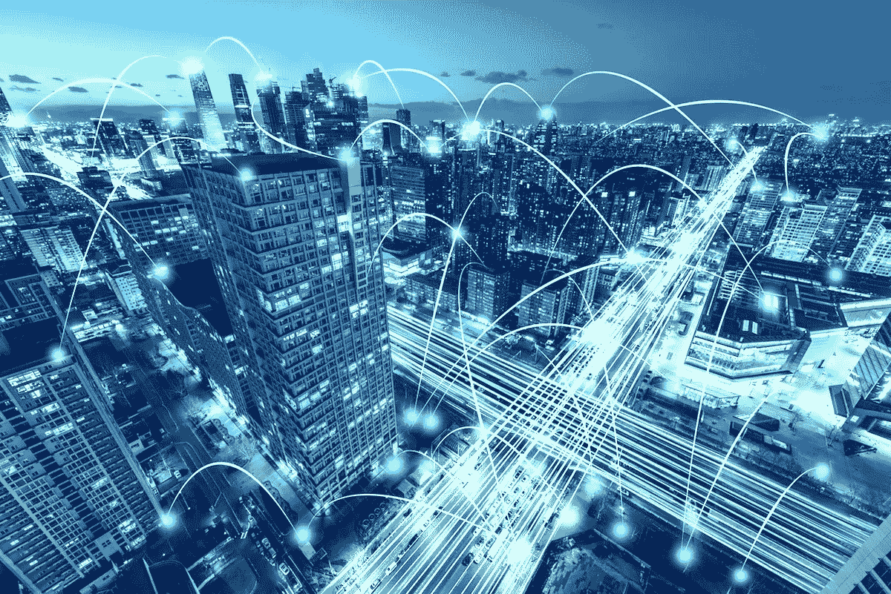

# 智能建筑:你必须考虑的用例。

> 原文：<https://medium.datadriveninvestor.com/smart-buildings-use-cases-you-must-consider-38125648f5c9?source=collection_archive---------2----------------------->

## 智能建筑为物业经理带来了全面的便利，但允许建筑物和设备通信的物联网(IoT)技术也带来了各种网络安全问题。

越来越多的商业和私人建筑在其设计和日常运营中融入了智能技术。智能建筑为物业管理人员带来了广泛的便利，但允许建筑物和设备通信的物联网(IoT)技术也带来了各种安全问题。

 [## 物联网危险预测|数据驱动的投资者

### 物联网危险预测|数据驱动的投资者

物联网危险预测|数据驱动的 Investorwww.datadriveninvestor.com](https://www.datadriveninvestor.com/2018/09/26/infographic-dangers-of-the-internet-of-things/iot-dangers-snip/) 

智能建筑依靠一个中央建筑管理系统(BMS)来协调从空气温度到安全配置文件的一切。一个全功能的 BMS 在开始营业时打开门，打开 HVAC 并管理电梯的使用，以优化建筑物内的交通流量。如果落入坏人之手，BMS 可能会被用于从骚扰到大规模犯罪活动的各种活动。

# 五大目标

无论 BMS 是位于建筑物的中央，还是位于安全的外部位置或云中，都没有关系。如果没有正确的安全管理协议，楼宇管理系统是物业经理最大的担忧，也是未经授权入侵的持续风险。去年，英特尔对 500 多名楼宇管理人员进行了一项调查，以确定哪些 BMS 组件会带来最大的网络安全风险。管理者最关心的五个系统包括:

*   安全系统
*   物联网/M2M 传感器或解决方案
*   人员/资产管理
*   能量消耗监控
*   火灾探测和报警

最终，任何这些系统都可以连接到更广泛、更包容的设备，连接到敏感数据存储、服务器，甚至员工和客户信息。作为 BMS 的一部分，并通过一系列物联网平台连接，每一个都受到恶意软件攻击、身份、数据窃取、机器人和黑客以及各种其他威胁的影响。保护员工、公司数据和客户的安全正成为物业经理的首要任务，他们过去只担心会有闯入者从前厅闯入。

# 领先一步

智能建筑最重要的新技术进步之一是开发和实施网络弹性功能。它要求物业经理与专门从事物联网的安全合作伙伴密切合作，后者可以识别建筑物智能管理平台中的差距和风险。即使是最合格的物业经理也可能不具备识别编程、连接和其他网络威胁风险的专业知识和培训。了解您的管理团队或安全顾问正在使用上周的技术的时间不是在早高峰期间电梯关闭之后。

可靠的物联网安全公司了解未来的威胁和当前的技术攻击，并认识到如何像保护堡垒一样保护 BMS。

2016 年，IBM“道德黑客”进行了一次网络攻击，以确定 BMS 风险。该团队能够通过使用三个 IP 地址访问一个 BMS。一旦他们获得了访问权限，他们发现在不同级别的安全访问中使用了同一个密码——这使得整个建筑容易受到他们的入侵。在测试结束时，IBM 指出，一项调查发现，不到三分之一的楼宇管理人员采取了措施来保护他们的楼宇管理系统。

未来五年，智能建筑投资预计将翻两番，这意味着黑客可以利用更多易受攻击的技术。在 BMS 的世界里，竞争不是在下一个街区或街对面。它可能在地球另一边的仓库里。保护财产和人员意味着找到一家物联网安全公司并与之合作，该公司具有预见威胁并在威胁到来之前阻止它的远见。