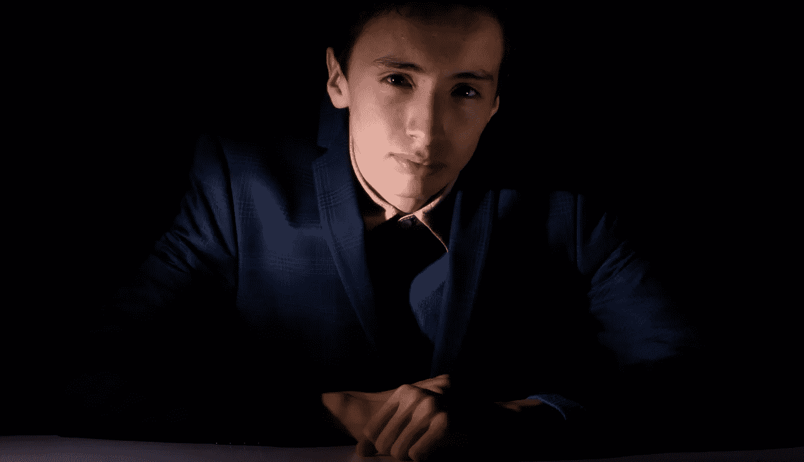
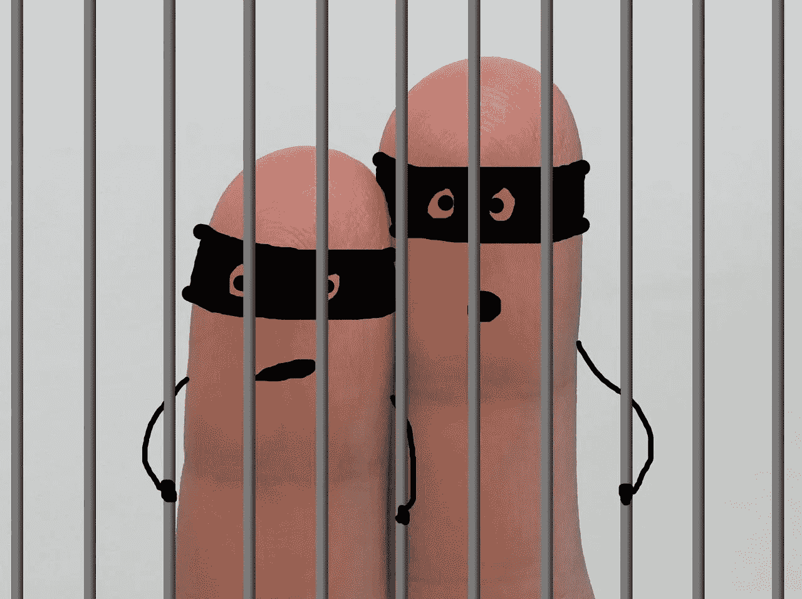
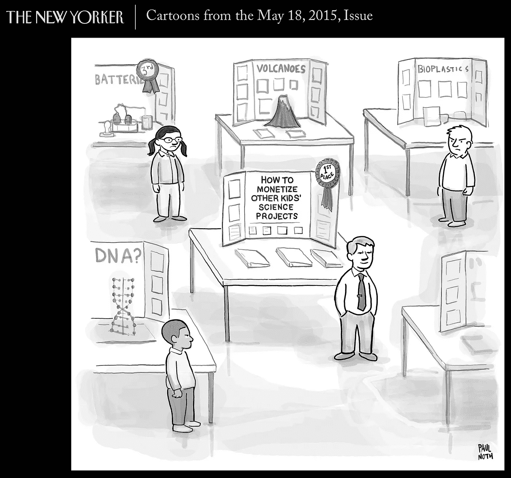
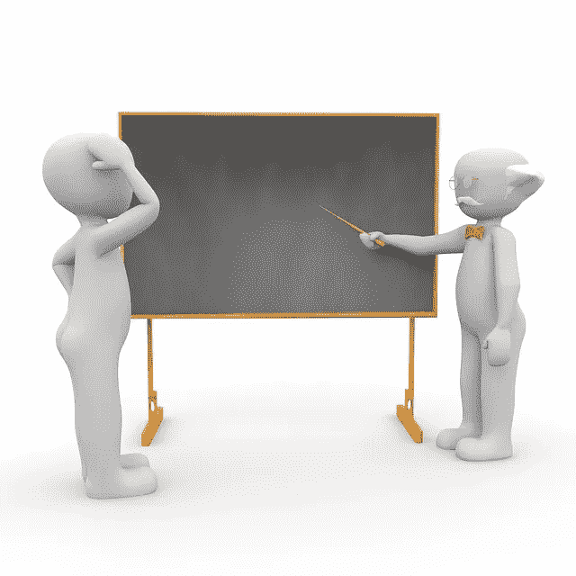

# 聪明但不富有？区分百万富翁的 12 个信念。

> 原文：<https://medium.datadriveninvestor.com/smart-but-not-rich-13-beliefs-that-set-millionaires-apart-a800c66af930?source=collection_archive---------20----------------------->

你知道你很聪明。你在学校是班上的尖子，有一份很有前途的工作。你最大限度地利用你的 401(k ),定期向高息储蓄账户存款。

但是你的梦想是在中年离开你的工作，仍然足够年轻去旅行或者开始你自己的生意。嗯，这开始感觉像一个空洞的白日梦。

你的一些邻居和同事对工作的压力要小得多(*他们*开车上下班，而*还亮着灯*)，但更接近工资独立和完全的财务自由。当你在大学里拼命工作，然后每周工作 60 多个小时争夺晋升机会时，他们现在正在挖房地产，计划为期六个月的生态度假。

等等…你做着类似的工作，怎么会发生这种事？这些人知道什么你不知道的？

也许生活是不公平的，或者也许你没有自己想象的那么聪明。

*哇哦。在我去拿纸巾的时候举行同情派对！*

# 你还不富裕的真正原因

不要自责。没有关于如何致富的大学课程；在乔叟和弦理论的学术目录中，没有一个专业被挤了进去。
美国 62%的亿万富翁不是继承或赢得彩票——他们是白手起家。*觉得他们都比你聪明？他们不是。*

几乎任何人，包括你，都可以经济独立，甚至变得富有，你不需要成为天才。然而，你确实需要拥有正确的金钱心态，你确实需要尽早采取大量富有成效的行动。

如果你太容易放弃或者无法鼓起开始的动力，这可能是因为你对金钱的内在信念与你的外在目标不一致。

## 换句话说，你在破坏自己。

# **自毁是伪装大师**

自我破坏隐藏起来；它伪装成其他感觉，所以除非你有意识地努力关闭它，否则它会毒害你多年的财务繁荣。在这些常见的主题中寻找自我破坏:

*   决策瘫痪(你会被太多的选择压垮)
*   害怕失败(如果有任何负面结果的可能性，你会抵制行动)
*   自我怀疑(你觉得自己不够聪明，不够有能力)
*   过度的愤世嫉俗(尽管有证据，你还是决定这不会起作用)
*   拖延症(你寻求安慰而不是解决棘手的问题)
*   傲慢(你认为你什么都知道，所以你拒绝帮助或指导)

听起来像你认识的人吗？也许只是一点点？

听着，你不是傻瓜。你已经知道，你的未来是根据你的选择和行动一天一天展现出来的，而*选择*来自信念。如果你的目标是积累财富并提前退休，但你没有行动或不能保持动力，试着改变你对金钱的信念。

*你知道你对金钱的信仰吗？你确定吗？*

# 对照这些让百万富翁与众不同的信念，检查一下你自己

阅读下面白手起家的百万富翁的陈述。
这些与你对金钱和财富的心态有多一致？提示:注意你的即时自动想法，因为这些几乎总是揭示核心信念。

## **1。你是(你的名字)公司的首席执行官。**

*没有人比你更投入你的职业和财务前途
(不是你的老板；不是你的 HR 部门)。*

## **2。钱创造了更多的钱和更多的机会。**

*你创建并投资的企业为他人创造机会，你的钱帮助他人实现财务目标。(如果你怀疑这种说法，想想你的园丁，你的房地产经纪人，你的房屋清洁服务，你的经纪人，你孩子的钢琴老师…)*

## **3。你的正规教育并不重要。**

史蒂夫·乔布斯、迈克尔·戴尔、比尔·盖茨和马克·扎克伯格从未完成大学学业，理查德·布兰森高中毕业后就辍学了。

## **4。你负责你的焦点和时间。**

*如果没有，你的生活将一次离开你一个小时。*

## **5。你不会用时间换取薪水而变得富有。**

与工资不同，投资组合、被动收入和业务收入没有上限。

## ***6。你购买资产，你花在负债上。***

*你的房子和车子都是负债(除非你是司机或者经营床位&早餐)。土地、投资、财产和企业都是资产。知道区别。*

## **7。你的投资优先于可自由支配的支出。**

支付账单，投资先存钱，然后决定你的自由支配支出。

## **8。几乎每个成功故事的背后都有一连串的失败。**

*白手起家的百万富翁将错误和失败视为改进的机会。养成起床、盘点、然后继续前进的习惯。*

## **9。每个百万富翁都有导师和教练。**

没有人生活在真空中。找教练或者找比你领先几步的人，然后求助。(即使是马克·扎克伯格也有导师。)

## **10。行动胜过分析麻痹，即使你有时是错的。**

不采取行动可能会感到安全，但却不会有任何结果。你已经知道了。

## **11。是的，存太多是有可能的。**

*安全的、联邦保险的储蓄账户和定期存款不会超过通货膨胀，所以你的钱一天天失去购买力。*

## 12。你的朋友和熟人很重要。

*是真的。与成功人士交往，你会不由自主地发现机会和潜在的导师。你甚至可以了解他们是如何成功的，以及他们是如何看待金钱的。*

当你对财富和繁荣的信念不支持你的目标时，打断它们。挑战他们。错误的信念在审视之下会土崩瓦解，所以问问你自己当初为什么相信它们，并寻找清晰的证据和事实。

研究百万富翁的习惯，研究成功人士如何看待金钱和财富。关于这个主题的书单很长，你永远不会缺少资料。

这里有三个老的最爱:

*   乔治·克拉森，*巴比伦最富有的人*
*   哈佛·埃克*百万富翁心中的秘密*
*   罗伯特清崎，*富爸爸，穷爸爸，*

这是一个百万富翁千禧一代的作品:

*   百万富翁浪子

# 欢迎来到一个全新的美丽世界。

想一想；美国公司的平均寿命不到 20 年，比你父母年轻时的 60 岁还低。今天，你只有依靠自己来获得经济保障。我从没说过这很容易，但我保证这将是解放。

一旦你不再用时间来换取工资，生活就会变得非常丰富！

你可以选择与家人和你爱的人共度时光。你不用担心一个年轻的、精通技术的大学毕业生会抢走你的工作，你也不用担心你的雇主会把你的工作职能外包给中国或印度。

**当你处于掌控之中，你开始追求*经历*和而不是*事情*。**

当你做你喜欢的事情时，想象你的生活，然后雇用别人来处理你讨厌的事情。想象一下，你有资源去帮助你爱的人，比如你的孩子或孙子。想象一下环游世界，参与别人梦寐以求的经历。

一旦你有了正确的心态，并采取了大量富有成效的行动，这是完全可能的，并且在你的掌握之中。