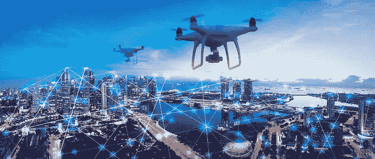

# 智能城市是未来

> 原文：<https://medium.datadriveninvestor.com/smart-cities-are-the-future-39abfcf90f03?source=collection_archive---------36----------------------->

随着安全系统、相机、冰箱和其他智能设备等互联网控制设备的兴起，物联网催生了智能家庭和办公室。现在，政府和私营部门正在投资物联网，以创建智能城市——技术增强和数据驱动的城市——这将显著改善通信和城市生活质量。

在智能城市中，组件和层通过传感器和执行器(物联网组件)连接起来，以实时获取和共享数据。这种相互联系推动了城市的数字化转型，使城市中心污染更少、更宜居、更安全、更方便。

智能城市预示着第四次工业革命的兴起，其潜在影响预计将超过智能手机、无线网络和互联网的推出。

根据麦肯锡的研究，预计到 2025 年，全球 60%的 GDP 将由 600 个城市产生。随着越来越多的农村居民迁移到城市地区，城市化是一个全球现象。迫在眉睫的大规模移民的影响只能等同于工业革命时期的经历。

世界各地的主要城市已经受到农村向城市移民的冲击，基础设施压力巨大，交通导致通勤时间长，污染严重。随着智能城市的兴起，城市环境将会互联、智能和自我调节。由于智能停车点、反应灵敏的交通灯和自动驾驶汽车，路上的汽车将会减少。垃圾箱将自动报告和调节。能够与我们的环境实时互动将产生比想象更深远的影响，在这个过程中提高生产力。

最流行的技术术语之一是“数字化转型”，它描述了人工智能(AI)、物联网、5G 等新兴技术的融合；3D 打印等，创造出超越工业革命的乘数效应。正如我们所说，智能城市正在建设中，每次一个传感器和执行器。美国西雅图市有一个名为“Rainwatch”的实时降雨预测系统，该系统利用附近的降雨量来实时预测降雨量。韩国松岛是一座生态友好型智能城市，它以智能垃圾管理、通过手机进行舒适的家庭管理等而自豪，尽管大多数居民抱怨说它人口稀少，人类互动极少。

世界上最聪明的城市在欧洲、美洲和远东，在发达国家，将智慧融入城市比在发展中国家要容易得多。

然而，在一些新兴经济体，整个城市都是从头开始建造的，建设智能城市更容易，因为最新技术可以很容易地被采用，跳过西方同行目前使用的遗留技术。在发达国家，很难改造现有的基础设施，如电力线、下水道和地下隧道，以服务于智能目的，基础设施不足的发展中国家可能会在建设时采用更新的技术。有了正确的政策，发展中国家将更适合采用智能城市，就像它们绕过了固定电话，采用了移动技术一样。