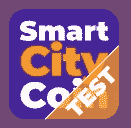

# 智慧城币 ICO 已成定局！

> 原文：<https://medium.datadriveninvestor.com/smart-city-coin-ico-is-a-done-deal-75f0bbfaf38b?source=collection_archive---------18----------------------->

彼得·法莱斯基尼访谈

# 我们的 ICO 关闭了，对此我们很感激！

你如何评价你的 ICO？

我对结果很满意。我发现象征性经济比传统经济更具挑战性。按照我的标准，我认为这是成功的！

**现在你有了一些资本，你有没有想过钱会花在什么地方？**

我们的代币实际上是我们商店的预付款，所以唯一正确的做法是购买智能家居套件和太阳能电池套件的股票。智慧城市项目有更多的章节，主要是我们的智慧城市团队在 R&D 工作，升级现有的硬件和软件。如果你问钱会去哪里——我刚刚给了你一个答案:股票和研发。

**你声称你会在这个项目上投入一切……但是我们听说你是一个汽车收藏家和发烧友。因此，很难相信你不会像大多数后起之秀一样花点钱。你什么时候能拿到蓝宝奖？**

当我们的团队开始为一个人进行太阳能充电时。

**哈哈，当然。至少你的团队成员会得到新车吗？**

不，不管有没有，我们都对现有的游乐设施感到满意。当然，我们都有自己的愿望和欲望，但全球问题之一是花你实际上没有的钱。生态包括适度满足个人需求，意识到你只能花利润。因此，我认为对于我们(SC 团队)来说，在我们宣布我们富有之前，还有很长的路要走。[gigl]

**好吧，更严重的事情。你的代币什么时候上市？**

一旦第一个交易所能够浮动稳定的硬币，固定汇率为 1 先令兑 1 欧分！没有一个大股东有兴趣很快加入交易所，所以我们并不着急。代币已经可以在我们店里买到了。然而，我们将在今年的大部分时间里致力于场外交易…

你是在告诉我代币被浪费了吗？

不要！绝对没有。这些代币在使用上没有任何限制。我们希望我们的加密货币不会被用于投机交易，而是真正的内部经济，为那些相信可以改善地球上生活质量的人们服务。我相信我们的 SCCTN 令牌对于任何主要经济体来说都是一个湿梦—它是稳定的，市场上的第三大令牌，背后有一个真实的产品，而不仅仅是一个也许有一天会被开发出来的想法。它已经在现实世界中测试成功，随着社区的成长，它的实用性只会上升。人多，控制好，浪费少。更多营业额…

**更多的钱……有意思。你学到了什么？**

区块链有巨大的机会，象征性经济有更大的机会。最大的挑战之一是摆脱所有的垃圾邮件发送者和所有不能兑现承诺的人…密码社区应该建立一个“分散黑名单”。

那是你的经历吗？

并非所有人都是如此，但加密世界已经成为一个雷区，充满了花哨的网页、SM 频道上的大量数字、不提供安排好的交易的骗子，等等……他们说你需要一个经过验证的营销代理机构——它会提前向初创企业收取资金……而且大多数情况下，他们不会提供商定的东西。大多数情况下，他们甚至不依赖自己的请求[rofl]。对于 Raid 这样的营销者来说，有两个问题很管用——流量对转化率？分享利润？

**听说了一些关于这些挑战的事情…这肯定不是一次好的经历。但是，你在这里。下一步是什么？**

首先也是最重要的是建设智慧城市社区。人是智慧城市项目的精髓。智慧城市项目最宝贵的成果是积累了如何在家庭中使用更少能源以及如何生产家庭所需所有能源的实用知识。这种知识是我们的珍宝，当我们把自己的生命献给这一崇高的理想时，应该好好珍惜。我们现在需要确定准备好用他们已经拥有的技能和知识来领导其他成员的社区成员。他们还必须为另一件事做好准备——赢得代币。这是成为我们智能城市社区积极成员的结果。我们需要开发 App4SmartCity 应用程序的另外三个版本:高级、开发人员和能源商业智能。我们正在开发并将在 SmartCityShop.net 上市的主要产品之一是价格实惠的即插即用家用电池。我们不应该忘记，安全性和稳定性是由服务器保证的，我们将开发自己的服务器。隐私和安全是我们的首要任务。我们需要像千变万化的大海上的老水手。

**现在谁可以加入你的社区？**

任何人。无论如何，ICO 只是第一步。在这一点上，任何人都可以加入智慧城市俱乐部脸书集团，每个人都可以购买智能家居入门套件和太阳能电池套件或简单地购买 SCCTN 代币。

我们以为这是封闭社区的事情。SCCTN 代币在哪里可以买到？

在我们的 SmartCityShop.net。关于我们的项目有许多误解和比较。我们正在长跑。越往前走，一切越清晰。

**还有一些……比如说，代币的痒处。为什么会有人买 SCCTN 代币？为什么不直接消费菲亚特？**

使用 SCCTN token 有很多好处。**第一次体验加密货币非常简单**因为第一次购买者可以用 PayPal、信用卡、银行转账购买代币。**所有将使用 SCCTN **的买家**将获得令牌化经济的第一手经验。**他们可以在智慧城市生态系统中赚取和消费代币。例如，如果他们使用代币购买太阳能电池套件，当他们的电费减少时，他们将节省法定货币。**对于交易者来说，这是利用我们的稳定硬币实现投资组合多样化的独特机会**-尽管在早期阶段，其他代币相对于我们的基准对我们有利-在这个阶段，我们的代币表现优于 BTC 和瑞士联邦理工学院，自 TGE 以来。同样，随着社区的发展，SCCTN 令牌以及相关产品和服务的应用只会越来越多。

**您尚未出现在 Coinmarketcap 上。你打算什么时候成为，你的 ICO 市值是多少？**

我们的市值是 10，000，000，000 欧元。Coinmarketcap 不能上市稳定的硬币，所以我们可能只有在交易所上市后才能上市。

**代币还能赚还是只是销售的标的？**

SCCTN 代币永远是赚钱的对象。智能家居套件的每个用户都会因为在我们的云中发送匿名数据而获得令牌。作为碳信用交易的一部分，每个太阳能电池用户都会得到代币。

**您是否在寻找新的团队成员，或者合作伙伴？**

我们一直在寻求改进。总是有新合作伙伴的空间，他们可以帮助我们获得 OTC 交易并改进我们的解决方案。我们正在为我们的商店设置一个非常有利可图的加盟计划。我个人来说，我在找一个私家侦探。

我想这一年对你来说是漫长而忙碌的一年。你休假了吗？

是的，它是。在一月最后一周的达沃斯之前，我会休息一段时间，但团队的大部分人已经在工作了。由于我们的总部设在瑞士，我们需要像一个永不停息的瑞士时钟。