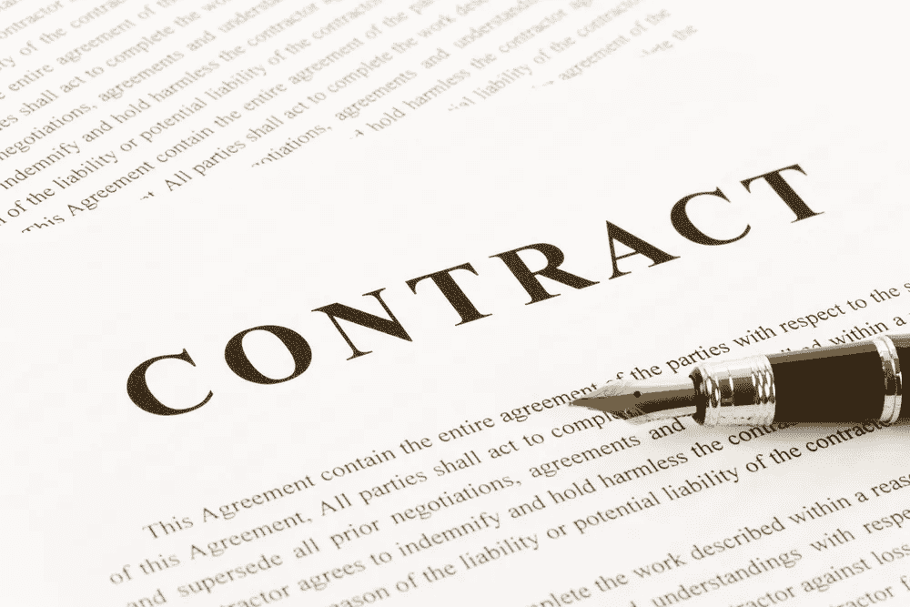
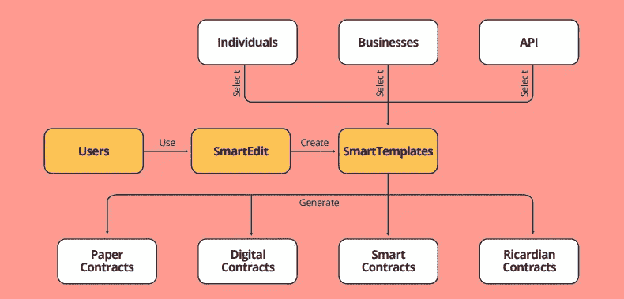

# 面向所有人的智能合同

> 原文：<https://medium.datadriveninvestor.com/smart-contracts-for-all-ef638fceccde?source=collection_archive---------6----------------------->

当 Nick Szabo 在 1994 年第一次提出智能合同时，他设想它们会将合同法的“高度发展”的实践引入到电子商务的设计中。Szabo 是一名计算机科学家、法律学者和密码学家，1989 年毕业于华盛顿大学，获得计算机科学学位。许多人认为萨博是中本聪，因为他在 1998 年引入了比特黄金，一些人认为这最终导致了比特币的出现；然而，他一再否认。

智能合同的使用远远超过了传统合同法的安全性，提高了效率，降低了相关成本。

***那么什么是智能合约呢？*** 智能合约(Smart contracts)是在一定条件下直接控制双方之间数字货币或资产转移的计算机程序。智能合同不仅以与传统合同相同的方式定义了与协议相关的规则和处罚，而且还可以自动执行这些义务。

智能合约存储在区块链上，继承了与分散式分类帐相关的安全性。换句话说，它们是防篡改的，消除了潜在的人为错误，并确保执行的准确性。区块链的公开分类账也确保了完全透明。

今天，法律合同和智能合同之间存在脱节，虽然许多企业或个人可能会使用它们，但它们的复杂性和相对未知的性质限制了它们的使用。

有一个新平台旨在弥合差距，使智能合同的采用和过渡变得简单高效。 [**Contract Vault**](https://www.contractvault.io/) 通过简化区块链合同流程的创建、管理和集成，弥合了这一差距。它面向消费者、律师事务所、小企业客户、企业客户、法律专业人士和智能合同开发人员。

通过认识到智能合约采用中的这种脱节和障碍，Contract Vault 发现并提供了以下问题的解决方案:

*   传统的合同模板通常是不合标准和不相关的，需要广泛的法律知识，这可能是一般人所不具备的。
*   与客户的协作既低效又耗时，而且要么来回发送多封电子邮件，要么通过邮寄/快递发送文档。
*   采用智能合同实现起来复杂且昂贵，非技术人员通常无法使用。风险很高，因为他们可能不符合法律规定。
*   无论是传统合同还是智能合同，获得法律和技术建议都是一个昂贵而漫长的过程。

Contract Vault 平台可以从其智能模板生成各种最终产品，包括:

*   传统的法律协议，然后可以以通常的方式离线使用。
*   法律协议，可以安全地保存在分散存储上，并使用签名的区块链事务进行防篡改。
*   智能表单和智能档案，使法律专业人员能够更高效地与客户沟通和协作。
*   定制智能合约，如以太坊智能合约
*   李嘉图合约或双重链接智能合约形式的可依法强制执行的智能合约

直观的 Contract Vault 界面允许任何人仅使用浏览器或移动设备来创建、测试和管理传统和智能合同。他们有一个“白标”解决方案，这意味着任何公司都可以利用 Contract Vault 平台应用自己的品牌。

智能编辑工具允许创建或修改现有合同，以适应并通过其市场，法律和技术审计的合同是可访问的。

Contract Vault API 使企业能够通过将现有流程与智能合同集成来创建或增强应用程序，而无需花费数月时间来开发它们。

通过 Contract Vault 丰富的法律顾问、区块链专家和企业生态系统，用户可以获得专家建议、仲裁和调解。

背后有一个经验丰富的团队和一个坚实的商业案例，解决一个现实世界的问题；契约金库 ICO(初始硬币发行)似乎是一项合理的投资，也是满足所有契约需求的完美解决方案。

更多信息请访问他们的[网站](https://www.contractvault.io/)或[电报](https://t.me/cvchat)组。