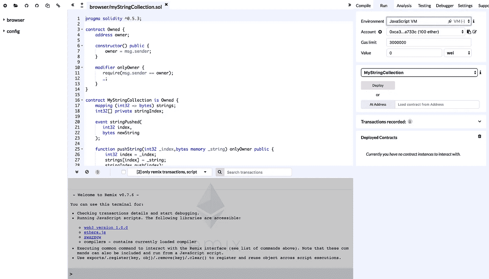

# 60 秒智能合同

> 原文：<https://medium.datadriveninvestor.com/smart-contracts-in-60-seconds-af297983a355?source=collection_archive---------12----------------------->

我期待有一天智能合同会把律师踢出他们的工作；)不全是。如果你是一名律师，那么不要生气，我不是在说你，你读这篇文章很棒。

# 开发、测试、部署

## 发展

混音 IDE—[https://remix.ethereum.org](https://remix.ethereum.org)

我们将使用**可靠性**来编写我们的智能合同。语言并不花哨。它看起来像是 javascript 和 C++的混合。Remix 是以太坊开发者开发的一个不错的 IDE，它将帮助我们编写 solidity。不需要设置，因为 Remix IDE 可以直接在浏览器中运行。

 [## 十大区块链课程|数据驱动的投资者

### 渴望在区块链发展吗？你想知道区块链是如何工作的，但不知道在哪里？或者就是太多了…

www.datadriveninvestor.com](https://www.datadriveninvestor.com/2019/03/08/top-10-blockchain-courses/) 

方便吧？

这是我们工作空间的样子。你可以看到环境被设置为 **Javascript VM** ，这意味着我们使用浏览器内虚拟以太网进行测试。

## 范围

我们将在契约中存储一个字符串集合，并实现三个函数。一个用于使用 **pushString** 将字符串插入集合，一个用于检索特定的字符串，一个用于计算集合中字符串的数量。而且我们也不会让除了主人之外的任何人插入收藏。

为了方便起见，还包含了另一个函数来返回集合中的所有索引。

## 测试

元掩码—[https://metamask.io/](https://metamask.io/)

> 元掩码是一座桥梁，它允许你今天在浏览器中访问明天的分布式 web。它允许您在浏览器中运行以太坊 dApps，而无需运行完整的以太坊节点。
> 
> MetaMask 包括一个安全的身份库，提供了一个用户界面来管理您在不同网站上的身份和签署区块链交易。

我们将使用 meta mask 在一个类似于实时以太坊主网络的测试网络中测试我们的智能合约。我们可以使用以下测试网络之一。

*   罗普斯滕
*   科万
*   林克比

对于我们的应用程序，我们将使用 Ropsten。

## 部署

因富拉—[https://infura.io/](https://infura.io/)

Infura 是元掩码背后的基础设施。它是以太坊网络的网关。使用集中式服务来开发分散式应用程序很有趣，但是现在还可以，因为运行我们自己的节点工作量太大，而且我们应用程序的大部分部分仍然是分散的:)

## 开始工作？

让我们不要操之过急；)可能一次消化太多了。既然我们知道技术栈和我们需要的工具，让我们做一些阅读，熟悉所有的活动部分。

对于开发、测试和部署的每个步骤，都将有单独的文章。链接到这些文章将在这里。如果他们还没来，那意味着我很难把自己从床上拖起来。

在那之前，继续黑…