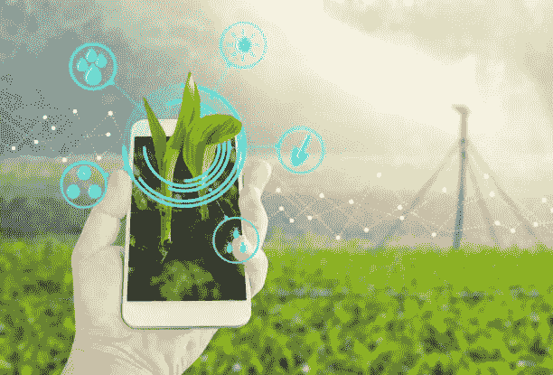

# 农业领域的智能农业

> 原文：<https://medium.datadriveninvestor.com/smart-farming-in-agriculture-sector-3b95964f0ffd?source=collection_archive---------4----------------------->

**为智能农业铺路**

农业一直是高风险、劳动密集型、低回报的行业。突然的环境变化、经济衰退和许多不同的因素极有可能使农民区域单元变得紧凑。然而，在过去的几年里，农业正在经历几次技术变革。技术驱动的进步，特别是 [**【物联网】**](https://www.cioapplications.com/news/how-does-iot-enhance-agriculture-nid-4217.html) 正在赋予农民应对他们所面临的这些巨大挑战的能力。

那里的地区单位有很多办法和时尚农业商量。技术在农业中的应用被称为 AgriTech。它们主要表示物联网解决方案在农业中的应用。智能农业物联网不像客户端连接设备那样流行，但是这些应用的市场是动态的。因为市场仍在不断发展，商机无限。为农业生产构建物联网产品将为成功铺平道路。

 [## 忘记石油吧，水是未来。数据驱动的投资者

### 我们不会耗尽燃料的替代品。能源行业曾经是投资者的荣耀，无论…

www.datadriveninvestor.com](https://www.datadriveninvestor.com/2018/11/14/forget-about-oil-water-is-the-future/) 

**农业领域的物联网用例**

物联网传感器和农业应用通常有不同类型的区域单元。

观察气候条件:最时尚的可感知农业设备是一个结合了可感知农业传感器的观察站。它们从周围环境中收集各种信息，并通过在球体中定位这些信息，将其发送到云端。这些分析信息将绘制气候条件图，选择合适的作物和精确耕作。

*   温室自动化:机器驱动的温室系统将改变条件以匹配给定的参数。允许远程管理灌溉关联度照明系统的感应洒水控制器就是一个例子。

**查看:** [**农业部门如何实施技术**](https://medium.com/datadriveninvestor/how-technology-is-being-implemented-in-agriculture-sector-657b2a8b86)

作物管理:有点像气象站作物管理设备放置在田间的区域单元，用于收集特定于农业的知识，即温度和降雨量、叶水势和整体作物健康状况。任何异常通常都可以被有效地防止。

端到端农场管理系统:农场生产力管理系统包含各种农业物联网设备和传感器，具有分析功能和内置新闻和会计选项。它们提供远程农场观察能力，可以简化大多数农业操作。

农业无人机:它们提供作物健康成像和集成 GIS 制图。无人机技术学校的知识分类和流程为该行业提供了高科技改造。

合理耕作的好处

追求性能和潜力

对生产风险低的过程进行更好的管理

价格管理和减少浪费

通过自动化扩大运营潜力

提高产品质量和产量

优化价格和劳动力使用

因此，物联网农业设备的利用为农民收集有针对性的知识以进行明智的耕作创造了条件。

**智能农业中的人工智能和自动化**

[**人工智能(AI)和自动化**](https://technologylimitless.com/artificial-intelligence-in-manufacturing/) 在农业技术(agtech)中的应用正在引发农业领域的新发展和创新。其中一项创新是 Taranis，associate agricultural AI and machine learning(ML)platform，它使用复杂的 pc 视觉、知识科学和深度学习算法来帮助农民。

该平台用于观察田地并收集与农作物健康、杂草生长、土壤缺乏、虫害、水和与耕作相关的不同因素中的仪器问题相关的知识。人工智能平台在全球各地都有应用，包括美国、俄罗斯、巴西、阿根廷和美国。Taranis 向农民提供信息，允许他们要求必要的措施来阻止疾病、杂草和昆虫。该平台增加了来自卫星、飞机和无人机的视觉层。

配备了先进的视觉系统，这是在整个领域的观察潜力。计算机代码采用深度学习技术来识别与作物和土壤完全不同的问题。该方法需要由一组农学家手动列出和标记的数千个症状的正确数据集。一旦数据集被上传到系统中，平台将简单地确认问题并提供解决方案。

Taranis 供应商旨在通过在底部添加额外的传感元素流来扩展和修改其关于作物、杂草、疾病和昆虫的信息。它还计划与农作物保险公司合作，帮助农民提出保险索赔。一旦它扩展了它的信息，Taranis 将能够帮助农民进行生产和推广。

**看看这个:关于**[**CIO Review**](https://medium.com/@jackmathew/cioreview-beab930fb56e)**杂志**的评论

Taranis 收集的数据经常被自动拖拉机用来喷洒农药或进行不同的农业作业。这些拖拉机配有全球定位系统，可以在田地里进行种植、喷洒和收割。Taranis 的视觉平台让农民能够轻松跟踪他们的 Brobdingnagian 英亩土地。

智能农业**对人工智能的采用可能会扩大自主拖拉机、灌溉系统和无人机的应用。像 Taranis 这样的作物管理系统可以使农民能够观察他们的田地，并及时做出选择以获得最佳产量。**

****来源—** [**CIO 应用**](https://www.cioapplications.com/)**

****CIOReview 客户端的:**[**prefect**](https://www.zebra.com/us/en/about-zebra/newsroom/press-releases/2019/profitect-recognized-by-cioreview.html)**，** [**旗舰**](http://www.flagshipbio.com/news/flagship-named-company-of-the-year-by-cioreview/) **，** [**，**](http://www.pcmicorp.com/2017/10/pcmi-20-automotive-technology-cioreview/) **，****Beqom****

****退房点评 CIO Review:**[**Crunchbase**](http://www.crunchbase.com/organization/cio-review)**，** [**Glassdoor**](http://www.glassdoor.co.in/Reviews/CIOReview-Reviews-E1172153.htm?countryRedirect=true)**

****看看这个:** [**CIOReview 概述**](http://www.owler.com/company/cioreview) **，**[**muck rack**](http://muckrack.com/media-outlet/cioreview)**