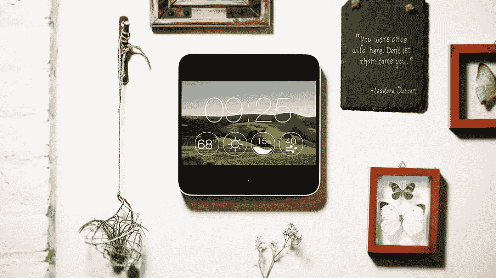
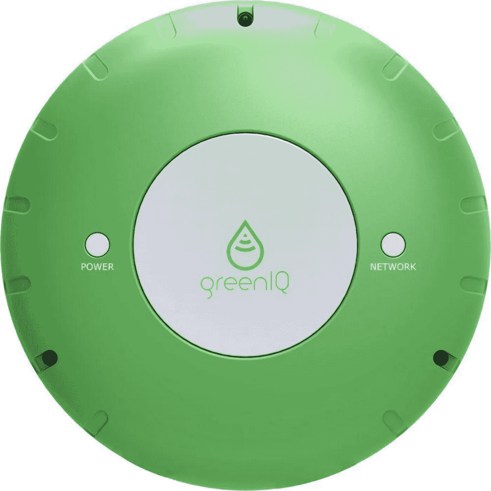
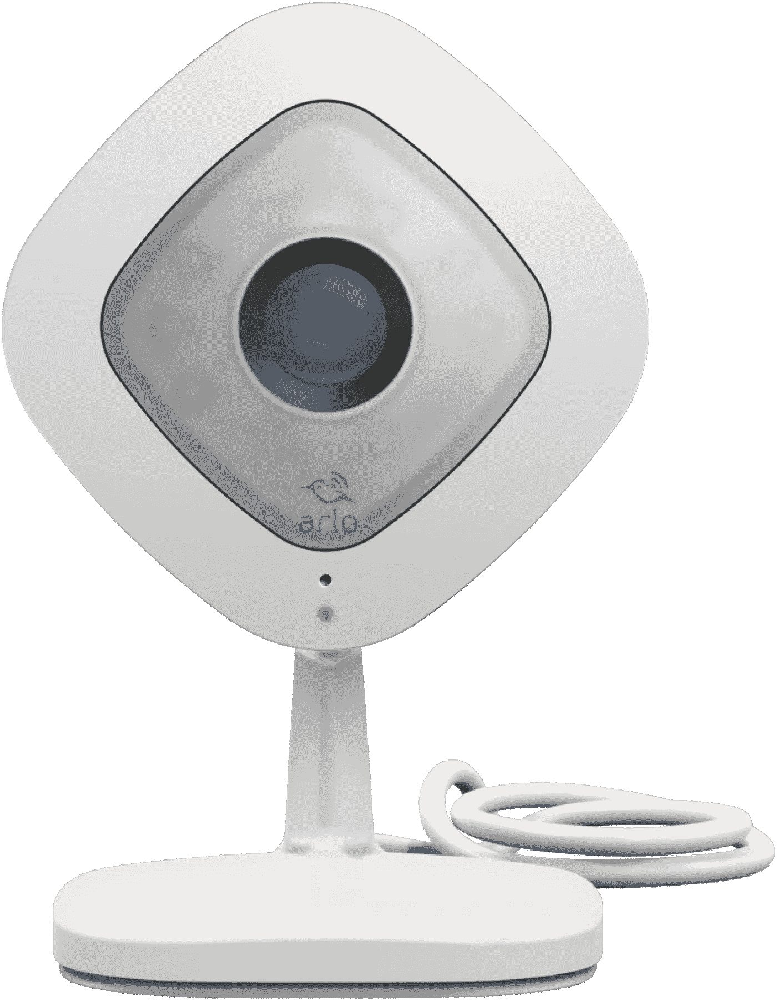
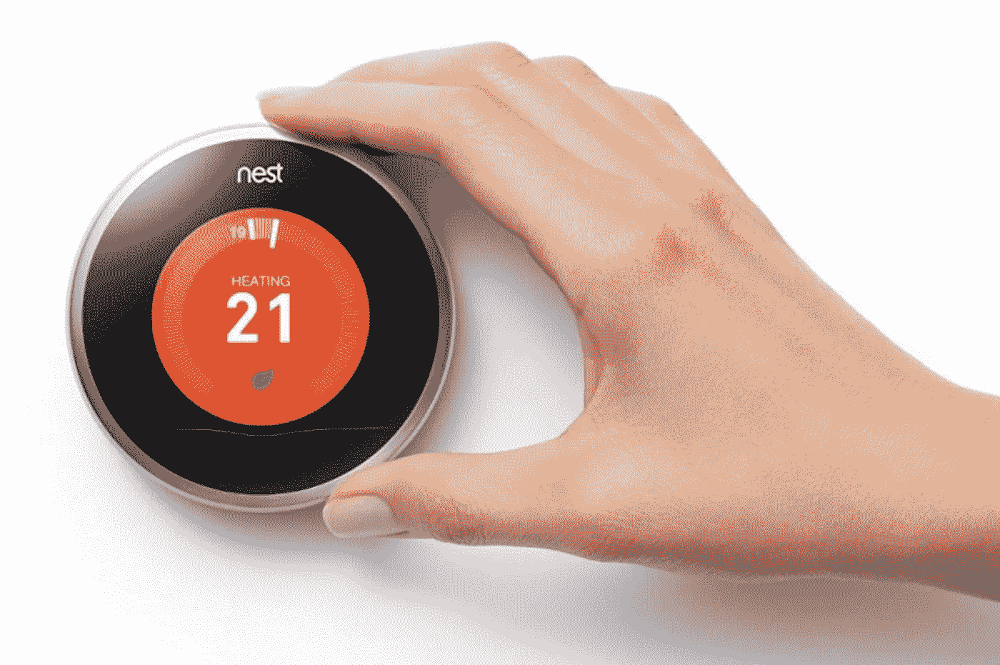
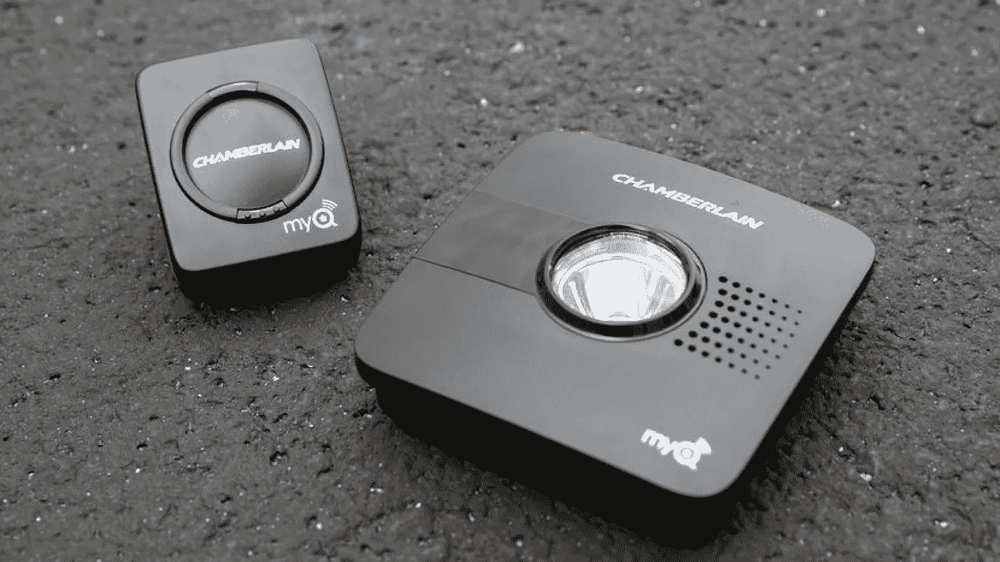
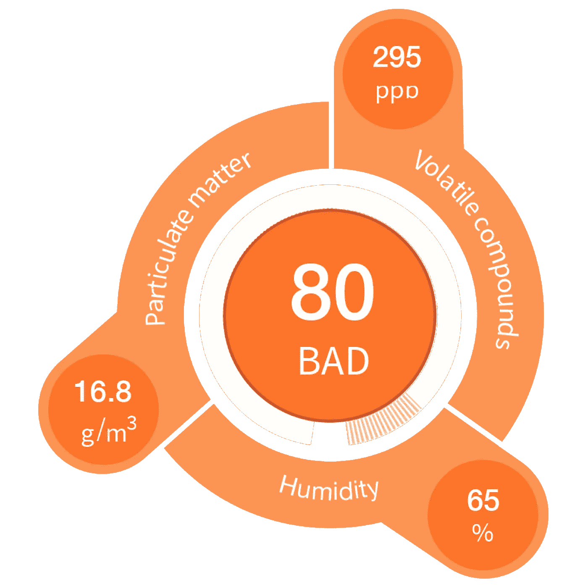
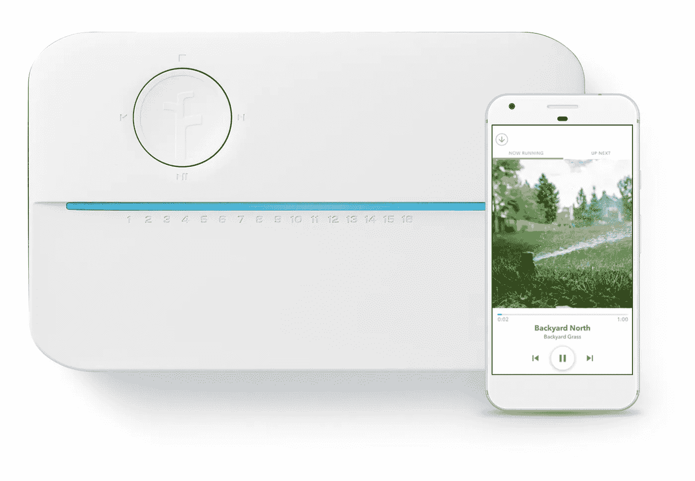

# 智能家居小工具 2018:最佳新设备概述

> 原文：<https://medium.datadriveninvestor.com/smart-home-gadgets-2018-an-overview-of-the-best-new-devices-7221fd0533ad?source=collection_archive---------12----------------------->

新智能家居设备的鼓舞人心的世界…还是一个顶级选择问题？

今年，物联网的成就令人印象深刻。通过为您的家庭设计和展示众多智能小工具，它将房屋维护的概念提升到了一个新的水平。现在，我们享受着各种新的智能家居设备，它们在我们的家庭环境中建立了一个有效的日常生活——节省成本，有吸引力，有爱心，高科技。

然而，最新的并不总是最酷的。在这里，目前的审查服务，揭示了最可靠和最好的智能家居设备。最重要的是，这些设备应该是体面的，并以迄今为止最好的方式提供技术解决方案。

**如何选择最适合您需求的智能家居产品**

在当代市场上大量可用的智能家居设备中，选择一个满足您需求的产品可能是一项艰巨的任务。因此，该概述集中于区分 10 个不同产品领域的最佳代表，而没有比较满足相同需求的两种设备。

在这个概述中，你会发现最酷的智能家居小工具-2018 年世界语音控制，锁定，农业，安全，能源，门控制，家庭助理，空气质量分析，浇水和园艺。

以下是 2018 年顶级智能家居产品的入围名单:

-亚马逊回声

-椭圆(由拉蒂斯设计)

- GreenIQ 控制器

-网件阿洛 Q

-巢式恒温器

-张伯伦 MYQ 车库

-库里机器人

-足球机器人

- U 由摩恩

-瑞秋 3 号

让我们仔细看看提到的每一项。

**十大智能家居产品排名**

1.亚马逊回声

作为最有价值的家用智能设备各种评级的频繁领导者，亚马逊 Echo 是一种在所有主要活动中建立语音力量的技术。为了让它工作，与 Alexa 的连接可以帮助这个设备播放音乐，打电话，创建任务和例行列表，控制智能家居的环境和查询有趣的事实。在这种情况下，复制的质量是设计师们最关心的问题，他们为这个小工具配备了杜比处理(有助于处理清脆的人声和动态低音)和 360 全方位音频(让声音充满整个房间)。亚马逊 Echo 的另一个重要特征是它的七个麦克风，这使得它可以听到来自任何地方的人类声音，并将其与噪音或背景音乐区分开来。因此，这个智能家居小工具的功能只能受到你的想象力的限制！

2.拉蒂思椭圆

拉蒂丝创造了一个令人惊叹的设备，值得在顶级智能家居设备中展示。准确地说，这种智能锁旨在最大限度地保护您的自行车。它由锻钢制成(已经达到“塑性变形”的状态，变得牢不可破)，并包括双重锁定(很难突破)。同时，这种智能自行车锁的可能性超越了这种静态安全。凭借防盗报警、无钥匙进入、蓝牙连接和自充电功能，Ellipse 是您日常生活中高效且极具吸引力的解决方案。此外，其优雅的设计将智能技术变成了一个不错的配件。此外，内置的太阳能系统使其无需有意充电即可工作多年。因此，看起来 Lattis 在其椭圆智能自行车锁设计中包含了一切可以想象的东西。因此，它被广泛认为是最好的家用智能设备。

3.GreenIQ 控制器

在 GreenIQ 控制器的优势中，这款智能设备的开发人员提到了省钱、省时、节水、远程控制、轻松连接到 Wi-Fi 或蜂窝网络、自适应、警报通知和景观照明控制。实际上，所有这一切意味着花园将获得全面的无线覆盖和由移动应用程序保证的复杂控制水平。与此同时，可以将主要管理功能交付给 WeatherIQ 智能算法，作为回报，您可以享受花园的自动化工作。此外，这款最佳智能家居设备的代表具有增强的连接性——它可以与亚马逊 Alexa、谷歌 home、Nest 和 Apple Watch 配对工作。最后，来自公共气象站的天气数据和检查土壤湿度水平也可在 GreenIQ 控制器的功能中获得。简而言之，这是一个真正令人惊叹的花园解决方案！

4.网件阿洛 Q

爱洛是 24/7 和 1080 高清安全摄像头，确保智能家居的安全和最高水平的人类控制。换句话说，这款智能家居产品的特点包括能够随时检查你的房子(通过将信息存储在云上)和最高质量的视频(区分记录中最微小的细节)。此外，爱洛的功能集成了用于夜视的红外线灯、双向音频(因此您可以使用智能手机收听和回话)、最新一周记录的基本云维护，以及对该摄像机视野中任何移动或发出声音的物体的智能警报。通过与谷歌助手和亚马逊 Alexa 的连接，Netgear Arlo Q 可以轻松地与其他家庭智能设备一起成为网络的一部分。

5.嵌套恒温器

Nest 是一个受欢迎的品牌，也是最新智能家居小工具中的知名代表。作为首选，它的恒温器是一个以美学和成本效益的方式设计的令人敬畏的设备。Nest 恒温器从顾客的偏好中学习，根据你的时间表调整加热温度，用这个简单的技巧节省大量能源！此外，季节的变化也在考虑之列。因此，当你在温暖的季节外出时，它会设置一个生态温度制度，该制度将持续到你开始接近家或改变手机温度之前。在后一方面，为 Nest 设计的智能手机应用程序为您提供关于节能和一般消耗的分析报告，以提高意识并显示改善日常习惯的空间。

6.张伯伦 MYQ 车库

在你家的智能小工具系列中，大多数车主都对这款全新的车库门控制器非常满意。凭借其简单的设置程序、实时提醒、每日日程安排、用户友好的智能手机应用程序和普遍兼容性，对车库维护的理解达到了一个新的水平。与此同时，这款设备的控制功能远远超出了车库领域，包括家庭照明和向智能手机发送安全警报。此外，*、* MYQ Garage 与各种品牌合作，以保证智能家居内最高水平的连接。特别是，这份名单包括苹果 HomeKit、ClareControls、Nest、谷歌助手、霍尼韦尔和其他受欢迎的智能家居小工具生产商。最后，该设备由锂电池供电，这意味着 MYQ Garage 即使在极端温度下也能完美工作。

7.库里机器人

这个可爱的机器人的出现是家庭最佳智能小工具名单中不可避免的。事实上，Kuri 创造了一个家庭助手，它拥有可爱的外观和捕捉智能家居中最佳瞬间的能力。换句话说，它是一个移动摄像师——足够智能，可以捕捉有趣的事情的 5 秒钟视频(即使没有语音评论！).此外，当你不在时，机器人可以检查你的房子里发生了什么。终于可爱到可以像宠物一样在心里赢得一席之地了！

不幸的是，几个月前该公司宣布暂停这些机器人的运行。然而，这项技术在不同的高规格活动(包括 TED 和经济学人创新峰会)上的广泛赞赏，证明了我们对其未来的乐观态度——在一定程度上将其纳入智能家居设备名单——2018 年，并承认这一失败的事实。

8.Foobot 空气质量监测仪

在家用最佳智能小工具名单中，Foobot 的出现很特别。有了这项技术，室内空气的成分不再是秘密。具体来说，Foobot 能够闻到污染物的存在，并在其 LED 显示屏上通知用户。此外，其增强的分析功能可帮助您了解各种典型活动如何影响空气成分，以及哪些习惯值得养成以防止其恶化。

有了一套有用的技巧，用 Foobot 跟踪空气质量变成了一个有见地和有趣的游戏。例如，智能设备不会让你的脑海中充斥着化学物质的名称——仅仅是通知的颜色就足以了解空气质量与未受影响的自然环境有多远。

9.摩恩的 u

为了跻身最佳新型智能家居产品之列，摩恩通过优先考虑客户的舒适度来设计淋浴器。特别是，摩恩的 U 能够调节水温和这一程序的时间，因此，给“早上好”一词带来了更准确的含义。晚上，该设备中的特殊机制将淋浴变成了一个放松的过程。所以，晚上也不错。

在实践中，用户可以设置个性化的偏好——当所需状态的淋浴准备好时，智能手机上的应用程序会发送通知。此外，设计师创造了两个或四个插座系统，以适应不同的浴室大小。

10.拉奇奥 3

为了总结这份 2018 年智能家居设备清单，我们选择了 Rachio 3。这是一个智能洒水控制器，将室内水管理提升到新的水平。随着超本地天气情报 Plus 的加入，这个小工具能够根据自然环境的变化创建一个浇水计划。作为该设备的另一大功能，与其他智能家居设备的最高级别连接使其成为整个智能家居系统不可或缺的一部分。确切地说，它可以与亚马逊 Alexa、苹果 HomeKit、谷歌助手、SmartThings 和 Nest 等其他产品配合使用。

此外，双频 Wi-Fi (2.4 GHz / 5 Hz)和 Flex radio 的扩展范围使 Rachio 3 能够将智能家居功能扩展到户外。此外，简单易用使这个小工具非常有用——它包含易于按压的连接器，磁性盖锁和 24/7 支持功能。因此，有了这个智能小工具，你将获得一个个人浇水助手，保证随时随地用智能手机远程控制浇水——既可以即时控制，也可以通过创建时间表来控制。