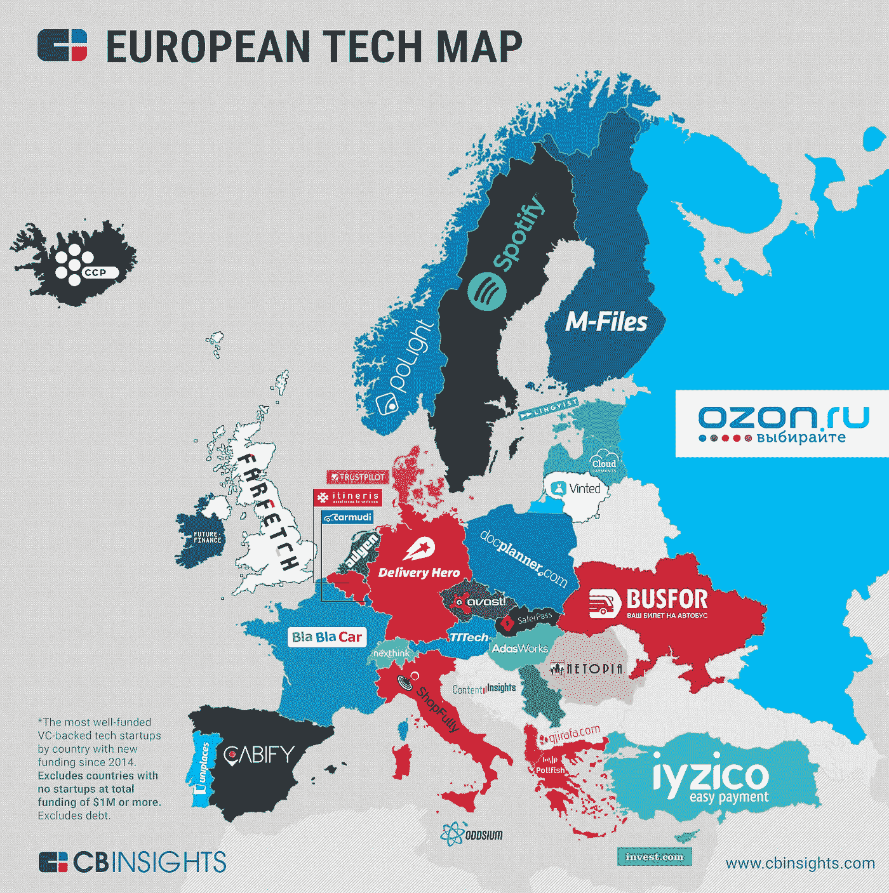
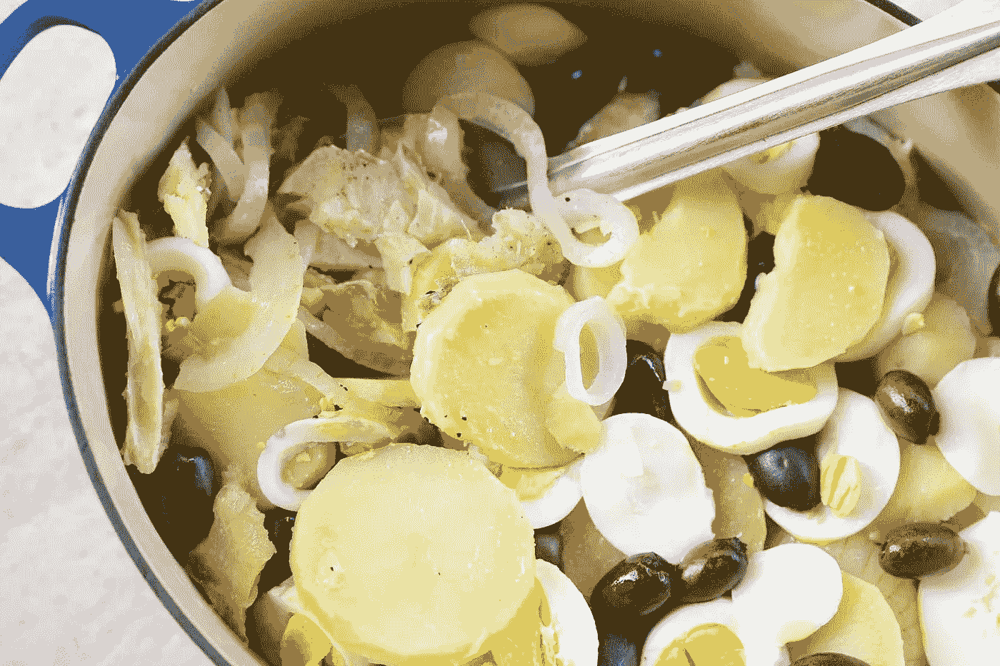

# 聪明人 1 —葡萄牙哪里

> 原文：<https://medium.datadriveninvestor.com/smart-people-1-where-in-portugal-5f3dfa6a8b47?source=collection_archive---------3----------------------->

有人邀请我加入这个论坛，这些聪明、能说会道、懂行的人谈论金融科技、区块链之类的话题。我确信我熟悉这些术语…

我非常肯定我对这些话题一无所知。“嘿，你，谈谈金融科技！”。不会发出一点声音…说真的。

我所知道的一件事是这个叫做…葡萄牙的小国家。

正如你在我的大多数故事(和 tripadvisor 点评)中看到的，我做了很多宣传。葡萄牙一直在攫取旅游奖项，它的创业场景只是稍微落后于以色列或我们在中国所说的他们正在做的任何事情。

我们已经举办网络峰会两年了。我们有面向大海的大学。麦当娜住在这里，埃利克·坎通纳、维坎德、法斯宾德和托尼·斯塔克也住在这里。好吧，也许斯塔克先生不住在这里。他住在东海岸。每个人都知道这个…

**铺路**

早在第一个“美国”[企业家](https://ahersko.wordpress.com/2010/12/01/join-or-die-americas-first-political-cartoon/)出现之前，葡萄牙就已经是**热衷于现代全球化的国家了**。是的，我们可能在世界更大规模的奴隶贸易排行榜上排名第五

但我们也在发现新的土地，交流知识，分享文化，教来自世界各地的水手如何正确地在海上航行，最重要的是，为西方世界做出贡献

巴西、印度、非洲大部分地区、东帝汶、日本，还有一些人说第一张澳大利亚地图是由葡萄牙制图师绘制的。

谈谈那时的一些谷歌地图…

**现在来看一些技术**

500 年后，荷兰、英国、法国、西班牙、美国(实际上还在继续)和俄罗斯(有点滚动)帝国，我们在这里。

曾经迷失在时间和身份中的里斯本，如今是南欧“一切”的舞台:从烹饪节目到科技新闻，如果你的目的地是波特拉或萨卡内罗，你显然没有上错飞机。

你处于一个**创业热点**。和 wi-fi 的可怕的顺便说一句(它确实是，它超过任何美国服务提供商；我知道，我在美国生活过)

**大 4**

很难卖掉 4 家初创公司，就像我说的是 EY、德勤之类的公司。我们有太多(没有帕洛阿尔托的规模)，在各种各样的领域做太多的事情(甚至没有接近上海的速度)(如前所述，我们像狗屎一样有创造力)。

所以我基本上选择了以下四个:

众筹，金融科技——种子公司(2009 年)

物业管理— **UNIPLACES** (2011 年)

人工智能，机器学习——**解禁** (2013)

电子商务— **FARFETCH** (2008)

你可能已经查过了，所有这些公司的首席执行官年龄都在 40 岁或以下。

就商业模式而言，Seedrs 或许是最有趣的。

**Farfetch** 由于其首席执行官在债务融资方面采取“要么做大，要么回家”的战略，因此发展最快。

**Uniplaces** 发现了 2007-2008 年金融危机导致的 havok 与里斯本成为可与马德里相媲美的旅游热点之间的最佳结合点*

并且**unlabel**正在用会让一群乌克兰黑帽子发疯的技术铺平道路。

要找到更多关于这些创业公司的信息，你可以随意搜索 Chrome/Firefox，因为我不会——更好地，**不能**——谈论太多。

我所知道的是他们做得很好，**他们在许多大洲都有业务，就他们带来的东西而言，他们的创新得分非常高**。

只需快速浏览一下 Seedrs，这是一个股权众筹解决方案，不知何故，它在英国法庭上一路过关斩将，成为每个人参与科技投资最受欢迎的方式之一。

Unbabel，就像 [Hypelabs](https://hypelabs.io/) 或 [Feedzai](https://feedzai.com/) 一样，更多的是关于“后端”而不是想法本身。

聪明、强大和“由内而外”(感谢网球)的商业模式——主要被认为是扩张和退出，而不是在全国范围内扩大规模，等待痛苦的死亡——也是葡萄牙创业技能的一部分。

there was an older map with Seedrs based in… the UK!

这只能证明葡萄牙可以与世界顶级编码员抗衡。

教育系统现在比以往任何时候都更有准备和意识地将学生融入孵化器和加速器项目。[Scratch](https://scratch.mit.edu/)code workshop 或者 [Maker fairs](https://www.rtp.pt/noticias/pais/meet-the-maker-e-no-porto_v879253) 在这里已经是*的事情*(如果你喜欢一些 cosplay，你甚至可以参加 [Comic Con](https://ccpt18.comic-con-portugal.com/pt) )！

葡萄牙人是天生的勤奋工作者，有改进的诀窍。从 Felcom(葡萄牙 20 世纪 30 年代的福特 A 发动机汽车)到 ATM，经过 Verde 和 [MBWAY](https://www.mbway.pt/) ，我们的历史是伟大成就和疯狂不幸的两极混合体(你有一个搅拌机，把它们混合起来，你就会得到 *Saudade* )。

有人说，与英国人或德国人相比，我们的管理能力让我们与众不同。可能是这样。

但是有六件事是肯定的:

>我们的英语很流利，与普遍的看法相反，我们的英语说得比西班牙好(我知道这一点是因为一位剑桥老师告诉我的；我们在年轻人的水平考试中名列前茅。所以，如果英语在未来 50-100 年内仍然是国际商业语言，我们……对此保持冷静；

>就天气、海滩和科技繁荣而言，我们是廉价版的加州；如果你想去里斯本和波尔图旅游，你所要做的就是避开甘蓝、卡戴珊和地震；哦，把价格降到 30/40%;

>我们被吹捧/评价为**周围最好的人之一**；你可以和瑞典人或加拿大人交谈，葡萄牙人会更快乐和谦逊(老实说，我认为这是真的；问问加拿大人或 T21 人；

>我们是鳕鱼最自豪的非主人和‘野蛮’的食用者；如果你在附近，你已经注意到了这一点；

gotta have it!

>我们有一系列音乐节**以防孩子们在你忙着投资的时候需要做点什么**

>等等，等等，还有 diabo a sete 的

*这就是销售宣传#1 的全部内容！*

*现在，是时候做些 5q 了。*

*(非常感谢[巴尔巴拉·莱昂](https://www.linkedin.com/in/barbara-le%C3%A3o-de-carvalho-phd-66b20a2)， [thegoodbrands](https://www.thegoodbrands.org/) 创始人， [IPAM](https://www.ipam.pt/en/lisbon) 的老师)*

**你的第一个商业想法是在哪个车库/朋友的谈话中萌发的*？*

*它来自于没有车库和零社会互动。它只是自发地爆发出来，出于我将一些生态友好和社会责任的商业解决方案带到桌面上的意愿。*

**你认为在未来 5-10 年内，葡萄牙能赶上以色列或中国这样的创意 MVP 吗*？*

*绝对没有理由相信我们不会在几乎所有方面都排名第一！*

**当我们谈论 ________ 和 _ _ _ _ _ _ _ _ _*(***填空*** )时，有很多关于创新的议论和一大堆沉默*

*人性与伦理。*

**你有哪些创意参考*？*国家与国际，活着的与死去的，真实的与虚构的*？*

*我会说甘地和埃隆·马斯克。*

*如果你必须向一个 4 岁的孩子解释你的公司，你会说什么？*

*我正在建造一个神奇的地方，在那里人们可以学会更快乐，更了解我们的星球正在发生什么。*

** *(墙这边 450 万游客 p/y vs 拉铁拉*[*Glovo*](https://glovoapp.com/en/partners)*；显然谷歌州几乎有****1700 万*** *人造访三藩市，超过 4220 万公子哥儿涌向洛杉矶；更多关于谷歌言论* [这里](https://medium.com/@tynuk/how-the-f-c-does-google-know-the-precise-dob-of-this-dude-639edf593278)*——****里斯本的面积大约相当于旧金山*** *然而它却获得了四分之一的旅游活动:】**