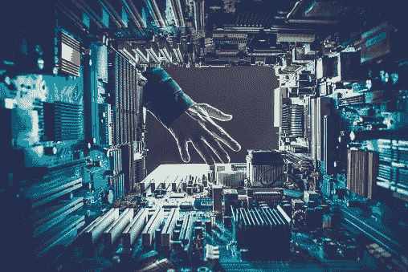
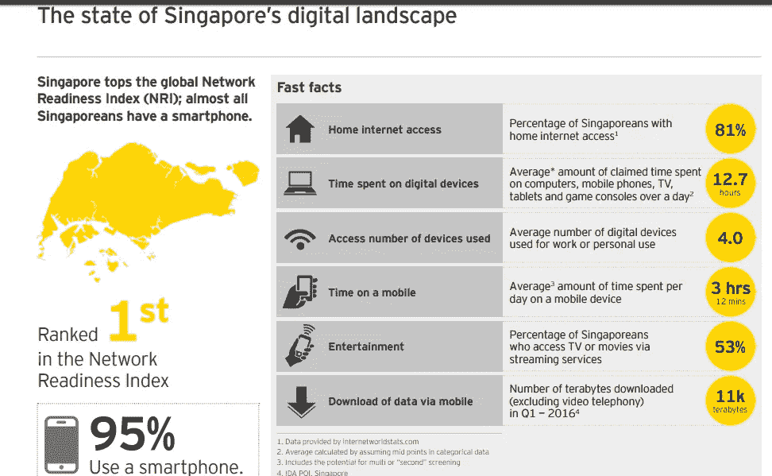
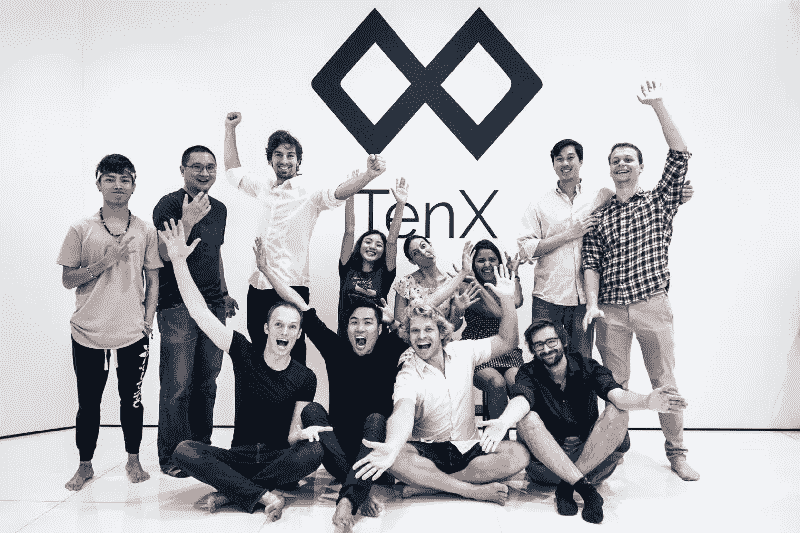
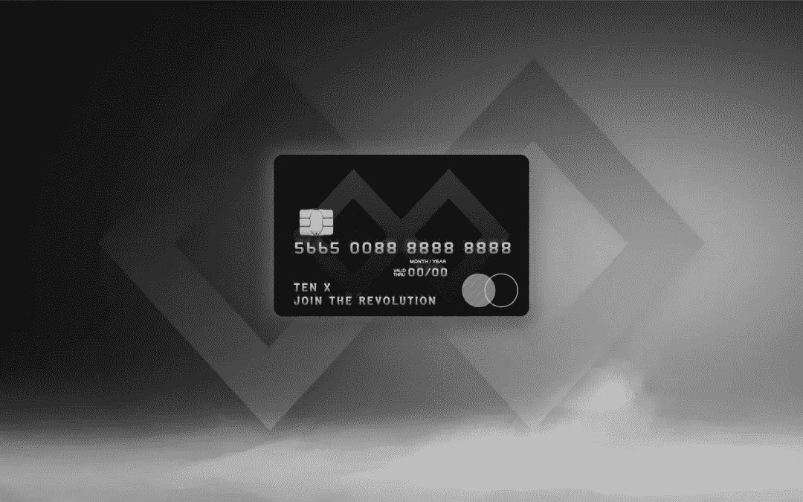
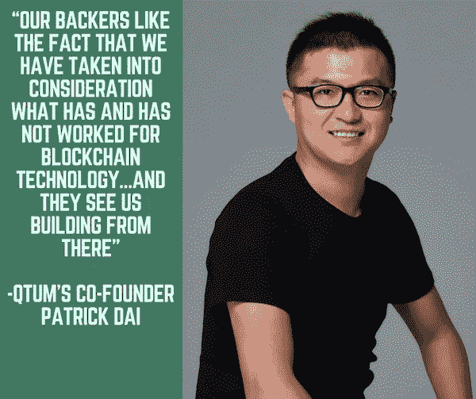
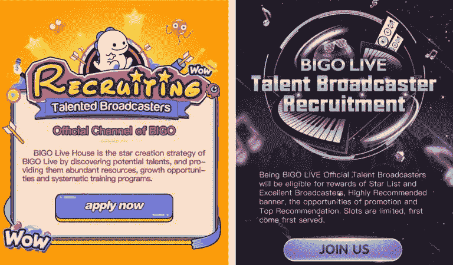
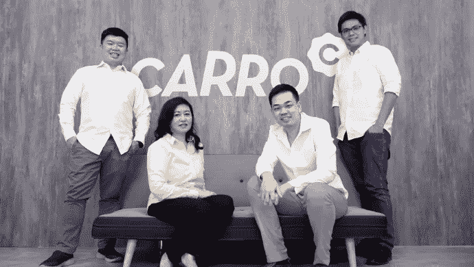
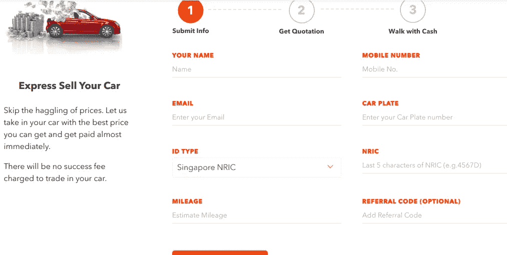

# 聪明人 3——新加坡，科技王国

> 原文：<https://medium.datadriveninvestor.com/smart-people-3-singapore-the-tech-dorado-aed4719f6466?source=collection_archive---------26----------------------->

他们是数据的避风港，他们知道如何合法行事(有欧盟-新加坡自由贸易协定和全面进步跨太平洋伙伴关系)。新加坡似乎没有弱点:它是地缘政治的天堂，非常适合希望管理出口管制的外国公司。

*阿里巴巴，百度，腾讯，谷歌，亚马逊，脸书，500 家创业公司，红杉资本，Wavemaker Partners，Dymon Asia Ventures，任何人的任何人都在新加坡。问题是…你为什么不在那里*？！

在**深入一个你可能** **知道的国家之前……让我们给你展示一些他们的音乐。**

alright, cue Smart People the Third!

新加坡可能没有像爱沙尼亚那样给我们 Skype，也没有像芬兰那样给我们第一个图形网络浏览器，但是当我们谈论它们的时候，我们应该像点击一样点击:随着超过 95%的智能手机渗透(根据 [EY](http://www.ey.com) 的一项研究)，每个新加坡人据说花费超过 12 个小时在线([*www . respect . SG*](http://www.respect.sg))！

是的，**“数字设备学科”在那里是一件*的事情*，它不应该让人感到惊讶**:这个国家是**无可争议的冠军，比如“联合最佳技术国家”、“最佳技术，去他妈的其他国家”、“我们绝对是第一，你迷路了，孤独地死去吧！”而且似乎没有人，在不久的将来能阻止他们。**

但是……我们不关心他们如何生活。我们关心他们如何能够改善我们的生活。哎呀，他们已经做到了:满足[智能国家](https://www.smartnation.sg)，一个专注于数据和网络协调和信息通信技术发展的倡议，以造福于公民…

我们正踩在金刚合金上。新加坡似乎没有什么缺陷。

Singa what now?!

让我们看看世界上最聪明的国家之一(等等…他们是第一名！)目前正在改变我们的未来。

**抓斗**(运输，2012)

这是东南亚的优步，有着合理的规划和不那么快速和激烈的扩张战略。

这些家伙通过一些 _______ 和 _______ 的策略成功获得了优步……东南亚的业务。**点击下方填空**！

Grab raised over 6Bn in funding rounds; the last one, from August, was something around 2Bn. These guys do live by their name!

TENX (金融科技，2015 年)

TenX 是一种智能支付解决方案，使您能够**在日常购物中使用加密货币**。

这有点“简化”了你从区块链到现实世界的过渡。

**它保证从选定的数字资产到合适的法定货币的快速代币交换**，就像在超市买东西一样。似乎是合法的？

It does.

在 [PayPal](http://www.paypal.com) 和 [VISA](http://www.visa.com) 的支持下， **TenX 专注于金钱方面的未来:“让支付比发短信更容易”**。

再说一遍:似乎是合法的！

**QTUM** (金融科技，2017)

**一读量子**。你应该留意这些家伙。如果你去看看他们的团队，他们只是一群热爱加密的青少年(请出示身份证)，但这些家伙知道他们的生意:比特币和以太坊的疯狂结合。

由于比特币作为一种价值转移程序运行，而以太坊扮演着智能合约平台的角色，Qtum 找到了一个“灰色”区域来适应:**一种开源的价值转移协议，它也可以支持 dapps 和智能合约。你拿到了吗？大概不是这样……/跑例子**！

你可以用 Qtum，sorry Quantum，**设置一辆汽车或一栋房子的产权，在双方同意的金额支付后，自动从一方转移到另一方。这实际上消除了对第三方托管或可信第三方的需求，以确保双方得到一致同意的东西。**

如果你还在用头撞墙，也许这能让你平静下来:

他们是有史以来最高众筹项目的前 20 名。

仅仅 90 分钟后，Qtum 就卖出了价值超过 1000 万美元的代币**；**

**♀他们总共筹集了 11，156.766 个比特币(BTC)和 77，081.031 个以太币(以太币)，以换取向公众分发的 5，100 万个 Qtum 代币**

follow [QtumOfficial](https://medium.com/u/66f690266253?source=post_page-----aed4719f6466--------------------------------)

**BIGO** (社交媒体，2016)

他们最近在 D 轮融资中获得了中国 YY(一些拥有 justin.tv、twitch.tv、ustream、tinychat 的爪牙)高达 2.72 亿英镑的支持。还不错…

Bigo 最出名的是它的直播应用[**【BigoLive】**](https://www.bigo.tv)，据该公司称，自推出以来，仅在 400 天内就聚集了超过 4500 万 MAU。

so you really Do think you can sing…

作为一个社交平台，Bigo 已经经历了强制性的公关大火:**它最近表示，它计划将其技术应用于帮助私营公司和政府。为什么？应用程序**上运行的网络欺凌和色情内容…

Bigo **还承诺通过向有抱负的音乐人和游戏玩家推出更多频道来培养更多“有益健康”的内容。**

如果你想了解更多，你可以看看这篇博文[这里](https://vulcanpost.com/605633/not-just-girls-bigo-live-expanded-into-live-music-gaming/)。

如果你想在那里挣钱，Quora 也可以帮你。

**卡罗**(市场，2015 年)

由前风投(右起第二个家伙)Carro(葡萄牙语中代表‘汽车’的意思)创立，他们做足了功课！)是一个全栈汽车市场，方便了汽车交易中的日常文书工作。

**它希望成为处理交易和互动所有阶段的平台，使买卖双方的流程更加简化**。

据报道，2017 年**Carro**交易了价值超过 2 . 5 亿美元的车辆。同年，卡尔的精灵金融服务公司发放了超过 1 亿英镑的贷款。

latest funding to these dudes: 60M through a series B round

**该公司已经扩展到汽车金融、保险经纪、道路救援等领域**。目前在新加坡、印尼、泰国运营(几乎相当于美国人口！) **Carro 最近在东南亚 30 个地点推出了 Carro Express，致力于在 60 分钟内完成每笔二手车交易**。

那么…你还在等什么？

#预订你的飞行

**来源** : [科技感](http://techinasia.com)