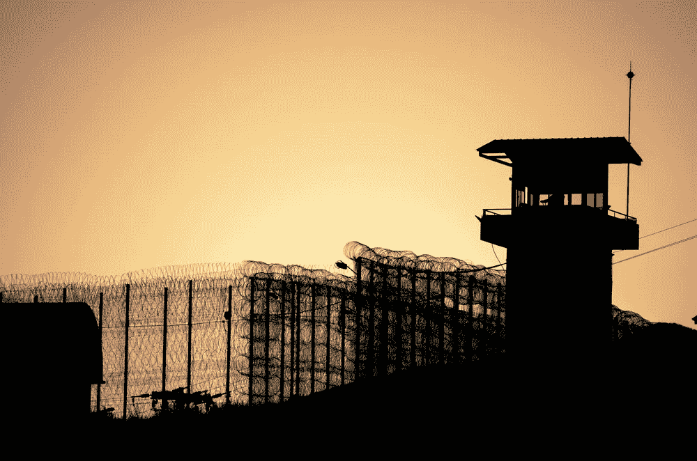
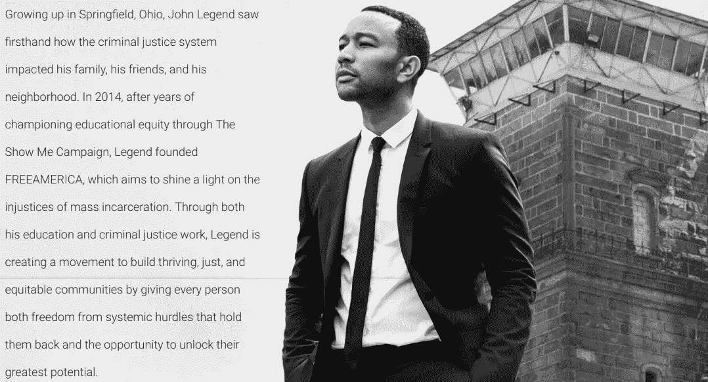

# 聪明人 4 —美利坚合众国，幻想和第二次机会的国度

> 原文：<https://medium.datadriveninvestor.com/smart-people-4-united-states-of-america-land-of-illusion-and-second-chances-9af6f61bb562?source=collection_archive---------10----------------------->

****垄断公司之家*** *这启发了……你从未听说过的最大的公司和商业模式:* **Luxottica** *(意大利，最大的眼镜制造商)* **YKK** *(日本，最大的拉链制造商)和****ABInBev****(比利时，世界上最大的啤酒厂，这个你可能听说过**

*当然，还有方、facebook、亚马逊、网飞和谷歌。*

*好吧，聪明人这次是不会搭上垄断列车的。我们要搭顺风车去别的地方。因为，有时候，**提出想法并不是全世界都关心的事情** …*

*这一次，我们谈论的是一项名为**解锁期货**的倡议。一些你隔壁的编程高手或想法推销者无法接触到的东西。*

*你从没在硅谷 [**或或**看到过的东西****](https://www.youtube.com/watch?v=J-GVd_HLlps) 。*

*值得**谈论和思考的事情**！*

*欢迎来到监禁者加速器。*

*想象一下，你刚刚在[极限技术挑战赛](http://www.extremetechchallenge.com/)上向理查德·布兰森爵士提出了一个想法，因为他支持你的东西而发疯，然后你抢劫了几个人(**有史以来最糟糕的例子，但实际上对构建大局很有用**)。*

*你对技术人员来说已经死定了，对吧？*

*嗯……不完全是。这就是**解锁期货**的意义所在。*

*每一个这种类型的倡议(我真的不知道类似的项目，我以前读过[这个](https://buildingmarkets.org/blogs/syria/2018/04/30/syrian-refugee-entrepreneurs-have-a-voice-at-global-entrepreneurship-congress/)和那个是’*只有孤独的*’)都需要某种面子来推广。进入约翰·传奇，他曾经记得我们，我们都是*

*还有**非常骄傲的**发射器*

***FreeAmerica** ，旨在“结束**美国作为世界上监禁最多的国家的地位**”，通过几个项目，如**我的潜力**，一个“**数字故事项目，由受系统影响的个人的强大视频和照片组成**。大约三年前，传说看到了“我对我们的同胞们投资更多(……)的需要，这样他们就不会从一开始就被系统淘汰”。他认为“如果他们这样做了，他们可以重新站起来”。*

**

**you can learn more about Free America* [*here*](https://letsfreeamerica.com/)*

***解禁期货是** **朝着那个方向的强制步骤**。*

*Legend 说:“我已经看到，对于以前被监禁的人来说，创业是建立可持续生计并为他们的社区和邻居做出贡献的一种可行方式。“(…) **我们希望未锁定的未来将成为一个强有力的工具，为许多有犯罪记录的人打破机会障碍。”***

*Unlocked Futures 是通过**美国银行慈善基金会提供的一笔 50 万美元的领导赠款**而**是由** [**新利润**](https://www.newprofit.org/) 管理合伙人**Tulane Montgomery 领导的，他当时说“我们相信 Unlocked Futures 企业家将是系统变革的真正代理人；他们不仅会在自己的社区创造就业和向上流动的机会，还会帮助领导一场变革性的美国平等运动。***

**

*as Dr. Evil would say: “Riiiiiiiiiiiiiiiiiiiiight…”*

*通过这个项目**，你肯定可以再次尝试变得令人惊叹，再次尝试并拥有观众**。*

*在这个知识经济时代，**所说的和分享的一切似乎越来越没有意义**(但是，嘿，它也可以像病毒一样传播，并且是一个必看的趋势！)解锁的期货是不同的，其中它**为那些在重大失败**后想要回报的人提供赎回。蒙哥马利说:“这个项目是对‘这些人’不可能成为可行的商业领袖的说法的驳斥。”。*

*到目前为止，Unlocked Futures 的成员一直在享受领先的业务，如 **Clean Decisions** ，这是一家华盛顿特区的合同服务公司，它只雇用前囚犯(他们通过这样做从这座城市获得了 15 万美元的合同)，创建了像 [**Flikshop**](https://play.google.com/store/apps/details?id=com.bullock.flikshop&hl=en) 这样的应用程序，让**囚犯更容易与亲人通信**(迄今为止它已经连接了超过 15 万个家庭)或试图通过[**obo 做出改变**](https://obodohub.com/)*

**

*Marcus Bullock, founder of Flikshop*

*Topeka K. Sam, creator of Hope House*

*最后，这一切都归结于 Montgomery 小姐所说的:“T18 一个已经服刑 T19 的人——这是我们支付联邦美元创造的最没有人性的条件之一——**并且精神完好无损地出现并准备好领导一个企业，*这是一个领导者 T22 我想知道 T23。****

****来源*** : [fastcompany](https://www.fastcompany.com/) ，[人](https://motherboard.vice.com/en_us/article/gykav9/these-formerly-incarcerated-entrepreneurs-are-trying-to-keep-people-out-of-prison)， [newprofit](https://www.newprofit.org/our-work/unlocked-futures/) ， [bankofamerica](https://about.bankofamerica.com/en-us/who-we-are.html?bcen=8a6b#fbid=Zana10SIm12)*