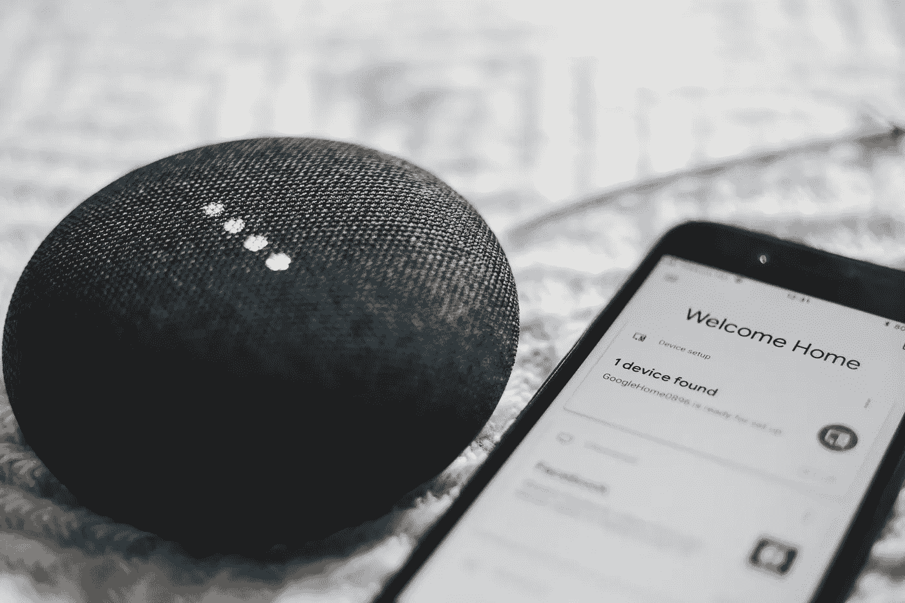

# 正如我们所知，智能扬声器标志着计算技术的一个进步

> 原文：<https://medium.datadriveninvestor.com/smart-speakers-mark-an-evolutionary-step-in-computing-as-we-know-it-6966f058d17d?source=collection_archive---------52----------------------->

Photo by [Bence ▲ Boros](https://unsplash.com/photos/anapPhJFRhM?utm_source=unsplash&utm_medium=referral&utm_content=creditCopyText) on [Unsplash](https://unsplash.com/search/photos/smart-speaker?utm_source=unsplash&utm_medium=referral&utm_content=creditCopyText)

## 说话，计算开始。

“计算机，宇宙的本质是什么？”

“照亮。”

“灯光。”

过去的科幻小说比你想象的要近，列表上又多了一个小玩意。正如上面的参考资料所暗示的，我说的是除了我们的声音之外不需要任何东西来与它们交互的计算机。

有问题吗？提问，了解答案。

想在电视上看点东西吗？命令就会实现。

想听播客吗？告诉它去玩，然后坐好。

很容易把这些不可思议的设备玩得只剩下玩具，或者“其他让我们变懒的东西”当我在学校的时候，我们总是被告知要警惕在我们的研究中使用互联网作为来源，否则我们会得到经典的“确保你使用两本书的来源，也许一个互联网的来源。”现在我不想变得粗鲁，但是你真的被误导了吗？我们有这个不可思议的东西，互联网，它把几乎所有的人类知识放在一个地方。它为世界上最偏远地区的人们提供了沟通能力，并消除了对即时消息和视频聊天等物理存在的需求。它没有消除一个人对阅读的需要，没有消除对研究技能的需要，当然也没有消除对写作技能的需要。这些技能中的每一项都需要时间和练习来掌握，一点也不懒惰。

> 有人记得 Nuance voice commands 应用程序中的“请稍等，说一个命令”吗？

更不用说，向你的谷歌助手询问一个复杂问题的答案，或者在你的日历上安排一个约会，这有多有趣呢？我不知道你喜欢做什么，但是当我想要开心的时候，我肯定不会做管理工作——这些设备不是玩具，它们是工具。

就像互联网是如何插入我们生活的几乎每一个方面一样，语音控制的助手和计算机无疑将是计算发展的一个更大的进步。你不再需要拿起手机，打开应用程序，输入你需要的东西，与它互动，把手机放回去，让它响铃，回去，再拿起它…这样的例子不胜枚举。我们正朝着这样一个未来努力:当你听到手机或扬声器发出通知时，你只需简单地喊一声“好的，谷歌，消息是什么？”从你的设备能听到的任何地方。这是计算领域的一次重大革命，它增强了我们与不断被灌输的所有信息的互动方式。

你还记得 2000 年代早期吗？90 年代后期怎么样？电脑随处可见，它们是通常放在家里桌子上的大砖头。你可能有一部手机，但如果你有手机的话，它很可能只能打电话和发短信。如果你想计算任何东西，你必须坐在办公桌前。我记得通过 MSN Messenger(后来的 Live Messenger)联系人们的日子，只希望你联系的人在他们的电脑前。后来我得到了我的第一部手机，它不是智能手机，但它有一些基本的应用程序(它被称为永远的三星)，其中之一是 Live Messenger 应用程序。我记得我穿过商场，玩着它，第一次看到那个实时的 Messenger 图标，在我四处走动的时候登录并进行对话。我当时从来没有多想，但现在我知道，这些类型的交互是我们今天所有智能设备的组成部分。我几乎可以在任何地方聊天和工作，甚至汽车现在也可以将信息直接传输到仪表板上。计算从停留在桌子上，到停留在口袋里，变得可以戴在手腕上(智能手表)，再到在房间或家里自由自在。有了智能扬声器，我可以模仿我在商场里的革命性体验。我不再需要把手伸进口袋，我可以在做其他事情的时候说话，我的智能扬声器会帮我完成这项工作。计算实际上比一臂之遥更近，它与我们所处的环境同义——说话，计算就开始了。

> 通过互联网的力量和我们时刻保持连接的需要，我们已经将计算从拴在桌子上发展到了舌尖上…

智能音箱不只是运行命令，我的三星永远有语音命令。有人记得 Nuance voice commands 应用程序中的“请稍等，说一个命令”吗？智能扬声器和它们的助手是当今机器学习的巅峰，而且它们只会越来越好。这些助手开始变得更加流畅，他们理解诸如“嗯”和“呃”之类的细微差别，你不必每次都用同样的方式组织命令。就像你可以用多种方式问别人时间一样，你可以用几乎相同的方式问谷歌:你现在有时间吗，几点了，现在几点了？除了道德问题，还有整个谷歌双工的事情，助理本质上承担了一个真正的人类助理的工作，并通过电话为你预约。你可以说智能音箱是我们今天人工智能进步的主要来源之一，因为它们一直连接到互联网，当你离开智能音箱时，你可以在你的智能手机上带着你选择的助手，它将是同一助手，它已经了解你的所有习惯，并知道你如何使用它，因为你所有的设备上都只有一个助手——这是多么不可思议？！？

当人们观看《星际迷航:原始系列》，甚至《星际迷航:下一代》时，通过语音命令进行复杂计算的计算机纯粹是虚构的作品。《霹雳游侠》怎么样？有人记得凯特吗？这些应用现在确实在发生，它们还很年轻，但它们正在发生。通过互联网的力量和我们随时保持连接的需要，我们已经将计算从拴在桌子上发展到了舌尖上——这是革命性的。智能扬声器是进化计算的物理表现，也是未来十年将会带来什么的清晰快照:更多的移动计算、更智能的人工智能和更多的连接。它们不仅仅是玩具，或者是让我们晚上懒得关灯的东西，它们代表的远不止这些，随着它们的成熟，它们与周围世界的兼容性和互动变得更加有用和明确，它们的潜力几乎是无限的。

## 继续对话…

*   [推特](https://twitter.com/MLProductions01)
*   [HTML 万物播客](http://bit.ly/hattpodcast)
*   [第一天补丁播客(RSS)](http://www.podcastgarden.com/podcast/podcast-rss.php?id=2246)