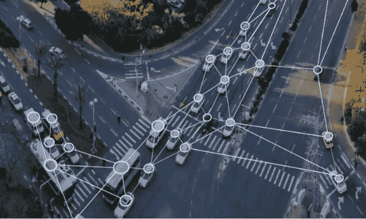
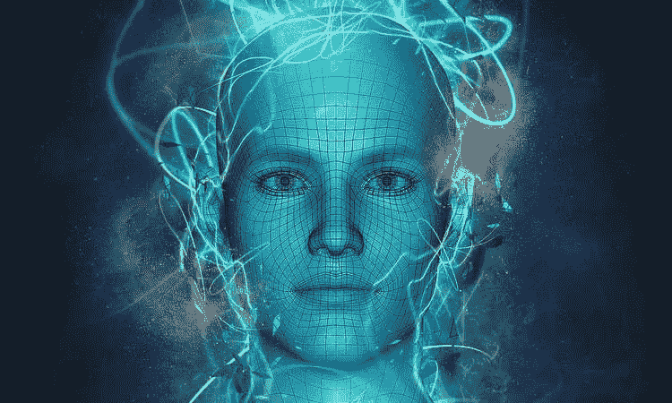

# 人工智能:智能方式图像识别比人更好

> 原文：<https://medium.datadriveninvestor.com/smart-way-of-images-recognition-better-than-human-with-artificial-intelligence-83d793784649?source=collection_archive---------30----------------------->

人工智能(AI)技术从一开始就足够精通，可以开发出能够识别照片和视频内容的软件。通过计算机视觉和图像分析，人工智能软件可以像人类一样观察和理解。

此外，人工智能机器人和软件还可以模仿人类的观察活动。有时候会让我们觉得 AI 可以探索很多远胜人类的东西。

当人类周围的事物快速增长时，人工智能正在提出革命性的解决方案。因此，非常准确地识别和描述照片的内容也是 AI 的重要部分之一。因此，可以说人工智能在图像分析领域的新可能性可以更严格地识别图片。技术前进的方式是试图展现当前所有隐藏的或未解决的情况。

**人工智能和图像识别**

人工智能计划创造在各方面都比人类更好的解决方案。这就是为什么企业可以通过使用人工智能来驾驭全球图像识别的最新趋势。

从安全特性开始，人工智能正准备为每个行业带来好处。从检测周围的物体到视觉分析，图像识别的优势正在行业中掀起新的浪潮。

计算机视觉和图像分析极大地受益于深度学习技术，这是人工智能的高级版本。

这项技术提供了详尽的开源数据库，以及更好的图像识别的高级编程工具。大型巨头正在研究这项技术，以减少图像识别的麻烦。

这被认为是技术领域的下一个大问题，可以被企业用来为世界提供更好的图像识别技术，但这仍然需要解决。为了获得更好的洞察力，不同的部门正在利用人工智能进行快速和经济的计算来分析图像扫描过程。

**人工智能是如何做到的**

有了图像中的时间人工智能，识别有利于品牌和企业快速前进。它允许创建一条进入新行业的新路径，帮助每个部门将用户体验提升到下一个级别。

因此，计算机视觉在分析图像方面的进步对各种商业垂直领域产生了指数级的影响。CPG 和包装行业正在以令人印象深刻的方式利用这一领域，从而为解决与图像识别相关的任务提供了巨大的新机遇。

从广告到汽车，人工智能的应用正在市场上活跃。此外，人工智能图像识别也将游戏、自然语言处理或生物信息学等传统解决方案提升到了一个全新的水平。

借助图像识别中的 AI，计算机视觉将众多部门的工作流程提升到了 ta 高端水平。这种技术很少对使用者造成任何危害。因此，随着时间的推移，通过同时访问其他独特的应用程序，这项技术变得越来越强大。

**底线**

技术正在提高工业中各种过程的工作能力。人工智能技术与开源框架和开放数据的结合正在将商业带到新的高度。人工智能在计算机视觉和图像分析的帮助下开创了一个时代，企业和用户都在经历一个新的技术阶段。

在[计算机视觉和图像分析](http://www.quytech.com/computer-vision-and-Image-analysis.php)的帮助下，人工智能开创了一个时代，企业和用户都在经历一个明智地利用技术服务的新阶段。

*原载于*[*www.townoftech.com*](https://www.townoftech.com/post/Artificial-Intelligence/)*。*