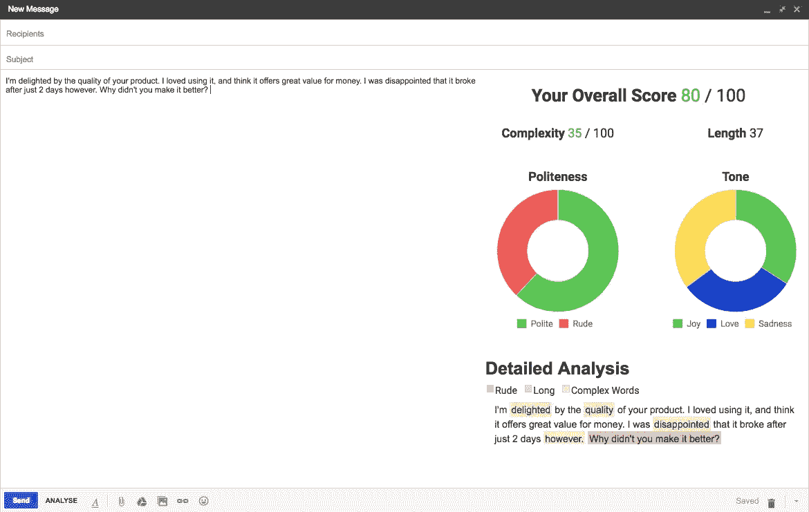

# 构建一个 Chrome 扩展来实时分析你的电子邮件！

> 原文：<https://medium.datadriveninvestor.com/smartmails-internship-project-documentation-d49e71ef32d7?source=collection_archive---------4----------------------->

今年夏天，我有幸获得了在 Kubric (kubric.io)实习 10 周的机会。这是一次令人惊奇的学习经历，我喜欢和这个乐于助人的团队一起工作！

我的项目(称为“BrainMail”)是创建一个谷歌 chrome 扩展，它可以在 Gmail 中分析电子邮件，并返回对各种特征(礼貌、语气等)的分析。)使用自然语言处理。

没有 Kubric 团队在每一步给予我的指导和支持,‘brain mail’就不可能实现。非常感谢他们让这个项目成为可能！

BrainMail in action!

以下是成品的链接:[https://chrome . Google . com/web store/detail/brain mail/fdgfojifaginflnohmodkpllcopehb](https://chrome.google.com/webstore/detail/brainmail/fdgfojifagignflnohmodckpllcopehb)

下面是源代码:【https://github.com/rahulrathi123/BrainMail

以下是我的项目文档:

**问题陈述:**

创建一个谷歌 Chrome 扩展，它可以分析 Gmail 中正在输入的电子邮件，并使用自然语言处理返回对各种功能的分析。

**使用的工具:**

1.GmailJS 库

2.GmailJS 节点样板文件

3.用于 Web 服务器的 Flask 服务

4.Sklearn SGD 分类器

5.NLTK 情感强度分析器

6.Chart.js

**解决方案架构:**

**镀铬扩展件**

chrome 扩展最初是使用 GmailJS 节点样板创建的。然后，我们编辑了 chrome 扩展，以便在使用 Gmail.js 库在 Gmail 的撰写正文中键入电子邮件时阅读它们。这是通过在 on compose 处理程序事件中访问电子邮件的撰写引用来实现的。chrome 扩展进行了两次 AJAX 调用。

1.添加了一个 on-compose 事件处理程序，在其中我们需要设置窗口超时来访问电子邮件的撰写主体。我们已经设置了时间间隔，这样每 2 秒钟就可以提取一次撰写主体数据，并通过 POST 请求发送给 flask 服务，后者在完成分析后返回一个 JSON scores 对象作为响应。然后，我们根据返回的 JSON 对象每两秒钟更新一次 UI。

2.在撰写窗口中添加了一个按钮，单击它，就会向 flask 服务发出 GET 请求，返回我们的 popup.html 模板。该模板显示在 Gmail 撰写窗口右侧的边栏中。

**烧瓶服务**

我们后端用的烧瓶。使用了两个服务器 URL。

1.chrome 扩展的 post 方法有一个服务器 URL，它接收邮件正文，清除所有 HTML 标签，对服务进行 NLP 和其他分析，并将分数作为 JSON 对象返回。

2.GET 请求的另一个 URL 返回/templates/文件夹中的 popup.html 文件，该文件用作我们项目的 UI 模板。

**UI**

对电子邮件的分析显示在撰写窗口右侧的边栏中。

对于 UI，我们决定采用以下特性:

1.总分

2.复杂性

3.长度

4.优雅

5.音调

此外，我们有一个建议按钮，当点击它时，会突出显示粗鲁的句子、复杂的单词和长句子。我们使用 chart.js 来显示一个甜甜圈图，以显示礼貌和语气，并且我们在整个 UI 中使用一种叫做“Roboto”的谷歌字体。总得分是 4 个因素的综合得分，即复杂性、礼貌、语气和积极性(积极性未显示)。每当检索到新的 JSON 对象时，所有 5 个类别都会更新。

**自然语言处理**

自然语言处理用于计算礼貌、语气和积极性的得分。

**礼貌**

语料库:斯坦福礼貌语料库，包含来自 Stack Overflow 和维基百科的评论，标注有 5 个用户的礼貌得分，从 1 到 25。通过反复试验，我发现数据库中的中性句子降低了模型的准确性，所以我将它们过滤掉，并手动添加一些粗鲁/礼貌的句子。

1.我们使用 Spacy 的“textcat”预定义的 CNN 模型，并使用三个类别对我们的数据进行训练:礼貌、中立、粗鲁，还尝试了两个类别的分数标记:礼貌和粗鲁。然而，在多次尝试使用不同范围的标签分数进行训练后，我们没有获得令人满意的准确性。

2.然后，我们使用 TF-IDF 1-N grams 矢量器作为特征，我们将分数的底部四分之一标记为粗鲁，将分数的顶部四分之一标记为礼貌。选择的模型是 SGDClassifier，该模型应该能够很好地处理稀疏数据，并且 TF-IDF 向量通常在大量维度上是稀疏的。在将损失函数改为' modified_huber '后，我们在与 Chrome 扩展集成时获得了良好的结果。由于噪声过大，我们决定不使用堆栈交换数据。此外，我们决定使用礼貌得分最高的 25%和最低的 25%进行培训。中间的 50%分数不是非常可靠的训练数据，因为由于人为偏见，5 个评级之间存在许多分歧。这样做之后，我们恢复到两级模型，并消除了“中性”。

**音调**

语料库:我们使用了[https://github.com/huseinzol05/NLP-Dataset](https://github.com/huseinzol05/NLP-Dataset)一个 GitHub 自然语言处理库，其中有 6 种常见情绪的数据集:快乐、爱、惊讶、恐惧、悲伤、愤怒。大约有 400，000 个句子被标记为这些情绪中的一种。由于记忆的限制，以及缺乏超过一点的准确度的改进，我们决定使用来自每种情绪的 15，000 个标记的句子，因此总共有 90，000 个标记的句子。

1.我们尝试使用 Spacy 的 textcat 模型指定类之间的不同相关性(互斥或非互斥)，并使用上述语料库进行训练。错误分类的数量相当大，并且由于最后一层的激活函数，错误分类的分数被提升得比其他分数高得多。结果并不令人满意。

2.然后，我们使用大型数据集，使用 TF-IDF 矢量器和 SGDClassifier 将其转换为矢量，SGD classifier 在所有线性分类器中提供了最佳结果。Spacy 的内置向量也被尝试作为降低维度的特性，但结果不如 TF-Idf 向量器。

**积极性**

1.首先，我们使用 NLTK 的标记电影评论语料库作为数据集。我们使用朴素贝叶斯分类器将数据分为“阳性”和“阴性”。为了从训练数据中提取特征，我们使用了带有计数矢量器的单词袋技术(无论该单词在语料库中是否存在)。我们在验证数据上达到了大约 70%的准确率。

2.然后，我们使用 Twitter 数据集来分析正面和负面的推文。我们使用 TF-IDF 矢量器提取 1-2 克的特征，并使用逻辑回归对数据进行分类。我们实现了大约 80%的验证准确率。然而，当我们在与 chrome 扩展集成后测试该模型时，我们没有获得令人满意的结果。

3.然后，我们决定使用 NLTK 的 SentimentIntensityAnalyzer 类，它使用一个包含不同权重的积极和消极情绪单词的词典，并根据这些单词的出现次数计算积极和消极得分。这个分类器使用 Chrome 扩展给出了很好的结果，并准确地将数据分类为阳性、阴性或中性。

我最终没有显示这个分数，但仍然在总分数计算中使用它。

**复杂性**

复杂性是使用 Flesch 可读性度量实现的，这不涉及 NLP。Flesch 可读性指标使用一个公式计算给定文本的复杂性，该公式考虑了字数、音节数和句子数。我们实现了这三个函数，并使用 Flesch 可读性度量，我们能够计算从 0 到 100 的复杂度分数，100 是最简单的。我们减去了从 100 获得的分数，以获得从 0 到 100 的复杂度分数，其中 100 是最复杂的。

**主观性**

在扩展的早期迭代中，我有一个主观性得分，但后来为了简化显示的结果，我删除了它。用于主观性的数据集是 NLTK 主观性语料库。

**总成绩**

总体得分由以下 4 个得分组成:积极、礼貌、语气和复杂性。NLTK 的 SentimentIntensityAnalyzer(“复合”字段)返回的积极得分介于-1 和 1 之间，我们将该得分定为 0 到 25 之间的分数。对于礼貌，我们已经有了介于 0 到 100 之间的礼貌分数，并将其定为 0 到 25。对于音调，所有 6 个音调的总和等于 1，我们将三个积极的音调相加:快乐、爱和惊喜，然后乘以 25。最后，对于复杂性，我们给出一个 0 到 50 之间的分数，在总分数的复杂性部分是 25 分，在一定程度上，电子邮件的复杂性不会影响信息。50 分类似于 12 年级学生理解的语言。除此之外，对于 50 到 100 之间的分数，我们在 0 到 25 之间线性缩放复杂度分数，复杂度 50 给定分数 25，复杂度 100 给定分数 0。然后，我们将四个分数相加，得出综合总分数。

**详细分析**

我们给出的建议基于三个等级:粗鲁、复杂和冗长。首先，我们遍历每个句子，检查它是否过长，即句子中的字数超过 25 个，并用蓝色突出显示。然后，我们检查每个句子的粗鲁程度，如果粗鲁程度大于 0.6(满分为 1)，那么我们会用红色突出显示该句子为粗鲁。我们最后检查每个单词并检查它是否是一个复合词，我们已经将它定义为具有 3 个或更多音节的单词。这些单词用黄色突出显示。由于这种顺序，即使句子很粗鲁/太长，复杂单词的突出显示也是可见的。此外，粗鲁比长度更重要。如果对电子邮件进行了更改，并再次单击建议按钮，建议将更新为新更改的电子邮件建议。

**未来的改进**

到目前为止，总得分是使用人工决定的试探法计算的。通过跟踪用户是否回复了电子邮件，可以改进总体得分度量。这可以通过几种不同的方式来实现。首先，可以在电子邮件的底部放置一个 1 x 1 像素的不可见图像。因此，我们可以跟踪电子邮件是否被打开，类似于 chrome 扩展，如 MailTrack。另一个选择是重定向用户放在电子邮件中的链接。这将使得能够检测电子邮件中的链接是否被点击。使用这两种方法中的任何一种，我们都可以标记各种特征的分数数据以及电子邮件的转换是真还是假。然后，我们可以根据电子邮件数据转换的训练来改进我们的总分计算器。我们可以确定用于计算总体得分的 4 个特征中，哪些是最重要的，并相应地修改我们的总体得分公式。

**链接:**

【http://flask.pocoo.org/docs/1.0/installation/ 号

【https://www.chartjs.org/docs/latest/ 

[http://sci kit-learn . org/stable/modules/generated/sk learn . linear _ model。SGDClassifier.html](http://scikit-learn.org/stable/modules/generated/sklearn.linear_model.SGDClassifier.html)

[https://github.com/josteink/gmailjs-node-boilerplate](https://github.com/josteink/gmailjs-node-boilerplate)

[https://github.com/KartikTalwar/gmail.js/tree/master](https://github.com/KartikTalwar/gmail.js/tree/master)

[http://t-redactyl . io/blog/2017/04/using-Vader-to-handle-sensation-analysis-with-social-media-text . html](http://t-redactyl.io/blog/2017/04/using-vader-to-handle-sentiment-analysis-with-social-media-text.html)

[https://en . Wikipedia . org/wiki/Flesch % E2 % 80% 93 kin CAID _ readability _ tests](https://en.wikipedia.org/wiki/Flesch%E2%80%93Kincaid_readability_tests)

[https://stack overflow . com/questions/9154027/Java-writing-a-syllable-counter-based-on-specifications](https://stackoverflow.com/questions/9154027/java-writing-a-syllable-counter-based-on-specifications)

[https://www.computerhope.com/htmcolor.htm](https://www.computerhope.com/htmcolor.htm)