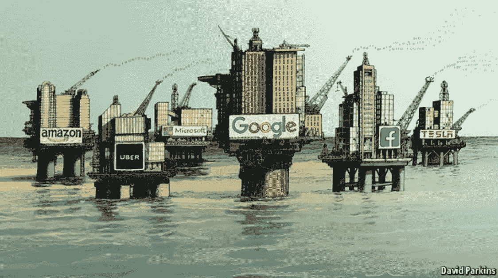
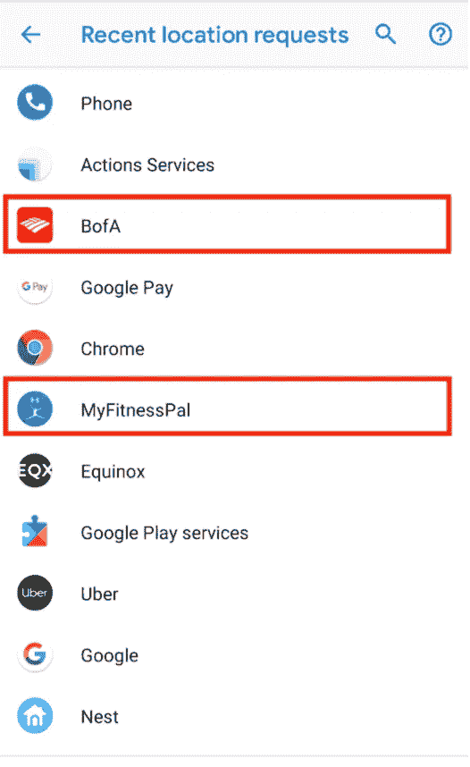
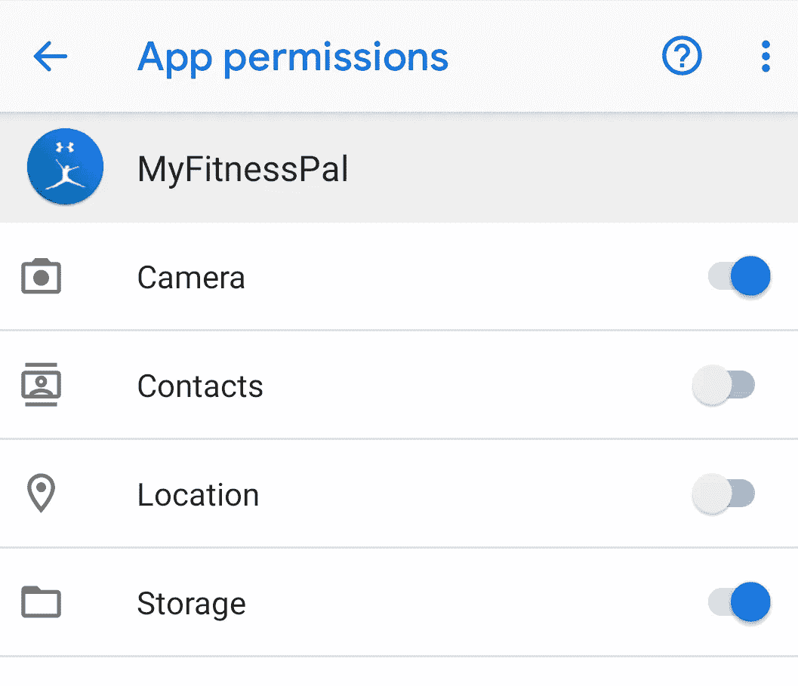

# 智能手机应用程序权限:为什么我们今天都应该做一个审计。

> 原文：<https://medium.datadriveninvestor.com/smartphone-app-permissions-why-we-should-all-do-an-audit-today-29f05d4ec90c?source=collection_archive---------20----------------------->

2017 年 5 月 6 日，*经济学家*断言[世界上最有价值的资源不再是石油，而是数据。](https://www.economist.com/leaders/2017/05/06/the-worlds-most-valuable-resource-is-no-longer-oil-but-data)在这篇文章中，作者声称数字时代的用户数据相当于 20 世纪的石油。因此，现在几乎每个人口袋里都有的超级计算机(即智能手机)不仅可以按需为用户提供有用的信息，还可以通过一系列听起来很好听的传感器收集用户的大量数据——加速度计、陀螺仪、磁力计等。这些传感器不断捕捉关于我们的使用和移动的数据:这些数据反过来又与软件开发商、硬件制造商和第三方应用程序共享。

这些数据——我们的数据——随后被用于各种功能，包括产品/应用改进、功能建议，以及最具争议的广告定位。黑客越来越多地瞄准应用程序，以恶意目的获取这些数据。鉴于最近的 Google+黑客事件和脸书的剑桥分析丑闻，我们都必须有意识地决定是否应该继续允许应用程序跟踪我们的位置、收集我们的数据，或者给予应用程序全面的权限。

我们必须以批判的眼光看待每个应用程序的权限，并提出以下问题:

*   **目的:**为什么这些应用程序想要/需要这些信息？
*   **留存:**app 在保存我的数据吗？如果是，持续多长时间？如果我愿意，我可以删除数据吗？
*   **共享:**这些数据是共享的吗？如果是，和谁？还有，出于什么目的？

最近，我完成了对我的智能手机应用程序权限的审计。首先，我查看了最近发出定位请求的应用程序(见截图)。

总的来说，结果并不令人惊讶。在谷歌的 AdWords 部门工作了两年多，**我通常不反对应用程序收集我的数据和跟踪我的位置**——只要它们透明地这样做，并允许我随时删除数据。**同时，我也不希望应用程序不必要地跟踪我。**

总共有 14 个应用程序(3 个未显示)发出了最近的位置请求。在这 14 个应用程序中:超过 50% (8 个)的应用程序是谷歌生态系统/安卓操作系统的一部分，6 个应用程序是我已经给予位置许可的第三方应用程序。

在回顾这个列表时，我选择了深入研究两个应用程序:(1) [MyFitnessPal](https://www.myfitnesspal.com/) 和(2) [BofA](https://play.google.com/store/apps/details?id=com.infonow.bofa&hl=en_US) —美国银行。

首先，我很震惊地看到 MyFitnessPal 竟然在这个名单上。我想不出为什么这个应用程序会想知道我的位置历史。经过调查，我了解到 MyFitnessPal 应用程序[使用我的位置来定位当地的餐馆，以便进行食品跟踪。](https://myfitnesspal.desk.com/customer/portal/articles/2931332-location-tracking)我对这一理由的挑战是，应用程序中的这一功能*很糟糕*(即几乎无法使用)。

然而，看到这个应用程序对我的位置的请求，我不禁怀疑**“这个应用程序还在跟踪什么？”**双击后，我了解到我已经让应用程序访问了我的相机、联系人、位置和存储。在研究了应用程序需要这些数据的原因后，**我决定关闭它对我的联系人和位置的权限。**很简单，我不使用应用程序的这些功能，因此我看不出有什么理由(A)继续允许应用程序提出这些数据请求，以及(B)增加我的潜在暴露(如果应用程序的后端数据库被黑客攻击)。

最终，我担心的是，MyFitnessPal 应用程序声称它使用定位服务为应用程序本身的用户增加价值，但实际上，它主要是通过向在应用程序中做广告的当地餐馆和商家出售我的地理位置数据来获利。我注意到应用内广告最近有所上升，这一事实进一步证实了这一假设。

第二，我还有点惊讶地看到美国银行的应用程序在这个名单上，这促使我再次深入调查。虽然我的银行账户没有读研究生前 3 年那么多零，但一个人的财务信息是高度敏感的，所以我想确保我只允许最低限度的必要权限。

总体而言，BofA 应用程序利用了 7 种不同的应用程序权限；然而，我只给了应用程序使用 2 个权限:(1)相机和(2)位置。

当我用这款应用程序拍照和存支票时，安装摄像头的理由立刻就显而易见了。然而，我对地点许可感到有点怀疑。虽然定位请求激起了我的兴趣，但我感谢我出于几个原因打开了它。

据网站[bankrate.com](https://www.bankrate.com/banking/banking-app-location-sharing/)报道，银行应用利用位置信息有两个特别有用的目的:

*   **欺诈保护:**通过与你的银行应用程序共享你的位置数据，银行可以根据手机的位置对你的账户进行三角定位。这样，银行可以更容易地检测和拒绝潜在的欺诈性费用。这项功能对银行和用户来说都是一大胜利。
*   **无摩擦旅行:**每个人都有这样的经历，他们想在旅行/度假时购物，但他们的信用卡因“可疑的欺诈活动”而被拒通过共享您的手机位置数据，发卡机构可以对卡相对于手机的位置进行三角定位。这样，银行可以看到，虽然位置是新的，但电话和卡仍然在同一个地方，因此不太可能拒绝对欺诈活动收费。银行和用户又一次大获全胜。

**总的来说，银行以及相应的银行应用程序受到高度监管，**这意味着银行及其应用程序收集的数据，包括一个人的购买历史，*可能*不会落入其他方的手中，如广告商或第三方应用程序开发商。**因此，我很乐意为美国银行的应用程序打开定位服务。**

**总的来说，用户必须更加注意我们赋予应用程序的权限。**我完成了这个对我的 app 权限的简单审核，但这个动作只是冰山一角。

**用户应定期审核其应用程序权限，并撤销不必要的或可能使用户承担潜在责任的权限。**虽然我们都希望这些应用程序和后续权限提供便利，但我们必须记住隐私权和维护安全与分享这些数据提供的边际便利之间的潜在矛盾。