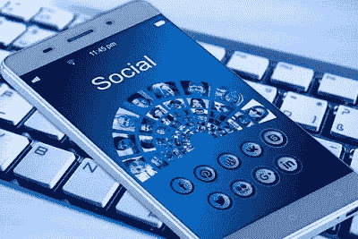

# “智能手机”——它们真的侵入了我们的大脑吗？

> 原文：<https://medium.datadriveninvestor.com/smartphones-do-they-really-hack-our-mind-3cca20e0f0ff?source=collection_archive---------9----------------------->

在过去的 15 年里，技术发生了迅速的变化，尤其是移动(电话)技术。我们从未想过有一天我们会在一部手机和另一部手机之间共享文件，不用任何线缆就能给手机充电，会有无线耳机，我们也不会再被纠结的耳机烦到，但事情已经发生了很大的变化。我们传统的手机现在都变成了智能手机。**乔布斯**曾经说过，***“智能手机真的不一样。”他们在很多好的方面是不同的，但是他们总是唠叨我们。我们工作时，他们打扰我们。他们需要我们的关注。虽然它们让我们能够访问整个互联网，但与以前的技术不同，我们让它们一直在我们身边。我们沉迷于我们的设备。***

所有这些技术变革不是突然出现的，而是被设计好的。制造这种智能手机的公司知道他们的产品对我们大脑的神经影响。不仅是智能手机公司，应用程序公司也在他们的产品中加入了一些功能，这些功能会促使我们在我们的设备上花费尽可能多的时间和注意力。

为了最大限度地增加我们在设备上花费的时间，这些公司的设计师以一种触发成瘾行为的方式操纵我们的大脑化学物质，这些技术涉及大脑化学物质“多巴胺”。多巴胺让我们感到兴奋，我们喜欢兴奋的感觉。因此，任何引发多巴胺释放的经历都是我们都想再次经历的事情。

如果我们的大脑知道查看手机通常会让我们兴奋，那么用不了多久，我们的大脑就会在想起手机时释放多巴胺。因此，看到别人查看自己的手机会让我们想要查看自己的手机。我们没有意识到技术设计师故意操纵我们的多巴胺反应，让我们很难停止使用他们的产品。如果我们感到无聊，我们会检查我们的电子邮件，如果没有新的内容，我们会检查社交媒体，如果对此不满意，我们会检查不同的社交媒体账户，这个过程会持续下去。我们很容易在手机上花上几个小时，而不用两次使用同一个应用程序。这导致了多巴胺的爆发，并使我们联想到检查手机的行为，并产生额外的兴奋感。我们有没有想过为什么 iPhone 和其他手机制造商每年都会推出具有新功能的新智能手机？我们有没有想过为什么脸书会不时推出这么多功能，为什么我们设备上的所有应用程序都会定期更新？。答案很简单:他们不想失去我们的注意力，也不想让我们减少花在这些应用和设备上的时间。

世间万物都有正反两面，智能手机也是如此。写这些，并不是想说智能手机正在毁掉我们的生活。它们是现代技术的杰作。技术来来去去，今天我们有智能手机，谁知道呢？明天我们可能会有比我们更智能的手机，但是我们不应该让这些技术控制我们。限量消费一切对我们有益，甚至限量消费酒精对我们也有益。如果我们不控制我们在这些设备上花费的时间，我们将会听到这样的消息的日子不远了:-人类正在用智能手机取代毒品吗？？？？？

*最初发表于*【vigourofthoughts.com】