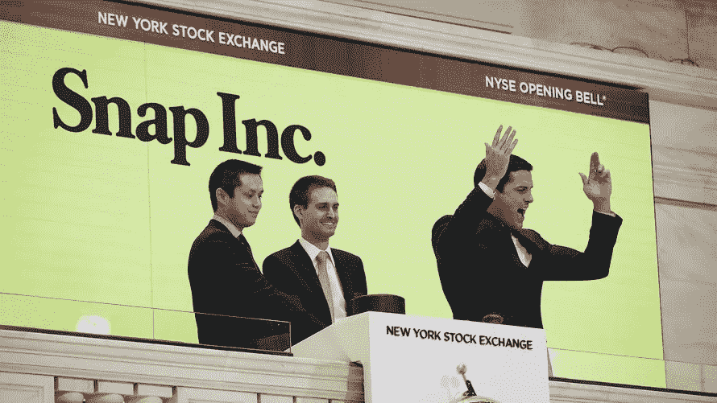

# DOJ 和美国证券交易委员会就 Snap Inc 年 IPO 向其发出传票

> 原文：<https://medium.datadriveninvestor.com/snap-inc-subpoenaed-by-doj-and-sec-regarding-their-2017-ipo-d18dff063599?source=collection_archive---------50----------------------->

Image Credit: Market Watch

Snap Inc .的情况看起来继续令人沮丧，因为他们周三透露，美国司法部和证券交易委员会已就该公司 2017 年的 IPO 向该公司发出传票。

这条新闻是在投资者和该公司之间正在进行的诉讼之后发布的；基于一名前员工最初提出的指控的诉讼称，Snap 在 Instagram 如何严重影响 2016 年下半年公司增长的问题上隐瞒信息并故意误导公众。

> Snap Inc .表示:“虽然我们无法完全了解这些调查，但我们的理解是，DOJ 很可能专注于与 Instagram 竞争相关的 IPO 披露。”

Snap 称这些指控“毫无根据”，并坚称 IPO 前的披露是“准确和完整的”。不管怎样，这个消息对他们的股票价格没有任何好处。SNAP 周三收于 6.48 美元(-0.23 美元)。它们在 2017 年的首次发行价是 17 美元，今年它们的股价整体下跌了 54%。

Image Credit: AdWeek

上个月发布的第三季度业绩显示，Snapchat 失去了 200 万用户，尽管 Snap 的收入和收益超出了分析师的预期，该季度的收入达到了 2.977 亿美元。

Snap 还面临着某种程度的员工危机。本周早些时候，Snap 的内容副总裁 Nick Bell 宣布他将离职。Cheddar 表示，最近的一项内部调查显示，40%的员工也计划离开公司。这比今年第一季度的 11%有了大幅增长。

看起来[埃文·斯皮格尔给员工的内部备忘录](https://medium.com/@glenwhillier/snapchat-a-camera-company-or-a-failing-company-f14ead83ef13)只能假设是为了在员工中灌输对公司的信心，并没有完全按照他的意图进行。毫无疑问，这是 Snap 目前发现自己所处的波涛汹涌的水域。

**演职员表:** [名利场](https://www.vanityfair.com/news/2018/11/snapchat-is-doing-so-badly-the-feds-are-getting-involved)， [Engadget](https://www.engadget.com/2018/11/14/doj-and-sec-subpoena-snap-over-allegedly-misleading-investors/) ，[切达](https://cheddar.com/videos/snap-employees-eye-exist-as-stock-sinks)，[路透社](https://www.reuters.com/article/us-snap-sec-exclusive/exclusive-snap-reveals-u-s-subpoenas-on-ipo-disclosures-idUSKCN1NJ04O)，[综艺](https://variety.com/2018/digital/news/snap-q3-earnings-1202994672/)

