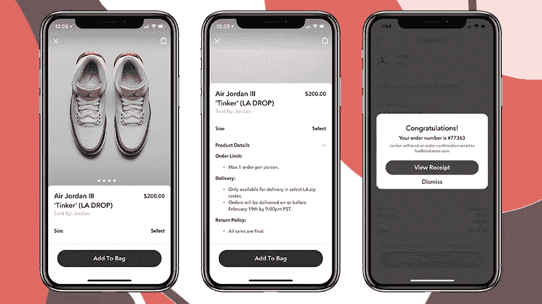
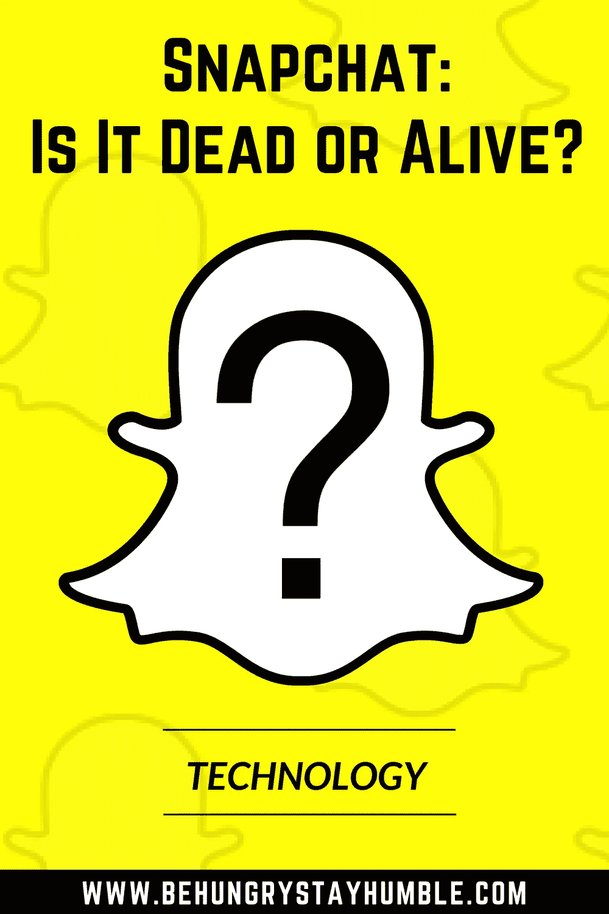

# Snapchat:是死是活？

> 原文：<https://medium.datadriveninvestor.com/snapchat-dead-or-alive-f1c8367f7832?source=collection_archive---------5----------------------->

深入了解 Snapchat 的发展

随着 Snapchat 和 Instagram 之间的战争接踵而至，众所周知，Snapchat 经常被视为与脸书旗下 Instagram 对抗的“失败者”。自从媒体巨头将故事功能添加到自己的平台以来，Snapchat 一直在与 Instagram 竞争。随后，它在 2018 年初的重新设计中再次受到打击，导致许多用户感到非常不安。

随着所有这些事情的发生，听到人们谈论 Snapchat 如何“死亡”并不罕见。许多人似乎认为“没有人”再使用这款应用，Instagram 赢得了这场战争。虽然 Instagram 绝对处于自己的水平，但当你深入了解 Snapchat 实际上在做什么时，事情似乎还没有结束。

# 观众

截至 2018 年 2 月，Snapchat 拥有 1.87 亿日活跃用户(dau)。显然，Snapchat 的大部分受众是千禧一代。但是，它开始长大了。根据 eMarketer 的数据， 83%的 12-17 岁的美国青少年每月至少使用一次 Snapchat，18-24 岁的美国人以 79%的比例位居第二，25-34 岁的渗透率为 48%。我们不要忘记脸书是如何从大学生开始的，现在 56 岁以上的人有 56%在使用它。([全能](https://www.omnicoreagency.com/facebook-statistics/))

尽管 Instagram 拥有 5 亿日活跃用户数，但拥有 1.87 亿 dau 肯定离“死亡”还有很长的路要走。

虽然 Snapchat 的 dau 比不上 Instagram，但在参与度方面却是另一番景象。Snapchat 用户平均每天在该应用上花费 40 分钟，高于 Instagram 用户平均每天花费 32 分钟的时间。([重新编码](https://www.recode.net/2017/8/30/16228318/snapchat-instagram-time-spent-stories-engagement))

这似乎不是一个很大的区别，但 Snapchat 的参与度与 Instagram 持平甚至更高的事实意味着它肯定还在游戏中。

另外，根据皮尤研究中心的调查，

> *“年龄在 18 至 24 岁的 Snapchat 用户中，约有 82%的人表示他们每天都会使用该平台，71%的人表示他们每天会多次使用该平台。同样，该年龄段的 Instagram 用户中有 81%每天都会访问该平台，其中 55%的人表示他们每天都会访问几次。(* [*皮尤研究*](http://www.pewinternet.org/2018/03/01/social-media-use-in-2018/) *)*

Instagram 如此受消费者和品牌欢迎的原因之一是，它们能够接触到更多的人——这是正确的。Instagram 上的可发现性比 Snapchat 上突出得多。

与 Instagram 相比，Snapchat 的发现功能较少，但通过 Snapchat 建立的关系有可能更加牢固。

用户打开应用程序的目的是一次看到一条内容，在这段时间内，内容创建者会吸引用户的全部注意力。虽然 Snapchat 的整体用户增长率远低于预期，但其用户在 Snapchat 上花费的时间逐年稳步增长。( [BTIG 研究](http://www.btigresearch.com/2017/10/17/why-we-have-been-wrong-on-snapchat-reducing-estimates-materially-wearesorry/))

越来越明显的是，虽然没有 Instagram，Snapchat 显然会更成功，但两者可能会共存。

# 营销

谈到广告，Snapchat 仍然是一个非常重要的、可以说是面向未来的玩家。尽管它缺乏整体用户增长(直到[最近](https://techcrunch.com/2018/02/06/snap-inc-earnings-q4-2017/)，它在广告上的参与可以非常有利可图。

广告商已经能够看到 CPM(每千次展示的成本)低至 2.25 美元，每次刷屏的成本(Snapchat 相当于 CPC)低至 0.10 美元，与其他主要应用程序相比，这是非常低的。( [HYPN](https://medium.com/@hyfn/snapchat-the-new-frontier-of-cost-efficiency-b16b01aea4b5) )

也就是说，总是有多种因素影响广告客户获得多低的成本，例如活动的目标、目标受众和实际的广告创意。

这是要记住的重要一点，因为许多第一次尝试新广告平台但不成功的人往往会很快说这些平台不起作用。事实上，最有可能是他们自己的广告创意或定位出了问题，而不是平台让他们失望了。

截至目前，Snapchat 的广告平台仍然缺乏 Instagram 和脸书提供的大部分定位功能。但是，Snapchat 的自然亲密环境和低成本转换率的潜力使其成为数字广告世界中非常真实的竞争者。

# 增强现实

最有趣的是，Snapchat 已经开始在增强现实领域获得更多动力。这方面的一个例子是该公司增强现实广告的创作。一旦在广告上滑动，用户的摄像头就会打开，允许用户与该公司的产品进行互动。宝马是第一个采用者，并利用它来促进其在海外的 [X2 发布](http://adage.com/article/digital/bmw-test-drives-snapchat-lenses-car-ad-3d/311394/)。

Picture showing a 3D image of BMW’s new X2 within Snapchat using an AR lens. Credit: Adage.com

这些广告的唯一问题是费用。众所周知，Snapchat 对类似宝马的 3D 镜头活动收取超过 50 万美元的费用，这是许多机构和品牌无法承受的。([公元时代](http://adage.com/article/digital/bmw-test-drives-snapchat-lenses-car-ad-3d/311394/)

Snapchat 的 Lens Studio 于 2018 年 3 月向公众发布，现在可以让第三方创作者和品牌创建自己的镜头。镜头工作室在发布的 6 周内看到了 30，000 个新镜头。([科技危机](https://techcrunch.com/2018/02/06/snap-inc-earnings-q4-2017/))

Snapchat 多年来一直在向公司出售 3D 角色。它还发布了 Bitmoji 应用程序，允许用户创建自己的自定义头像，在快照中跳舞，并在许多社交平台上跟随他们。

然而，根据 Snapchat 的说法，宝马播放的增强现实广告是第一个以这种方式翻译实际产品广告的例子。

这些 AR 广告的另一个例子是在 2018 年 NBA 全明星周末期间与乔丹发生的。早在 2 月份，Snapchat 就与 Shopify、Darkstore 和 R/GA 合作，推广 Air Jordan III Tinker 运动鞋的发布。

它的工作方式是洛杉矶斯台普斯中心附近的用户看到了乔丹的 3D 增强现实世界镜头。用户可以与他互动，点击看他换上 2018 年的全明星制服，其中包括尚未发布的 AJ III 补锅匠。

Credit: Adweek.com

当天晚些时候，在乔丹的一次特别活动中，Snapchat 发布了二维码，用户可以在 Snap Store(由 Shopify 提供支持)中扫描和使用该二维码来购买运动鞋。最酷的是，购买鞋子的用户可以在不到两个小时内收到鞋子，因为 Darkstore 是一家专门为电子商务公司提供当天送货的公司。

运动鞋在 23 分钟内销售一空。( [Adweek](http://www.adweek.com/digital/snapchats-ecommerce-strategy-hit-a-new-high-when-it-sold-out-the-new-air-jordans-in-minutes/) )

鉴于这仅仅是两个例子，Snapchat 通过为消费者创造独特的购买体验肯定是有所作为的，这无疑只是对未来产品销售方式的一瞥。毫无疑问，AR 只会越来越大，Snapchat 似乎将自己定位为这一领域的主要参与者。

# 展望未来

当谈到社交媒体领域的增长时，Snapchat 肯定有它的工作要做，但毫无疑问，该公司还不应该被淘汰。

鉴于目前技术变化的速度，Snapchat 离重回巅峰还有一步之遥，因此在这一点上完全放弃这款应用还为时过早。同样值得注意的是该公司在打造品牌时采取的方法。

这是第一个更像一个品牌而不是纯粹的社交网络的社交媒体平台，比如眼镜的发布。虽然这次发布不太成功，但它确实证明了该公司有潜力不仅仅是一个应用程序。它带来了成为一个品牌的可能性，这个品牌可以销售从眼镜到配件到服装的任何东西。

对于任何正在争论应该关注哪一款应用的人来说，最好的建议是同等重视 Instagram 和 Snapchat。请记住，仅仅因为一个应用程序在某个时间点不是最受欢迎的，并不自动意味着它没有效果。

事实上，Snapchat 可能对现在使用它的营销人员更有效，尽管主流媒体都在报道。实话实说，1.87 亿 dau 不是九牛一毛，尤其是你的目标市场比较年轻的情况下。营销人员现在可能会在 Snapchat 上做得非常好，因为应用程序中还有更多市场份额留给他们，而且目前广告价格非常低。

虽然 Instagram 肯定会放缓 Snapchat 的增长速度，但增强现实和未来的功能发布可以帮助用户以更个性化和更真实的方式联系，这可能正是它在未来几年改变游戏所需要的。

