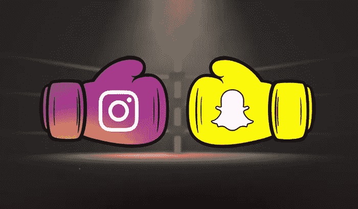

# Snapchat 拿出一把大枪对抗竞争对手，这将是一件好事

> 原文：<https://medium.datadriveninvestor.com/snapchat-pulls-a-big-gun-out-against-the-competition-and-its-going-to-be-sweet-6f3d8a84dd95?source=collection_archive---------19----------------------->

## 因为像脸书/Instagram 甚至抖音这样的重量级人物是不会罢休的！

关于 Snapchat，你必须记住一个非常重要的事实:**这是一个专门为年轻人群量身定制的平台。**说出你对 Snapchat 的看法，虽然在许多情况下这是一个优势，但从长远来看，这是这场社交媒体竞赛的最终劣势。把乌龟和兔子比作一个类比，你可能就明白了。

举个例子，脸书和 Instagram 已经模仿了 Snapchat 最有效的方式:*故事*。现在你看到了上升和竞争激烈的使用，这立即给时髦的 Snap 平台带来了一个小问题，除非那里的大亨们采取一些积极的行动，否则它可能很快就会步 Twitter 的后尘。如果你持怀疑态度，请知道这个:*仅 Instagram 就拥有大约 400 毫米* *的每日活跃用户*。这是 Snapchat 的两倍。我们甚至不要从抖音开始，他目前正通过风暴接管短视频格式。

 [## 计划者让社交媒体保持正轨——数据驱动的投资者

### 如果想达到并保持最高效率，忙碌的人会坚持使用系统。这是 Tweepsmap 和…背后的前提

www.datadriveninvestor.com](https://www.datadriveninvestor.com/2019/03/11/schedulers-keep-social-media-on-track/) 

# 因此，Snapchat 的使用量最终保持稳定，在过去的几个季度中也有所下降

然而，该平台有一点对他们有利:*年轻用户仍然喜欢它！*

这在最近的一次峰会上提供了一个机会，Snapchat 展示了其最新的努力:一个游戏平台。仔细想想，这是明智之举。毕竟，Snapchat 覆盖了 75%的 13-34 岁人群，其中 90%在美国。通过游戏立即接触他们是另一个巨大的收入来源，这可能会让他们保持与大公司的竞争力。

众所周知，Snapchat 虽然自身强大，但没有脸书和 Instagram 那么多资源。这个游戏平台拥有一些原创作品和第三方贡献者，它可以创造每个人都想要的平衡:

想到 Snap 的旗舰品牌 **Bitmoji Party** 就有一个。其他项目包括 Spry Fox 的 **Alphabear Hustle** ，ZeptoLab 的 c . a . t . s .漂移赛**，Game Closure 的**蛇队**，PikPok 的**僵尸营救队**，以及非常知名的 Zynga 的**小皇家**。**

由于不可跳过的 6 秒视频广告，收入将开始滚滚而来——同样的广告形式推动了 Snapchat 第四季度的收入，随着这些合作伙伴关系的到位，这对于该平台来说只能意味着伟大的事情。

# 说实话，我们对此并不感到惊讶

移动游戏持续增长。只有在社交媒体上发展才有意义。然而，就目前情况而言，我们在 Instagram、Twitter，尤其是 LinkedIn 等其他平台上没有看到任何这种情况。这样的概念似乎并不太适合。但是 Snapchat 呢？*他们为什么不早点推出这个*？也许这是一项正在进行的工作，他们当然想把它变成自己的。无论是哪种情况，随着云游戏的持续发展，毫无疑问，Snapchat 不会退缩。

你用 Snapchat 吗？还是对你来说太新潮太“千禧”了？ [**附和自己的 VIGYAA 账号，开始发布**](https://vigyaa.com/accounts/login/) ，也 [**查看数据驱动投资人更多技术洞察**](http://datadriveninvestor.com) **！**